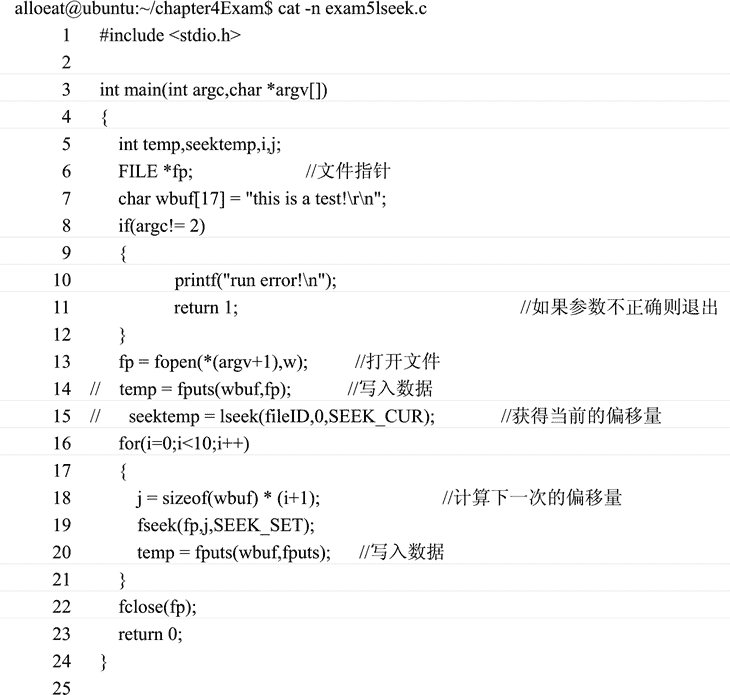

# Linux cat 命令：显示文件内容

> 原文：[`www.weixueyuan.net/a/347.html`](http://www.weixueyuan.net/a/347.html)

Linux 中显示文本文件内容的命令是 cat 命令，用来将文件的内容显示到终端上。该命令的使用方式如下：

cat [选项] 文件列表

cat 命令选项说明如表 1 所示。

表 1：cat 命令选项说明

| 选项 | 说明 |
| --- | --- |
| -v | 用一种特殊形式显示控制字符，LFD 与 TAB 除外。加了 -v 选项后， -T 和 -E 选项将起作用。其中：-T 将 TAB 显示为“ùⅠ”。该选项需要与 -v 选项一起使用。 即如果没有使用 -v 选项，则这个选项将被忽略。-E 在每行的末尾显示一个 $ 符。该选项需要与 -v 选项一起使用。 |
| -u | 输出不经过缓冲区 |
| -A | 等于-vET |
| -t | 等于 -vT |
| -e | 等于 -vE |
| -n | 在文件的每行前面显示行号 |

如下是使用 cat 命令来显示某个 C 语言文件的应用实例，在每一行之前加上了行编号：

