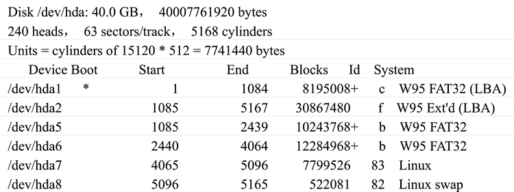

# Linux fdisk 命令：查看分区

> 原文：[`www.weixueyuan.net/a/351.html`](http://www.weixueyuan.net/a/351.html)

Linux fdisk 命令可以查看硬盘分区情况，并可对硬盘进行分区管理。此外 fdisk 也是一个非常好的硬盘分区工具，该命令的使用方法如下：

fdisk [-1]

说明：使用 fdisk 命令时必须拥有 root 权限。

IDE 硬盘对应的设备名称分别为 hda、hdb、hdc 和 hdd，SCSI 硬盘对应的设备名称则为 sda、sdb 等。此外，hda1 代表 hda 的第一个硬盘分区，hda2 代表 hda 的第二个分区，依此类推。

通过查看 /var/log/messages 文件，可以找到 Linux 系统已辨认出来的设备代号，如果如下使用 fdisk 命令：

# fdisk -1

则将在屏幕上显示输出：

