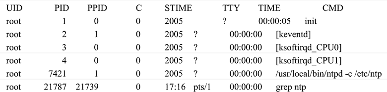

# Linux 进程管理命令：ps 和 kill

> 原文：[`www.weixueyuan.net/a/353.html`](http://www.weixueyuan.net/a/353.html)

与 Linux 进程管理有关的常用命令有 ps 和 kill。

ps 命令用于显示当前系统中由该用户运行的进程列表，而 kill 命令用于输出特定的信号给指定进程号（PID）的进程并根据该信号完成指定的行为，其中可能的信号有进程挂起、进程等待、进程终止等，它们的使用方法说明如下：

ps: ps [选项]
kill: kill [选项] 进程号(PID)

ps 命令选项说明如表 3 所示；kill 命令中的进程号为信号输出的指定进程的进程号，当选项默认时为输出终止信号给该进程。

表 3：ps 命令选项说明

| 选项 | 说明 |
| --- | --- |
| -ef | 查看所有进程及其 PID（进程号）、系统时间、命令的详细目录、执行者等。 |
| -aux | 除可显示 -ef 所有内容外，还可显示 CPU 及内存占用率、进程状态。 |
| -w | 以加宽方式显示，这样可以显示较多的信息。 |

kill 命令选项说明如表 4 所示。

表 4：kill 命令选项说明

| 选项 | 说明 |
| --- | --- |
| -s | 将指定信号发送给进程 |

例如，在命令行中，输入以下命令：`#ps -ef`。系统将会显示所有的进程，如下所示：

该例中，先查看所有进程，接下来要终止进程号为 7421 的 ntp 进程。输入如下命令：

# kill 7421

之后再次查看，使用命令如下：

# ps -ef | grep ntp

系统输出：

root    21789 21739    0 17:16 ptd/1    00:00:00 grep ntp

可以看出，已经没有该进程号的进程，说明该进程已经被删除。

注意：ps 命令通常可以与其他一些命令结合起来使用，主要作用是提高效率。ps 选项中的参数 w 可以写多次，通常最多写 3 次，它的含义表示加宽 3 次，这足以显示很长的命令行了。例如：ps-auxwww。