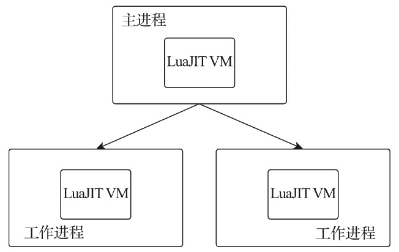

# Nginx 是什么

> 原文：[`www.weixueyuan.net/a/601.html`](http://www.weixueyuan.net/a/601.html)

Nginx（发音同“engine x”）是一个高性能的反向代理和 Web 服务器软件，最初是由俄罗斯人 Igor Sysoev 开发的。Nginx 的第一个版本发布于 2004 年，其源代码基于双条款 BSD 许可证发布，因其系统资源消耗低、运行稳定且具有高性能的并发处理能力等特性，Nginx 在互联网企业中得到广泛应用。

Nginx 是互联网上最受欢迎的开源 Web 服务器之一，它不仅提供了用于开发和交付的一整套应用技术，还是应用交付领域的开源领导者。Netcraft 公司 2019 年 7 月的统计数据表明，Nginx 为全球最繁忙网站中的 25.42% 提供了服务或代理，进一步扩大了其在主机域名领域的占有量，新增 5220 万个站点，总数达 4.4 亿个，市场占有率已经超过 Apache 4.89%。

得益于近几年云计算和微服务的快速发展，Nginx 因在其中发挥了自身优势而得到广泛应用，且有望在未来占有更多的市场份额。

2019 年 3 月，著名硬件负载均衡厂商 F5 宣布收购 Nginx，Nginx 成为 F5 的一部分。F5 表示，将加强对开源和 Nginx 应用平台的投资，致力于 Nginx 开源技术、开发人员和社区的发展，更大的投资将为开放源码计划注入新的活力，会主办更多的开放源码活动，并产生更多的开放源码内容。

## 1、Nginx 的不同版本

作为最受欢迎的 Web 服务器之一，Nginx 自 2004 年发布以来已经得到很多互联网企业的应用。官方目前有 Nginx 开源版和 Nginx Plus 商业版两个版本，开源版是目前使用最多的版本，商业版除了包含开源版本的全部功能外，还提供了一些独有的企业级功能。

Nginx 在国内互联网企业中也得到了广泛应用，企业在实际使用中会根据自身的需求进行相应的扩展和增强。目前国内流行的 Nginx 主要有两个开源版本，分别是由淘宝网技术团队维护的 Tengine 项目和由章亦春发起的 OpenResty 项目。

### 1) 开源版 Nginx

Nginx 开源版一直处于活跃开发状态，由 Nginx 公司负责开发与维护。截至本教程写作时，Nginx 开源版本已经更新到 1.17.2 版本。Nginx 自推出以来，一直专注于低资源消耗、高稳定、高性能的并发处理能力，除了提供 Web 服务器的功能外，还实现了访问代理、负载均衡、内容缓存、访问安全及带宽控制等功能。其基于模块化的代码架构及可与其他开发语言（如 Perl、JavaScript 和 Lua）有效集成的可编程特性，使其具有强大的扩展能力。

部署和优化具有高效率、高性能并发请求处理能力的应用架构是应用架构师一直追求的目标，在应用架构技术的迭代中，各种分离式思想成为主流，比如将访问入口和 Web 服务器分离、将 Web 服务器和动态脚本解析器分开、将 Web 功能不断拆分、微服务等。

Nginx 不仅提供了 Web 服务器的功能，还极大满足了这一主流架构的需求并提供了如下应用特性。

#### ① 访问路由

现今大型网站的请求量早已不是单一 Web 服务器可以支撑的了。单一入口、访问请求被分配到不同的业务功能服务器集群，是目前大型网站的通用应用架构。Nginx 可以通过访问路径、URL 关键字、客户端 IP、灰度分流等多种手段实现访问路由分配。

#### ② 反向代理

就反向代理功能而言，Nginx 本身并不产生响应数据，只是应用自身的异步非阻塞事件驱动架构，高效、稳定地将请求反向代理给后端的目标应用服务器，并把响应数据返回给客户端。其不仅可以代理 HTTP 协议，还支持 HTTPS、HTTP/2、FastCGI、uWSGI、SCGI、gRPC 及 TCP/UDP 等目前大部分协议的反向代理。

#### ③ 负载均衡

Nginx 在反向代理的基础上集合自身的上游（upstream）模块支持多种负载均衡算法，使后端服务器可以非常方便地进行横向扩展，从而有效提升应用的处理能力，使整体应用架构可轻松应对高并发的应用场景。

#### ④ 内容缓存

动态处理与静态内容分离是应用架构优化的主要手段之一，Nginx 的内容缓存技术不仅可以实现预置静态文件的高速缓存，还可以对应用响应的动态结果实现缓存，为响应结果变化不大的应用提供更高速的响应能力。

#### ⑤ 可编程

Nginx 模块化的代码架构方式为其提供了高度可定制的特性，但可以用 C 语言开发 Nginx 模块以满足自身使用需求的用户只是少数。Nginx 在开发之初就具备了使用 Perl 脚本语言实现功能增强的能力。Nginx 对 JavaScript 语言及第三方模块对 Lua 语言的支持，使得其可编程能力更强。

Nginx 开源版本维护了两个版本分支，分别为主线（mainline）分支和稳定（stable）分支。主线分支是一个活跃分支，会添加一些最新的功能并进行错误修复，由版本号中的第二位奇数标识，截至本教程写作时的最新版本为 1.17.2。稳定分支会集成修复严重错误的代码，但不会增加新的功能，由版本号中的第二位偶数标识，截至本教程写作时的最新版本为 1.16.1。想了解更多内容的用户可参阅 [Nginx 官方网站](http://www.nginx.org)。

### 2) 商业版 Nginx Plus

Nginx Plus 是 Nginx 于 2013 年推出的商业版本，在开源版本的基础上增加了使用户对 Nginx 的管理和监控更轻松的功能。其代码在单独的私有代码库中维护。它始终基于最新版本的 Nginx 开源版本主线分支，并包含一些封闭源代码特性和功能。因此，除了开源版本中提供的功能外，Nginx Plus 还具有独有的企业级功能，包括实时活动监视数据、通过 API 配置上游服务器负载平衡和主动健康检查等。

相对于开源版本，Nginx Plus 还提供了以下几个功能。

#### ① 负载均衡

*   基于 cookies 的会话保持功能。
*   基于响应状态码和响应体的主动健康监测。
*   支持 DNS 动态更新。

#### ② 动态管理

*   支持通过 API 清除内容缓存。
*   可通过 API 动态管理上游的后端服务器列表。

#### ③ 安全控制

*   基于 API 和 OpenID 连接协议单点登录（SSO）的 JWT（JSON Web Token）认证支持。
*   Nginx WAF 动态模块。

#### ④ 状态监控

*   超过 90 个状态指标的扩展状态监控。
*   内置实时图形监控面板。
*   集成可用于自定义监控工具的 JSON 和 HTML 输出功能支持。

#### ⑤ Kubernetes Ingress Controller

*   支持 Kubernetes 集群 Pod 的会话保持和主动健康监测。
*   支持 JWT 身份认证。

#### ⑥ 流媒体

*   支持自适性串流（Adaptive Bitrate Streaming，ABS）媒体技术 HLS（Apple HTTP Live Streaming）和 HDS（Adobe HTTP Dynamic Streaming）。
*   支持对 MP4 媒体流进行带宽控制。

### 3) 分支版本 Tengine

Tengine 是由淘宝网技术团队发起的 Nginx 二次开发项目，是在开源版 Nginx 及诸多第三方模块的基础上，针对淘宝网的高并发需求进行的二次开发。其中添加了很多针对互联网网站中使用 Nginx 应对高并发负载、安全及维护等的功能和特性。

据 Tengine 官网介绍，Tengine 不仅在淘宝网上使用，搜狗、天猫、大众点评、携程、开源中国等也在使用，其性能和稳定性得到了有效检验。Tengine 从 2011 年 12 月开始成为开源项目，Tengine 团队的核心成员来自淘宝、搜狗等互联网企业。

Tengine 在继承 Nginx 的所有功能的同时，也保持了自有的对 Nginx 的优化和增强，其增强特性如下。

*   继承 Nginx 1.17.3 版本的所有特性，兼容 Nginx 的配置；
*   支持 HTTP 的 CONNECT 方法，可用于正向代理场景；
*   支持异步 OpenSSL，可使用硬件（如 QAT）进行 HTTPS 的加速与卸载；
*   增强相关运维、监控能力，如异步打印日志及回滚、本地 DNS 缓存、内存监控等；
*   Stream 模块支持 server_name 指令；
*   支持输入过滤器机制。该机制的使用使得 Web 应用防火墙的编写更为方便；
*   支持设置 Proxy、Memcached、FastCGI、SCGI、uWSGI 在后端失败时的重试次数；
*   支持动态脚本语言 Lua，其扩展功能非常高效简单；
*   支持按指定关键字（域名、URL 等）收集 Tengine 运行状态；
*   更强大的防攻击（访问速度限制）模块。

Tengine 是基于 Nginx 开发的轻量级开源 Web 服务器，作为阿里巴巴七层流量入口的核心系统，支撑着阿里巴巴“双 11”等大促活动的平稳度过，并提供了智能的流量转发策略、HTTPS 加速、安全防攻击、链路追踪等众多高级特性，同时秉着软硬件结合的性能优化思路，在高性能、高并发方面取得了重大突破。

目前，Tengine 正通过打通 Ingress Controller 和 Kubernetes 使 Tengine 具备动态感知某个服务整个生命周期的能力。未来，Tengine 将定期开源内部通用组件功能模块，并同步 Nginx 官方的最新代码，丰富开发者们的开源 Web 服务器选项。

### 4) 扩展版本 OpenResty

OpenResty 是基于 Nginx 开源版本的扩展版本，它利用 Nginx 的模块特性，使 Nginx 支持 Lua 语言的脚本编程，鉴于 Lua 本身嵌入应用程序中增强应用程序扩展和定制功能的设计初衷，开源版本 Nginx 的可编程性得到大大增强。

据 OpenResty 官网介绍，2017 年全球互联网中至少有 23 万台主机正在使用 Nginx 的 OpenResty 版本作为 Web 服务器或网关应用。OpenResty® 是一个基于 Nginx 与 Lua 的高性能 Web 平台，其内部集成了大量精良的 Lua 库、第三方模块以及大多数依赖项，以便搭建能够处理超高并发、扩展性极高的动态 Web 应用、Web 服务和动态网关。

OpenResty® 通过汇聚各种设计精良的 Nginx 模块（主要由 OpenResty 团队自主开发），将 Nginx 变成一个强大的通用 Web 应用平台。这样，Web 开发人员和系统工程师就可以使用 Lua 脚本语言调动 Nginx 支持的各种 C 模块及 Lua 模块，快速构造出足以胜任一万乃至百万以上单机并发连接的高性能 Web 应用系统。

OpenResty® 的目标是让 Web 服务直接运行在 Nginx 服务内部，充分利用 Nginx 的非阻塞 I/O 模型，不仅对 HTTP 客户端请求，还对远程后端如 MySQL、PostgreSQL、Memcached 及 Redis 等都进行一致的高性能响应。

OpenResty 构架在 Nginx 和 LuaJIT 的基础之上，利用 Nginx 的模块特性集成了大量 Lua 支持库，用户可以很方便地使用 Lua 编程语言对 Nginx 的功能进行扩展和增强。

OpenResty 通过基于 Nginx 优化的 ngx.location.capture_multi 功能，可以非阻塞地并行转发多个子请求给后端服务器，当后端服务器返回数据时进行相应的归类和排序处理，进而有效提升客户端的请求响应速度。在 OpenResty 代码架构中，其代码以 ngx_lua 模块的形式嵌入 Nginx 代码中，从而使用户编写的 Lua 代码与 Nginx 进程协同工作。OpenResty 为每个 Nginx 工作进程（Worker Process）创建了一个 Lua 虚拟机（LuaVM），如下图所示。并将 Nginx I/O 原语封装注入 Lua 虚拟机中供 Lua 代码访问，每个外部请求都由 Lua 虚拟机产生一个 Lua 协程（coroutine）进行处理，协程之间彼此数据隔离并共享对应的 Lua 虚拟机。

图：OpenResty Lua 虚拟机
当 Lua 代码调用异步接口时，会挂起当前协程以不阻塞 Nginx 工作进程，等异步接口处理完成时再还原当前协程继续运行。

OpenResty 项目开始于 2007 年 10 月，最早是为雅虎中国搜索部门开发的项目，后由章亦春进行开发和维护，并得到了国内外诸多企业的应用，目前主要由 OpenResty 软件基金会和 OpenResty Inc. 公司提供支持。