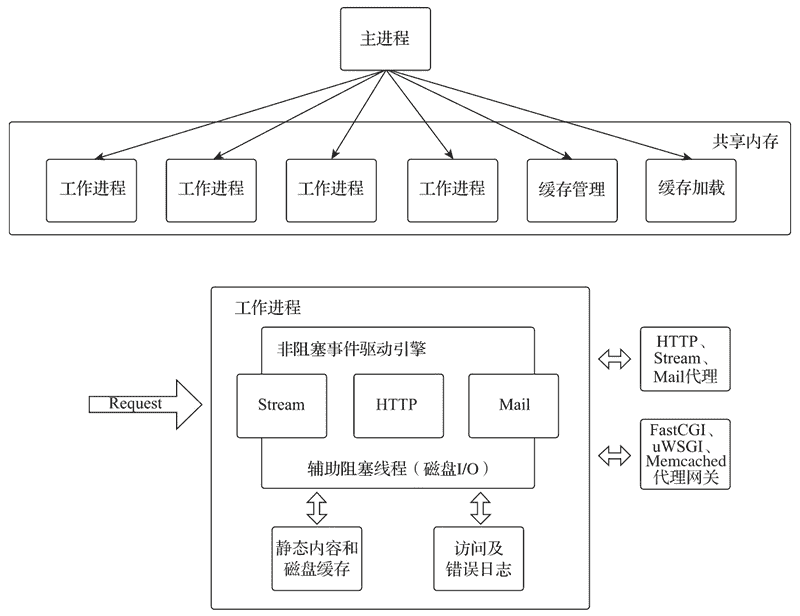
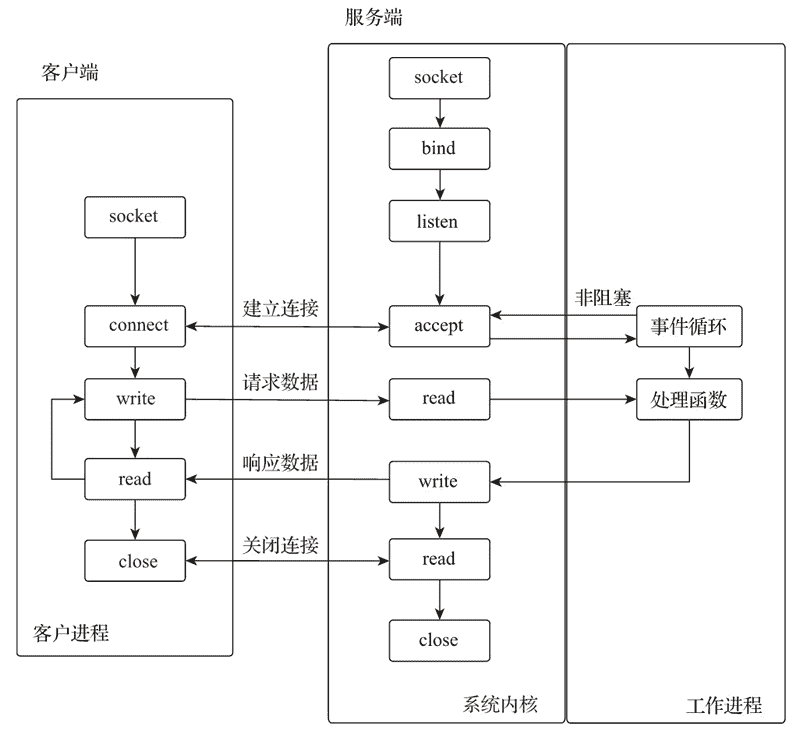
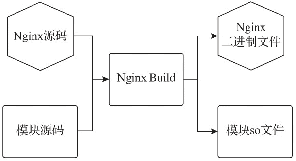

# Nginx 源码架构分析

> 原文：[`www.weixueyuan.net/a/603.html`](http://www.weixueyuan.net/a/603.html)

Nginx 低资源消耗、高稳定、高性能的并发处理能力，来源于其优秀的代码架构。它采用了多进程模型，使自身具有低资源消耗的特性。以事件驱动的异步非阻塞多进程请求处理模型，使 Nginx 的工作进程通过异步非阻塞的事件处理机制，实现了高性能的并发处理能力，让每个连接的请求均可在 Nginx 进程中以工作流的方式得到快速处理。

Nginx 代码架构充分利用操作系统的各种机制，发挥了软硬件的最大性能，使它在普通硬件上也可以处理数十万个并发连接。而且 Nginx 支持在多种操作系统下部署运行，为发挥 Nginx 的最大性能，需要对不同的平台进行细微的调整，为方便了解 Nginx 架构的特点，本教程仅以 Linux 系统平台为例进行介绍。

## 1、多进程模型

进程是操作系统资源分配的最小单位，由于 CPU 数量有限，多个进程间通过被分配的时间片来获得 CPU 的使用权，系统在进行内核管理和进程调度时，要执行保存当前进程上下文、更新控制信息、选择另一就绪进程、恢复就绪进程上下文等一系列操作，而频繁切换进程会造成资源消耗。

Nginx 采用的是固定数量的多进程模型（见下图），由一个主进程（Master Process）和数量与主机 CPU 核数相同的工作进程协同处理各种事件。主管理进程负责工作进程的配置加载、启停等操作，工作进程负责处理具体请求。

图：多进程模型
进程间的资源都是独立的，每个工作进程处理多个连接，每个连接由一个工作进程全权处理，不需要进行进程切换，也就不会产生由进程切换引起的资源消耗问题。默认配置下，工作进程的数量与主机 CPU 核数相同，充分利用 CPU 和进程的亲缘性（affinity）将工作进程与 CPU 绑定，从而最大限度地发挥多核 CPU 的处理能力。

Nginx 主进程负责监听外部控制信号，通过频道机制将相关信号操作传递给工作进程，多个工作进程间通过共享内存来共享数据和信息。

### 1) 信号

信号（signal）又称软中断信号，可通过调用系统命令 `kill` 来发送信号实现进程通信。在 Nginx 系统中，主进程负责监听外部信号，实现对进程的热加载、平滑重启及安全关闭等操作的响应。

Nginx 支持的信号如下表所示。

| 信号 | 命令行参数 | 功能 |
| TERM 或 INT | stop | 快速关闭 Nginx 服务 |
| QUIT | quit | 安全关闭 Nginx 服务 |
| HUP | reload | 热加载配置文件 |
| WINCH |   | 安全关闭工作进程 |
| USR1 | reopen  | 重新创建日志文件 |
| USR2 |   | 平滑更新 Nginx 执行文件 |

在 Linux 系统下可以通过 kill 命令向 Nginx 进程发送信号指令，代码如下：

kill -HUP 'cat nginx.pid'

在 Linux 系统下也可以通过 nginx -s 命令行参数实现信号指令的发送，代码如下：

nginx -s reload

### 2) 频道

频道（channel）是 Nginx 主进程向工作进程传递信号操作的通信方式，用于将控制工作进程的信号操作传递给工作进程。通信频道的原理是应用 socketpair 方法使用本机的 socket 方式实现进程间的通信。主进程发送频道消息，工作进程接收频道消息并执行相应操作，如工作进程的创建与停止等。

创建工作进程时会将接收频道消息的套接字注册到对应的事件引擎（如 epoll）中，当事件引擎监听到主进程发送的频道消息时，就会触发回调函数通知工作进程执行响应操作。

### 3) 共享内存

共享内存是 Linux 操作系统下进程间的一种简单、高效的通信方式，其允许多个进程访问同一个内存地址，一个进程改变了内存中的内容后，其他进程都可以使用变更后的内容。Nginx 的多个进程间就是通过共享内存的方式共享数据的，主进程启动时创建共享内存，工作进程创建（fork 方式）完成后，所有的进程都开始使用共享内存。

用户可以在配置文件中配置共享内存名称和大小，定义不同的共享内存块供 Nginx 不同的功能使用，Nginx 解析完配置文件后，会将定义的共享内存通过 slab 机制进行内部统一划分和管理。

### 4) 进程调度

当工作进程被创建时，每个工作进程都继承了主进程的监听套接字（socket），所以所有工作进程的事件监听列表中会共享相同的监听套接字。但是多个工作进程间同一时间内只能由一个工作进程接收网络连接，为使多个工作进程间能够协调工作，Nginx 的工作进程有如下几种调度方式。

#### ① 无调度模式

所有工作进程都会在连接事件被触发时争相与客户端建立连接，建立连接成功则开始处理客户端请求。无调度模式下所有进程都会争抢资源，但最终只有一个进程可以与客户端建立连接，对于系统而言这将在瞬间产生大量的资源消耗，这就是所谓的惊群现象。

#### ② 互斥锁模式（accept_mutex）

互斥锁是一种声明机制，每个工作进程都会周期性地争抢互斥锁，一旦某个工作进程抢到互斥锁，就表示其拥有接收 HTTP 建立连接事件的处理权，并将当前进程的 socket 监听注入事件引擎（如 epoll）中，接收外部的连接事件。

其他工作进程只能继续处理已经建立连接的读写事件，并周期性地轮询查看互斥锁的状态，只有互斥锁被释放后工作进程才可以抢占互斥锁，获取 HTTP 建立连接事件的处理权。当工作进程最大连接数的 1/8 与该进程可用连接（free_connection）的差大于或等于 1 时，则放弃本轮争抢互斥锁的机会，不再接收新的连接请求，只处理已建立连接的读写事件。

互斥锁模式有效地避免了惊群现象，对于大量 HTTP 的短连接，该机制有效避免了因工作进程争抢事件处理权而产生的资源消耗。但对于大量启用长连接方式的 HTTP 连接，互斥锁模式会将压力集中在少数工作进程上，进而因工作进程负载不均而导致 QPS 下降。

#### ③ 套接字分片（Socket Sharding）

套接字分片是由内核提供的一种分配机制，该机制允许每个工作进程都有一组相同的监听套接字。当有外部连接请求时，由内核决定哪个工作进程的套接字监听可以接收连接。这有效避免了惊群现象的发生，相比互斥锁机制提高了多核系统的性能。该功能需要在配置 listen 指令时启用 reuseport 参数。

Nginx 1.11.3 以后的版本中互斥锁模式默认是关闭的，由于 Nginx 的工作进程数量有限，且 Nginx 通常会在高并发场景下应用，很少有空闲的工作进程，所以惊群现象的影响不大。无调度模式因少了争抢互斥锁的处理，在高并发场景下可提高系统的响应能力。套接字分片模式则因为由 Linux 内核提供进程的调度机制，所以性能最好。

### 5) 事件驱动

事件驱动程序设计（Event-Driven Programming）是一种程序设计模型，这种模型的程序流程是由外部操作或消息交互事件触发的。其代码架构通常是预先设计一个事件循环方法，再由这个事件循环方法不断地检查当前要处理的信息，并根据相应的信息触发事件函数进行事件处理。通常未被处理的事件会放在事件队列中等待处理，而被事件函数处理的事件也会形成一个事件串，因此事件驱动模型的重点就在于事件处理的弹性和异步化。

为了确保操作系统运行的稳定性，Linux 系统将用于寻址操作的虚拟存储器分为内核空间和用户空间，所有硬件设备的操作都是在内核空间中实现的。当应用程序监听的网络接口接收到网络数据时，内核会先把数据保存在内核空间的缓冲区中，然后再由应用程序复制到用户空间进行处理。

Linux 操作系统下所有的设备都被看作文件来操作，所有的文件都通过文件描述符（File Descriptor，FD）集合进行映射管理。套接字是应用程序与 TCP/IP 协议通信的中间抽象层，也是一种特殊的文件，应用程序以文件描述符的方式对其进行读/写（I/O）、打开或关闭操作。每次对 socket 进行读操作都需要等待数据准备（数据被读取到内核缓冲区），然后再将数据从内核缓冲区复制到用户空间。

为了提高网络 I/O 操作的性能，操作系统设计了多种 I/O 网络模型。在 Linux 系统下，网络并发应用处理最常用的就是 I/O 多路复用模型，该模型是一种一个进程可以监视多个文件描述符的机制，一旦某个文件描述符就绪（数据准备就绪），进程就可以进行相应的读写操作。

epoll 模型是 Linux 系统下 I/O 多路复用模型里最高效的 I/O 事件处理模型，其最大并发连接数仅受内核的最大打开文件数限制，在 1GB 内存下可以监听 10 万个端口。epoll 模型监听的所有连接中，只有数据就绪的文件描述符才会调用应用进程、触发响应事件，从而提升数据处理效率。epoll 模型利用 mmap 映射内存加速与内核空间的消息传递，从而减少复制消耗。

作为 Web 服务器，Nginx 的基本功能是处理网络事件，快速从网络接口读写数据。Nginx 结合操作系统的特点，基于 I/O 多路复用模型的事件驱动程序设计，采用了异步非阻塞的事件循环方法响应处理套接字上的 accept 事件，使其在调用 accept 时不会长时间占用进程的 CPU 时间片，从而能够及时处理其他工作。通过事件驱动的异步非阻塞机制（见下图），使大量任务可以在工作进程中得到高效处理，以应对高并发的连接和请求。

图：异步非阻塞机制

## 2、工作流机制

Nginx 在处理客户端请求时，每个连接仅由一个进程进行处理，每个请求仅运行在一个工作流中，工作流被划分为多个阶段（见下图），请求在不同阶段由功能模块进行数据处理，处理结果异常或结束则将结果返回客户端，否则将进入下一阶段。工作进程维护工作流的执行，并通过工作流的状态推动工作流完成请求操作的闭环。

图：Nginx 工作流

### 1) HTTP 请求处理阶段

HTTP 请求的处理过程可分为 11 个阶段，HTTP 请求处理阶段如下表所示。

| 阶段标识 | 阶段说明 |
| NGX_HTTP_POST_READ_PHASE | 读取请求阶段，会进行 HTTP 请求头的读取和解析处理 |
| NGX_HTTP_SERVER_REWRITE_PHASE | server 重定向阶段，会在 URI 进入 location 路由前修改 URI 的内容，进行重定向处理 |
| NGX_HTTP_FIND_CONFIG_PHASE | URI 匹配阶段，URI 进行 location 匹配处理，该阶段不支持外部模块引入 |
| NGX_HTTP_REWRITE_PHASE | rewrite 重写阶段，对 URI 执行 rewrite 规则修改处理 |
| NGX_HTTP_POST_REWRITE_PHASE | rewrite 重写结束阶段，对 rewrite 的结果执行跳转操作并进行次数验证，超过 10 次的则认为是死循环，返回 500 错误。该阶段不支持外部模块引入 |
| NGX_HTTP_PREACCESS_PHASE | 访问控制前阶段，进行连接数、单 IP 访问频率等的处理 |
| NGX_HTTP_ACCESS_PHASE | 访问控制阶段，进行用户认证、基于源 IP 的访问控制等处理 |
| NGX_HTTP_POST_ACCESS_PHASE | 访问控制结束阶段，对访问控制的结果进行处理，如向用户发送拒绝访问等响应。该阶段不支持外部模块引入 |
| NGX_HTTP_PRECONTENT_PHASE | 访问内容前阶段，对目标数据进行内容检验等操作。以前的版本称为 NGX_HTTP_TRY_FILES_PHASE，try_files 和 mirror 功能在这个阶段被执行 |
| NGX_HTTP_CONTENT_PHASE | 访问内容阶段，执行读取本地文件，返回响应内容等操作 |
| NGX_HTTP_LOG_PHASE | 日志记录阶段，处理完请求，进行日志记录 |

HTTP 请求处理阶段可以让每个模块仅在该阶段独立完成该阶段可实现的功能，而整个 HTTP 请求则是由多个功能模块共同处理完成的。

### 2) TCP/UDP 处理阶段

TCP/UDP 会话一共会经历 7 个处理阶段，每个 TCP/UDP 会话会自上而下地按照 7 个阶段进行流转处理，每个处理阶段的说明如下表所示。

| 阶段标识 | 阶段说明 |
| Post-accept | 接收客户端连接请求后的第一阶段。模块 ngx_stream_realip_module 在这个阶段被调用 |
| Pre-access | 访问处理前阶段。模块 ngx_stream_limit_conn_module 在这个阶段被调用 |
| Access  | 访问处理阶段。模块 ngx_stream_access_module 在这个阶段被调用 |
| SSL | TLS/SSL 处理阶段。模块 ngx_stream_ssl_module 在这个阶段被调用 |
| Preread | 数据预读阶段。将 TCP/UDP 会话数据的初始字节读入预读缓冲区，以允许 ngx_stream_ssl_preread_module 之类的模块在处理之前分析 |
| Content  | 数据数据处理阶段。通常将 TCP/UDP 会话数据代理到上游服务器，或将模块 ngx_stream_return_module 指定的值返回给客户端 |
| Log | 记录客户端会话处理结果的最后阶段。模块 ngx_stream_log_module 在这个阶段被调用 |

Nginx 功能模块就是根据不同的功能目的，按照模块开发的加载约定嵌入不同的处理阶段的。

## 3、模块化

Nginx 一直秉持模块化的理念，其模块化的架构中，除了少量的主流程代码，都是模块。模块化的设计为 Nginx 提供了高度的可配置、可扩展、可定制特性。模块代码包括核心模块和功能模块两个部分：核心模块负责维护进程的运行、内存及事件的管理；功能模块则负责具体功能应用的实现，包括路由分配、内容过滤、网络及磁盘数据读写、代理转发、负载均衡等操作。Nginx 的高度抽象接口使用户很容易根据开发规范进行模块开发，有很多非常实用的第三方模块被广泛使用。

### 1) 模块分类

#### ① 核心模块（core）

该模块提供了 Nginx 服务运行的基本功能，如 Nginx 的进程管理、CPU 亲缘性、内存管理、配置文件解析、日志等功能。

#### ② 事件模块（event）

该模块负责进行连接处理，提供对不同操作系统的 I/O 网络模型支持和自动根据系统平台选择最有效 I/O 网络模型的方法。

#### ③ HTTP 模块（http）

该模块提供 HTTP 处理的核心功能和部分功能模块，HTTP 核心功能维护了 HTTP 多个阶段的工作流，并实现了对各种 HTTP 功能模块的管理和调用。

#### ④ Mail 模块（mail）

该模块实现邮件代理功能，代理 IMAP、POP3、SMTP 协议。

#### ⑤ Stream 模块（stream）

该模块提供 TCP/UDP 会话的代理和负载相关功能。

#### ⑥ 第三方模块

第三方模块即非 Nginx 官方开发的功能模块，据统计，在开源社区发布的第三方模块已经达到 100 多个，其中 lua-resty、nginx-module-vts 等模块的使用度非常高。

### 2) 动态模块

Nginx 早期版本在进行模块编译时，通过编译配置（configure）选项 `--with_module` 和 `--without-module` 决定要编译哪些模块，被选择的模块代码与 Nginx 核心代码被编译到同一个 Nginx 二进制文件中，Nginx 文件每次启动时都会加载所有的模块。这是一种静态加载模块的方式。随着第三方模块的增多和 Nginx Plus 的推出，模块在不重新编译 Nginx 的情况下被动态加载成为迫切的需求。

Nginx 从 1.9.11 版本开始支持动态加载模块的功能，该功能使 Nginx 可以在运行时有选择地加载 Nginx 官方或第三方模块。为使动态模块更易于使用，Nginx 官方还提供了 pkg-oss 工具，该工具可为任何动态模块创建可安装的动态模块包。

在 Nginx 开源版本的代码中，编译配置选项中含有`=dynamic`选项，表示支持动态模块加载。例如，模块 http_xslt_module 的动态模块编译配置选项示例如下。

./configure --with-http_xslt_module=dynamic

编译后，模块文件以 so 文件的形式独立存储于 Nginx 的 modules 文件夹中。动态模块编译如下图所示。

图：动态模块编译
在不同编译配置选项下，Nginx 在编译时会因为某些结构字段未被使用而不会将其编译到代码中，因此就会出现不同编译配置选项的动态模块无法加载的问题。为解决这个问题，Nginx 在编译配置选项中提供了`--with-compat`选项，在进行 Nginx 及动态模块编译配置时如果使用了该选项，在相同版本的 Nginx 代码下，动态模块即使与 Nginx 执行文件的其他编译配置选项不同，也可以被 Nginx 执行文件加载。启用兼容参数编译的示例如下：

./configure --with-compat --with-http_xslt_module=dynamic

可以在配置文件中使用 load_module 指令加载动态模块，示例如下：

load_module "modules/ngx_http_xslt_filter_module.so";