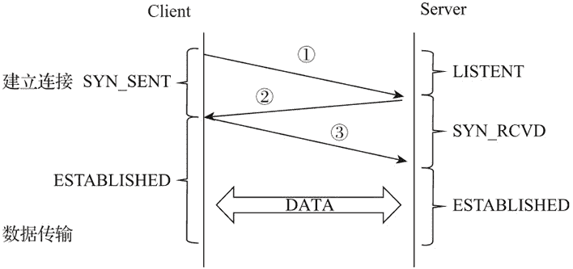
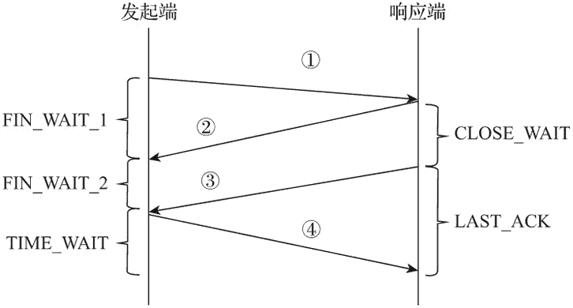

# Nginx 编译安装

> 原文：[`www.weixueyuan.net/a/604.html`](http://www.weixueyuan.net/a/604.html)

Nginx 是一款优秀的开源软件，支持在 FreeBSD、Linux、Windows、macOS 等多种操作系统平台下编译及运行。CentOS 拥有良好的系统结构和工具软件生态环境，是一款基于 Linux 的非常流行的发行版本。CentOS 源自 RedHat 企业版，按照 Linux 的开源协议编译而成，在稳定性及技术的可持续性方面完全可以代替 RedHat 企业版，因此我们选择将它 CentOS 作为本教程的操作系统环境。

## 1、编译环境准备

### 1) 操作系统的准备

Nginx 是一款优秀的开源软件，是运行在操作系统上的应用程序，因此 Nginx 的性能依赖于操作系统及其对底层硬件的管理机制，为了使 Nginx 在运行时发挥最大的性能，需要对操作系统的服务配置和参数做一些调整。系统服务配置可用如下方式实现。

#### ① 系统服务安装

CentOS 可用最小化安装，安装完毕后，用如下命令补充工具。

yum -y install epel-release                           # 安装扩展工具包 yum 源
yum install net-tools wget nscd lsof            # 安装工具

#### ② DNS 缓存

编辑 /etc/resolv.conf 配置 DNS 服务器，打开 NSCD 服务，缓存 DNS，提高域名解析响应速度。

systemctl start nscd.service                         # 启动 NSCD 服务
systemctl enable nscd.service

#### ③ 修改文件打开数限制

操作系统默认单进程最大打开文件数为 1024，要想实现高并发，可以把单进程的文件打开数调整为 65536。

echo "* soft nofile 65536                             # *号表示所用用户
\* hard nofile 65536" >>/etc/security/limits.conf

### 2) Linux 内核参数

Linux 系统是通过 proc 文件系统实现访问内核内部数据结构及改变内核参数的，proc 文件系统是一个伪文件系统，通常挂载在 /proc 目录下，可以通过改变 /proc/sys 目录下文件中的值对内核参数进行修改。

/proc/sys 目录下的目录与内核参数类别如下表所示。

| 目录 | 内核参数类别 |
| fs | 文件系统 |
| kernel | CPU、进程 |
| net  | 网络 |
| vm | 内存 |

Linux 系统环境下，所有的设备都被看作文件来进行操作，建立的网络连接数同样受限于操作系统的最大打开文件数。最大打开文件数会是系统内存的 10%（以 KB 来计算），称为系统级限制，可以使用 `sysctl -a | grep fs.file-max` 命令查看系统级别的最大打开文件数。

同时，内核为了不让某个进程消耗掉所有的文件资源，也会对单个进程最大打开文件数做默认值处理，称之为用户级限制，默认值一般是 1024，使用 `ulimit -n` 命令可以查看用户级文件描述符的最大打开数。

Nginx 是一款 Web 服务器软件，通过系统层面的网络优化可以提升 HTTP 数据传输的效率。HTTP 协议是基于 TCP/IP 通信协议传递数据的，了解 TCP 建立连接（三次握手）及进行数据传输的机制是优化网络相关内核参数的基础。相关术语说明如下。

*   SYN：建立连接标识；
*   ACK：确认接收标识；
*   FIN：关闭连接标识；
*   seq：当前数据包编号，在实际传输过程中，数据会被拆成多个数据包传输给接收端，接收端再通过该编号将多个数据包拼接为完整的数据；
*   ack：确认号，为上一个数据包的编号 +1。

TCP 建立连接并进行数据传输的流程如下图所示，具体说明如下。

*   Client（下图中 ① 的位置）主动将请求报文（SYN=1，初始编号 seq=x）发送给 Server，将自己的状态更改为 SYN_SENT；
*   Server（下图中 ② 的位置）返回确认报文（SYN=1，ACK=1，确认号 ack=x+1，初始编号 seq=y），将自己的状态更改为 SYN_RCVD；
*   Client（下图中 ③ 的位置）返回确认报文（ACK=1，确认号 ack=y+1，编号 seq=x+1）给 Server，将自己的状态更改为 ESTABLISHED；
*   Server（下图中 ③ 的位置）收到确认报文后，将自己的状态更改为 ESTABLISHED，并与 Client 实现数据传输。

图：TCP 建立连接
数据传输完毕后，TCP 关闭连接流程如下图所示，具体说明如下。

*   发起端（下图中 ① 的位置）主动将连接关闭报文（FIN=1，编号 seq=u）发送给响应端，将自己的状态更改为 FIN_WAIT_1；
*   响应端（下图中 ② 的位置）返回确认报文（ACK=1，确认号 ack=u+1，编号 seq=v）给发起端，将自己的状态更改为 CLOSE_WAIT；
*   发起端（下图中 ② 的位置）收到确认报文后，将自己的状态更改为 FIN_WAIT_2，等待响应端发送连接释放报文；
*   响应端（下图中 ③ 的位置）发送连接释放报文（FIN=1，ACK=1，编号 seq=w，确认号 ack=u+1）给发起端，将自己的状态更改为 LAST-ACK；
*   发起端（下图中 ④ 的位置）收到连接释放报文后，发送确认报文（ACK=1，seq=u+1，ack=w+1）给响应端，将自己的状态更改为 TIME_WAIT，系统会在等待 2 倍 MSL（Maximum Segment Lifetime）时间后关闭连接，释放资源；
*   响应端（下图中 ④ 的位置）收到确认报文后，关闭连接，释放资源；
*   关闭连接的动作不限于 Client 和 Server，不同角色都可作为发起端主动发起关闭连接的请求；
*   有时发起端也可以在下图中 ① 发送 reset 报文给响应端，不经过 ②、③、④ 步骤立刻关闭连接。

图：TCP 关闭连接
CentOS 操作系统支持通过配置 sysctl.conf 文件中相关内核参数的方式实现对 proc/sys 目录下文件内容的调整。

## 2、Nginx 源码编译

### 1) Nginx 源码获取

Nginx 源码可通过官网直接下载，源码获取命令如下：

mkdir -p /opt/data/source
cd /opt/data/source
wget http://nginx.org/download/nginx-1.17.4.tar.gz
tar zxmf nginx-1.17.4.tar.gz

### 2) 编译配置参数

编译 Nginx 源码文件时，首先需要通过编译配置命令 configure 进行编译配置。编译配置命令 configure 的常用编译配置参数如下表所示。

| 编译配置参数 | 默认值/默认编译状态 | 参数说明 |
| --prefix=PATH | /usr/local | 编译后代码的安装目录 |
| --with-select_module | 不编译 | 编译 select I/O 事件机制模块，在不支持 Nginx 默认 I/O 事件机制的操作系统下自动编译该模块 |
| --without-select_module | 编译 | 不编译 select I/O 事件机制模块 |
| --with-poll_module | 不编译 | 编译 poll/O 事件机制模块，在不支持 Nginx 默认 I/O 事件机制的操作系统下自动编译该模块 |
| --without-poll_module | 编译 | 不编译 poll I/O 事件机制模块 |
| --with-threads | 不编译  | 启用线程池支持 |
| --with-file-aio | 不编译 | 启用 AIO 支持 |
| --with-http_ssl_module | 不编译 | 编译 SSL 模块 |
| --with-http_v2_module | 不编译 | 编译 HTTP/2 模块 |
| --with-http_realip_module | 不编译 | 编译 HTTP 的真实 IP 模块 |
| --with-http_addition_module | 不编译 | 编译响应内容追加模块 |
| --with-http_xslt_module | 不编译 | 编译 XSLT 样式表转换模块 |
| --with-http_xslt_module=dynamic | -- | 动态编译 XSLT 样式表转换 XML 响应模块 |
| --with-http_image_filter_module | 编译 | 编译图像转换模块 |
| --with-http_image_filter_module=dynamic | -- | 动态编译图像转换模块 |
| --with-http_geoip_module | 编译 | 编译客户端 IP 解析城市地址模块 |
| --with-http_geoip_module=dynamic | -- | 动态编译客户端 IP 解析城市地址模块 |
| --with-http_sub_module | 不编译 | 编译字符串替换模块 |
| --with-http_dav_module | 不编译 | 编译 WebDAV 协议支持模块 |
| --with-http_flv_module | 不编译  | 编译 FLV 文件伪流媒体服务器支持模块 |
| --with-http_mp4_module | 不编译 | 编译 MP4 文件伪流媒体服务器支持模块 |
| --with-http_gunzip_module | 不编译  | 编译 gzip 压缩兼容模块 |
| --with-http_gzip_static_module | 不编译    | 编译发送 gz 预压缩文件数据模块 |
| --with-http_auth_request_module | 不编译   | 编译请求认证模块 |
| --with-http_random_index_module | 不编译 | 编译随机首页模块 |
| --with-http_secure_link_module | 不编译 | 编译请求连接安全检查模块 |
| --with-http_degradation_module |  不编译  | 编译内存不足响应模块 |
| --with-http_slice_module | 不编译  | 编译文件切片模块 |
| --with-http_stub_status_module | 不编译  | 编译运行状态模块 |
| --without-http_charset_module | 编译 | 不编译字符集转换模块 |
| --without-http_gzip__module | 编译 | 不编译 gzip 方式压缩输出模块 |
| --without-http_ssi_module | 编译 | 不编译 SSI 支持模块 |
| --without-http_userid_module | 编译 | 不编译 cookie 操作模块 |
| --without-http_access_module | 编译 | 不编译基于 IP 的访问控制模块 |
| --without-http_auth_basic_module | 编译 | 不编译 HTTP 基本认证模块 |
| --without-http_mirror_module | 编译   | 不编译访问镜像模块 |
| --without-http_autoindex_module | 编译 | 不编译自动目录索引模块 |
| --without-http_geo_module | 编译 | 不编译根据客户 IP 创建变量模块 |
| --without-http_map_module | 编译 | 不编译变量映射模块 |
| --without-http_split_clients_module | 编译  | 不编译自定义客户请求分配模块 |
| --without-http_referer_module | 编译 | 不编译 referer 操作模块 |
| --without-http_rewrite_module | 编译 | 不编译 rewrite 规则模块 |
| --without-http_proxy_module | 编译 | 不编译代理功能模块 |
| --without-http_fastcgi_module | 编译 | 不编译 FastCGI 支持模块 |
| --without-http_uwsgi_module  | 编译 | 不编译 uWSGI 支持模块 |
| --without-http_scgi_module | 编译 | 不编译 SCGI 支持模块 |
| --without-http_grpc_module | 编译 | 不编译 gRPC 支持模块 |
| --without-http_memcached_module | 编译 | 不编译 Memcached 服务访问模块 |
| --without-http_limit_conn_module | 编译 | 不编译并发连接数控制模块 |
| --without-http_limit_req_module | 编译 | 不编译单 IP 请求数限制模块 |
| --without-http_empty_gif_module | 编译 | 不编译空 GIF 图片模块 |
| --without-http_browser_module | 编译 | 不编译客户端浏览器识别模块 |
| --without-http_upstream_hash_module | 编译 | 不编译 hash 负载均衡算法模块 |
| --without-http_upstream_ip_hash_module | 编译 | 不编译 HTTP 协议 ip-hash 负载均衡模块 |
| --without-http_upstream_least_conn_module | 编译 | 不编译最少连接数算法负载均衡模块 |
| --without-http_upstream_random_module | 编译 | 不编译随机选择算法负载均衡模块 |
| --without-http_upstream_keepalive_module | 编译 | 不编译负载均衡后端长连接支持模块 |
| --without-http_upstream_zone_module | 编译 | 不编译负载均衡共享内存支持模块 |
| --with-http_perl_module | 不编译 | 编译 Perl 脚本支持模块 |
| --with-http_perl_module=dynamic | -- | 动态编译 Perl 脚本支持模块 |
| --with-stream | 不编译 | 编译 TCP/UDP 代理模块 |
| --with-stream=dynamic | -- | 动态编译 TCP/UDP 代理模块 |
| --with-stream_ssl_module | 不编译 | 编译 TCP/UDP 代理 SSL 支持模块 |
| --with-stream_realip_module | 不编译 | 编译 TCP/UDP 代理真实 IP 模块 |
| --with-stream_geoip_module | 不编译 | 编译地域信息解析模块 |
| --with-stream_geoip_module=dynamic | -- | 动态编译地域信息解析模块 |
| --with-stream_ssl_preread_module | 不编译 | 编译 TCP/UDP 代理的 SSL 预处理模块 |

对于上表，有以下三点说明。

*   TCMalloc 是谷歌开源的一个内存管理分配器，优于 Glibc 的 malloc 内存管理分配器；
*   upstream 是被代理服务器组的 Nginx 内部标识，通常称为上游服务器；
*   开启 pcre JIT 支持，可以提升处理正则表达式的速度。

如上表所示，具有带`--with`前缀的编译配置参数的模块都不会被默认编译，若要使用该功能模块，需要使用提供的编译配置参数进行编译配置。相反，具有带`--without`前缀的编译配置参数的模块都会被默认编译，如果不想使用某个功能模块，在进行编译配置时添加带有`--without`前缀的参数即可。此处只列出了常用功能的编译配置参数，也可以通过编译配置命令的帮助参数获得更多的编译配置参数。

./configure --help

### 3) 代码编译

安装编译工具及依赖库，脚本如下：

yum -y install gcc pcre-devel  zlib-devel openssl-devel libxml2-devel \
    libxslt-devel gd-devel GeoIP-devel jemalloc-devel libatomic_ops-devel \
    perl-devel  perl-ExtUtils-Embed

编译所有功能模块，脚本如下：

./configure \
    --with-threads \
    --with-file-aio \
    --with-http_ssl_module \
    --with-http_v2_module \
    --with-http_realip_module \
    --with-http_addition_module \
    --with-http_xslt_module=dynamic \
    --with-http_image_filter_module=dynamic \
    --with-http_geoip_module=dynamic \
    --with-http_sub_module \
    --with-http_dav_module \
    --with-http_flv_module \
    --with-http_mp4_module \
    --with-http_gunzip_module \
    --with-http_gzip_static_module \
    --with-http_auth_request_module \
    --with-http_random_index_module \
    --with-http_secure_link_module \
    --with-http_degradation_module \
    --with-http_slice_module \
    --with-http_stub_status_module \
    --with-stream=dynamic \
    --with-stream_ssl_module \
    --with-stream_realip_module \
    --with-stream_geoip_module=dynamic \
    --with-stream_ssl_preread_module \
    --with-compat  \
    --with-pcre-jit
    make && make install

此处只作为示例，可根据具体的需求灵活调整参数配置。编译后，默认安装目录为 /usr/local/nginx。

### 4) 添加第三方模块

Nginx 的功能是以模块方式存在的，同时也支持添加第三方开发的功能模块。执行 configure 时，通过 `--add-module=PATH` 参数指定第三方模块的代码路径，在 make 时就可以进行同步编译了。

添加第三方静态模块的方法如下：

./configure --add-module=../ngx_http_proxy_connect_module

添加第三方动态模块的方法如下：

./configure --add-dynamic-module=../ngx_http_proxy_connect_module \
    --with-compat