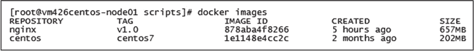
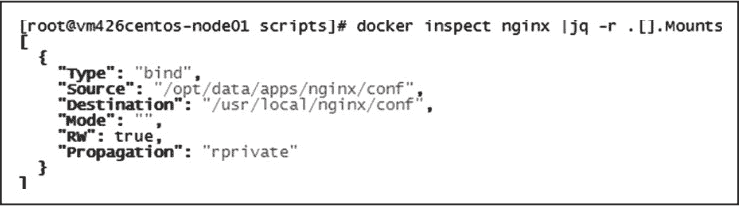

# Nginx 的 Docker 容器化配置

> 原文：[`www.weixueyuan.net/a/619.html`](http://www.weixueyuan.net/a/619.html)

Docker 是一款基于 Go 语言开发的开源应用容器引擎，Docker 可以让用户将需要运行的应用服务和依赖环境打包在一个小体积的应用容器中，被打包的容器可以移植到任意可运行 Docker 环境的操作系统中，极大地缩短了应用服务编译和部署所需的时间。Docker 的虚拟化机制也使得在不同操作系统环境下编译的应用服务都可运行在同一 Docker 宿主机中。

Docker 中有两个基本概念：镜像（Image）和容器（Container）。Docker 使用 AUFS 文件系统进行文件管理，这种文件系统的文件是分层叠加存储的，镜像是存储在只读层的文件，而运行的容器则是镜像运行的实例，它的实例文件存储在可写层中，所以通常需要先通过 Docker 命令制作镜像，然后再通过 Docker 编排命令将镜像运行成容器。

## 1、Docker 环境安装

Docker 的虚拟化机制是基于操作系统的进程级别虚拟化技术，所以 Docker 也可以安装在其他虚拟机中。在物理机或云环境的 CentOS 7 环境下均可通过 yum 命令实现快速安装，安装命令如下。

# 安装 yum 工具
yum install -y yum-utils

# 安装 Docker 官方 yum 源
yum-config-manager --add-repo https://download.docker.com/linux/centos/docker-ce.repo

# 安装 Docker 及 docker-compose 应用
yum install -y docker-ce docker-compose

# 设置 Docker 服务开机自启动
systemctl enable docker

# 启动 Docker 服务
systemctl start docker

## 2、Dockerfile 常用命令及编写

Dockerfile 是按照 Docker Build 语法约定的顺序结构规则脚本文件。通过 Dockerfile 的编写可以实现 Docker 镜像的自动化制作，本节所介绍的编译过程均可被编写在 Dockerfile 中，使用 Docker 命令打包为 Nginx 的 Docker 镜像。

Dockerfile 常用命令如下。

1) FROM 用于指定构建当前镜像的基础镜像名，使用方法如下。

FROM centos

2) MAINTAINER 用于填写作者声明的描述信息，使用方法如下。

MAINTAINER Nginx Dockerfile Write by John.Wang

3) ADD 命令会向 Image 中添加文件，支持文件、目录、URL 的源，使用方法如下。

ADD /tmp/init_nginx.sh /usr/local/nginx/sbin/

4) COPY 用于向镜像内复制文件夹，使用方法如下。

COPY . /tmp

5) ENV 设置 Container 启动后的环境变量，使用方法如下。

ENV PATH $PATH:/usr/local/nginx/sbin

6) EXPOSE 设置 Container 启动后对外开放的端口，它只相当于一个防火墙开放端口的概念，与实际运行的服务无关，使用方法如下。

EXPOSE 8080

7) RUN 用于在制作 Image 时执行指定的脚本或 shell 命令，使用方法如下。

RUM yum -y install net-tools

8) USER 设置运行 Image 或 Container 的系统用户，使用方法如下。

USER nginx:nginx

9) VOLUME 定义 Image 挂载点，该挂载点可被其他 Container 使用，且目录中的内容是共享的，将会同步更新，使用方法如下。

VOLUME ["/data1","/data2"]

10) WORKDIR 设置 CMD 参数指定命令的运行目录，使用方法如下。

WORKDIR ~/

11) CMD 命令是设定于 Container 启动后执行的命令，可被外部 `docker run` 命令参数覆盖，使用方法如下。

CMD "Hello Nginx"

12) ENTRYPOINT 命令是设定于 Container 启动后执行的命令，不可被外部 `docker run` 命令参数覆盖。

ENTRYPOINT /usr/local/nginx/sbin/init_nginx.sh

现在，可以按照 Dockerfile 的命令格式编写 Dockerfile 了，基础镜像选用 CentOS 7，Nginx 选用 Nginx 的扩展版本 OpenResty 1.15.8.2。

Nginx 镜像 Dockerfile 脚本如下：

FROM centos:centos7
MAINTAINER Nginx Dockerfile Write by John.Wang
RUN yum -y install epel-release && yum -y install wget gcc make pcre-devel \
    zlib-devel openssl-devel libxml2-devel libxslt-devel luajit GeoIP-devel \
    gd-devel libatomic_ops-devel luajit-devel perl-devel perl-ExtUtils-Embed

RUN cd /tmp && wget https://openresty.org/download/openresty-1.15.8.2.tar.gz  && \
    tar zxmf openresty-1.15.8.2.tar.gz && \
    cd openresty-1.15.8.2 && \
    ./configure \
        --with-threads \
        --with-file-aio \
        --with-http_ssl_module \
        --with-http_v2_module \
        --with-http_realip_module \
        --with-http_addition_module \
        --with-http_xslt_module=dynamic \
        --with-http_image_filter_module=dynamic \
        --with-http_geoip_module=dynamic \
        --with-http_sub_module \
        --with-http_dav_module \
        --with-http_flv_module \
        --with-http_mp4_module \
        --with-http_gunzip_module \
        --with-http_gzip_static_module \
        --with-http_auth_request_module \
        --with-http_random_index_module \
        --with-http_secure_link_module \
        --with-http_degradation_module \
        --with-http_slice_module \
        --with-http_stub_status_module \
        --with-stream=dynamic \
        --with-stream_ssl_module \
        --with-stream_realip_module \
        --with-stream_geoip_module=dynamic \
        --with-libatomic \
        --with-pcre-jit \
        --with-stream_ssl_preread_module && \
    gmake && gmake install
ENV PATH $PATH:/usr/local/nginx/sbin
RUN ln -s /usr/local/openresty/nginx /usr/local/nginx
RUN ln -sf /dev/stdout /usr/local/nginx/logs/access.log &&\
    ln -sf /dev/stderr /usr/local/nginx/logs/error.log
EXPOSE 80
ENTRYPOINT ["nginx", "-g", "daemon off;"]

在 Dockerfile 文件的同一目录下，执行如下命令构建 Nginx 的 Dokcer 镜像。

docker build -t nginx:v1.0 .

在脚本执行结束后，当尾行出现“Successfully tagged nginx:v1.0”时表示 Dokcer 镜像已经构建成功，可以通过 Docker 命令 docker images 查看镜像是否已经存在于本地的镜像仓库中，查询结果如下图所示。

图：本地镜像仓库中的所有 Docker 镜像

## 3、Nginx Docker 运行

Docker 镜像在 AUFS 文件系统中是只读的，需要通过 `docker run` 命令以容器方式运行，脚本如下：

docker run --name nginx -p 80:80 -d nginx:v1.0
docker ps -a
CONTAINER ID        IMAGE               COMMAND                  CREATED
STATUS                    PORTS               NAMES
26ffd54950e8          nginx:v1.0          "nginx -g 'daemon of…"  7 seconds ago
Up 7 seconds          0.0.0.0:80->80/tcp  nginx

通过 curl 命令访问本地 80 端口，可以返回 OpenResty 的提示信息。

Docker 容器如果被移除，所有的修改文件同样会被删除，为了把变更的配置保存下来，需要把配置文件目录复制出来进行持久化，所以需要通过卷挂载的方式实现配置的使用和维护，脚本如下：

mkdir -p /opt/data/apps/nginx/
docker cp nginx:/usr/local/nginx/conf /opt/data/apps/nginx/
docker stop nginx
docker rm nginx
docker run --name nginx -h nginx -p 80:80 -v
/opt/data/apps/nginx/conf:/usr/local/nginx/conf -d nginx:v1.0

如下图所示，Docker 容器已经把本地目录挂载到容器中。

图：目录挂载
在使用 docker run 命令时，每次都需要使用很多参数，为了便于维护，可以用 Docker-Compose 工具进行容器编排，Docker-Compose 是使用基于 YAML 语法的脚本配置文件来实现容器的运行管理的。Nginx 的 docker-compose.yaml 脚本文件如下：

nginx:
    image: nginx:v1.0
    restart: always
    container_name: nginx
    hostname: 'nginx'
    ports:
        - 80:80
    volumes:
        - '/opt/data/apps/nginx/conf:/usr/local/nginx/conf'