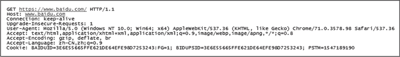
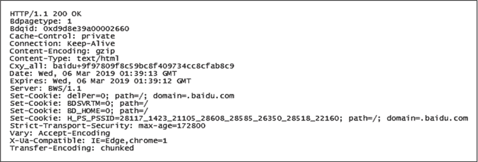

# Nginx 处理 HTTP 请求

> 原文：[`www.weixueyuan.net/a/646.html`](http://www.weixueyuan.net/a/646.html)

标准的 HTTP 请求从开始到结束包括请求报文和响应报文。

请求报文是客户端向服务端发起请求时告知服务端请求的方式、相关属性和请求内容的数据包，由请求行、请求头、请求体组成，这里以百度首页的请求为例，HTTP 请求头结构如下图所示。

图：HTTP 请求头结构
请求行是请求头内容的第一行，包括请求方法 GET，请求的 URI 地址 https://www.baidu.com，请求的协议及版本号 HTTP/1.1。

请求头还包含此次请求所设定的若干属性字段，属性字段由属性名称和属性值组成，如浏览器信息 User-Agent 等。

请求体则是请求数据，该请求是无参数的 GET 方法，请求体中无内容。

常见的请求头属性如下表所示。

| 属性名称 | 属性值样例 | 属性说明 |
| Host | www.baidu.com | 记录用户请求的目标主机名，常用于服务端虚拟主机的区分，对应 Nginx 的 server_name 指令的配置 |
| Accept | text/html, application/xhtml+xml | 描述客户端能够接收服务端返回的数据类型，Nginx 会通过 types 指令域中的内容做匹配 |
| Cookie | BD_HOME=1; sugstore=1 | 客户端当前连接的所有 cookie |
| Referer | https://www.baidu.com | 表示当前连接的上一个来源 URI |
| Cache-Control | no-cache | 当前客户端缓存机制的控制，可通过更多的属性值参数进行缓存控制 |
| Connection | keep-alive | 表示是否需要启用保持连接机制，HTTP/1.1 默认启用保持连接 |
| If-None-Match | W/ "50b1c1d4f775c61:df3" | 与页面响应头中 etag 的属性值配合使用，将 etag 的内容提交给服务端，用以判断请求内容是否已经被修改，若未被修改，则返回状态码 304，客户端使用本地缓存 |
| if_modified_since | -- | 当前请求 URI 页面本地缓存的最后修改时间。服务器会将实际文件的修改时间与该参数值进行比较，若一致，则返回 304，客户端读取本地缓存；若不一致，则返回服务端文件的内容 |

响应报文是服务端处理客户端请求后返回客户端的数据，数据包括响应行、响应头、响应体 3 个部分，HTTP 响应头结构如下图所示。

图：HTTP 响应头结构
响应行是响应头内容的第一行，包含报文协议及版本号 HTTP/1.1、响应状态码 200、响应状态描述 OK。

响应头则包含服务端处理完请求后响应设定的若干属性字段，如 set-cookie 信息等。

响应体为返回的处理结果，本次请求的响应体是 HTML 页面数据。

HTTP 响应状态码是响应报文中对 HTTP 请求处理结果的重要标识，响应状态码是由 RFC 2616 规范定义的，并由互联网号码分配局（Internet Assigned Numbers Authority）维护，状态码可以分为以下 5 个类别。

*   1××（消息）：表示服务端已经接收到请求，正在进行处理；
*   2××（处理成功）：表示服务端已经正确处理完客户端的 HTTP 请求；
*   3××（重定向）：服务端接收到 HTTP 请求，并将其 HTTP 请求重定向到客户本地或其他服务器进行处理；
*   4××（客户端请求有误）：客户端提交的请求不符合规范或未被授权、禁止访问等；
*   5××（服务端处理出错）：服务端无法正常完成请求操作，如超时等。

常见的响应头属性如下表所示。

| 属性名称 | 属性值样例 | 属性说明 |
| Content-Type | text/html; charset=utf-8 | 告知客户端返回数据的类型 |
| Connection | keep-alive | 告知客户端是否启用保持连接机制 |
| Cache-Control | no-cache | 告知客户端对缓存机制的控制 |
| ETag | "50b1c 1d4f775c61:df3" | 当前响应数据的实体标签值，用于在客户端与服务端提交相同请求时判断请求内容是否有修改 |
| Location | https://map.baidu.com/  | 告知客户端跳转到指定的 URI |
| Set-Cookie | username=john.wang | 通知客户端修改本地 cookie 内容 |

当 Nginx 接收 HTTP 请求后，处理相关的配置指令如下表所示。

| 指令 | 作用域 | 默认值 | 指令值选项 | 指令说明 |
| ignore_invalid_headers | http, server | on | on 或 off | 忽略请求头中的无效属性字段，请求头属性字段中，属性名称默认由英文字符、数字和连接符组成，不符合此标准的属性名均为无效属性名。当指令值为 on 时，不对无效的属性名称进行过滤 |
| underscores_in_headers | http, server | off | on 或 off | 请求头中属性名称的定义中“_”是无效连接符，启用该指令后，“_”将被认为是有效的连接符。如果该指令值为 off，则按照 ignore_invalid_headers 指令的配置进行处理 |
| client_header_buffer_size | http, server | 1k | -- | 设置存放读取客户端请求头的缓冲区的大小，默认值为 1K，当请求头的数据因 cookie 过长等其他原因超过所设定的大小时，会按照 large-client header buffers 的指令配置进行处理 |
| large_client_header_buffers | http, server | 48k | -- | 当客户请求头的大小超过 client_header_buffer_size 指令设置的值时，会将超出的部分转移到该缓冲区中。在默认配置下，超大请求头第一次可分配到一个 8KB 的缓冲区块，请求行的大小不能超过该缓冲区块的大小，否则将返回 414 错误。超出 8KB 的请求头会被循环转移到新的缓冲区块中，最多转移 4 次，当超过该值时，则会返回 400 错误 |
| client_header_timeout | http, server | 60s | -- | 读取客户端请求头的最大超时时间 |
| request_pool_size | http, server | 4k | -- | Nginx 开始处理请求时，会为每个请求分配一个 4KB 大小的内存池，以减少内核对小块内存的分配次数，HTTP 请求结束后会回收为其分配的内存池 |
| client_max_body_size | http, server, Location | 1m | -- | HTTP 请求时，请求体的最大值。当请求头中属性 Content-Length 的大小超过指令配置时，返回状态码 408 |
| client_body_buffer_size | http, server, location | -- | -- | 设置读取客户请求体的缓冲区大小，当请求体的大小超过该设定值后，会按照 client_body_in_single_buffer 指令的配置选择部分或全部写入 client_body_temp_path 指令设定的文件中。默认配置下，32 位系统下缓冲区的大小是 8KB，64 位系统下缓冲区的大小是 16KB |
| client_body_in_file_only | http, server, location | off | off 或 clean 或 on | 默认情况下是优先使用缓存，在请求体超出请求体缓冲区的大小时再写入文件。启用该指令后将禁用缓冲区，请求体会被直接写入 client_body_temp_path 指令设定的文件中 |
| client_body_temp_path | http, server, location | client_body_temp_path_client_body_temp | -- | 请求体被写入文件的临时目录 |
| client_body_timeout | http, server, location | 60s | -- | 当 HTTP 请求建立连接后，客户端在超过设定时间后仍未发送请求体内容到服务端，则 Nginx 认为请求体超时，将返回响应状态码 408 |
| if_modified_since | http, server, location | exact | off 或 exact 或 before | 在请求头中存在属性 if modified since 时，关闭或设置客户端缓存文件修改时间的服务端校验功能 |
| etag | http, server, location | on | on 或 off | etag（Entity Tag），用于在响应头中返回文件实体标签，与同一文件的下一次请求头中 If-None-Match 属性值组合检查文件是否被修改，未修改则返回响应状态码 304，否则返回最新的文件内容 |
| max_ranges | http, server, location | -- | -- | 默认为不限制大小，当客户端以 byte-range 方式获取数据请求时，该指令限定了允许的最大值。当指令值为 0 时，则关闭以 byte-range 方式获取数据的功能 |
| types | http, server, location | -- | -- | 被请求文件扩展名与 MIME 类型映射表 |
| types_hash_max_size | http, server, location | 1024 | -- | 设定 MIME 类型哈希表的大小 |
| types_hash_bucket_size | http, server, location | -- | -- | 设定 MIME 类型哈希桶的大小，默认值与 CPU 缓存行的大小一致，有 32、64、128（单位：字节）3 个值 |
| error_page | http, server, location | -- | -- | 当 HTTP 请求发生错误时，可以根据响应状态码定义一个返回的页面或执行跳转 |
| recursive_error_pages | http, server, location | off | off 或 on | 当使用 error_pages 设定多层内部访问时，仍可处理上一层级返回的响应状态码 |
| server_tokens | http, server, location | on | on 或 off | 默认在错误信息响应头中增加属性字段“Server”以标识 Nginx 的版本号 |
| msie_padding | http, server, location | on | on 或 off | 在响应状态大于或等于 400 时，会在响应报文中添加注释，使响应报文大小达到 512 字节。仅适用于 msie 客户端 |

配置样例如下：

http {
    ignore_invalid_headers off;
    underscores_in_headers on;
    client_header_buffer_size 2k;
    large_client_header_buffers 10 8k;
    client_header_timeout 180s;
    request_pool_size 4k;
    client_max_body_size 100m;
    client_body_in_file_only on;
    client_body_temp_path /tmp/nginx/client_temp 1 2;
    client_body_timeout 120s;
    if_modified_since before;
    etag off;
    max_ranges 1024 ;
    types_hash_max_size 2048;
    types_hash_bucket_size 64;
    error_page 404             /404.html;
    error_page 500 502 503 504 /50x.html;
    error_page 404 = @fallback;
    location @fallback {
        proxy_pass http://backend;
    }
    error_page 404 =200 /empty.gif;
    location /download/ {
        types {
            application/octet-stream yaml;
        }
        default_type application/octet-stream;
    }
    proxy_intercept_errors on;          # 当上游服务器返回非 200 状态码时，返回代理服务器处理
    recursive_error_pages on;           # 启用多级错误跳转功能
    location / {
        error_page 404 = @fallback;     # 当前 URL 请求为 404 时执行内部请求@fallback
    }
    location @fallback {
        proxy_pass http://backend;      # 当前所有请求代理到上游服务器 backend
        error_page 502 = @upfallback;   # 当上游服务器返回 502 状态码时，执行内部请求@upfallback
    }
    location @upfallback {
        proxy_pass http://newbackend;   # 当前的所有请求代理到上游服务器 newbackend
    }
    server_tokens off;
    msie_padding off;
}