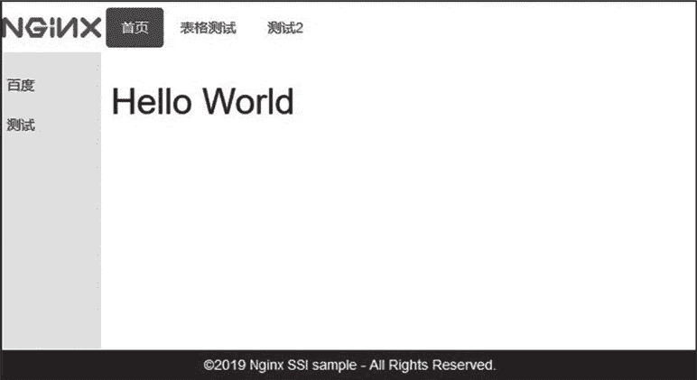
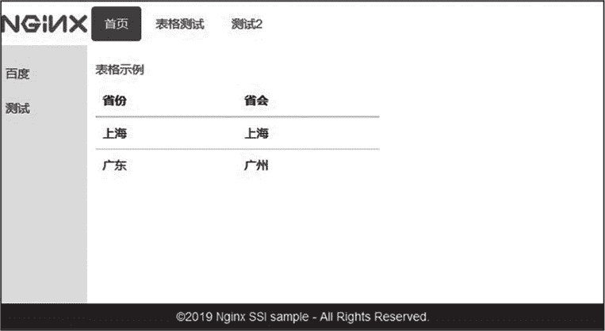

# Nginx 伪动态 SSI 服务器

> 原文：[`www.weixueyuan.net/a/707.html`](http://www.weixueyuan.net/a/707.html)

Nginx 可以通过 SSI 命令将多个超文本文件组合成一个页面文件发送给客户端。SSI（Server Side Include）是一种基于服务端的超文本文件处理技术。由于 SSI 仍是通过其他动态脚本语言获取动态数据的，所以此处将其归类为伪动态服务功能。

SSI 服务器可通过 SSI 命令实现诸多动态脚本语言的 HTML 模板功能，配合其他动态脚本服务的 API，完全可以实现前后端分离的 Web 应用。

## 1、配置指令

Nginx 是通过 ngx_http_ssi_module 模块实现 SSI 命令处理的，SSI 配置指令如下表所示。

| 指令名称  | 指令值格式  | 默认值 | 指令说明 |
| ssi | on 或 off | off | 启用 SSI 命令功能 |
| ssi_last_modified | on 或 off | off  | 允许保留原始响应头中的属性字段 Last-Modified，默认配置下该字段会被移除 |
| ssi_min_file_chunk | size | 1k | 设置存储在磁盘上的响应数据的最小值，超过该值的文件使用 sendfile 功能发送 |
| ssi_silent_errors | on 或 off | off | 当指令值为 on 时，SSI 处理出现错误后不输出 errmsg 的内容 |
| ssi_types | mime-type...  | text/html | 设置 SSI 处理的 MIME 类型 |
| ssi_value_length | length | 256   | SSI 中变量值的最大长度 |

上述指令均可编写在 http、server、location 指令域中，ssi 指令还可编写在 if 指令域中。

## 2、SSI 命令

SSI 命令格式如下：

<!--# command parameter1=value1 parameter2=value2 ... -->

Nginx 支持如下 SSI 命令。

#### 1) block

通过 block 命令可以定义一个超文本内容，该内容可以被 include 命令参数 stub 引用。超文本内容中可以包含其他 SSI 命令。

#### 2) include

通过 include 命令可以引入一个文件或请求响应的结果数据。参数有 file（引入一个文件）、virtual（引入一个内部请求响应数据）、stub（引入一个 block 内容为默认数据）、wait（是否等待 virtual 参数发起请求处理完毕再处理 SSI 命令）、set（将 virtual 参数的响应内容输出到指定的变量）。

SSI 文件配置样例如下：

<!--# block name="one" -->&nbsp;<!--# endblock -->      # block one 的内容为空
<!--# include file="footer.html" stub="one" -->        
    # 引用文件 footer.html 的内容，若 footer.html 文件不存在或 SSI 命令出错，输出 block one 的内容
<!--# include virtual="/remote/body.php?argument=value" wait="yes" stub="one"
      set="body" -->
    # 引用内部请求的响应数据，等待请求完毕再处理 SSI 指令，若出错则输出 block one 的内容，成功则
    # 把返回结果赋值给变量 body

Nginx 中样例配置如下：

location /remote/ {
    subrequest_output_buffer_size 128k;　# 子请求的输出缓冲区大小是 128KB
    ...
}

include 不支持“../”这样的相对路径；另外 include 参数 set 的响应数据大小通过指令 subrequest_output_buffer_size 设置。

#### 3) config

通过 config 命令可以设置 SSI 处理过程中使用的参数 errmsg（SSI 处理出错时输出的字符串）和 timefmt（输出时间的格式，默认为“%A,%d-%b-%Y %H:%M:%S %Z”）。

<!--# config errmsg="oh!出错了" timefmt="%A, %d-%b-%Y %H:%M:%S %Z" -->

#### 4) set

通过 set 命令设置变量。参数有 var（变量名）和 value（变量值）。

#### 5) echo

通过 echo 命令输出变量的值。参数有 encoding（HTML 编码方式，默认为 entity）、default（变量不存在时定义的默认输出，默认为 none）。

<!--# set var="This_TEST" value="with a SSI test value" -->
<!--# echo var="This_TEST" -->

#### 6) if

通过 if 命令可进行条件控制，且 if 命令支持正则判断。

<!--# if expr="$name != /text/" -->
    <!--# echo var="name" -->
<!--# endif -->
<!--# if expr="$name = /(.+)@(?P<domain>.+)/" -->
    <!--# echo var="domain" -->
<!--# else -->
    <!--# echo var="1" -->
<!--# endif -->

## 3、配置样例

根据 Nginx SSI 模块提供的功能可以搭建一个类似 HTML 框架的前端模板网站。模板目录规划如下：

├── _footer.html 
├── _header.html
├── _head.html
├── index.html
├── _sidebar.html
├── static
│     └── main.css
└── table.html

文件 _footer.html 内容如下：

```

<div id="footer">
    <!--# config timefmt="%Y" -->&copy;<!--# echo var="date_local" --> Nginx
          SSI sample - All Rights Reserved.
</div>
```

文件 _header.html 内容如下：

```

<div id="logo">
    
</div>
<div id="header">
    <ul class="nav nav-pills">
        <li class="active"><a href="index.html">首页</a></li>
        <li><a href="table.html">表格测试</a></li>
        <li><a href="#">测试 2</a></li>
    </ul>
</div>
```

文件 _head.html 内容如下：

```

<!DOCTYPE html PUBLIC "-//W3C//DTD XHTML 1.0 Transitional//EN" "http://www.w3.org/TR/xhtml1/DTD/xhtml1-transitional.dtd">
<html>
<head>
    <meta content="text/html; charset=UTF-8" http-equiv="Content-Type">
        <link rel="stylesheet" href="https://cdn.staticfile.org/twitter-bootstrap/3.3.7/css/bootstrap.min.css">
        <script src="https://cdn.staticfile.org/jquery/2.1.1/jquery.min.js"></script>
        <script src="https://cdn.staticfile.org/twitter-bootstrap/3.3.7/js/bootstrap.min.js"></script>
        <link rel="stylesheet" href="/static/main.css?v=12">
</head>
```

文件 index.html 内容如下：

```

<!--# block name="one" --><!--# endblock -->
<!--# include file="_head.html" stub="one" -->   
<body>
    <div>
        <!--# include file="_header.html" stub="one" -->   
        <!--# include file="_sidebar.html" stub="one" -->
    </div>
<div id="section">
    <h1>Hello World</h1>
</div>
<!--# include file="_footer.html" stub="one" -->
</body>
</html>
```

文件 _sidebar.html 内容如下：

```

<div id="sidebar">
    <ul class="nav navbar-nav">
        <li class="active"><a href="http://www.baidu.com" target="blank">百度</a></li>
        <li class="active"><a href="#">测试</a></li>
    </ul>
</div>
```

首页页面效果如下图所示。


图：SSI 框架首页
文件 table.html 内容如下：

```

<!--# block name="one" --><!--# endblock -->
<!--# include file="_head.html" stub="one" -->   
<body>
    <div>
        <!--# include file="_header.html" stub="one" -->   
        <!--# include file="_sidebar.html" stub="one" -->
    </div>
<div id="section">
    <table class="table">
            <caption>表格示例</caption>
        <thead>
            <tr>
            <th>省份</th>
            <th>省会</th>
            </tr>
        </thead>
        <tbody>
            <tr>
            <td>上海</td>
            <td>上海</td>
            </tr>
            <tr>
            <td>广东</td>
            <td>广州</td>
            </tr>
        </tbody>
    </table>
</div>
<!--# include file="_footer.html" stub="one" -->
</body>
</html>
```

表格页页面效果如下图所示。


图：SSI 框架表格页
Nginx 配置内容如下：

```

server {
    listen 8081;
    server_name localhost;
    charset utf-8;
    root /opt/nginx-web/nginx-ssi;
    sendfile on;
    ssi on;                         # 启用 SSI 命令解析支持
    ssi_min_file_chunk 1k;          # 存储在磁盘上的响应数据的最小值为 1KB
    ssi_value_length 1024;          # SSI 中变量值的最大长度为 1024 字节
    ssi_silent_errors off;          # 输出 errmsg 的内容

    location / {
         index index.html;
    }
}
```