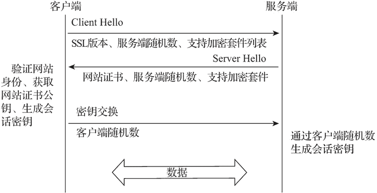

# Nginx HTTPS 服务器搭建

> 原文：[`www.weixueyuan.net/a/711.html`](http://www.weixueyuan.net/a/711.html)

互联网应用为我们提供了丰富的信息内容，在给我们带来方便的同时也影响着我们的生活方式。随着人们对网络的依赖不断增强，安全问题变得愈发重要，各种加密技术应运而生。SSL 协议是 20 世纪 90 年代由 Netscape 公司提出的，后由 ITEL 接管并进行标准化，更名为 TLS 协议，TLS 1.0 就是 SSL 3.1 版本。

HTTPS（HyperText Transfer Protocol Secure，超文本传输安全协议）是在 HTTP 的基础上增加了 SSL 协议，为数据传输提供了身份验证和加密功能。使用 HTTPS 协议可验证用户客户端和服务器的身份，确保数据可以在正确的用户客户端和服务器间传输。

因为 HTTPS 协议的数据传输是加密的，所以在传输过程中可以有效防止数据被窃取和修改，从而保障网络信息的安全。Nginx 的 HTTPS 协议服务是通过 ngx_http_ssl_module 模块实现的，在配置编译参数时需要添加 --with-http_ssl_module 参数启用该功能。

## 1、配置指令

Nginx HTTPS 配置指令如下表所示。

| 指令名称 | 指令值格式 | 默认值 | 指令说明 |
| ssl | on 或 off | off | 启用 SSL 支持，建议使用 listen 的 ssl 参数开启 |
| ssl_protocols | [SSLv2][SSLv3] [TLSvl][TLSv1.1]
[TLSv1.2][TLSv1.3] | TLSv1 TLSv1.1
TLSv1.2 | 设置使用的 SSL 协议 |
| ssl_buffer_size | size | 16k | 设置用于发送数据的缓存大小 |
| ssl_certificate | file | -- | PEM 格式的网站证书文件，可自建或由 CA 机构颁发 |
| ssl_certificate_key | file | -- | PEM 格式的网站证书私钥文件，可自建或由 CA 机构颁发 |
| ssl_password_file | file | -- | 存放网站证书私钥密码的文件，一个密码一行，有多个密码时，Nginx 会依次尝试 |
| ssl_ciphers | ciphers | HIGH: !aNULL:
!MD5 | 设置 HTTPS 建立连接时用于协商使用的加密算法组合，也称密码套件，指令值内容为 openssl 的密码套件名称，多个套件名称间用“:”分隔 |
| ssl_prefer_server_ciphers | on 或 off | off | 是否启用在 SSLv3 和 TLSv1 协议的 HTTPS 连接时优先使用服务端设置的密码套件 |
| ssl_dhparam | file | -- | DH 密钥交换的 Diffie-Hellman 参数文件 |
| ssl_ecdh_curve | curve | auto | 配置 SSL 加密时使用椭圆曲线 DH 密钥交换的曲线参数，多个参数间使用“:”分隔。ecdh 是 Elliptic-Curve 和 Diffie-Hellman 的缩写，指令值为 auto 时，配置的曲线参数是 prime256v1 |
| ssl_early_data | on 或 off | off | 是否启用 TLS 1.3 0-RTT 支持 |
| ssl_session_cache | off 或 none 或 [builtin[:size]]
[shared:name:size] | none | HTTPS 会话缓存设置，指令值参数见后面的介绍 |
| ssl_session_tickets | on 或 off | on | 是否启用会话凭证（Session Ticket）机制实现 HTTPS 会话缓存，当指令值为 off 时，使用会话编号（Session ID）机制 |
| ssl_session_ticket_key | file | -- | 指定会话凭证密钥文件，用于在多台 Nginx 间实现会话凭证共享，否则 Nginx 会随机生成一个会话凭证密钥 |
| ssl_session_timeout | time | 5m | 设置客户端可用会话缓存的超时时间 |
| ssl_verify_client | on 或 off 或 optional 或 optional_no_ca | off | 设置是否启用客户端证书验证功能。当指令值为 on 时启用验证；当指令值为 optional 时，如果接收到客户端证书则启用验证；当指令值为 optional_no_ca 时，若接收到客户端证书则启用客户端证书验证，但不进行证书链校验。将验证结果存储在 $ssl_client_verity 变量中 |
| ssl_verify_depth | number | 1 | 设置客户端证书链验证深度 |
| ssl_crl | file | -- | 用于验证客户端证书有效性的证书吊销列表文件 |
| ssl_client_certificate | file | -- | 指定一个 PEM 格式的 CA 证书（根或中间证书）文件，该证书用作在线证书协议（OCSP）响应的证书验证或客户端证书验证，该证书列表会发送给客户端 |
| ssl_trusted_certificate | file | -- | 指定一个 PEM 格式的 CA 证书（根或中间证书）文件，该证书用作在线证书协议响应的证书验证或客户端证书验证，该证书列表不会发送给客户端 |
| ssl_stapling | on 或 off | off | 是否启用在线证书协议结果缓存 |
| ssl_stapling_file | file | -- | 在线证书协议结果缓存文件 |
| ssl_stapling_responder | url | -- | 设置获取在线证书协议结果的 URL，优先级低于 ssl_stapling_file，仅支持 HTTP 协议，默认端口为 80 |
| ssl_stapling_verify | on 或 off | off | 设置是否启用在线证书协议结果缓存证书验证 |

1) 上述指令都可编写在 http、server 指令域中。

2) ssl_ciphers 指令值的内容是 OpenSSL 参数 ciphers 的内容，可通过如下命令查看。

openssl ciphers                 # 列出 OpenSSL 支持的密码套件
openssl ciphers -v 'ALL:eNULL'  # 列出指定密码套件详情

3) 密码套件格式及说明可参见 OpenSSL 相关文档。

4) ssl_session_cache 指令值参数如下。

*   off：禁用 HTTPS 会话缓存；
*   none：启用伪会话缓存支持，Nginx 告知客户端可进行会话重用，但服务端并未存储会话参数；
*   builtin：使用内置 OpenSSL 缓存机制，无法在 Nginx 的多个工作进程中共享缓存内容；
*   shared：使用 Nginx 的共享缓存机制，会在 Nginx 的多个工作进程中共享缓存内容，1MB 内存可以存储 4000 个会话。

## 2、HTTPS 基本配置

HTTPS 协议数据的传输是基于 SSL 层加密的数据，其简单模型是服务端获得客户请求后，将用私钥加密的协商数据发送给客户端。客户端先使用服务端提供的公钥解密协商数据并读取真实的内容，再用公钥加密返回协商数据并发送给服务端，完成彼此间的密钥协商。密钥协商完毕后，服务端和客户端通过协商后的密钥进行通信数据的加解密传输。私钥只存放在服务端，公钥则由所有的客户端持有。

在实际使用过程中，为提高公钥的使用安全性、防止公钥被替换，使用第三方 CA 机构的证书实现对服务器身份的认证和网站公钥的安全传递。HTTPS 先通过非对称加密方式交换密钥，建立连接后再通过协商后的密钥与加密算法进行对称加密数据传输，如下图所示。


图：HTTPS 时序图
1) 服务端按照自身的域名等身份信息创建网站证书私钥和网站证书申请文件，网站管理员将证书申请文件提交给 CA 机构并获得网站证书，网站证书和网站证书私钥被部署到服务端。

2) 客户端发送包含协议版本号、客户端随机数（Client Random）、支持加密套件列表的请求给服务端。

3) 服务端获得客户端 HTTPS 请求后，将包含网站信息及网站证书公钥的证书、服务端随机数（Server Random）及随机选择的客户端支持加密套件返回给客户端，若需要验证客户端身份，也会在此时发送相关信息给客户端。

4) 客户端通过操作系统中的 CA 公钥解密证书获取网站证书公钥并进行网站证书的合法性、有效期和是否被吊销的验证。

5) 客户端用网站证书公钥将新生成的客户端随机数加密后发送给服务端，同时使用 3 个随机数生成会话密钥。

6) 服务端使用网站证书私钥解密客户端数据获取客户端随机数（Pre-master），使用 3 个随机数生成会话密钥。

7) 服务端与客户端使用一致的会话密钥和加密算法完成传输数据的加解密交互。

HTTPS 网站证书是由 CA 机构颁发的，网站管理员只需按照相关流程向 CA 机构提交请求文件即可，操作步骤如下。

#### 1) 生成请求文件

生成请求文件的脚本如下：

## 创建无密码网站证书私钥文件的请求文件
openssl req -out /etc/nginx/conf/ssl/www_nginxbar_org.csr -new -sha256 -newkey rsa:2048 -nodes -keyout /etc/nginx/conf/ssl/www_nginxbar_org.key -subj "/C=CN/ST=Shanghai/L=Shanghai/O=nginxbar/OU=admin/CN=nginxbar.com/emailAddress=admin@nginxbar.com"

## 创建有密码私钥文件的请求文件
openssl genrsa -aes256 -passout pass:111111 -out /etc/nginx/conf/ssl/www_nginxbar_org.key 2048

openssl req -out /etc/nginx/conf/ssl/www_nginxbar_org.csr -new -sha256 -nodes -passin pass:111111 -key /etc/nginx/conf/ssl/www_nginxbar_org.key -subj "/C=CN/ST=Shanghai/L=Shanghai/O=nginxbar/OU=admin/CN=nginxbar.com/emailAddress=admin@nginxbar.com"

## 保存私钥密码
echo "111111" >>/etc/nginx/conf/ssl/www_nginxbar_org.pass

网站证书私钥文件是否需要密码由用户自行选择，只需选择一种方式执行即可。

#### 2) 获取证书文件

将 www_nginxbar_org.csr 文件提交给 CA 机构后，即可获得 Nginx 支持的 PEM 格式证书文件。

CA 机构为方便进行证书管理，通常会以证书链的方式进行网站证书的颁发与验证，证书链通常由网站证书、中间证书与根证书组成。证书链的验证是由网站证书开始、自下而上进行信任验证传递的。根证书通常存放在客户端，吊销根证书的过程非常困难；中间证书只是增加了一个中间验证环节，可以减少 CA 机构对根证书的管理维护工作，吊销也相对简单。除了向 CA 机构申请证书外，也可以自签证书在内部使用，自签证书操作如下：

## 创建独立站点使用的自签证书
openssl req -new -x509 -nodes -out /etc/nginx/conf/ssl/www_nginxbar_org.pem -keyout /etc/nginx/conf/ssl/www_nginxbar_org.key -days 3650 -subj "/C=CN/ST=Shanghai/L=Shanghai/O=nginxbar/OU=admin/CN=nginxbar.com/emailAddress=admin@nginxbar.com"

## 创建独立站点使用有密码的网站证书私钥文件的自签证书
openssl genrsa -aes256 -passout pass:111111 -out /etc/nginx/conf/ssl/www_nginxbar_org.key 2048

openssl req -new -x509 -nodes -out /etc/nginx/conf/ssl/www_nginxbar_org.pem -passin pass:111111 -key /etc/nginx/conf/ssl/www_nginxbar_org.key -days 3650 -subj "/C=CN/ST=Shanghai/L=Shanghai/O=nginxbar/OU=admin/CN=nginxbar.com/emailAddress=admin@nginxbar.com"

## 保存私钥密码
echo "111111" >>/etc/nginx/conf/ssl/www_nginxbar_org.pass

## 创建自签客户端证书
openssl req -new -x509 -nodes -out /etc/nginx/conf/ssl/client.pem -keyout /etc/nginx/conf/ssl/client.key -days 3650 -subj "/C=CN/ST=Shanghai/L=Shanghai/O=nginxbar/OU=admin/CN=nginxbar.com/emailAddress=admin@nginxbar.com"

## 转换客户端证书为可被浏览器导入的 pkcs12 格式
openssl pkcs12 -export -clcerts -in /etc/nginx/conf/ssl/client.pem -inkey /etc/nginx/conf/ssl/client.key -out /etc/nginx/conf/ssl/client.p12

获得网站证书后，可以按照如下方式配置 HTTPS 站点。

```

server {
    listen 443 ssl;                                 # 启用 HTTPS 支持
    server_name www.nginxbar.org;
    charset utf-8;
    root /opt/nginx-web;
    index index.html index.htm;

    ssl_certificate ssl/www_nginxbar_org.pem;       # HTTPS 网站证书
    ssl_certificate_key ssl/www_nginxbar_org.key;   # HTTPS 网站证书私钥
    ssl_password_file ssl/www_nginxbar_org.pass;    # HTTPS 网站证书私钥密码文件
}
```

## 3、HTTPS 密钥交换算法

在 HTTPS 建立连接进行密钥交换阶段，可以通过多种密钥交换算法实现密钥交换。基于 RSA 的密钥交换过程是客户端把第 3 个随机数发送给服务端，但在 HTTPS 建立连接阶段的传输仍是明文的，会存在安全问题。

DH（Diffie-Hellman）密钥交换算法可保证通信双方在明文传输的环境下安全地交换密钥。基于 DH 的密钥交换过程是在服务端产生服务端随机数后，将 DH 参数和密钥交换服务端公钥加密后传递给客户端，客户端根据 DH 参数和密钥交换服务端公钥计算出第 3 个随机数，并把自己产生的密钥更换为客户端公钥发送给服务端，服务端依据密钥交换客户端公钥计算出第 3 个随机数并完成后续的操作。

椭圆曲线的 DH（ECDH）密钥交换算法与 DH 交换算法相似，但使用了不同的数学模型。在使用椭圆曲线的 DH 密钥交换时，服务器会为密钥交换指定一条预先定义好参数的曲线，Nginx 的 ECDH 密钥交换默认配置的是 prime256v1 曲线算法。配置样例如下：

```

server {
    listen 443 ssl;
    server_name www.nginxbar.org;
    charset utf-8;
    root /opt/nginx-web;
    index index.html index.htm;

    ssl_certificate ssl/www_nginxbar_org.pem;
    ssl_certificate_key ssl/www_nginxbar_org.key;
    ssl_password_file ssl/www_nginxbar_org.pass;
    ssl_dhparam ssl/dhparam.pem;                    # DH 参数文件
    ssl_ecdh_curve auto;                            # ECDH 椭圆曲线算法为 prime256v1
}
```

DH 参数文件可通过如下命令生成。

openssl dhparam -out /etc/nginx/conf/ssl/dhparam.pem 2048

基于 DH 的密钥交换算法也称前向加密（Forward Secrecy）或完全前向加密（Perfect Forward Secrecy），其应用场景是即便日后服务器的 SSL 私钥被第三方获得，后者也无法推算出会话密钥。

## 4、HTTPS 会话缓存

HTTPS 建立连接时传递证书及协商会话密钥会占用一定资源，为加快 HTTPS 建立连接的速度，提升性能，TLS 协议使用了会话缓存机制。会话缓存机制可以使已经断开连接的 HTTPS 会话重用之前的协商会话密钥继续 HTTPS 数据传输。会话缓存机制有两种实现方式：会话编号（Session ID）和会话凭证（Session Ticket）。

#### 1) 会话编号

服务端在与客户端进行数据传输时，会为每次会话生成一个会话编号，并存储该会话编号与会话协商数据。HTTPS 会话中断需要重新连接时，客户端将最后一次会话的会话编号发送给服务端，服务端检查存储中该编号是否存在，如果存在就与客户端使用原有的会话密钥进行数据传输。配置样例如下：

```

server {
    listen 443 ssl;
    server_name www.nginxbar.org;
    charset utf-8;
    root /opt/nginx-web;
    index index.html index.htm;

    ssl_certificate ssl/www_nginxbar_org.pem;
    ssl_certificate_key ssl/www_nginxbar_org.key;
    ssl_password_file ssl/www_nginxbar_org.pass;

    ssl_session_cache shared:SSL:10m;               # HTTPS 会话缓存存储大小为 10MB
    ssl_session_tickets off;                        # 以会话编号机制实现会话缓存
    ssl_session_timeout 10m;                        # 会话缓存超时时间为 10 分钟
}
```

这里作以下两点说明。

*   服务端会存储会话编号和会话协商数据，相对会消耗服务器资源；
*   当 Nginx 服务器为多台时，无法实现会话共享。

#### 2) 会话凭证

会话凭证类似于 cookie，它将协商的通信数据加密之后发送给客户端保存，服务端只保存密钥。HTTPS 建立连接后，服务端发送一个会话凭证给客户端，当需要重新连接时，客户端发送会话凭证与服务端恢复会话连接。配置样例如下：

```

server {
    listen 443 ssl;
    server_name www.nginxbar.org;
    charset utf-8;
    root /opt/nginx-web;
    index index.html index.htm;

    ssl_certificate ssl/www_nginxbar_org.pem;
    ssl_certificate_key ssl/www_nginxbar_org.key;
    ssl_password_file ssl/www_nginxbar_org.pass;

    ssl_session_cache shared:SSL:10m;               # HTTPS 会话缓存存储大小为 10MB
    ssl_session_tickets off;                        # 以会话凭证机制实现会话缓存
    ssl_session_timeout 10m;                        # 会话缓存超时时间为 10 分钟
    ssl_session_ticket_key ssl/session_ticket.key;  # 会话凭证密钥文件
}
```

ssl_session_ticket_key 可以实现多台 Nginx 间共用会话缓存，解决了会话缓存共享问题，可通过如下命令生成：

openssl rand 80 > /etc/nginx/conf/ssl/session_ticket.key

## 5、HTTPS 双向认证配置

通常网站的 HTTPS 访问，都是客户端通过证书验证所访问服务器的身份，而服务器对来访的客户端并不做身份验证，也称单向认证。在一些场景中，也会增加客户端身份验证以提高数据传输的安全性，这就是双向认证。配置样例如下：

```

server {
    listen 443 ssl;
    server_name www.nginxbar.org;
    charset utf-8;
    root /opt/nginx-web;
    index index.html index.htm;

    ssl_certificate ssl/www_nginxbar_org.pem;
    ssl_certificate_key ssl/www_nginxbar_org.key;
    ssl_password_file ssl/www_nginxbar_org.pass;

    ssl_session_cache shared:SSL:10m;
    ssl_session_timeout 10m;
    ssl_session_ticket_key ssl/session_ticket.key;

    ssl_verify_client on;                          # 启用客户端证书认证
    ssl_client_certificate ssl/ca.pem;             # 客户端证书信任链的 CA 中间证书或根证书
}
```

## 6、HTTPS 吊销证书配置

HTTPS 的证书会因安全原因在正常有效期到期前进行证书变更，为了方便客户端或浏览器及时判断当前使用的网站证书是否已被吊销，通常会采用以下两种方式实现：证书吊销列表（CRL）和在线证书协议（OCSP）。

#### 1) 证书吊销列表

证书吊销列表是由 CA 机构维护的列表，列表中包含已被吊销的证书序列号和时间，通常在 CA 机构证书中都会包含 CRL 下载地址。证书吊销列表 Nginx 配置如下：

```

server {
    listen 443 ssl;
    server_name www.nginxbar.org;
    charset utf-8;
    root /opt/nginx-web;
    index index.html index.htm;

    ssl_certificate ssl/www_nginxbar_org.pem;
    ssl_certificate_key ssl/www_nginxbar_org.key;
    ssl_password_file ssl/www_nginxbar_org.pass;

    ssl_session_cache shared:SSL:10m;
    ssl_session_timeout 10m;
    ssl_session_ticket_key ssl/session_ticket.key;

    ssl_crl ssl/ca.crl;                          # 证书吊销列表文件
}
```

证书吊销列表可通过查看网站证书字段“CRL 分发点”的字段值下载获得。

#### 2) 在线证书协议

在线证书协议是一个吊销证书在线查询协议，虽然可以实现实时查询，但同时也会因在 HTTPS 建立连接时查询 OCSP 接口引发性能问题。为解决 OCSP 查询造成的性能影响，引入了 OCSP Stapling 机制，即由 HTTPS 服务器查询 OCSP 接口或本地 OCSP 缓存，并通过证书状态消息返回给客户端。

在线证书协议缓存 Nginx 配置如下：

```

resolver 114.114.114.114 valid=300s;             # DNS 服务器地址
resolver_timeout 1s;                             # DNS 解析超时时间为 1s

server {
    listen 443 ssl;
    server_name www.nginxbar.org;
    charset utf-8;
    root /opt/nginx-web;
    index index.html index.htm;

    ssl_certificate ssl/www_nginxbar_org.pem;
    ssl_certificate_key ssl/www_nginxbar_org.key;
    ssl_password_file ssl/www_nginxbar_org.pass;

    ssl_session_cache shared:SSL:10m;
    ssl_session_timeout 10m;
    ssl_session_ticket_key ssl/session_ticket.key;

    ssl_stapling on;                                 # 启用 OCSP 缓存
    ssl_stapling_file ssl/ocsp.pem;                  # OCSP 结果缓存文件
    ssl_stapling_responder http://ocsp.example.com/; # 设置获取 OCSP 结果的 URL
    ssl_stapling_verify on;                          # 设置 OCSP 结果缓存证书验证
    ssl_trusted_certificate ssl/ca.pem;              # 网站证书信任证书链的中间证书文件
}
```

注意，OCSP 结果缓存文件和获取 OCSP 结果的 URL 同时设置时，OCSP 结果缓存文件的优先级最高。

OCSP 响应结果可通过如下命令获得。

openssl ocsp -issuer /etc/nginx/conf/ssl/ca.pem -cert
/etc/nginx/conf/ssl/www_nginxbar_org.pem -no_nonce -text -url
http://ocsp.example.com -text -respout /etc/nginx/conf/ssl/ocsp.pem

## 7、HTTPS 配置样例

HTTPS 通过加密通道保护客户端与服务端之间的数据传输，极大地降低了数据被窃取、篡改的风险，增强了网站对数据安全的保护能力，已成为当前网站建设的必选配置。根据 Nginx 提供的配置指令，HTTPS 配置样例如下：

```

resolver 114.114.114.114 valid=300s;               # DNS 服务器地址
resolver_timeout 5s;                               # DNS 解析超时时间为 5s

server {
    listen 443 ssl;
    server_name www.nginxbar.org;
    charset utf-8;
    root /opt/nginx-web;
    index index.html index.htm;

    ssl_protocols TLSv1 TLSv1.1 TLSv1.2 TLSv1.3;   # DNS 服务器地址
    ssl_ciphers EECDH+CHACHA20:EECDH+CHACHA20-draft:EECDH+AES128:RSA+AES128:EECDH+AES256:RSA+AES256:EECDH+3DES:RSA+3DES:!MD5;
    ssl_prefer_server_ciphers on;                  # 启用服务端密码组件优先
    ssl_dhparam  ssl/dhparam.pem;                  # 设置 DH 密钥交换算法参数
    ssl_ecdh_curve secp384r1;                      # DH 密钥交换椭圆曲线算法为 secp384r1

    ssl_certificate ssl/www_nginxbar_org.pem;      # 网站证书文件
    ssl_certificate_key ssl/www_nginxbar_org.key;  # 网站证书密钥文件
    ssl_password_file ssl/www_nginxbar_org.pass;   # 网站证书密钥密码文件

    ssl_session_cache shared:SSL:10m;              # 会话缓存存储大小为 10MB
    ssl_session_timeout  10m;                      # 会话缓存超时时间为 10 分钟
    ssl_session_tickets on;                        # 设置会话凭证为会话缓存机制
    ssl_session_ticket_key  ssl/session_ticket.key;# 设置会话凭证密钥文件

    ssl_stapling on;                               # 启用 OCSP 缓存
    ssl_stapling_file ssl/ocsp.pem;                # OCSP 结果缓存文件
    ssl_stapling_verify on;                        # 设置 OCSP 结果缓存证书验证
    ssl_trusted_certificate  ssl/ca.pem;           # 网站证书信任证书链的中间证书文件

    # 启用 HSTS
    add_header Strict-Transport-Security "max-age=63072000; includeSubDomains; preload";

    add_header X-Frame-Options DENY;               # 禁止被嵌入框架
    add_header X-XSS-Protection "1; mode=block";   # XSS 跨站防护
    add_header X-Content-Type-Options nosniff;     # 防止在浏览器中的 MIME 类型混淆攻击
}

server {
    listen      80;
    server_name www.nginxbar.org;
    rewrite ^(.*)$  https://$host$1? permanent;    # 强制 HTTP 访问跳转为 HTTPS 访问
}
```

可以通过网站 ssllabs.com 对 HTTPS 的配置进行安全性检测，并按照测试结果有针对性地进行优化。