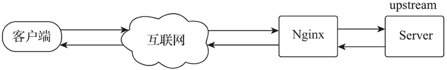
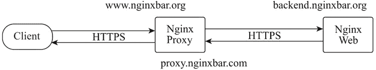

# Nginx HTTP 代理服务器

> 原文：[`www.weixueyuan.net/a/743.html`](http://www.weixueyuan.net/a/743.html)

代理功能根据应用方式的不同可以分为正向代理和反向代理。正向代理是客户端设置代理地址后，以代理服务器的 IP 作为源 IP 访问互联网应用服务的代理方式；反向代理则是客户端直接访问代理服务器，代理服务器再根据客户端请求的主机名、端口号及 URI 路径等条件判断后，将客户端请求转发到应用服务器获取响应数据的代理方式。

## 1、模块指令

Nginx 的 HTTP 代理功能是通过 ngx_http_proxy_module 模块实现的，该模块会被默认构建，无须特殊配置编译参数。配置指令如下表所示。

| 指令名称 | 指令值格式 | 默认值 | 指令说明 |
| proxy_bind | address[transparent] 或 off | -- | 设置从指定的本地 IP 地址及端口与被代理服务器建立连接，指令值可以是变量。指令值参数为 transparent 时，允许将客户端的真实 IP 透传给被代理服务器，并将客户端的真实 IP 设置为访问被代理服务器的源 IP；指令值参数为 off 时，取消上一层指令域同名指令的配置 |
| proxy_buffering | on 或 off | on | 设置是否启用响应数据缓冲区 |
| proxy_buffers | number size | 4k 或 8k | 设置每个连接从被代理服务器接收响应数据的缓冲区数量及单个缓冲区的大小。默认单个缓冲区的大小与操作系统的单个内存页（Page Size）的大小相等。缓冲区至少有 2 个 |
| proxy_buffer_size | size | 4k 或 8k | 设置用于读取被代理服务器响应数据第一部分的缓冲区大小，默认值等于操作系统的单个内存页的大小 |
| proxy_busy_buffers_size | size | 8k 或 16k | 当每个连接从被代理服务器接收响应数据时，限制 proxy_buffers 设置的缓冲区中可用于向客户端发送响应数据的缓冲区大小，以使其余的缓冲区用于从被代理服务器接收响应数据。该值必须大于单个缓冲区或 proxy_buffer_size 的大小，小于总缓冲区减掉一个缓冲区的大小。默认值为单个缓冲区大小的 2 倍 |
| proxy_limit_rate | rate | 0 | 限制从被代理服务器读取响应的每个请求的流量速度，单位是字节/秒，指令值为“0”时表示不限制。该指令只有在 proxy_buffering 启用时才有效 |
| proxy_max_temp_file_size | size | 1024m | 当响应数据超出响应数据缓冲区的大小时，超出部分数据将存储到临时文件中。该指令设置临时文件的最大值，指令值为“0”时，关闭存储临时文件的功能。该值必须大于单个缓冲区或 proxy_buffer_size 的大小 |
| proxy_temp_file_write_size | size | 8k 或 16k | 限制一次写入临时文件的数据大小，默认值为 2 个缓冲区的大小。在默认配置下，缓冲区大小由 proxy_buffer_size 和 proxy_buffers 指令配置限制，最大值是 proxy_max_temp_file_size 指令的值 |
| proxy_temp_path | path [level1 [level2 [level3]]] | proxy_temp | 设置临时文件存储目录 |
| proxy_request_buffering | on 或 off | on | 设置是否将请求转发给被代理服务器之前，先从客户端读取整个请求体。若禁用该功能，Nginx 接收到请求体时会立即转发给被代理服务器，已经发送请求体的请求，将无法使用 proxy_next_upstream 指令功能。对于基于 HTTP/1.1 协议的分块传输请求，会强制读取完整请求体 |
| proxy_pass | address | -- | 设置连接被代理服务器的协议、IP 地址或套接字，也可以是域名或 upstream 定义的服务器组 |
| proxy_method | method | -- | 将当前客户端的请求方法改为指令值设定的请求方法，并向被代理服务器发送请求 |
| proxy_pass_request_body | on 或 off | on | 设置是否将客户端请求体传递给被代理服务器 |
| proxy_pass_request_headers | on 或 off | on | 设置是否将客户端请求头传递给被代理服务器 |
| proxy_set_header | field value | -- | 在转发给被代理服务器前，修改或添加客户端的请求头属性字段 |
| proxy_set_body | value | -- | 修改客户端的请求体为指令值指定的内容，指令值可以是文本、变量及其组合 |
| proxy_redirect | default 或 off 或 redirect replacement | default | 替换被代理服务器返回的响应头中属性字段 location 或 Refresh 的值，并返回给客户端。指令值为 default 时，使用 proxy_pass 指令值的内容进行替换 |
| proxy_cookie_domain | off 或 domain replacement | off | 修改被代理服务器返回的响应头属性字段 Set-Cookie 中 domain 的内容，支持正则及变量 |
| proxy_cookie_path | off 或 path replacement | off | 修改被代理服务器返回的响应头属性字段 Set-Cookie 中 path 的内容，支持正则及变量 |
| proxy_force_ranges | on 或 off | off | 无论被代理服务器的 HTTP 响应头中是否有属性字段 Accept-Ranges，都启用 byte-range 请求支持 |
| proxy_hide_header | field | -- | 指定被代理服务器响应数据中不向客户端传递的 HTTP 头字段名称 |
| proxy_pass_header | field | -- | 默认配置下 Nginx 不会将头属性字段 Status 和 X-Accel-... 传递给客户端，可通过该指令开放传递 |
| proxy_headers_hash_bucket_size | size | 64 | 设置指令 proxy_set_header 及 proxy_hide_header 使用哈希表的桶的大小 |
| proxy_headers_hash_max_size | size | 512 | 设置指令 proxy_set_header 及 proxy_hide_header 使用哈希表的大小 |
| proxy_ignore_headers | field... | -- | 设置 Nginx 对被代理服务器响应头包含指定字段时，不执行响应操作。如 Expires 和 Cache-Control |
| proxy_send_lowat | size | 0 | 设置 FreeBSD 系统中，使用 kqueue 驱动时 socket 接口 SO_SNDLOWAT 选项的大小。在 Linux、Solaris 及 Windows 平台，该指令无效 |
| proxy_connect_timeout | time | 60s | Nginx 与被代理服务器建立连接的超时时间，通常不应该超过 75s，与请求是否返回响应无关 |
| proxy_read_timeout | time | 60s | 在连续两个从被代理服务器接收数据的读操作之间的间隔时间超过设置的时间时，将关闭连接 |
| proxy_send_timeout | time | 60s | 在连续两个发送到被代理服务器的操作之间的间隔时间超过设置的时间时，将关闭连接 |
| proxy_ignore_client_abort | on 或 off | off | 设置当客户端未接收响应就关闭连接时，是否关闭 Nginx 与被代理服务器的连接。默认配置下，Nginx 会记录日志响应码 499，并关闭连接 |
| proxy_http_version | 1.0 | 1.0 或 1.1 | 设置用于代理的 HTTP 协议版本，若使用 keepalive 或 NTLM 认证，建议指令值设置为 1.1 |
| proxy_socket_keepalive | on 或 off | off | 设置 Nginx 与被代理服务器的 TCP keepalive 行为的心跳检测机制，默认使用操作系统的 socket 配置。若指令值为 on，则开启 SO_KEEPALIVE 选项进行心跳检测 |
| proxy_intercept_errors | on 或 off | off | 当指令值为 on 时，将拦截被代理服务器响应码大于或等于 300 的结果，error_page 指令可对该结果做后续处理；当指令值为 off 时，直接返回给客户端 |
| proxy_next_upstream | error、timeout、 invalid_header、
http_500、http_502、
http_503、http_504、
http_403、http_404、
http_429、
non_idempotent、
off... | enror timeout | 当出现指令值中指定的条件时，将未返回响应的客户端请求传递给 upstream 中的下一个服务器 |
| proxy_next_upstream_timeout | time | 0 | 设置将符合条件的客户端请求传递给 upstream 中下一个服务器的超时时间。“0”为不做超时限制，此时须遍历完所有上游服务器组中的服务器 |
| proxy_next_upstream_tries | number | 0 | 设置将符合条件的客户端请求传递给 upstream 中下一个服务器的尝试次数，包括第一次失败次数。“0”为不做尝试次数限制，此时须遍历完所有上游服务器组中的服务器 |
| proxy_ssl_protocols | [SSLv2][SSLv3] [TLSv1][TLSv1.1]
[TLSv1.2][TLSv1.3] | TLSv1 TLSv1.1 TLSv1.2 | 指定可用于 Nginx 与被代理服务器建立 SSL 连接的 SSL 协议版本 |
| proxy_ssl_server_name | on 或 off | off | 在与被代理服务器建立 HTTPS 连接时，设置是否启用通过 SNI 或 RFC 6066 传递主机名 |
| proxy_ssl_ciphers | ciphers | DEFAULT | 设置与被代理服务器建立 SSL 连接时用于协商使用的加密算法组合，又称密码套件，指令值内容为 openssl 的密码套件名称，多个套件名称由“:”分隔 |
| proxy_ssl_session_reuse | on 或 off | off | 决定是否启用与被代理服务器 HTTPS 连接的 SSL 会话重用功能 |
| proxy_ssl_certificate | file | -- | 指定被代理服务器对 Nginx 服务器身份验证的 PEM 格式 SSL 证书文件 |
| proxy_ssl_certificate_key | file | -- | 指定被代理服务器对 Nginx 服务器身份验证的 PEM 格式 SSL 证书私钥文件 |
| proxy_ssl_password_file | file | -- | 存放被代理服务器对 Nginx 服务器身份验证的 PEM 格式 SSL 证书私钥文件的密码文件，一个密码一行。有多个密码时，Nginx 会依次尝试 |
| proxy_ssl_verify | on 或 off | off | 设置是否启用对被代理服务器的 SSL 证书验证功能 |
| proxy_ssl_crl | file | -- | 证书吊销列表文件，用以验证被代理服务器 SSL 证书有效性的 PEM 格式文件 |
| proxy_ssl_trusted_certificate | file | -- | 指定一个 PEM 格式 CA 证书（根或中间证书）文件，该证书用作被代理服务器的证书链验证 |
| proxy_ssl_name | name | $proxy_host | 指定对被代理服务器 SSL 证书验证的主机名 |
| proxy_ssl_verify_depth | number | 1 | 设置对被代理服务器 SSL 证书链的验证深度 |

关于上表，有以下几点需要说明。

*   在 ngx_http_proxy_module 模块指令列表中，除 proxy_pass 指令以外，其余指令使用的指令域范围都是 http、server 或 location；
*   缓冲区的大小默认为操作系统中单个内存页的大小，在 CentOS 下可通过如下命令查询：

getconf PAGE_SIZE

*   proxy_next_upstream 指令值中，当 non_idempotent 参数启用时，请求方法 POST、LOCK、PATCH 在出现错误时，也可以向下一个服务器重复提交。

## 2、正向代理

正向代理是客户端设置代理地址后，通过将代理服务器的 IP 作为源 IP 访问互联网应用服务的代理方式。通过对正向代理访问设置，可以实现限制客户端的访问行为、下载速度、访问记录统计、隐藏客户端信息等目的。实现原理如下图所示。


图：正向代理

#### 1) HTTP 的正向代理

Nginx 的 proxy 模块可以实现基础的 HTTP 代理功能。配置样例如下：

```

map $host $deny {
     hostnames;
     default 0;
     www.google.com 1;                             # 禁止访问 www.google.com
}

server {
    listen 8080;
    resolver 114.114.114.114;
    resolver_timeout 30s;
    access_log logs/proxy_access.log;              # 记录访问日志
    location / {

        if ( $deny ) {
            return 403;                            # 被禁止访问的网址返回 403 错误
        }
        proxy_limit_rate    102400;                # 限制客户端的下载速率是 100KB/s
        proxy_buffering on ;                       # 启用代理缓冲
        proxy_buffers   8 8k;                      # 代理缓冲区大小为 64KB
        proxy_buffer_size   8k;                    # 响应数据第一部分的缓冲区大小为 8KB
        proxy_busy_buffers_size 16k;               # 向客户端发送响应的缓冲区大小 16KB
        proxy_temp_file_write_size  16k;           # 一次写入临时文件的数据大小为 16KB

        # 设置所有代理客户端的 agent
        proxy_set_header User-Agent "Mozilla/5.0 (Windows; U; Windows NT 5.1; zh-CN; rv:1.8.1.14) Gecko/20080404 Firefox/2.0.0.14" ;

        proxy_set_header Host $http_host;
        proxy_connect_timeout   70s;               # 代理连接超时时间
        proxy_http_version  1.1;                   # 代理协议为 http/1.1
        proxy_pass $scheme://$http_host$request_uri; # 代理到远端服务器
    }
}
```

#### 2) HTTPS 的正向代理

Nginx 默认不支持 HTTP 的 CONNECT 方法，所以无法实现 HTTPS 的正向代理的功能，若要实现 Nginx 的 HTTPS 的正向代理功能，需要添加一个第三方模块 ngx_http_proxy_connect_module，实现 HTTPS 的正向代理支持。对于该模块，官网提示可支持到 Nginx 1.15.8 版本，但实测 Nginx 的 1.17.0 版本也可以编译通过。模块配置指令如下表所示。

| 指令名称 | 指令值格式 | 默认值 | 指令说明 |
| proxy_connect | -- | -- | 启用 HTTP 的 CONNECT 方法支持 |
| proxy_connect_allow | all 或端口或端口范围 | 443 563 | 设置允许 CONNECT 方法的访问端口 |
| proxy_connect_timeout | time | -- | 设置与被代理服务器建立连接的超时时间 |
| proxy_connect_read_timeout | time | 60s | 在连续两个从被代理服务器接收数据的操作之间的间隔时间超过设置的时间时，将关闭连接 |
| proxy_connect_send_timeout | time | 60s | 在连续两个发送到被代理服务器的操作之间的间隔时间超过设置的时间时，将关闭连接 |
| proxy_connect_address | address 或 off | none | 设置代理服务器的 IP 地址，指令值可以是变量。指令值 off 等于 none |
| proxy_connect_bind | address[tran-sparent] 或 off | none | 设置从指定的本地 IP 地址及端口号与被代理服务器建立连接，指令值不能是变量。transparent 参数启用时，将会允许以非 Nginx 的客户端 IP 为源 IP 访问被代理服务器。指令值 off 等于 none |

proxy_connect 模块指令使用的指令域范围为 server。模块编译如下：

yum -y install patch
git clone https://github.com/chobits/ngx_http_proxy_connect_module.git
cd nginx
patch -p1 < ../ngx_http_proxy_connect_module/patch/proxy_connect_rewrite_101504.patch
./configure --add-module=../ngx_http_proxy_connect_module

配置样例如下：

```

server {
    listen 8080;
    resolver 114.114.114.114;
    resolver_timeout 30s;
    access_log logs/proxy_access.log             # 记录访问日志

    proxy_connect;                               # 启用 HTTP 的 CONNECT 方法支持
    proxy_connect_allow            all;          # 允许所有端口
    proxy_connect_connect_timeout  60s;          # 与互联网网站建立连接的超时时间

    location / {
        proxy_buffering on ;                     # 启用代理缓冲
        proxy_buffers   8 8k;                    # 代理缓冲区的大小为 64KB
        proxy_buffer_size   8k;                  # 响应数据第一部分的缓冲区的大小为 8KB
        proxy_busy_buffers_size 16k;             # 向客户端发送响应的缓冲区的大小 16KB
        proxy_limit_rate    102400;              # 限制客户端的下载速率是 100KB/s
        proxy_temp_file_write_size  16k;         # 一次写入临时文件的数据大小为 16KB

        # 设置所有代理客户端的 agent
        proxy_set_header    User-Agent “Mozilla/5.0 (Windows; U; Windows NT 5.1; zh-CN; rv:1.8.1.14) Gecko/20080404 Firefox/2.0.0.14” ;

        proxy_set_header Host $host;
        proxy_connect_timeout   70s;             # 代理连接
        proxy_http_version  1.1;                 # 代理协议为 http/1.1
        proxy_pass $scheme://$http_host$request_uri;# 代理到远端服务器
    }
}

## 本地测试
curl -x 127.0.0.1:8080  https://www.baidu.com
```

各浏览器可以通过代理功能配置使用 Nginx 代理服务器访问互联网服务器。 

## 3、HTTP 的反向代理

反向代理是用户客户端访问代理服务器后，被反向代理服务器软件按照一定的规则从一个或多个被代理服务器中获取响应资源并返回给客户端的代理模式，客户端只知道代理服务器的 IP，并不知道后端服务器的 IP，原因是代理服务器隐藏了被代理服务器的信息。

因为编写 Nginx 的反向代理配置时，被代理服务器通常会被编写在 upstream 指令域中，所以被代理服务器也被称为上游服务器。实现原理如下图所示。


图：反向代理
为方便反向代理的配置，此处把通用的代理配置写在 proxy.conf 文件中。在使用时，通过主配置文件 nginx.conf 用 include 指令引入。文件 proxy.conf 的内容如下：

```

cat >proxy.conf<<EOF

proxy_buffering on;           # 启用响应数据缓冲区
proxy_buffers 8 8k;           # 设置每个 HTTP 请求读取上游服务器响应数据缓冲区的大小为 64KB
proxy_buffer_size 8k;         # 设置每个 HTTP 请求读取响应数据第一部分缓冲区的大小为 8KB
proxy_busy_buffers_size 16k;  # 接收上游服务器返回响应数据时，同时用于向客户端发送响应的缓
                              # 冲区的大小为 16KB
proxy_limit_rate 0;           # 不限制每个 HTTP 请求每秒读取上游服务器响应数据的流量
proxy_request_buffering on;   # 启用客户端 HTTP 请求读取缓冲区功能
proxy_http_version 1.1;       # 使用 HTTP 1.1 版本协议与上游服务器建立通信
proxy_connect_timeout 5s;     # 设置与上游服务器建立连接的超时时间为 5s
proxy_intercept_errors on;    # 拦截上游服务器中响应码大于 300 的响应处理
proxy_read_timeout 60s;       # 从上游服务器获取响应数据的间隔超时时间为 60s
60sproxy_send_timeout 60s;    # 向上游服务器发送请求的间隔超时时间为 60s

# 设置发送给上游服务器的头属性字段 Host 为客户端请求头头字段 Host 的值
proxy_set_header   Host              $host:$server_port;

# 设置发送给上游服务器的头属性字段 Referer 为客户端请求头头字段的值 Host
proxy_set_header   Referer           $http_referer;

# 设置发送给上游服务器的头属性字段 Cookie 为客户端请求头头字段的值 Host
proxy_set_header   Cookie            $http_cookie;

# 设置发送给上游服务器的头属性字段 X-Real-IP 为客户端的 IP
proxy_set_header   X-Real-IP         $remote_addr;

# 设置发送给上游服务器的头属性字段 X-Forwarded-For 为客户端请求头的 X-Forwarded-For 的
# 值，如果没有该字段，则等于$remote_addr
proxy_set_header   X-Forwarded-For   $proxy_add_x_forwarded_for;

# 设置发送给上游服务器的头属性字段 X-Forwarded-Proto 为请求协议的值
proxy_set_header   X-Forwarded-Proto $scheme;  

EOF
```

在 nginx.conf 的 http 指令域中引入该文件，配置样例如下：

http {
    ...
    include proxy.conf
    include conf.d/*.conf
}

Nginx 的指令支持在指令域中对上级指令域指令的继承和修改，若对 proxy.conf 有特殊配置需求的，可在对应的 server 指令域中添加同名指令。

反向代理的配置样例如下：

```

server {
    listen       8088;
    access_log  logs/proxy.access.log  main;

    tcp_nodelay off;                 # 因启用缓冲区功能，所以关闭立刻发送功能

    location ~ ^/ {
        proxy_force_ranges on;       # 强制启用字节范围请求支持
        proxy_pass   http://192.168.2.145:8082;
        break;
    }
}
```

## 4、HTTPS 的反向代理

HTTPS 通过加密通道保护客户端与服务端之间的数据传输，已成为当前网站部署的必选配置。在部署有 Nginx 代理集群的 HTTPS 站点，通常会把 SSL 证书部署在 Nginx 的服务器上，然后把请求代理到后端的上游服务器。这种部署方式由 Nginx 服务器负责 SSL 请求的运算，相对减轻了后端上游服务器的 CPU 运算量，这种方式也被称为 SSL 终止（SSL Termination）。

因 Nginx 启用了对 TSL SNI（Server Name Identification）技术的支持，所以在同一服务器上可以安装多个绑定不同域名的 SSL 证书，使其可以在 Nginx 服务器上统一部署，同时也极大地方便了证书的管理和维护。

由 Nginx 服务器实现 SSL 终止的 HTTPS 的反向代理的常见方式有两种，一种是由 Nginx 通过 HTTP 方式与被代理服务器建立连接；另一种是由 Nginx 通过 HTTPS 方式与被代理服务器建立连接。由 Nginx 通过 HTTP 方式与被代理服务器建立连接的部署方式为客户端 → Nginx 服务器（HTTPS）→ 上游服务器（HTTP），配置样例如下：

```

server {
    listen 443 ssl;
    server_name www.nginxbar.org;
    charset utf-8;
    access_log  logs/sslproxy.access.log  main;

    tcp_nodelay off;                              # 因启用缓冲区功能，所以关闭立刻发送功能

    ssl_certificate ssl/www_nginxbar_org.pem;     # 网站证书文件
    ssl_certificate_key ssl/www_nginxbar_org.key; # 网站证书密钥文件

    ssl_session_cache shared:SSL:10m;               # 会话缓存的存储大小为 10MB
    ssl_session_timeout  10m;                       # 会话缓存的超时时间为 10 分钟
    ssl_session_tickets on;                         # 设置会话凭证为会话缓存机制
    ssl_session_ticket_key  ssl/session_ticket.key; # 设置会话凭证密钥文件

    location ~ ^/ {
        proxy_pass   http://192.168.2.145:8082;
        break;
    }
}
```

按照上面的配置，Nginx 服务器与后端的上游服务器之间仍然采用的是 HTTP 透明传输，虽然可以与上游服务器部署在同一内网，但数据传输仍是不安全的。为了提高传输安全性，建议在上游服务器也开启 HTTPS 协议，实现全链路的安全数据传输。由 Nginx 通过 HTTPS 方式与被代理服务器建立连接的配置样例场景如下。

在配置样例的场景中有两个 HTTPS 节点，为方便举例说明配置指令的功能及配置指令中所用的 SSL 证书的区别，共设计了 3 个 SSL 证书并通过自签证书的方式进行签发，部署方式如下图所示。


图：HTTPS 代理
www.nginxbar.org (http://www.nginxbar.org) 证书为对外网站的域名证书，用于给用户提供身份验证。

backend.nginxbar.org (htp://backend.nginxbar.org) 证书为被代理服务器的域名证书，用于给 Nginx 服务器提供身份验证。

proxy.nginxbar.com (http://proxy.nginxbar.com) 证书为 Nginx 服务器的域名证书，用于给被代理服务器提供身份验证。

自签证书命令如下：

# 生成自建根域 nginxbar.org 证书
openssl req -new -x509 -out /etc/nginx/conf/ssl/root.pem -keyout
/etc/nginx/conf/ssl/root.key -days 3650 -subj
"/C=CN/ST=Shanghai/L=Shanghai/O=nginxbar/OU=admin/CN=nginxbar.org/emailAddress= admin@nginxbar.org"

# 域名 www.nginxbar.org 生成请求文件，面向用户端的域名请求文件
openssl req -out /etc/nginx/conf/ssl/www_nginxbar_org.csr -new -sha256
-newkey rsa:2048 -nodes -keyout /etc/nginx/conf/ssl/www_nginxbar_org.key
-subj
"/C=CN/ST=Shanghai/L=Shanghai/O=nginxbar/OU=www/CN=www.nginxbar.org/emailAddress= www@nginxbar.org"

# 颁发自签域名 www.nginxbar.org 证书，面向用户端的域名证书
openssl x509 -req -in /etc/nginx/conf/ssl/www_nginxbar_org.csr -out
/etc/nginx/conf/ssl/www_nginxbar_org.pem -CA /etc/nginx/conf/ssl/root.pem
-CAkey /etc/nginx/conf/ssl/root.key  -CAcreateserial -days 3650

# 域名 backend.nginxbar.org 生成请求文件，后端上游服务器的 SSL 请求文件
openssl req -out /etc/nginx/conf/ssl/backend_nginxbar_org.csr -new -sha256
-newkey rsa:2048 -nodes -keyout
/etc/nginx/conf/ssl/backend_nginxbar_org.key -subj
"/C=CN/ST=Shanghai/L=Shanghai/O=nginxbar/OU=backend/CN=backend.nginxbar.org/emailAddress=backend@nginxbar.org"

# 颁发自签域名 backend.nginxbar.org 证书，后端上游服务器的 SSL 证书
openssl x509 -req -in /etc/nginx/conf/ssl/backend_nginxbar_org.csr -out
/etc/nginx/conf/ssl/backend_nginxbar_org.pem -CA
/etc/nginx/conf/ssl/root.pem -CAkey /etc/nginx/conf/ssl/root.key
-CAcreateserial -days 3650

# 生成自建根域 nginxbar.com 证书，该域名仅为方便区分代理端和后端证书使用，实际使用时可以使用一个根证书
openssl req -new -x509 -out /etc/nginx/conf/ssl/proxy_root.pem -keyout
/etc/nginx/conf/ssl/proxy_root.key -days 3650 -subj
"/C=CN/ST=Shanghai/L=Shanghai/O=nginxbar/OU=admin/CN=nginxbar.com/emailAddress= admin@nginxbar.com"

# 域名 proxy.nginxbar.com 生成请求文件，Nginx 服务器的 SSL 代理请求文件
openssl req -out /etc/nginx/conf/ssl/proxy_nginxbar_com.csr -new -sha256
-newkey rsa:2048 -nodes -keyout /etc/nginx/conf/ssl/proxy_nginxbar_com.key
-subj “/C=CN/ST=Shanghai/L=Shanghai/O=nginxbar/OU=proxy/CN=proxy.nginxbar.com
/emailAddress=proxy@nginxbar.com”

# 颁发自签域名 proxy.nginxbar.com 证书，Nginx 服务器的 SSL 代理证书
openssl x509 -req -in /etc/nginx/conf/ssl/proxy_nginxbar_com.csr -out
/etc/nginx/conf/ssl/proxy_nginxbar_com.pem -CA
/etc/nginx/conf/ssl/proxy_root.pem -CAkey
/etc/nginx/conf/ssl/proxy_root.key  -CAcreateserial -days 3650

Nginx 代理服务器的配置如下：

```

resolver 114.114.114.114 valid=300s;              # DNS 服务器地址
resolver_timeout 5s;                              # DNS 解析的超时时间为 5s

server {
    listen      443 ssl;
    server_name www.nginxbar.org;
    access_log  logs/sslproxy2_access.log  main;

    ssl_certificate ssl/www_nginxbar_org.pem;     # 网站 www.nginxbar.org 证书文件
    ssl_certificate_key ssl/www_nginxbar_org.key; # 网站 www.nginxbar.org 证书密钥文件

    ssl_session_cache shared:SSL:10m;             # 会话缓存的存储大小为 10MB
    ssl_session_timeout  10m;                     # 会话缓存的超时时间为 10 分钟
    ssl_session_tickets on;                       # 设置会话凭证为会话缓存机制
    ssl_session_ticket_key  ssl/session_ticket.key;  # 设置会话凭证密钥文件

    location / {
        proxy_pass                    https://backend.nginxbar.org; # 被代理服务器的地址
        proxy_ssl_certificate         ssl/proxy_nginxbar_com.pem;   # 代理服务器的客户端证书
                                                                    # 文件
        proxy_ssl_certificate_key     ssl/proxy_nginxbar_com.key;   # 代理服务器的客户端证书
                                                                    # 密钥文件
        proxy_ssl_protocols           TLSv1 TLSv1.1 TLSv1.2;
        proxy_ssl_ciphers             HIGH:!aNULL:!MD5;

        proxy_ssl_verify        on;                  # 启用验证被代理服务器的证书
        proxy_ssl_trusted_certificate ssl/root.pem;  # 用于验证被代理服务器的主机名 backend.
                                                     # nginxbar.org 的根证书
        proxy_ssl_verify_depth  2;                   # 证书验证深度为 2
        proxy_ssl_session_reuse on;                  # SSL 连接启用会话重用
    }
}
```

Nginx Web 服务器配置如下：

```

server {
    listen      443 ssl;
    server_name backend.nginxbar.org;
    access_log  logs/sslbackend_access.log  main;

    ssl_certificate        ssl/backend_nginxbar_org.pem;# 网站 backend.nginxbar.org 证书文件
    ssl_certificate_key    ssl/backend_nginxbar_org.key;# 网站 backend.nginxbar.org 证书密钥
                                                        # 文件
    ssl_verify_client      on;                          # 启用对 Nginx 服务的证书验证
    ssl_client_certificate ssl/proxy_root.pem;          # 用以验证 Nginx 服务器主机名
                                                        # proxy.nginxbar.com 的根证书
    ssl_verify_depth  2;                                # 证书验证深度为 2

    ssl_session_cache shared:SSL:10m;                   # HTTPS 会话缓存的存储大小为 10MB
    ssl_session_tickets off;                            # 以会话编号机制实现会话缓存
    ssl_session_timeout 10m;                            # 会话缓存的超时时间为 10 分钟

    charset utf-8;
    root /opt/nginx-web;
    index index.html index.htm;
}
```

## 5、反向代理的真实客户端 IP

客户端在访问互联网应用服务器时，与真实的应用服务器之间会因为有多层反向代理，而导致真实应用服务器获取的仅是最近一层的反向代理服务器 IP。为使 Nginx 后端的上游服务器可以获得真实客户端 IP，Nginx 提供了 ngx_http_realip_module 模块用以实现真实客户端 IP 的获取及传递的功能。

通过该模块提供的配置指令，用户可以手动设置上层反向代理服务器的 IP 作为授信 IP，Nginx 服务器根据配置指令的配置排除授信 IP，而甄别出真实的客户端 IP 进行日志记录，并传递给上游服务器。模块配置指令如下表所示。

| 指令名称 | 指令值格式 | 默认值 | 指令说明 |
| set_real_ip_from | address 或 CIDR 或 unix | -- | 设置授信 IP，IP 网段或 UNIX 套接字 |
| real_ip_header | field 或 X-Real-IP 或 X-For-warded-For 或 proxy_protocol  | X-Real-IP | 通过指定的 HTTP 头字段获取真实客户端 IP |
| real_ip_recursive | on 或 off | off | 当客户端经多层反向代理到达当前服务器时，指定的 HTTP 头字段中会有多个 IP 地址。默认会以最后一个 IP 为真实客户端 IP，当指令值为 on 时，会以最后一个非信 IP 为真实客户端 IP |

该模块指令使用的指令域范围为 http、server、location。配置样例如下：

```

server {
    listen       8088;
    access_log  logs/proxy.access.log  main;

    set_real_ip_from 192.168.2.159;   # 设置 192.168.2.159 为授信 IP
    real_ip_header X-Forwarded-For;   # 通过 HTTP 头字段 X-Forwarded-For 获取真实客户端 IP
    real_ip_recursive on;             # 以最后一个非授信 IP 为真实客户端 IP

    tcp_nodelay off;                  # 因启用缓冲区功能，所以关闭立刻发送功能

    location ~ ^/ {
        proxy_force_ranges on;        # 强制启用字节范围请求支持
        proxy_pass   http://192.168.2.145:8082;
        break;
    }
}
```