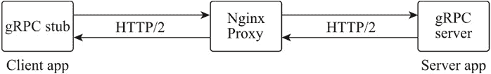

# Nginx gRPC 代理服务器

> 原文：[`www.weixueyuan.net/a/759.html`](http://www.weixueyuan.net/a/759.html)

Nginx 从 1.13.10 版本开始就提供了对 gRPC 代理的支持，其可以通过 gRPC 模块的反向代理功能对外发布包括基于 SSL 的 gRPC 服务，且其应用 Nginx 提供的 HTTPv2 模块可实现速率限定、基于 IP 的访问控制以及日志等功能。

通过 Nginx 的 location 指令可检查方法调用，可将不同的调用方法路由到后端的多个不同 gRPC 服务器，以实现单点部署多个 gRPC 服务器的应用场景。并且通过 Nginx 实现 gRPC 服务器负载均衡，还可以使用轮询、最少连接数等算法实现流量分发。

## 1、gRPC 介绍

gRPC 是一个开源的基于 HTTP/2 协议的高性能、跨语言的远程过程调用（RPC）框架。它提供了双向流、流控、头部压缩、单 TCP 连接上的多复用请求等功能，这些功能使其在移动设备上可更节省空间和降低电量消耗。而且 gRPC 相对于 REST 的数据调用方式，提供了一个更加适合服务间调用数据的通信方案。

基于 gRPC 的客户端应用可以像调用本地对象方法一样直接调用 gRPC 服务端提供的方法，使其更适合分布式应用和服务场景。

## 2、gRPC 模块指令

Nginx 默认会构建 gRPC 代理的支持，但 gRPC 是基于 HTTP/2 协议的，而 ngx_http_v2_module 模块默认不会被构建，这就需要在编译时通过 `–with-http_v2_module` 参数来启用对 HTTP/2 协议的支持。

gRPC 代理模块配置指令下表所示。

| 指令名称 | 指令值格式 | 默认值 | 指令说明 |
| grpc_bind | address[transparent] 或 off | -- | 设置从指定的本地 IP 地址及端口与被代理服务器建立连接，指令值可以是变量。指令值参数为 transparent 时，允许将客户端的真实 IP 透传给被代理服务器，并以客户端真实 IP 为访问被代理服务器的源 IP |
| grpc_buffer_size | size | 4k 或 8k | 设置用于从 gRPC 服务器读取响应数据缓冲区的大小，当 Nginx 收到响应数据后将同步传递给客户端 |
| grpc_pass | address | -- | 设置 gRPC 服务器的地址及端口，地址可以是 IP、域名或 UNIX 套接字 |
| grpc_hide_header | field | -- | 指定 gRPC 服务器响应数据中，不向客户端传递的 HTTP 头字段名称 |
| grpc_pass_header | field | -- | 默认配置下 Nginx 不会将头字段属性 Status 和 X-Accel-... 传递给客户端，可通过该指令开放传递 |
| grpc_ignore_headers | field... | -- | 设置禁止 Nginx 处理从 gRPC 服务器获取响应的头字段 |
| grpc_set_header | field value | Content-Length $content_length | 在转发给 gRPC 服务器前，修改或添加客户端的请求头属性字段 |
| grpc_connect_timeout | time | 60s | Nginx 与 gRPC 服务器建立连接的超时时间，通常不应该超过 75s |
| grpc_read_timeout | time | 60s | 在连续两个从 gRPC 服务器接收数据的“读”操作之间的间隔时间超过设置的时间时，将关闭连接 |
| grpc_send_timeout | time | 60s | 在连续两个发送到 gRPC 服务器的“写”操作之间的间隔时间超过设置的时间时，将关闭连接 |
| grpc_socket_keepalive | on 或 off | off | 设置 Nginx 与被代理服务器的 TCP keepalive 行为的心跳检测机制，默认使用操作系统的 socket 配置，若指令值为 on 时，则开启 SO_KEEPALIVE 选项进行心跳检测 |
| grpc_intercept_errors | on 或 off | off | 指令值为 on 时，将拦截 gRPC 服务器啊应码大于或等于 300 的结果，error page 指令可对该结果做后续处理；指令值为 off 时，则直接返回给客户端 |
| grpc_next_upstream | error、timeout、 invalid_header、
http_500、http_503、
http_403、http_404、
http_429、
non_idempotent、
off... | error timeout | 当出现指令值中指定的条件时，将未返回响应的客户请求传递给 upstream 中的下一个服务器 |
| grpc_next_upstream_timeout | time | 0 | 设置将符合条件的客户端请求传递给 upstream 的过程中，下一个服务器的超时时间。指令值为 0 不做超时限制，直到遍历完所有上游服务器组中的服务器为止 |
| grpc_next_upstream_tries | number | 0 | 设置符合条件的客户端请求传递给 upstream 的过程中，下一个服务器的尝试次数，包括第一次的失败次数。指令值为 0 不做尝试次数限制，直到遍历完所有上游服务器组中的服务器为止 |
| grpe_ssl_protocols | [SSLv2][SSLv3] [TLSv1][TLSv1.1]
[TLSv1.2][TLSv1.3] | TLSv1 TLSv1.1
TLSv1.2 | 指定可用于 Nginx 与 gRPC 服务器建立 SSL 连接的 SSL 协议的版本 |
| grpe_ssl_session_reuse | on 或 off | on | 是否启用与 gRPC 服务器 HTTPS 连接的 SSL 会话重用功能 |
| grpc_ssl_ciphers | ciphers | DEFAULT | 设置 HTTPS 建立连接时用于协商使用的加密算法组合，也称为密码套件，指令值内容为 openssl 的密码套件名称，多个套件名称由“:”分隔 |
| grpc_ssl_server_name | on 或 off | off | 在与 gRPC 服务器建立 SSL 连接时，设置是否启用通过 SNI 或 RFC 6066 传递主机名 |
| grpc_ssl_certificate | file | -- | 指定 gRPC 服务器对 Nginx 服务器身份验证的 PEM 格式 SSL 证书文件 |
| grpc_ssl_certificate_key | file | -- | 指定 gRPC 服务器对 Nginx 服务器身份验证的 PEM 格式 SSL 证书私钥文件 |
| grpc_ssl_password_file | file | -- | 存放 gRPC 服务器对 Nginx 服务器身份验证的 PEM 格式 SSL 证书私钥文件的密码文件，一个密码一行。有多个密码时，Nginx 会依次尝试 |
| grpe_ssl_verify | on 或 off | off | 设置是否启用对 gRPC 服务器的 SSL 证书验证机制 |
| grpc_ssl_name | name | proxy_pass 指令指定的主机名 | 指定对 gRPC 服务器 SSL 证书验证的主机名 |
| grpc_ssl_crl | file | -- | 证书吊销列表文件，用以验证被代理服务器 SSL 证书有效性的 PEM 格式文件 |
| grpc_ssl_trusted_certificate | file | -- | 指定一个 PEM 格式的 CA 证书（根或中间证书）文件，该证书用作 gRPC 服务器的证书链验证 |
| grpc_ssl_verify_depth | number | 1 | 设置 gRPC 服务器的证书链的验证深度 |

3、gRPC 反向代理配置

gRPC 是基于 HTTP/2 协议的，所以 Nginx 的 gRPC 代理需要启用 HTTP/2，然后 gRPC 客户端将请求发送到 Nginx。Nginx 为 gRPC 服务提供了一个稳定的网关。其部署方式如下图所示。


图：gRPC 代理
配置样例如下：

```

server {
    listen  8080 http2;                               # 设置监听端口为 8080 并启用 http/2 协议支持
    access_log /var/log/nginx/grpc_access.log main;
    location / {
        grpc_pass grpc://192.168.2.145:50051;         # 设置 gRPC 服务器
    }
}
```

gRPC 模块同样提供对后端 SSL gRPC 服务器的反向代理，配置样例如下：

```

server {
    listen  80 http2;                                 # 设置监听端口为 80 并启用 http/2 协议支持
    access_log /var/log/nginx/grpcs_access.log main;
    grpc_ssl_verify off;                              # 关闭对 gRPC 服务器的 SSL 证书验证
    grpc_ssl_session_reuse on;                        # 设置 gRPC 服务器
    location / {
        grpc_pass grpcs://192.168.2.145:50051;        # 设置 SSL gRPC 服务器
    }
}
```

Nginx 可以通过 HTTP 协议的 SSL 证书，对外提供安全的 gRPC 代理转发，部署方式为客户端 → Nginx 服务器（HTTPS）→ 被代理服务器（SSL gRPC）。配置样例如下：

```

server {
    listen 443 ssl http2 default_server;         # 设置监听端口为 443 并启用 SSL 及 HTTP/2 协议支持
    access_log /var/log/nginx/grpcs_access.log main;

    ssl_certificate ssl/www_nginxbar_org.pem;    # 网站证书文件
    ssl_certificate_key ssl/www_nginxbar_org.key;# 网站证书密钥文件

    grpc_ssl_verify off;
    grpc_ssl_session_reuse on;
    location / {
        grpc_pass grpcs://192.168.2.145:50051;
    }
}
```