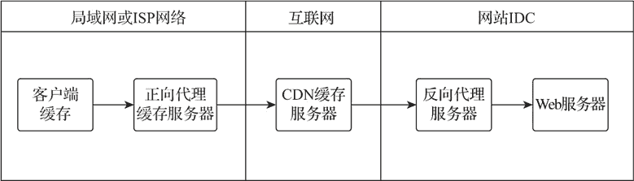
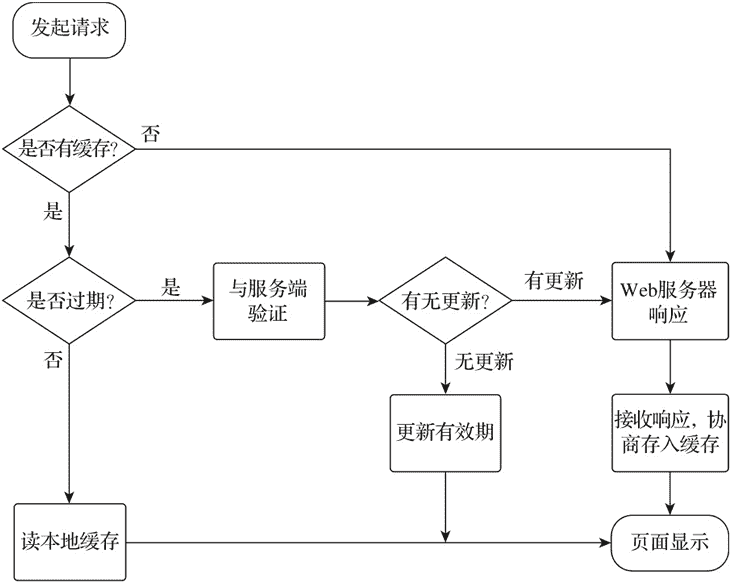
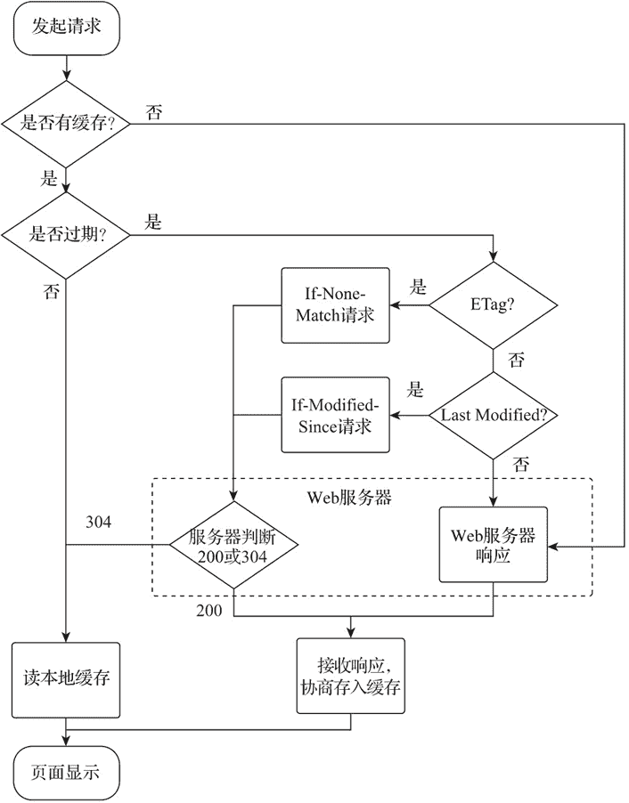
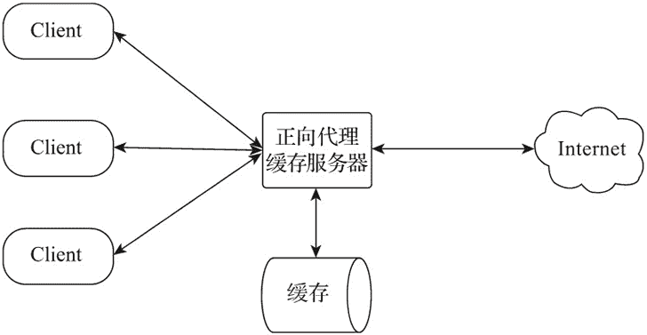
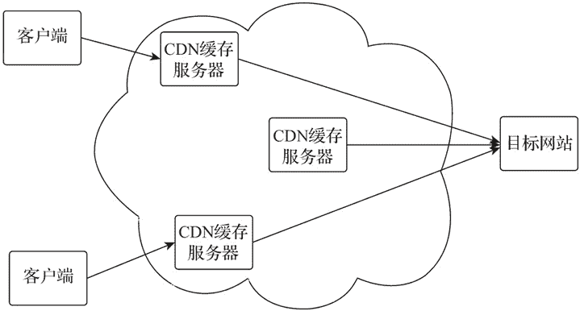
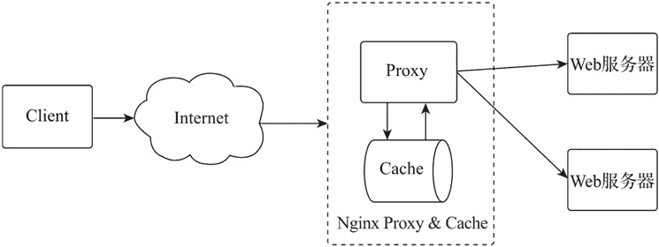

# Nginx Web 缓存配置

> 原文：[`www.weixueyuan.net/a/762.html`](http://www.weixueyuan.net/a/762.html)

Web 缓存可节约网络带宽，有效提高用户打开网站的速度。由于应用服务器被请求次数的降低，也相对使它的稳定性得到了提升。Web 缓存从数据内容传输的方向分为前向位置缓存和反向位置缓存两类。如下图所示。

图：Web 缓存位置图
前向位置缓存既可以是用户的客户端浏览器，也可以是位于用户 ISP 或内部局域网的服务器。反向位置缓存通常位于互联网端，如内容分发网络或网站的反向代理缓存等。

## 1、客户端缓存

当客户端访问某一网站时，通常会多次访问同一页面，如果每次都到网站服务器获取相同的内容，不仅会造成用户自身网络资源的浪费，也会加重网站服务器的负载。为了提高访问效率，客户端浏览器会将访问的内容在本地生成内容缓存。

由于网站的内容经常变化，为了保持缓存的内容与网站服务器的内容一致，客户端会通过内容缓存的有效期及 Web 服务器提供的访问请求校验机制，快速判断请求的内容是否已经更新。客户端缓存校验流程如下图所示。

图：客户端缓存校验
客户端通过内容缓存有效期的本地校验和由 Web 服务端提供的服务端校验两种方式共同校验内容缓存是否有效，这两种方式都是通过 HTTP 消息头中的相应字段进行判断或与服务端交互的。HTTP 消息头字段功能说明如下表所示。

| 消息头字段 | 示例 | 类型 | 功能 |
| Cache-Control | Cache-Control: no-cache | 请求/响应 | HTTP/1.1 协议加入的缓存控制字段，用于服务端告知客户端是否缓存及缓存的有效期。也可用于客户端本地缓存检验流程的控制 |
| Pragma | Pragma: no-cache | 请求/响应 | 一个在 HTTP/1.0 中规定的通用消息头字段，当字段值为 no-cache 时，功能与消息头 Cache-Control:no-cache 的设定一致 |
| Date | Date: Tue, 15 Nov 2018 08:12:31 GMT | 响应 | 原始服务器消息发出的时间 |
| Expires | Expires: Fri, 16 Aug 2019 19:43:31 GMT | 响应 | 告知客户端当前响应内容缓存的有效期，是个绝对时间，属于 HTTP/1.0 的协议约定，优先级低于 HTTP/1.1 协议的 max-age 设置 |
| Last-Modified | Last-Modified: Fri, 16 Aug 2019 12:45:26 GMT | 响应 | 当前响应数据的最后修改时间 |
| If-Modified-Since | If-Modified-Since: Fri, 16 Aug 2019 19:43:31 GMT | 请求 | 将当前请求本地内容缓存的最后修改时间发送给服务端进行校验，如果请求的内容在指定时间之后被修改了，将返回被修改的内容，否则返回响应状态码 304，客户端将使用本地缓存 |
| If-Unmodified-Since | If-Unmodified-Since: Fri, 16 Aug 2019 19:43:31 GMT | 请求 | 将当前请求本地内容缓存的最后修改时间发送给服务端进行校验，如果请求的内容在指定时间之后未被修改，将继续传输内容，否则返回响应状态码 412，其常被用在 byte-range 请求的断点续传场景 |
| ETag | ETag: "0a3ea38e4fd51:0" | 响应 | 当前响应数据的实体标签值 |
| If-Match | If-Match: "0a3ea38e4fd51:0" | 请求 | 将当前内容缓存的 ETag 值发送给服务端进行校验，如果与服务端的 ETag 匹配一致就继续响应请求，否则返回响应状态码 412 |
| If-None-Match | If-None-Match: "0a3ea38e4fd51:0" | 请求 | 将当前内容缓存的 ETag 值发送给服务端进行校验，如果与服务端的 ETag 值匹配不一致，则返回新的内容，否则返回响应状态码 304，客户端将使用本地缓存 |

1) 消息头字段 Cache-Control 由客户端发起缓存控制的相关字段值如下表所示。

| 消息头 | 功能分类 | 功能 |
| Cache-Control: max-age= | 有效期 | 当 max-age=0 时，不进行内容缓存的有效期验证，直接向 Web 服务器发起请求，不影响缓存的服务端验证 |
| Cache-Control: max-stale[=] | 有效期 | 如果内容缓存的过期时间不超过指定值，仍可被认为有效并被客户端使用。单位为秒 |
| Cache-Control: min-fresh= | 有效期 | 内容缓存的更新时间不超过指定值，则认为有效。单位为秘 |
| Cache-Control: no-cache | 可缓存性 | 不进行内容缓存的有效期验证，直接向 Web 服务器发起请求。常用在 Ctrl+F5 的场景，强制从服务端获取最新内容 |
| Cache-Control: only-if-cached | 其他 | 只使用本地已经缓存的内容，不向 Web 服务器发送请求 |

当按下 F5 或者点击刷新时，客户端浏览器会添加请求消息头字段 `Cache-Control：max-age=0`，该请求不进行内容缓存的本地验证，会直接向 Web 服务端发起请求，服务端将根据消息头字段进行服务端验证。

当按下 Ctrl+F5 时，客户端浏览器会添加请求消息头字段 `Cache-Control：no-cache` 和 `Pragma:no-cache`，并忽略所有服务端验证的消息头字段，该请求不进行内容缓存的本地验证，它会直接向 Web 服务端发起请求，因没有服务端验证的消息头字段，所以会直接返回请求内容。

2) 消息头字段 Cache-Control 由服务端发起缓存控制的相关字段值如下表所示。

| 消息头 | 类型 | 功能 |
| Cache-Control: no-cache | 可缓存性 | 不对响应数据的内容缓存设置有效期，不需要进行本地有效期验证 |
| Cache-Control: no-store | 可缓存性 | 响应数据不在本地保留内容缓存 |
| Cache-Control: public | 可缓存性 | 表明当前数据可以被任何对象（客户端、缓存服务器等）缓存 |
| Cache-Control: private | 可缓存性 | 当响应数据在经过缓存服务器（CDN 或反向代理缓存服务器）时，用于告知缓存服务器不能缓存该响应数据 |
| Cache-Control: max-age= | 有效期 | 设置内容缓存的最大有效期，是个相对值，表示一个时间区间，单位为 s |
| Cache-Control: s-maxage= | 有效期 | 当响应数据在经过缓存服务器（CDN 或反向代理缓存服务器）时，用于对缓存服务器中缓存的控制，该值优先级高于 max-age 的设定，与客户端浏览器无关 |
| Cache-Control: must-revalidate | 服务端验证 | 当响应数据被设置有效期时，超过有效期的缓存请求必须进行服务端验证 |
| Cache-Control: proxy-revalidate | 服务端验证 | 当响应数据在经过缓存服务器（CDN 或反向代理缓存服务器）时，用于缓存服务器缓存的控制，功能与 must-revalidate 相同 |
| Cache-Control: no-transform | 其他 | 当响应数据在经过缓存服务器（CDN 或反向代理缓存服务器）时，用于告知缓存服务器不得对消息头进行修改，与客户端浏览器无关 |

3) Last-Modified 与 if-modified-since 属于 HTTP/1.0，是用于服务端对响应数据修改时间进行校验的服务端校验方法。

Last-Modified 的值是由服务端生成后传递给客户端的，客户端发送请求时，它会将本地内容缓存中的 Last-Modified 的值由请求消息头的 if-modified-since 字段传递给服务端，如果服务端被请求的内容在 if-modified-since 字段值的时间之后被修改了，将返回被修改的内容，否则返回响应状态码 304，客户端将使用本地缓存。

4) ETag 与 If-None-Match 属于 HTTP/1.1，优先级高于 Last-Modified 的验证，是用于服务端对响应数据进行实体标签校验的服务端校验方法。

ETag 类似于身份指纹，是一个可以与 Web 资源关联的记号（token）。当客户端第一次发起请求时，ETag 的值在响应消息头中传递给客户端；当客户端再次发送请求时，如果验证本地内容缓存需要发起服务端验证，Etag 的值将由请求消息头的 If-None-Match 字段传递给服务端。

如果验证本地内容缓存与服务端的 ETag 的匹配不一致，则认为请求的内容已经更新，服务端将返回新的内容，否则返回响应状态码 304，客户端将使用本地缓存。

5) 客户端会通过 HTTP 消息头字段对本地内容缓存进行本地校验和服务端校验，内容缓存校验的流程如下图所示。

图：客户端内容缓存校验流程图

## 2、正向代理缓存

当客户端浏览器通过正向代理缓存服务器访问互联网 Web 服务器时，正向代理缓存服务器会先检查本地的缓存，如果本地已经有客户端访问网站的内容缓存，则会根据缓存策略将缓存内容返回客户端；如果本地没有相应的内容缓存，则会向网站 Web 服务器发起访问请求，在获得响应数据后，它会先将响应内容在本地缓存生成内容缓存，然后再转发给客户端。

正向代理缓存架构如下图所示。

图：正向代理缓存架构图
通常是多个客户端共享一台正向代理缓存服务器，当一台客户端访问某个网站后，其他客户端均会共享这个网站的缓存，无须再向网站服务器发起访问请求，提升内容响应速度。

通过共享正向代理缓存服务器，不仅减少了外网的访问次数，也降低了网络带宽的需求。通过正向代理缓存服务器的控制策略，可以有效地针对内网客户端及访问的目标进行过滤控制，提升内网安全。

正向代理缓存服务器并不严格限制其一定要在客户端的内网，因它是通过七层协议实现代理转发的，所以只要客户端通过 HTTP 或 HTTPS 协议可以连接到正向代理服务器即可。

## 3、内容分发网络

内容分发网络（CDN）是基于反向代理缓存技术实现的大规模网络应用，其将缓存服务器分布到用户访问相对集中的地区或网络中，当用户访问目标网站时，它会利用全局负载策略，将用户的访问分配到离用户最近的缓存服务器，并由被分配的缓存服务器处理用户的访问请求。

国内跨运营商的网络访问会很慢，通过 CDN 的分配策略，可有效地优化网络路径，并结合 CDN 缓存服务器节点的缓存，有效提高用户的访问速度，从而提升用户体验。内容分发网络架构如下图所示。

图：内容分发网络架构图
CDN 将被加速的网站内容缓存在离用户最近的缓存服务器中，通常被缓存的是更新较少的静态资源（如静态页面、CSS、JavaScript、图片、视频等），CDN 的各缓存服务器节点是通过 HTTP 响应头的 Cache-Control 来控制本地内容缓存有效期的。当客户端的请求被分配到 CDN 缓存服务器节点时，CDN 缓存服务器会先判断内容缓存是否过期，若内容缓存在有效期内，则直接返回客户端，否则将向源站点发出回源请求，并从源站点获取最新的数据，在更新本地缓存后将响应数据返回客户端。

CDN 的缓存有效期设置会影响内容缓存的回源率。如果缓存有效期设置的较长，回源率较低，则会使缓存服务器的缓存数据与源网站不同步，影响访问；如果缓存有效期设置的较短，回源率较高，则会增加源网站的负载，影响 CDN 缓存服务器的使用效率。

因此，CDN 服务商会根据被缓存资源的类型（如文件后缀）、路径等多个维度为使用者提供缓存有效期设置接口，并为用户提供更加细化的缓存时间管理。除了可以设置缓存时间外，也可以通过“缓存刷新”接口对 CDN 缓存服务器的缓存数据进行强制更新。

## 4、反向代理缓存

反向代理缓存是基于反向代理技术在用户请求转发到 Web 服务器前进行缓存加载的缓存方式。反向代理缓存服务器通常位于 Web 服务器之前，通过反向代理缓存服务器可以对被代理服务器的响应内容进行缓存，以加速用户请求响应的处理速度，降低被代理服务器的负载。反向代理缓存服务器架构如下图所示。

图：反向代理缓存服务器架构图
反向代理缓存提高了网站内容的加载速度，降低了被代理服务器的负载，并可以在被代理服务器发生故障时通过缓存的内容作为备份来提高网站的可用性。

提升网站性能。反向代理缓存以与静态内容相同的处理速度为所有类型的缓存内容提供用户响应处理，从而减少因被代理服务器动态计算产生的延迟，进一步提升网站的性能。

增加资源容量。因为减少了被代理服务器的请求，被代理服务器将有更多的计算资源处理动态响应，相对增加了应用服务器的资源容量。

提高可用性。通过反向代理缓存服务器的本地缓存，可以在被代理服务器出现故障或停机产生的故障等待时，让用户仍可访问网站（单向的浏览缓存中的内容），避免了用户因收到故障信息而产生的负面影响。