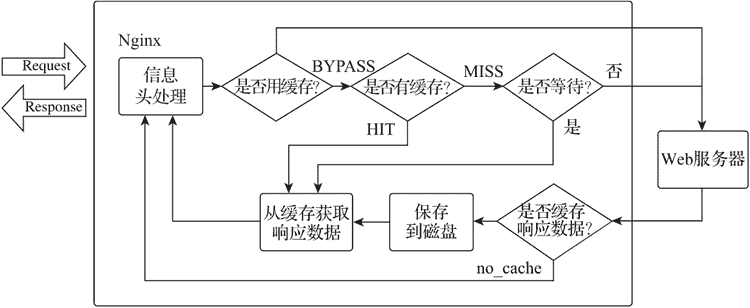

# Nginx 代理缓存配置

> 原文：[`www.weixueyuan.net/a/764.html`](http://www.weixueyuan.net/a/764.html)

Nginx 的缓存功能是集成在代理模块中的，当启用缓存功能时，Nginx 将请求返回的响应数据持久化在服务器磁盘中，响应数据缓存的相关元数据、有效期及缓存内容等信息将被存储在定义的共享内存中。当收到客户端请求时，Nginx 会在共享内存中搜索缓存信息，并把查询到的缓存数据从磁盘中快速交换到操作系统的页面缓存（Page Cache）中，整个过程的速度非常快。

Nginx 缓存会缓存加载进程（Cache Loader Process）和库存管理（Cade Manger Process）进行管理。缓存加载进程只在 Nginx 启动时执行一次，将上一次 Nginx 运行时缓存有关数据的元数据加载到共享内存区域，加载结束后它将自动退出。

为了避免缓存因加载缓存降低 Nginx 的性能，缓存加载进程会采用周期性迭代式加载缓存数据，且迭代加载的时间间隔、每次最大消耗时间和每次迭代加载的数量可以由配置指令 proxy_cache_path 的指令值参数设置。缓存管理进程则周期性的检查缓存的状态，负责清除在一段时间内未被访问的缓存文件，并对超出缓存存储最大值的缓存对象进行删除，缓存管理进程的删除操作也是周期性迭代执行的，并由配置指令 proxy_cache_path 的指令值参数设置。

#### 1) 缓存处理流程及状态

当客户端发起请求到 Nginx 缓存服务器时，Nginx 会先检查本地是否已经有该请求的内容缓存，有的话会直接返回数据，缓存请求状态会被标记为 HIT，否则该缓存请求状态就会被标记为 MISS。

如果指令 proxy_cache_lock 未被启用，则会直接向源服务器发起访问请求，如果被启用，则会先确认当前请求是不是第一个发起的请求，若不是，则等待；若是，则向源服务器发起访问请求。服务器响应数据返回后会先被存储在本地缓存，然后再返回给客户端。缓存处理流程如下图所示。


图：Nginx 缓存处理流程图
Nginx 在处理缓存过程中，客户端请求的缓存请求状态会被记录在变量 $upstream_cache_status 中，缓存请求状态如下表所示。

| 缓存请求状态 | 状态说明 |
| MISS | 缓存未命中，从源服务器获取响应数据 |
| HIТ | 缓存命中，从本地缓存获取数据 |
| BYPASS | proxy_cache_bypass 生效，直接从源服务器获取响应数据 |
| REVALIDATED | 启用 proxy_cache_revalidate 指令后，缓存将被源服务器服务端验证为有效状态，从本地缓存获取数据 |
| EXPIRED | 缓存过期，从源服务器获取响应数据 |
| UPDATING | 正在更新缓存，当前返回为旧缓存内容，在配置指令 proxy_cache_use_stale updating 时会存在该状态 |
| STALE | 源服务器无法正常返回更新的内容，当前返回为旧缓存内容，在配置指令 proxy_cache_use_stale error timeout 时会存在该状态 |
| SCARCE | 缓存节点被查询次数未达到配置指令 proxy_cache_min_uses 设定的值时，对此请求无法启用缓存机制，将从源服务器获取响应数据 |

#### 2) 缓存配置指令

Nginx 缓存配置指令如下表所示。

| 指令名称 | 指令值格式 | 默认值 | 指令说明 |
| proxy_store | on、off 或 string | off | 设置是否将被代理服务器的响应数据在本地按照请求的 URL 建立目录结构镜像。当指令值为 on 时，存储路径的设置为 root 或 alias，响应数据先存储到临时文件后再复制或重命名保存 |
| proxy_store_access | users:permissions... | user:rw | 设置创建本地镜像存储路径的文件夹权限 |
| proxy_cache | zone 或 off | off | 设置一个用以做缓存管理的共享内存区域 |
| proxy_cache_path | path 参数 | -- | 设置缓存文件存储路径及参数。缓存数据以 URL 的 MD5 值命名存储在缓存目录中 |
| proxy_cache_key | string | $scheme $proxy_host
$request_uri | 设置缓存的关键字 |
| proxy_cache_lock | on 或 off | off | 是否启用缓存锁指令。当启用缓存锁机制时，每次只允许个向被代理服务器转发的请求，按照 proxy_cache_key 指令设置的标识增添新的缓存数据，其他相同的请求则将等待缓存中出现响应数据或该缓存锁被释放，其等待时间由 proxy_cache_lock_timeout 指令设置 |
| proxy_cache_lock_age | time | 5s | 缓存锁有效时间。当启用缓存锁机制时，如果一个请求在该指令的时间内没有完成响应数据缓存的添加，缓存锁将会被释放，获取缓存锁的请求将被转发给被代理服务器由代理服务器负责生成缓存 |
| proxy_cache_lock_timeout | time | 5s | 缓存锁等待超时时间。当启用缓存锁机制时，等待超过该时间的请求将直接从被代理服务器中读取响应，该请求响应不会被添加到缓存中 |
| proxy_cache_max_range_offset | number | -- | 用以设置范围请求（byte-range）请求时的最大偏移量。超出该偏移量的请求将直接从被代理服务器中读取响应数据 |
| proxy_cache_methods | GET 或 HEAD 或 POST... | GET HEAD | 指定可被缓存的请求方法 |
| proxy_cache_convert_head | on 或 off | on | 开启或禁用将请求方法 HEAD 转换为 GET，如果该功能被禁用，配置指令 proxy_cache_key 的指令值应该添加变量 $request_method |
| proxy_cache_min_uses | numberstring | 1 | 响应数据超过设置请求次数后将被缓存 |
| proxy_no_cache | string... | -- | 设置不生成缓存数据的条件，指定字符串的值不为空或不等于 0，则不将当前请求返回的响应数据进行缓存 |
| proxy_cache_bypass | string... | -- | 设置不使用缓存数据的条件，指令值中至少有一个值不为空或不等于 0 时，当前请求不使用缓存中的响应数据，直接访问源应用服务器。它可以与 proxy_no_cache 指令一起使用 |
| proxy_cache_revalidate | on 或 off | off | 启用该指令后，如果缓存过期，则通过在 HTTP 头中添加字段属性 If-Modified-Since 和 If-None-Match 的方式发送给源服务器，从而进行缓存的服务端校验 |
| proxy_cache_use_stale | error、timeout、 invalid_header、
updating、http_500、
http_503、http_403、
http_404、http_429、
off... | off | 当出现指定的条件时，使用已经过期的缓存响应数据 |
| proxy_cache_background_update | on 或 off | off | 允许使用过期的响应数据时，设置是否启用后台子请求更新过期缓存，同时向客户端返回过期的缓存响应数据 |
| proxy_cache_valid | [code...] time | -- | 根据响应码设置缓存时间 |
| proxy_cache_purge | string... | -- | 定义清除缓存请求条件，若指定的字符串不为空或 0，则将 proxy_cache_key 设置的标识的缓存进行清除。清除成功则返回状态码 204，仅商业版有效 |

关于上表有以下几点需要说明。

*   该模块指令列表中指令的指令域范围都是 http、server、location；
*   proxy_cache_path 指令只能编写在 http 指令域中；
*   proxy_cache 与 proxy_store 指令不能在同一指令域中同时使用；
*   proxy_cache_path 指令值参数如下表所示。

| 参数名 | 参数格式 | 默认值 | 参数说明 |
| levels | levels | -- | 设置缓存目录的层级及命名方式 |
| use_temp_path | on 或 off | on | 参数值为 on，则使用 proxy_temp_path 设置作为临时文件目录。参数值为 off 时，则使用缓存目录做临时文件目录 |
| keys_zone | name:size | -- | 设置存储 cache_key 的共享内存 zone 及大小，1MB 可以存储 8000 个 key |
| inactive | time | 10 分钟 | 设置时间内未被访问的缓存将被删除 |
| max_size | size | -- | 缓存数据的最大值，超出这个最大值时，缓存管理进程将执行迭代更新，即删除最近最少使用的缓存 |
| manager_files | number | 100 | 缓存管理进程执行一次迭代更新时，删除文件的最大数 |
| manager_sleep | time | 50ms | 缓存管理进程每次更新缓存的迭代间隔时间 |
| manager_threshold | time | 200ms | 缓存管理进程执行一次迭代更新时，最大执行的时间，单位为 ms |
| loader_threshold | time | 200ms | 缓存加载进程每次迭代加载时，加载数据的最大执行时间 |
| loader_files | number | 100 | 缓存加载进程每次迭代加载时，加载缓存目录中缓存数据的最大文件数 |
| loader_sleep | time | 50ms | 缓存加载进程每次迭代的间隔时间 |
| purger | on 或 off | off | 是否启用缓存清除功能。仅商业版有效 |
| purger_files | number | 10 | 每次迭代清除时，清除缓存目录中缓存数据的最大文件数。仅商业版有效 |
| purger_sleep | time | 50ms | 连续两次迭代清除间的最少间隔时间。仅商业版有效 |
| purger_threshold | time | 50ms | 每次迭代清除时，最大执行的时间。仅商业版有效 |

#### 3) HTTP 范围请求

范围请求允许服务器只发送请求的一部分响应数据给客户端，通常对大文件传输时，用以实现断点续传、多线程下载等功能。若服务端响应信息头中包含字段 Accept-Ranges:bytes，则表示服务端支持范围请求，且节点范围的单位为字节（bytes）。

在 Nginx 缓存默认配置下，Nginx 处理完一个大文件的初始请求后，后续的用户请求必须等待整个文件下载结束并存入缓存后才可以继续被处理，整个过程非常耗时。为解决这个问题，Nginx 提供了 ngx_http_slice_module 模块，用以缓存范围请求的支持。该模块将文件分成更小的切片（slices），客户端每个范围请求覆盖特定的切片，如果该范围没有缓存，则从源服务器请求后存入缓存，否则就从缓存中返回数据。

http_slice 模块配置指令如下表所示。

| 名称 | 切片指令 |
| 指令 | slice |
| 作用域 | http、server、location |
| 默认值 | 0 |
| 指令说明 | 设定范围请求切片的大小。默认为不启用该功能 |

配置样例如下：

```

location / {
    slice             1m;                               # 切片大小为 1MB
    proxy_cache       cache;                            # 缓存共享内存名称为 cache
    proxy_cache_key   $uri$is_args$args$slice_range;    # 设置缓存 key
    proxy_set_header  Range $slice_range;               # 添加头字段 Range 的字段值为
                                                        # $slice_range
    proxy_cache_valid 200 206 1h;                       # 响应状态码为 200 及 206 的内容缓存有效期为 1h
    proxy_pass        http://localhost:8000;
}
```