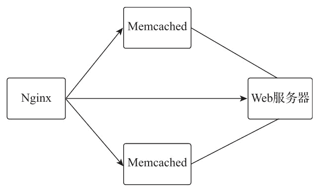

# Nginx Memcached 缓存模块简述

> 原文：[`www.weixueyuan.net/a/767.html`](http://www.weixueyuan.net/a/767.html)

Nginx 的 ngx_http_memcached_module 模块本身并没有提供缓存功能，它只是一个将用户请求转发到 Memcached 服务器的代理模块。

在以 Memcached 服务器为缓存应用的方案中，Memcached 作为内容缓存的存储服务器，用户通过 URL 为 Memcached 的 key 将 Web 请求数据缓存到 Memcached 服务器中，在客户端发起请求时，Nginx 通过一致的 URL 为 key，快速地从 Memcached 服务器中将缓存的内容作为用户的请求响应数据返回给客户端。

Memcached 是一个开源、高性能的内存对象缓存系统，使用 Memcached 服务器作为缓存存储服务器，充分利用了 Memcached 的高效缓存功能，减少了 Nginx 服务器磁盘 I/O 的操作，也可以通过 upstream 指令对多台 Memcached 做分布式集群负载，以便整体提升 Nginx 缓存服务器的性能。

Memcached 缓存模块配置指令如下表所示。

| 指令名称 | 指令值格式 | 默认值 | 指令说明 |
| memcached_bind | address[transparent] 或 off | -- | 设置从指定的本地 IP 地址及端口与 Memcached 服务器建立连接，指令值可以是变量。指令值参数为 transparent 时，允许将客户端的真实 IP 透传给被代理服务器，并以客户端真实 IP 为访问被代理服务器的源 IP，指令值为 off 时，则取消上一层指令域同名指令的配置 |
| memcached_buffer_size | size | 4k 或 8k | 设置用于读取 Memcached 服务器，读取响应数据缓冲区的大小，当 Nginx 收到响应数据后，将同步传递给客户端 |
| memcached_connect_timeout | time | 60s | Nginx 与 Memcached 服务器建立连接的超时时间，通常不应超过 75s |
| memcached_force_ranges | on 或 off | off | 启用来自 Memcached 服务器的缓存和未缓存响应的 byte-range 请求支持，而不考虑这些响应头中的 Accept-Ranges 字段 |
| memcached_gzip_flag | flag | -- | 启用对 Memcached 服务器缓存数据 fags 的测试，flags 为客户端写入缓存时的自定义标记，此处用以判断缓存数据是否被压缩存储，如果数据被压缩存储，则将响应头字段 Content-Encoding 设置为 gzip |
| memcached_next_upstream | error、timeout、 invalid_header、
not found 或 off... | error timeout | 当出现指令值中指定的条件时，将未返回响应的客户请求传递给 upstream 中的下一个服务器 |
| memcached_next_upstream_timeout | time | 0 | 设置将符合条件的客户端请求传递给 upstream 中下一个服务器的超时时间。0 为不做超时限制，遍历完所有上游服务器组中的服务器为止 |
| memcached_next_upstream_tries | number | 0 | 设置符合条件的客户端请求传递给 upstream 中下一个服务器的尝试次数，包括第一次失败的次数。0 为不做尝试次数限制，遍历完所有上游服务器组中的服务器为止 |
| memcached_pass | address | -- | 设置 Memcached 服务器的地址及端口，地址可以是 IP、域名或 UNIX 套接字 |
| memcached_read_timeout | time | 60s | 在连续两个从 Memcached 服务器接收数据的读操作之间的间隔时间超过设置的时间时，将关闭连接 |
| memcached_send_timeout | time | 60s | 在连续两个发送到 Memcached 服务器的写操作之间的间隔时间超过设置的时间时，将关闭连接 |
| memcached_socket_keepalive | on 或 off | off | 设置 Nginx 与 Memcached 服务器的 TCP keepalive 行为的心跳检测机制，默认使用操作系统的 socket 配置，若指令值为 on，则开启 SO_KEEPALIVE 选项进行心跳检测 |

配置样例如下：

```

server {
    location / {
        set            $memcached_key "$uri?$args";  # 设置 Memcached 缓存 key
        memcached_pass 127.0.0.1:11211;              # 设置被代理 Memcached 地址
        error_page     404 502 504 = @fallback;      # 返回状态码 404、502、504 时跳入内部请求
    }

    location @fallback {
        proxy_pass     http://backend;               # 将请求转发给后端服务器
    }
}
```

## Memcached 缓存应用

为了提高动态网站的响应速度，有时会采用将动态网站转换成静态化文件的方式进行优化，而相对于磁盘存储，使用 Memcached 进行静态文件的存储则可以进一步提升网站的响应速度。Memcached 是基于内存的高性能对象缓存系统，因为存储数据都是在内存中的，所以减少了系统的 I/O 操作，从而避免了因磁盘性能带来的影响。

使用 Memcached 作为缓存存储服务器，可以直接利用 Memcached 缓存的过期机制实现缓存的自动化过期管理，且利用 Nginx 的负载机制和 Memcached 分布式特性，可以非常方便地横向扩展，以提升处理性能。Memcached 缓存应用场景如下图所示。


图：Memcached 缓存应用
Web 服务器将动态文件以请求 URI 作为 Memcached 的 key 初始化到 Memcached 服务器中；Nginx 将用户请求转发到 Memcached 服务器中，并将以请求 URI 作为 Memcached key 的数据返回给用户；当 Memcached 的请求失败后，则将请求转发给后端 Web 服务器的接口动态生成对应的静态文件，返回响应数据并更新 Memcached。

Memcached 的安装非常简单，在 CentOS 7 系统下使用 yum 安装即可，安装方法如下：

yum -y install memcached

cat /etc/sysconfig/memcached
PORT="11211"                  # 端口
USER="memcached"
MAXCONN="1024"          # 最大连接数
CACHESIZE="64"              # 使用内存大小为 64M
OPTIONS=""

systemctl start memcached

Nginx 服务器配置样例如下：

```

upstream backend {
    server 192.168.2.145:8190;                              # 后端 PHP 服务器 IP
}

upstream memcached {
    hash $host$request_uri consistent;                      # 一致性 hash
    server 192.168.2.145:11211;                             # Memcached 服务器 IP
    server 192.168.2.109:11211;                             # Memcached 服务器 IP
}

server {
    listen       8181;
    access_log logs/mem_access.log;
    set $memcached_key $host$request_uri;                   # 设置 Memcached 的 key
    location / {
        memcached_connect_timeout 5s;             # 与 Memcached 建立连接超时时间为 5s
        memcached_read_timeout 2s;                # 连续两次读的超时时间为 2s
        memcached_send_timeout 2s;                # 连续两次写的超时时间为 2s
        memcached_pass memcached;                 # 代理到 Memcached 集群
        add_header X-Cache-Satus HIT;             # 显示缓存命中状态
        add_header Content-Type 'text/html; charset=utf-8'; # 强制响应数据格式为 html
    }

    error_page     404 502 504 = @fallback;

    location @fallback {
        proxy_set_header   X-Memcached-Key $memcached_key;  # 将 memecached key 传递
                                                            # 给 PHP 服务器
        proxy_pass     http://backend;                      # PHP 服务器
    }
}
```

为了方便演示 Memcached 的使用方法，在此处提供了一段简单的 PHP 测试代码。在测试代码中，使用了 PHP 模块 Memcached 与 Nginx 兼容的一致性哈希算法实现分布式 Memcached 集群的支持。

```

<?php
    // 测试数据
    $html = file_get_contents('https://www.baidu.com');

    if ($_SERVER['REQUEST_METHOD'] != 'GET' || !isset($_SERVER['HTTP_X_MEMCACHED_KEY']) || !$_SERVER['HTTP_X_MEMCACHED_KEY']) {
        echo $html;
        exit();
    }

    $memcachedKey = $_SERVER['HTTP_X_MEMCACHED_KEY'];

    // 初始化 Memcached
    $memcached = new Memcached();

    // 配置分布式 hash 一致性算法，兼容 Nginx 的 Ketama 算法
    $memcached->setOptions(array(
        Memcached::OPT_DISTRIBUTION=>Memcached::DISTRIBUTION_CONSISTENT,
        Memcached::OPT_LIBKETAMA_COMPATIBLE=>true,
        Memcached::OPT_REMOVE_FAILED_SERVERS=>true,
        Memcached::OPT_COMPRESSION=>false
    ));

    // 添加 Memcached 服务器
    $memcached->addServers(array(
        array('192.168.2.145', 11211),
        array('192.168.2.109', 11211)
    ));

    // 存储到 Memcached，缓存有效期 1 天
    $memcached->set($memcachedKey, $html, 86400);

    //调试用
    header('X-Cache-Status: MISS');
    header('X-Cache-Key: ' . $memcachedKey);

    //输出静态文件
    print $html;

?>
```