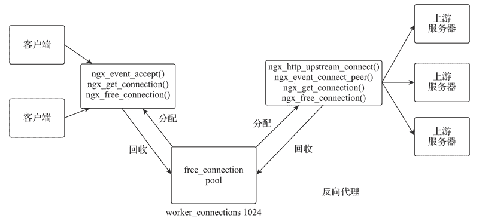
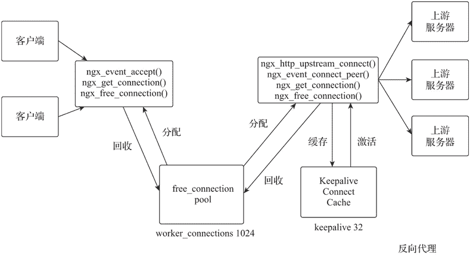

# Nginx 长连接负载均衡

> 原文：[`www.weixueyuan.net/a/783.html`](http://www.weixueyuan.net/a/783.html)

当客户端通过浏览器访问 HTTP 服务器时，HTTP 请求会通过 TCP 协议与 HTTP 服务器建立一条访问通道，当本次访问数据传输完毕后，该 TCP 连接会立即被断开，由于这个连接存在的时间很短，所以 HTTP 连接也被称为短连接。

在 HTTP/1.1 版本中默认开启 Connection:keep-alive，实现了 HTTP 协议的长连接，可以在一个 TCP 连接中传输多个 HTTP 请求和响应，减少了建立和关闭 TCP 连接的消耗和延迟，提高了传输效率。网络应用中，每个网络请求都会打开一个 TCP 连接，基于上层的软件会根据需要决定这个连接的保持或关闭。例如，FTP 协议的底层也是 TCP，是长连接。

默认配置下，HTTP 协议的负载均衡与上游服务器组中被代理的连接都是 HTTP/1.0 版本的短连接。Nginx 的连接管理机制如下图所示。


图：Nginx 连接管理机制
相关说明如下。

Nginx 启动初始化时，每个 Nginx 工作进程（Worker Process）会生成一个由配置指令 worker_connections 指定大小的可用连接池（free_connection pool）。工作进程每建立一个连接，都会从可用连接池中分配（ngx_get_connection）到一个连接资源，而关闭连接时再通知（ngx_free_connection）可用连接池回收此连接资源。

客户端向 Nginx 发起 HTTP 连接时，Nginx 的工作进程获得该请求的处理权并接受请求，同时从可用连接池中获得连接资源与客户端建立客户端连接资源。

Nginx 的工作进程从可用连接池获取连接资源，并与通过负载均衡策略选中的被代理服务器建立代理连接。

默认配置下，Nginx 的工作进程与被代理服务器建立的连接都是短连接，所以获取请求响应后就会关闭连接并通知可用连接池回收此代理连接资源。

Nginx 的工作进程将请求响应返回给客户端，若该请求为长连接，则保持连接，否则关闭连接并通知可用连接池回收此客户端连接资源。

Nginx 能建立的最大连接数是 worker_connections×worker_processes。而对于反向代理的连接，最大连接数是 worker_connections×worker_processes/2，但是其会占用与客户端及与被代理服务器建立的两个连接。

在高并发的场景下，Nginx 频繁与被代理服务器建立和关闭连接会消耗大量资源。Nginx 的 upstream_keepalive 模块提供与被代理服务器间建立长连接的管理支持，该模块建立了一个长连接缓存，用于管理和存储与被代理服务器建立的连接。Nginx 长连接管理机制如下图所示。


图：Nginx 长连接管理机制
相关说明如下。

当 upstream_keepalive 模块初始化时，将建立按照 upstream 指令域中的 keepalive 指令设置大小的长连接缓存（Keepalive Connect Cache）池。

当 Nginx 的工作进程与被代理服务器新建的连接完成数据传输时，其将该连接缓存在长连接缓存池中。

当工作进程与被代理服务器有新的连接请求时，会先在长连接缓存池中查找符合需求的连接，如果存在则使用该连接，否则创建新连接。

对于超过长连接缓存池数量的连接，将使用最近最少使用（LRU）算法进行关闭或缓存。

长连接缓存池中每个连接最大未被激活的超时时间由 upstream 指令域中 keepalive_timeout 指令设置，超过该指令值时间未被激活的连接将被关闭。

长连接缓存池中每个连接可复用传输的请求数由 upstream 指令域中 keepalive_requests 指令设置，超过该指令值复用请求数的连接将被关闭。

Nginx 与被代理服务器间建立的长连接是通过启用 HTTP/1.1 版本协议实现的。由于 HTTP 代理模块默认会将发往被代理服务器的请求头属性字段 Connection 的值设置为 Close，因此需要通过配置指令清除请求头属性字段 Connection 的内容。

配置样例如下：

```

upstream http_backend {
    server 192.168.2.154:8080;
    server 192.168.2.109:8080;
    keepalive 32;                           # 长连接缓存池大小为 32
    keepalive_requests 2000;                # 每条长连接最大复用请求数为 2000
}

server {
    location /http/ {
        proxy_pass http://http_backend;
        proxy_http_version 1.1;             # 启用 HTTP/1.1 版本与被代理服务器建立连接
        proxy_set_header Connection "";     # 清空发送被代理服务器请求头属性字段 Connection
                                            # 的内容
    }
}
```

对于 FastCGI 协议服务器，需要设置 fastcgi_keep_conn 指令启用长连接支持。

```

upstream fastcgi_backend {
    server 192.168.2.154:9000;
    server 192.168.2.109:9000;
    keepalive 8;                            # 长连接缓存池大小为 8
}

server {
    ...

    location /fastcgi/ {
        fastcgi_pass fastcgi_backend;
        fastcgi_keep_conn on;               # 启用长连接支持
        ...
    }
}
```

SCGI 和 uWSGI 协议没有长连接的概念；Memcached 协议（由 ngx_http_memcached_module 模块提供）的长连接配置，只需在 upstream 指令域中设置 keepalive 指令即可。

```

upstream memcached_backend {
    server 127.0.0.1:11211;
    server 10.0.0.2:11211;

    keepalive 32;                           # 长连接缓存池大小为 32
}

server {
    ...

    location /memcached/ {
        set $memcached_key $uri;            # 设置$memcached_key 为$uri
        memcached_pass memcached_backend;
    }
}
```