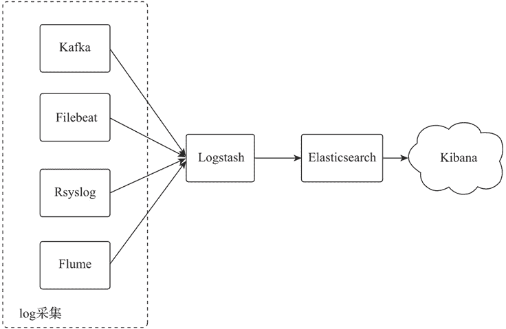
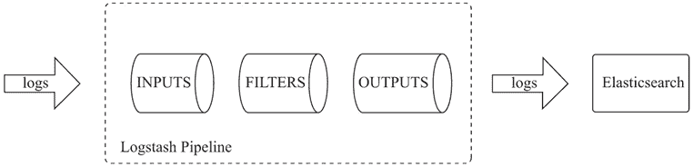
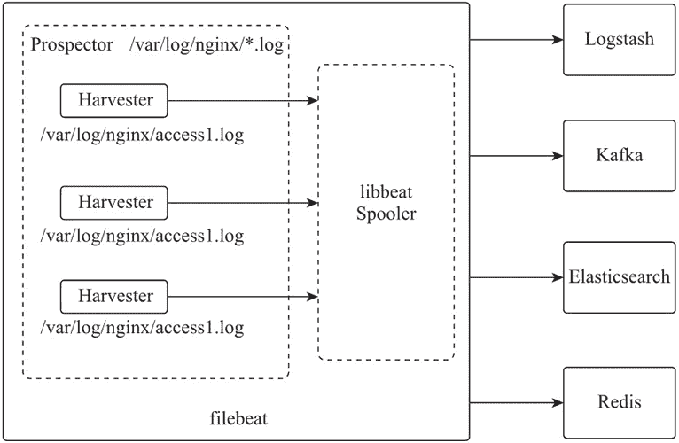
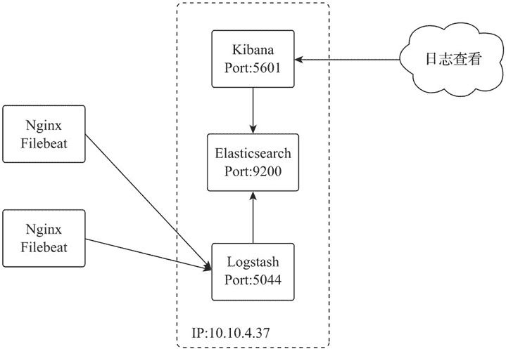

# Nginx 日志分析工具（ELK）配置

> 原文：[`www.weixueyuan.net/a/805.html`](http://www.weixueyuan.net/a/805.html)

Nginx 的访问日志中可以记录用户的 IP、访问方法、访问 URI、响应状态及响应数据大小等 HTTP 请求处理中会涉及的各种信息，通过这些信息可以实现访问用户来源分布、用户请求 URI 排行、响应数据大小及并发连接的分析和统计。

## 1、ELK 简介

ELK（Elasticsearch、Logstash、Kibana）是开源的实时日志收集分析解决方案。ELK 访问逻辑如下图所示，是由 Elasticsearch、Logstash、Kibana 这三款软件和数据采集客户端（如 Filebeat）等实现日志采集、储存、搜索分析等操作。


图：ELK 访问逻辑
1) Elasticsearch 是一款用 Java 语言开发的，基于 Lucene 的开源搜索引擎，它提供了分布式多用户的全文搜索、分析、存储能力。Elasticsearch 的常见关键词如下表所示。

| 关键词 | 名称 | 关键词说明 |
| cluster | 集群 | 集群由一个主节点和多个从节点组成，主节点是通过内部选举产生的。Elastic-search 集群是一个去中心化的分布式架构，对于外部用户来讲，Elasticsearch 集群是个整体，与其中任何一个节点通信获取内容都是一致的 |
| index | 索引 | Elasticsearch 是面向文档的数据库，一条数据就是一个文档，文档内容为包含多个 key，value 格式字段数据。Elasticsearch 集群可以包括多个索引，每个索引下包含多个类型，每个类型下包含多个文档。索引相当于关系型数据库中的库，类型相当于关系型数据库中的表 |
| shards | 索引分片 | Elasticsearch 可以把一个完整的索引分成多个分片，该方式可以把一个大的索引拆分成多个，并分布到不同的节点，实现分布式搜索 |
| replicas | 索引副本 | Elasticsearch 可以为索引设置多个副本，当集群中某个节点或某个索引的分片损坏或丢失时，可以通过副本进行恢复，同时可以为搜索请求提供负载均衡，以提高查询效率 |
| recovery | 数据分配与恢复 | Elasticsearch 集群在有节点加入或退出时，会根据节点的数量变化对索引分片进行重新分配，当挂掉的节点重启后也会进行数据分配与恢复 |
| gateway | 存储方式 | Elasticsearch 存储方式，Elasticsearch 会先把索引存放到内存中，当内存满了时再持久化到 gateway 配置的目标存储中。默认 gateway 配置为本地硬盘，也支持其他分布式文件系统，如 Hadoop 的 HDFS 和 Amazon 的 s3 云存储服务等 |

2) Logstash 是基于 C/S 架构，对日志进行收集、过滤、转发的日志收集引擎，它可以同时从多个源获取数据，动态地将客户端采集的数据进行分拣、过滤，并转发到不同存储服务器。

Logstash 是以 pipeline 方式处理每条日志信息的，在每个 pipeline 中都有输入（INPUTS）、过滤（FILTERS）、输出（OUTPUTS）3 个处理动作。每个处理动作可由一个或多个插件实现复杂的功能。输入处理是获取日志数据；过滤处理可以对日志进行分拣、修改；输出处理则是将日志数据发送给目标存储服务器。

Logstash 工作原理如下图所示。


图：Logstash 原理
3) Kibana 是 Elasticsearch 的 Web 管理工具，它提供了友好的界面化操作方式和统计分析的 Dashboard 工具，让使用者只需简单点击就可完成基本的数据搜索、分析等工作。

4) Filebeat 隶属于 Beats 工具包，是负责文件数据采集的客户端工具。Filebeat 由 pro-spector 和 harvester 两个主要组件组成。prospector 目前只支持 log 文件和 stdin 两个输入类型，是 harvester 的管理进程，负责按照配置参数 paths 的内容查找日志文件，并为每个日志文件分配一个 harvester。

harvester 负责实时读取单个日志文件，harvester 将日志内容发送给底层的 libbeat，libbeat 将日志数据发送给配置文件中指定的输出目标。Filebeat 工作原理如下图所示。


图：Filebeat 原理

## 2、ELK 安装

ELK 支持多种安装方式，鉴于 Docker 化部署的便捷性，本小节以基于 docker-compose 脚本的 Docker 化来部署 ELK 环境，部署示意如下图所示。


图：ELK 部署示意

#### 1) 初始化系统环境

首先要初始化系统环境并安装 Docker 应用。

```

# 安装 yum 工具
yum install -y yum-utils
# 安装 Docker 官方 yum 源
yum-config-manager --add-repo https://download.docker.com/linux/centos/docker-ce.repo
# 安装 docker 及 docker-compose 应用
yum install -y docker-ce docker-compose
# 设置 docker 服务开机自启动
systemctl enable docker
# 启动 docker 服务
systemctl start docker

# 优化内核参数，设置一个进程拥有 VMA（虚拟内存区域）的最大数量为 262144
sysctl -w vm.max_map_count=262144
```

#### 2) 编写 docker-compose 文件

使用 docker-compose 工具进行 ELK 容器运行编排。docker-compose 文件如下：

```

cat elk.yaml

version: '2'
services:
    elasticsearch:
        image: docker.elastic.co/elasticsearch/elasticsearch:7.0.1
        container_name: elasticsearch701
        environment:
            - discovery.type=single-node
            - bootstrap.memory_lock=true
            - "ES_JAVA_OPTS=-Xms512m -Xmx512m"
        ulimits:
            memlock:
                soft: -1
            hard: -1
        hostname: elasticsearch
        restart: always
        ports:
            - "9200:9200"
            - "9300:9300"
    kibana:
        image: docker.elastic.co/kibana/kibana:7.0.1
        container_name: kibana701
        hostname: kibana
        depends_on:
            - elasticsearch
        restart: always
        ports:
            - "5601:5601"
    logstash:
        image: docker.elastic.co/logstash/logstash:7.0.1
        container_name: logstash701
        hostname: logstash
        restart: always
        depends_on:
            - elasticsearch
        ports:
            - "5044:5044"

# 运行 ELK 容器
docker-compose -felk.yaml up -d
```

docker-compose 是功能非常强的容器运行编排工具，内部含有很多配置指令可以完成容器的资源配置、运行、服务依赖、网络配置等运行时的编排配置，具体指令说明可参照 docker-compose 的官方文档。

#### 3) 数据持久化

Docker 的镜像（Image）文件存放在一个只读层，而容器（Container）的文件则是存放在可写层，当容器删除或重建时，该容器运行时变更的文件将会丢失，所以需要通过外挂卷的方式将变更的配置和文件保存到主机系统中。ELK 容器有 Elasticsearch、Logstash 和 Kibana 3 个容器，这 3 个容器都需要实现数据持久化。

```

cd /opt/data/apps
# 创建容器外挂卷目录及数据存储目录
mkdir -p {elasticsearch/data,elasticsearch/config,elasticsearch/modules,elastic-search/plugins,kibana/config,logstash/pipeline,logstash/config}

# 复制容器数据到数据存储目录
docker cp elasticsearch701:/usr/share/elasticsearch/data elasticsearch
docker cp elasticsearch701:/usr/share/elasticsearch/config elasticsearch
docker cp elasticsearch701:/usr/share/elasticsearch/modules elasticsearch
docker cp elasticsearch701:/usr/share/elasticsearch/plugins elasticsearch
docker cp logstash701:/usr/share/logstash/config logstash
docker cp logstash701:/usr/share/logstash/pipeline logstash
docker cp kibana701:/usr/share/kibana/config kibana

# Logstash 配置

cat>logstash/pipeline/logstash.conf<<EOF
input {
    beats {
        port => 5044
        codec =>"json"
    }
}
output {
    elasticsearch {
        hosts => ["http://10.10.4.37:9200"]
        index => "logstash-nginx-%{[@metadata][version]}-%{+YYYY.MM.dd}"
    }
}
EOF

# 配置目录权限
chown -R 1000:1000 elasticsearch/*
chown -R 1000:1000 logstash/*

# 配置 docker-compose 脚本，挂载数据存储目录

cat elk.yaml

version: '2'
services:
    elasticsearch:
        image: docker.elastic.co/elasticsearch/elasticsearch:7.0.1
        container_name: elasticsearch701
        environment:
            - discovery.type=single-node
            - bootstrap.memory_lock=true
            - "ES_JAVA_OPTS=-Xms512m -Xmx512m"
        ulimits:
            memlock:
                soft: -1
                hard: -1
        volumes:
            - /etc/localtime:/etc/localtime:ro
            - /etc/timezone:/etc/timezone:ro
            - /opt/data/apps/elasticsearch/modules:/usr/share/elasticsearch/modules
            - /opt/data/apps/elasticsearch/plugins:/usr/share/elasticsearch/plugins
            - /opt/data/apps/elasticsearch/data:/usr/share/elasticsearch/data
            - /opt/data/apps/elasticsearch/config:/usr/share/elasticsearch/config
        hostname: elasticsearch
        restart: always
        ports:
            - "9200:9200"
            - "9300:9300"
    kibana:
        image: docker.elastic.co/kibana/kibana:7.0.1
        container_name: kibana701
        hostname: kibana
        volumes:
            - /etc/localtime:/etc/localtime:ro
            - /etc/timezone:/etc/timezone:ro
            - /opt/data/apps/kibana/config:/usr/share/kibana/config
        depends_on:
            - elasticsearch
        restart: always
        ports:
            - "5601:5601"
    logstash:
        image: docker.elastic.co/logstash/logstash:7.0.1
        container_name: logstash701
        hostname: logstash
        volumes:
            - /etc/localtime:/etc/localtime:ro
            - /etc/timezone:/etc/timezone:ro
            - /opt/data/apps/logstash/pipeline:/usr/share/logstash/pipeline
            - /opt/data/apps/logstash/config:/usr/share/logstash/config
        restart: always
        depends_on:
            - elasticsearch
        ports:
            - "5044:5044"

# 运行 ELK 容器

docker-compose -f elk.yaml up -d
```

#### 4) Nginx 配置

在运行 Nginx 的主机上把 Nginx 日志定义为 json 格式，编辑 nginx.conf 文件并在 http 指令域添加如下指令：

```

log_format json '{"@timestamp": "$time_iso8601", '
                '"connection": "$connection", '
                '"remote_addr": "$remote_addr", '
                '"remote_user": "$remote_user", '
                '"request_method": "$request_method", '
                '"request_uri": "$request_uri", '
                '"server_protocol": "$server_protocol", '
                '"status": "$status", '
                '"body_bytes_sent": "$body_bytes_sent", '
                '"http_referer": "$http_referer", '
                '"http_user_agent": "$http_user_agent", '
                '"http_x_forwarded_for": "$http_x_forwarded_for", '
                '"request_time": "$request_time"}';
```

#### 5) Filebeat 安装

在 Nginx 服务器安装 Filebeat 进行 Nginx 日志采集。

```

# 安装 Filebeat
rpm -ivh https://artifacts.elastic.co/downloads/beats/filebeat/filebeat-7.0.1 -x86_64.rpm

# 设置输出数据到 Logstash 及 Logstash 地址
sed -i "s/#output.logstash:/output.logstash:/g" /etc/filebeat/filebeat.yml
sed -i "s/#hosts: \[\"localhost:5044\"\]/  hosts: \[\"10\.10\.4\.37:5044\"\]/g" /etc/filebeat/filebeat.yml

# 关闭直接输出数据到 Elasticsearch
sed -i "s/output.elasticsearch/#output.elasticsearch/g" /etc/filebeat/filebeat.yml
sed -i "s/hosts: \[\"localhost:9200\"\]/#hosts: \[\"localhost:9200\"\]/g" /etc/filebeat/filebeat.yml

# 安装 Filebeat Nginx 模块
filebeat modules enable nginx

# 配置 Filebeat Nginx 模块
cat >/etc/filebeat/modules.d/nginx.yml<<EOF
- module: nginx
    access:
        enabled: true
        var.paths: ["/usr/local/nginx/logs/*access.log"]
    error:
        enabled: true
        var.paths: ["/usr/local/nginx/logs/*error.log"]
EOF

# 检查配置
filebeat test config
filebeat test output

# 启动 Filebeat
systemctl restart filebeat

# 设置为自启动
systemctl enable filebeat
```

#### 6) Kibana 展示

在浏览器中打开 http://10.10.4.37:5601，在右侧菜单栏中选择 management → index_patterns → Create index pattern，然后输入 logstash-nginx-*，接着点击 Next Step 添加 Nginx 日志索引。在左侧菜单栏中点击 Discover 选择 logstash-nginx-就可以实时查看 Nginx 输出的访问或错误日志了。