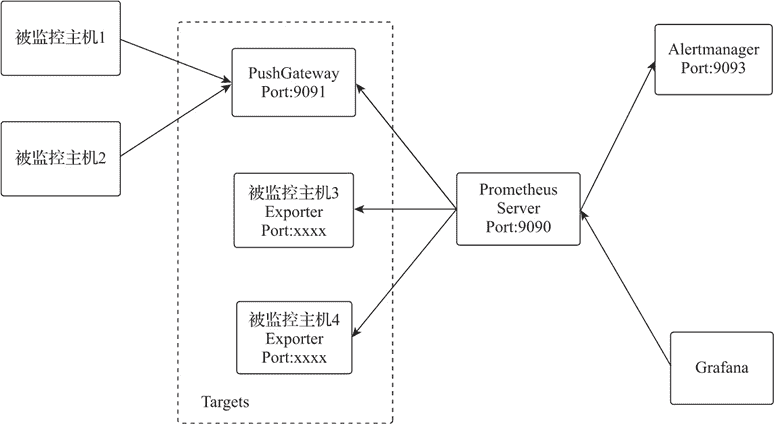
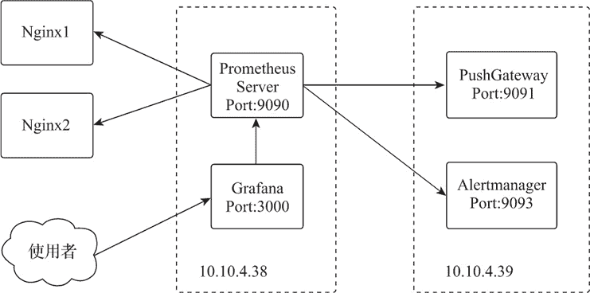
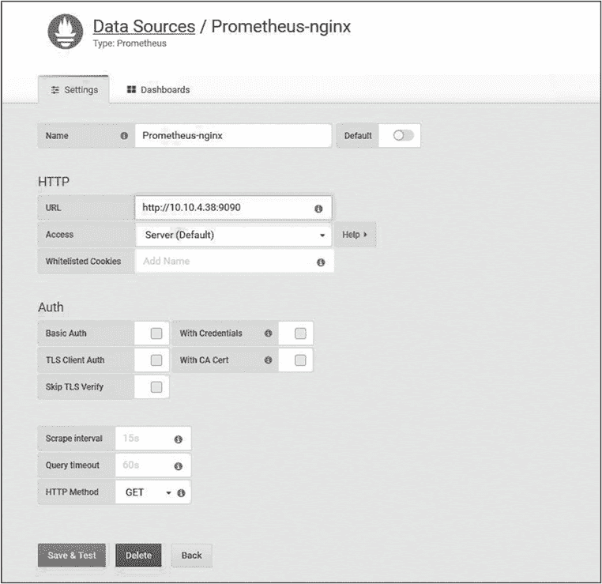
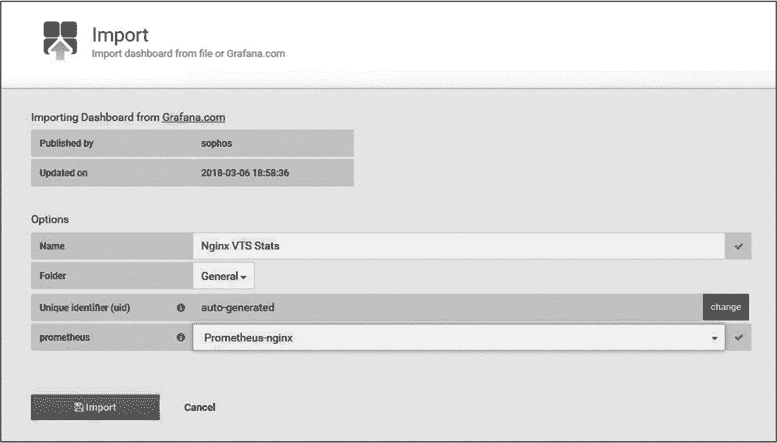
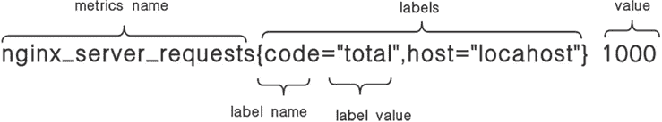

# Nginx 监控工具（Prometheus）配置

> 原文：[`www.weixueyuan.net/a/822.html`](http://www.weixueyuan.net/a/822.html)

Nginx 的 ngx_http_stub_status_module 模块及第三方的主机状态监控模块都提供了自身状态数据的统计和输出功能，但作为监控管理，仍需要进一步实现对各种状态数据的收集、存储、统计展示、阈值报警等工作。为实现监控管理的完整性，需要使用更专业的监控工具来实现后续的工作。

## 1、Prometheus 简介

Prometheus 是由 SoundCloud 开源的监控告警解决方案，其在 GitHub 上的 Star 数已经超过 3.1 万，已成为很多大公司首选的监控解决方案。Prometheus 由 Prometheus Server、PushGateway、Alertmanager、Exporter 等 4 个组件共同组成。

其中，Exporter 可以由用户自行开发，只需输出符合 Prometheus 的规范数据即可；Prometheus Server 提供了 api 接口并支持自定义的 PromQL 查询语言对外实现监控数据查询输出，结合 Grafana 强大的图形模板功能，可以非常直观地以监控数据统计图表的形式进行展示。Prometheus 结构如下图所示。


图：Prometheus 结构
关于上图有以下几点需要说明。

*   Prometheus Server：Prometheus 的基础服务，其从配置文件中 job 配置的 tagrets 目标服务器拉取监控数据，拉取数据周期由配置参数 scrape_interval 设置，同时开放 api 接口提供监控数据的对外查询和聚合分析功能；
*   PushGateway：Prometheus 的推送网关服务。Prometheus 默认都是从被监控服务器上拉取监控数据的，但由于网络原因无法直接访问目标服务器时，可在被监控服务器上通过脚本或工具采集监控数据，然后推送给推送网关服务（PushGateway），Prometheus 的基础服务则实时地从推送网关服务提供的端口 9091 拉取监控数据，完成监控操作；
*   Alertmanager：Prometheus 的告警服务，其对外开放端口 9093 接收 Prometheus Server 发送的告警信息，并按照告警规则将告警信息发送给接收目标；
*   Exporter：监控数据采集接口服务，该服务可由用户按照 Prometheus 的数据规范自行开发，只需提供对外访问接口，并能输出 Prometheus 数据格式的监控数据即可。

## 2、Prometheus 部署

Prometheus 支持多种方式部署，鉴于 Docker 化部署的便捷性，此处选择基于 docker-compose 脚本部署 Docker 化的 Prometheus 环境，部署示意如下图所示。


图：Prometheus 部署
在服务器 10.10.4.38 上部署 Prometheus 的基础服务和 Grafana 服务；在服务器 10.10.4.39 上部署 Prometheus 的推送网关服务和 Prometheus 的告警服务。

#### 1) 安装 Prometheus 和 Grafana

在服务器 10.10.4.38 上初始化 Prometheus 和 Grafana 的 docker-compose 脚本。

```

cat>prometheus.yaml<<EOF
version: '3.5'
services:
    prometheus:
        hostname: prometheus
        container_name: prometheus
        restart: always
        image: prom/prometheus
        ports:
            - "9090:9090"
        stop_grace_period: 1m
    grafana:
        hostname: grafana
        container_name: grafana
        restart: always
        image: grafana/grafana
        ports:
            - "3000:3000"
        stop_grace_period: 1m
EOF

# 启动镜像
docker-compose -f prometheus.yaml up -d
```

#### 2) 配置 Prometheus

配置 Prometheus 并持久化 Prometheus 及 Grafana 数据。

```

cd /opt/data/apps
mkdir -p {prometheus,grafana}

# 复制配置文件
docker cp prometheus:/etc/prometheus prometheus/prometheus

# 复制监控数据文件
docker cp prometheus:/prometheus prometheus/prometheus_data

# 配置 Alertmanager 服务器地址
sed -i "s/# - alertmanager:9093/ - 10.10.4.39:9093/g" prometheus/prometheus/prometheus.yml

# 配置告警规则文件目录
sed -i "/rule_files:/a\  - /etc/prometheus/*.rules" prometheus/prometheus/prometheus.yml

# 配置 PushGateway 地址
cat>>prometheus/prometheus/prometheus.yml<<EOF

    - job_name: pushgateway                 # 监控 job 名称，全局唯一
      static_configs:
        - targets: ['10.10.4.39:9091']      # 被监控主机的 IP 及 Exporter 的端口
          labels:
            instance: pushgateway           # 被监控主机的标识，多为主机名或 docker 实例名称
EOF

# 设置目录权限
chown -R 65534:65534 prometheus/*

# 复制 Grafana 配置文件
docker cp grafana:/etc/grafana grafana/config
# 复制 Grafana 数据文件
docker cp grafana:/var/lib/grafana grafana/data

# 设置目录权限
chown -R 472:472 grafana/*

# 修改 docker-compose 脚本
cat>prometheus.yaml<<EOF
version: '3.5'
services:
    prometheus:
        hostname: prometheus
        container_name: prometheus
        restart: always
        image: prom/prometheus
        ports:
            - "9090:9090"
        volumes:
            - /etc/localtime:/etc/localtime:ro
            - /opt/data/apps/prometheus/prometheus:/etc/prometheus
            - /opt/data/apps/prometheus/prometheus_data:/prometheus
        stop_grace_period: 1m
    grafana:
        hostname: grafana
        container_name: grafana
        restart: always
        image: grafana/grafana
        ports:
            - "3000:3000"
        volumes:
            - /etc/localtime:/etc/localtime:ro
            - /opt/data/apps/grafana/config:/etc/grafana
            - /opt/data/apps/grafana/data:/var/lib/grafana
        stop_grace_period: 1m
EOF

# 重建并运行镜像
docker-compose -f prometheus.yaml up -d
```

通过浏览器访问 http://10.10.4.38:9090/targets，就可以看到 Prometheus 和 PushGateway 这两个 Endpoint。然后通过浏览器访问 Grafana Web 管理页面 http://10.10.4.38:3000，初始用户名和密码都是 admin。

#### 3) 安装 Alertmanager 和 PushGateway

在服务器 10.10.4.39 上初始化 Alertmanager 和 PushGateway 的 docker-compose 脚本。

```

cat>prometheus.yaml<<EOF
version: '3.5'
services:
    alertmanager:
        hostname: alertmanager
        container_name: alertmanager
        restart: always
        image: prom/alertmanager
        ports:
            - "9093:9093"
        stop_grace_period: 1m
    pushgateway:
        hostname: pushgateway
        container_name: pushgateway
        restart: always
        image: prom/pushgateway
        ports:
            - "9091:9091"
        stop_grace_period: 1m
EOF

# 运行镜像
docker-compose -f prometheus.yaml up -d
```

#### 4) 配置 Alertmanager

配置 Alertmanager 并持久化 Alertmanager 及 PushGateway 数据。

```

cd /opt/data/apps
mkdir -p prometheus

# 复制 Alertmanager 配置文件
docker cp alertmanager:/etc/alertmanager prometheus/alertmanager
# 复制 Alertmanager 数据文件
docker cp alertmanager:/alertmanager prometheus/alertmanager_data

# 配置目录权限
chown -R 65534:65534 prometheus/alertmanager
chown -R 65534:65534 prometheus/alertmanager_data

# 配置 prometheus.yaml
cat>prometheus.yaml<<EOF
version: '3.5'
services:
    alertmanager:
        hostname: alertmanager
        container_name: alertmanager
        restart: always
        image: prom/alertmanager
        ports:
            - "9093:9093"
        volumes:
            - /etc/localtime:/etc/localtime:ro
            - /opt/data/apps/prometheus/alertmanager:/etc/alertmanager
            - /opt/data/apps/prometheus/alertmanager_data:/alertmanager
        stop_grace_period: 1m
    pushgateway:
        hostname: pushgateway
        container_name: pushgateway
        restart: always
        image: prom/pushgateway
        ports:
            - "9091:9091"
        volumes:
            - /etc/localtime:/etc/localtime:ro
EOF

# 重建并运行镜像
docker-compose -f prometheus.yaml up -d
```

通过浏览器访问 http://10.10.4.39:9093，可以查看 Alertmanager 的告警信息及配置；通过浏览器访问 http://10.10.4.39:9091，可以查看 PushGateway 的相关信息。

## 3、监控 HTTP 主机状态

Prometheus 针对被监控主机，是通过轮询 Exporter 接口的形式获取监控数据的，nginx-module-vts 模块虽然也提供 Prometheus 数据格式输出，但数据并不详细，推荐使用 nginx-vts-exporter 实现 Prometheus 数据输出。nginx-vts-exporter 是由 Go 语言开发的，不仅提供了针对信息的监控数据，还提供了配套的 Grafana 模板。

#### 1) 在 Nginx 服务器上安装 nginx-vts-exporter

```

# 获取 nginx-vts-exporter 二进制文件
wget https://github.com/hnlq715/nginx-vts-exporter/releases/download/v0.10.3/nginx-vts-exporter-0.10.3.linux-amd64.tar.gz
tar zxmf nginx-vts-exporter-0.10.3.linux-amd64.tar.gz
cp nginx-vts-exporter-0.10.3.linux-amd64/nginx-vts-exporter /usr/local/nginx/sbin/

# 运行测试
nginx-vts-exporter -nginx.scrape_timeout 10 -nginx.scrape_uri http://127.0.0.1: 8080/vts/format/json

curl http://127.0.0.1:9913/metrics
```

#### 2) 将 nginx-vts-exporter 配置为进程服务

```

# 安装 supervisor
yum install supervisor

# 配置 nginx-vts-exporter 服务管理配置
cat>/etc/supervisord.d/nginx-vts-exporter.ini<<EOF
[program:nginx-vts-exporter]
;配置进程运行命令
command=/usr/local/nginx/sbin/nginx-vts-exporter -nginx.scrape_timeout 10 -nginx.scrape_uri http://127.0.0.1:8080/vts/format/json
directory=/usr/local/nginx/sbin     ;进程运行目录
startsecs=5                         ;启动 5 秒后没有异常退出表示进程正常启动，默认为 1 秒
autostart=true                      ;在 supervisord 启动的时候也自动启动
autorestart=true                    ;程序退出后自动重启
EOF

# 启动 supervisord 并配置为开机运行
systemctl start supervisord
systemctl enable supervisord

# nginx-vts-exporter 进程服务管理
# 查看 nginx-vts-exporter 进程服务状态
supervisorctl status nginx-vts-exporter

# 重启 nginx-vts-exporter 进程服务
supervisorctl restart nginx-vts-exporter

# 启动 nginx-vts-exporter 进程服务
supervisorctl start nginx-vts-exporter

# 停止 nginx-vts-exporter 进程服务
supervisorctl stop nginx-vts-exporter

# 访问测试
curl http://10.10.4.8:9913/metrics
```

#### 3) 在 Prometheus 上配置监控 job

```

cd /opt/data/apps
cat>>prometheus/prometheus/prometheus.yml<<EOF
    # nginx-vts-exporter job
    - job_name: nginx_exporter
        static_configs:
        - targets: ['10.10.4.8:9913']
            labels:
                instance: nginx-1
EOF

docker restart prometheus
```

#### 4) 导入 Grafana 模板实现图表化展示

登录 Grafana 后，在左侧菜单点击 Configuration→Add data source，选择 Prometheus 图标后进入数据源配置页面，配置如下图所示。


图：Grafana 数据源配置
在左侧菜单点击 Create→Import，在标题为 Grafana.com Dashboard 的输入框输入模板 ID 2949 后，点击任意位置进入模板导入页，如下图所示。


图：Grafana 模板导入

## 4、监控 TCP/UDP 主机状态

TCP/UDP 主机状态模块 nginx-module-sts 虽然也提供了 Prometheus 格式数据输出，但仍然不够详细，同时也没有可用的开源 Exporter。为实现 Nginx TCP/UDP 主机状态数据的采集，可以按照 Prometheus 的数据规范编写一个 Exporter。

#### 1) Prometheus 的数据类型

*   计数类型（Counter）：计数类型用于累加值，一直增加或一直减少，重启进程后，会被重置。如记录请求次数、错误发生次数等；
*   计量类型（Gauge）：计量类型用于常规数值，用以表示瞬间状态的数值，可大可小，重启进程后，会被重置，如硬盘空间、内存使用等；
*   直方图（Histogram）：直方图可以理解为柱状图，常用于表示一段时间内数据的采样，能够对其指定区间及总数进行统计；
*   合计统计（Summary）：合计统计和直方图相似，常用于表示一段时间内数据采样的结果。Histogram 需要通过 _bucket 计算 quantile（按百分比划分跟踪的结果），而 Summary 直接存储了 quantile 的值。

#### 2) Exporter 数据输出格式

Exporter 输出的数据是以 Metric 行为单位的文本数据，数据输出格式规范如下。

*   Exporter 输出数据的 Content-Type 必须是 text 类型（text/plain）；
*   Exporter 输出内容以行为单位，空行将被忽略，文本内容最后一行为空行；
*   每个输出监控数据的行被称为 Metric 行，每一行文本的最后不能有空格，否则会不被识别；
*   以“# HELP”开头的行为注释行，表示帮助信息；
*   以“# TYPE”开头的行为类型声明行，用以声明至下一个注释行间 Metric 数据的数据类型。

类型声明与注释行间的文本为 Metric 数据，每行结构如下图所示。


图：Metric 数据行结构

#### 3) 编写 Exporter 脚本

Python 下的 prometheus_client 模块可以实现 Prometheus Exporter 的快速开发，因 Prome-theus 是采用拉取方式获取监控数据的，所以还需要用 flask 实现 Web 框架和访问路由功能。脚本代码如下：

```

import prometheus_client
from prometheus_client import Counter,Gauge
import requests
import sys
import json
import time
from flask import Response, Flask

# 初始化监控项
nginx_info = Gauge("nginx_info", "nginx_info nginx info",['hostName','nginxVersion'])
nginx_server_info = Gauge("nginx_server_info", "nginx_server_info nginx server info",['host','port','protocol'])
nginx_server_connections = Gauge("nginx_server_connections", "nginx connections", ['status'])
nginx_server_bytes = Counter("nginx_server_bytes","request/response bytes", ['direction','host'])
nginx_upstream_responses = Counter("nginx_upstream_requests","requests counter", ['backend','code','upstream'])

app = Flask(__name__)

@app.route("/metrics")
def requests_metrics():
    metrics=""
    url = "http://127.0.0.1:8080/sts/format/json"
    res = requests.get(url)
    all_data = json.loads(json.dumps(res.json()))

    # server_info
    nginx_info.labels(hostName=all_data["hostName"],nginxVersion=all_data["nginx-Version"]).set(time.time())
    metrics+=prometheus_client.generate_latest(nginx_info)

    # connections
    connections=["accepted","active","handled","reading","requests","waiting", "writing"]
    for con in connections:
        nginx_server_connections.labels(status=con).set(all_data["connections"][con])
    metrics+=prometheus_client.generate_latest(nginx_server_connections)

    # streamServerZones
    for k,streamServer in all_data["streamServerZones"].items():
        nginx_server_bytes.labels(direction="in",host=k).inc(streamServer["inBytes"])
        nginx_server_bytes.labels(direction="out",host=k).inc(streamServer["outBytes"])
        nginx_server_info.labels(host=k,port=streamServer["port"],protocol=stream-Server["protocol"]).set(1)

    metrics+=prometheus_client.generate_latest(nginx_server_bytes)
    metrics+=prometheus_client.generate_latest(nginx_server_info)

    # streamUpstreamZones
    status_code=["1xx","2xx","3xx","4xx","5xx"]
    for ups,stream in all_data["streamUpstreamZones"].items():
        for v in stream:
            for code in status_code:
                nginx_upstream_responses.labels(backend=v["server"],code=code,up-stream=ups).inc(v["responses"][code])

    metrics+=prometheus_client.generate_latest(nginx_upstream_responses)

    return Response(metrics,mimetype="text/plain")

@app.route('/')
def index():
    html='''<html>
            <head><title>Nginx sts Exporter</title></head>
            <body>
            <h1>Nginx sts Exporter</h1>
            <p><a href="/metrics">Metrics</a></p>
            </body>
            </html>'''
    return html

if __name__ == "__main__":
    app.run(
        host="0.0.0.0",
        port= 9912,
        debug=True
        )
```

在此处只选了几个监控项做样例，感兴趣的读者可继续补充完整。

#### 4) Exporter 脚本部署

```

将 Exporter 脚本保存为 /usr/local/nginx/sbin/nginx-sts-exporter.py。

# 配置运行环境
yum install python2-pip
pip install prometheus_client requests flask

# 运行 Exporter
python /usr/local/nginx/sbin/nginx-sts-exporter.py

# 测试
curl http://127.0.0.1:9912/metrics
```

#### 5) 在 Prometheus 上配置监控 job

具体配置样例如下：

```

cd /opt/data/apps
cat>>prometheus/prometheus/prometheus.yml<<EOF
    # nginx-vts-exporter && nginx-sts-exporter job
    - job_name: nginx_exporter_8
        static_configs:
        - targets: ['10.10.4.8:9913','10.10.4.8:9912']
          labels:
            instance: nginx-8
EOF

# 重启 Prometheus，使配置生效
docker restart prometheus
```

## 5、Prometheus 监控告警

Prometheus 监控告警是通过 Alertmanager 组件实现的。Alertmanager 提供标准的 RESTful api 接口接收警报信息，其将告警信息按照规则重定向给接收者，接收者可以是邮箱、webhook 和微信等。Alertmanager 会对已发送的告警进行智能记录并做延时、去重等处理，从而有效避免告警风暴的产生。

#### 1) Prometheus 监控告警处理流程如下：

*   Prometheus Server 根据配置参数 evaluation_interval 的时间间隔按照告警规则进行计算；
*   当不满足 expr 设定计算规则的阈值时，该告警规则被置为 inactive 状态；
*   当满足 expr 设定计算规则的阈值并小于 for 设定的持续时间时，该告警规则被置为 pending 状态；
*   当满足 expr 设定计算规则的阈值并大于 for 设定的持续时间时，该告警规则被置为 firing 状态，并发送告警信息给 Alertmanager 处理；
*   Alertmanager 接收到告警信息后，根据 labels 进行路由分拣，告警信息会根据 group_by 配置进行分组，如果分组不存在，则新建分组；
*   新创建的分组将等待 group_wait 指定的时间（等待时如收到同一分组的告警信息，将其进行合并），然后发送通知；
*   已有分组时将等待 group_interval 指定的时间，当上次发送通知到现在的间隔大于 repeat_interval 或者分组有更新时会发送通知。

#### 2) 告警规则格式

```

ALERT <alert name>            # 告警标识符，可以不唯一
  IF <expression>             # 触发告警阈值规则
  [ FOR <duration> ]          # 触发告警通知的持续时间
  [ LABELS <label set> ]      # 分组标签，用以 Alertmanager 进行分拣路由
  [ ANNOTATIONS <label set> ] # 告警描述信息
```

#### 3) Prometheus Server 配置告警规则格式

```

cat>prometheus/prometheus/nginx.rules<<EOF
groups:
- name: NginxAlert # 规则组名称
  rules:
    - alert: ResponseTimeAlert      # 规则的名称
      # 告警阈值计算规则为响应时间大于 1000ms 并持续 10s 的发送告警
      expr: (nginx_upstream_responseMsec > 1000)
      for: 10s                      # 持续时间为 10s
      labels:                       # 定义告警路由标签
            severity: critical
            service: nginx
        annotations:                # 告警信息
            summary: “Nginx 响应大于 1000ms”
            description: “Nginx {{ $labels.instance }}后端集群{{ $labels.upstream }} 中{{ $labels.backend }}的响应时间大于 1000ms。当前值为：{{ $value }} ms”
EOF

# 重启 Prometheus
docker restart prometheus
```

其中，$labels 是 Metric 行数据的 labels 内容。labels 的内容可用对象数据类型方法引用；$value 是 Metric 行的 value；$labels 是多条时，会自动遍历内容，每条记录生成一个 annotations 信息。

#### 4) Alertmanager 配置

```

cd /opt/data/apps

# 配置 Alertmanager
cat>prometheus/alertmanager/alertmanager.yml<<EOF
# 全局配置，配置 smtp 信息
global:
    resolve_timeout: 5m                             # 处理超时时间，默认为 5min
    smtp_smarthost: 'smtp.exmail.qq.com:465'        # 邮箱 smtp 服务器代理，请替换自己的 smtp
                                                        # 服务器地址
    smtp_from: 'monitor@nginxbar.org'               # 发送告警信息的邮箱地址，请替换自己的
                                                        # 邮箱地址
    smtp_auth_username: 'monitor@nginxbar.org'      # 邮箱账号，请替换自己的邮箱账号
    smtp_auth_password: '12345678'                  # 邮箱密码，请替换自己的邮箱密码
    smtp_require_tls: false

# 定义发送邮件的模板信息
templates:
    - 'template/*.tmpl'

# 定义发送告警邮件的路由信息，这个路由不仅可以接收所有的告警，还可以配置多个路由
route:
    group_by: ['alertname']                 # 告警信息分组依据，按照同类 alertname
                                                        # 进行分组
    group_wait: 10s                                 # 最初等待 10s 发送告警通知
    group_interval: 60s                             # 在发送新告警前的等待时间
    repeat_interval: 1h                             # 发送重复告警的等待周期为 1 小时，避免产
                                                        # 生邮件风暴
    receiver: 'email'                       # 全局默认告警接收者的名称，与 receivers
                                                        # 的 name 对应
    routes:
    - match:                                # 匹配 labels 存在如下标签的告警信息
            severity: critical
            service: nginx
        receiver: nginx_email                       #Nginx 服务器警报接收者的名称

# 定义默认警报接收者信息
receivers:
    - name: 'email'                                 # 路由中对应的 receiver 名称
      email_configs:                                # 告警接收者邮箱配置
        - to: 'xiaodong.wang@freemud.com'           # 告警接收者的邮箱配置

    - name: 'nginx_email'                           # 路由中对应的 receiver 名称
      email_configs:                                # 告警接收者邮箱配置
        - to: 'xiaodong.wang@freemud.com'           # 告警接收者的邮箱配置

EOF

# 重启 alertmanager
docker restart alertmanager
```

Nginx 监控项的阈值触发设置的告警规则时，Prometheus 就会自动发送告警到目标邮箱。