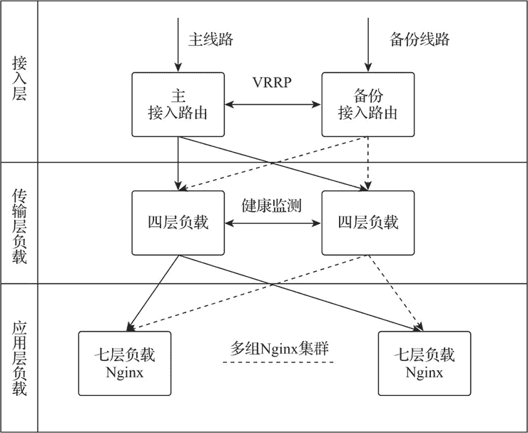
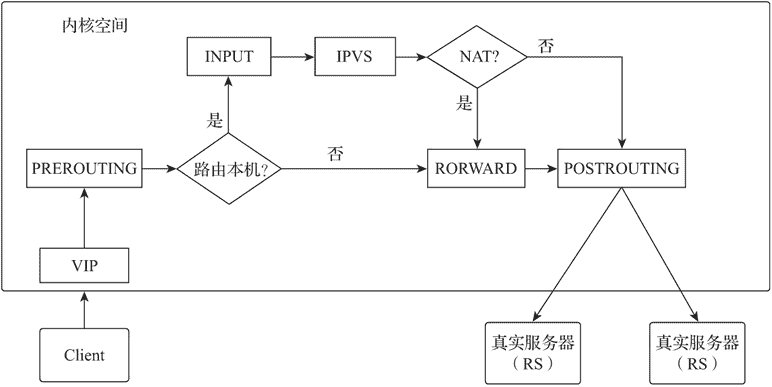

# LVS（Linux 虚拟服务器）简介

> 原文：[`www.weixueyuan.net/a/825.html`](http://www.weixueyuan.net/a/825.html)

LVS（Linux Virtual Server）是一个开源的负载均衡项目，是国内最早出现的开源项目之一，目前已被集成到 Linux 内核模块中。该项目在 Linux 内核中实现了基于 TCP 层的 IP 数据负载均衡分发，其工作在内核空间且仅做负载均衡分发处理，所以稳定性相对较好，性能相对较强，对内存及 CPU 资源的消耗也最低。

图：多层负载均衡网络架构

## 1、LVS 术语

LVS 相关术语说明如下。

*   DS（Director Server）：控制器服务器，部署 LVS 软件的服务器；
*   RS（Real Server）：真实服务器，被负载的后端服务器；
*   VIP（Virtual IP）：虚拟 IP，对外提供用户访问的 IP 地址；
*   DIP（Director Server IP）：控制器服务器 IP，控制器服务器的 IP 地址；
*   RIP（Real Server IP）：真实服务器 IP，真实服务器的 IP 地址；
*   CIP（Client IP）：客户端 IP，客户端的 IP 地址；
*   IPVS（IP Virtual Server）：LVS 的核心代码，工作于内核空间，主要有 IP 包处理、负载均衡算法、系统配置管理及网络链表处理等功能；
*   ipvsadm：IPVS 的管理器，工作于用户空间，负责 IPVS 运行规则的配置。

## 2、LVS 工作原理

IPVS 是基于 Linux 的 Netfilter 框架实现的，其以数据包的网络检测链为挂载点完成数据的负载均衡及转发处理。其工作原理如下图所示。

图：LVS 工作原理
客户访问虚拟 IP（VIP）时，数据包先在主机内核空间被 PREROUTING 链检测，根据数据包的目标地址进行路由判断，若目标地址是本地，则交由 INPUT 链进行处理。

IPVS 工作于 INPUT 链，当数据包到达 INPUT 链时，会先由 IPVS 进行检查，并根据负载均衡算法选出真实服务器 IP。

IPVS 转发模式为 NAT 模式时，将数据包由 FORWARD 链进行处理后由 POST-ROUTING 链发送给真实服务器。

IPVS 转发模式为非 NAT 模式时，则将数据包由 POSTROUTING 链发送给真实服务器。

## 3、LVS 转发模式

LVS 支持多种网络部署结构，官方版本提供了 NAT、TUN 及 DR 这 3 种标准转发模式，另阿里巴巴工程师根据自身需求进行扩展，实现了 FullNAT 转发模式。

#### 1) LVS 标准转发模式如下：

NAT，该模式需要真实服务器的网关指向 DS，客户端的请求包和返回包都要经过 DS，该模式对 DS 的硬件性能的要求相对较高。

TUN，该模式是将客户端的请求包通过 IPIP 方式封装后分发给真实服务器，客户端的返回包则由真实服务器的本地路由自行处理，源 IP 地址还是 VIP 地址（真实服务器需要在本地回环接口配置 VIP）。因 DS 只负责请求包转发，其处理性能比 NAT 模式要高，但需要真实服务器支持 IPIP 协议。

DR，该模式是将客户端的请求包通过修改 MAC 地址为真实服务器的 MAC 地址后将数据包分发给真实服务器，客户端的返回包则由真实服务器的本地路由自行处理，源 IP 地址还是 VIP 地址（真实服务器需要在本地回环接口配置 VIP）。

因 DS 只负责请求包转发，且与真实服务器间进行基于二层的数据分发，所以处理性能最高，但要求 DS 与真实服务器在同一 MAC 广播域内。

#### 2) 阿里扩展版本转发模式如下：

FullNAT，该模式是客户端的请求包和返回包都要经过 DS，但真实服务器可以在网络中的任意位置，且无须将网关配置为 DS 的 IP 地址，该方式虽然对 DS 的性能要求较高，但始终由 DS 面对客户端，有效保护了真实服务器的安全。

阿里扩展版本还针对 LVS 官方版本在安全方面进行了增强，提供了 SYNPROXY 功能支持，该功能在 LVS 上增加了一层 foold 类型的攻击包防护，实现了 UDP/IP FRAG DDOS 攻击防护。

## 4、LVS 负载均衡算法

LVS 实现了 10 种负载均衡算法，负载均衡算法及其功能介绍如下表所示。

| 算法名称 | 英文名称 | 配置简称 | 功能说明 |
| 轮询调度 | Round Robin | rr | 将请求依次循环分发给负载的真实服务器 |
| 加权轮询调度 | Weight Round Robin | wrr | 按照配置的权重比例将请求分发给真实服务器，权重越高，分配的请求越多 |
| 目标地址散列调度 | Destination Hashing | dh | 该算法将目标地址作为散列键（Hash Key），从散列表中找出对应的真实服务器进行请求分发 |
| 源地址散列调度 | Source Hashing | sh | 该算法根据源地址作为散列键（Hash Key）从散列表中找出对应的真实服务器进行请求分发 |
| 最小连接调度 | Least Connections | lc | 将新的请求分发给当前连接数最小的服务器，其通过每个真实服务器当前连接数进行统计判断 |
| 加权最小连接调度 | Weight Least Connec-tions | wlc | 按照配置的权重，将新请求分发给当前连接数最小的服务器 |
| 最短延迟调度 | Shortest Expected Delay | sed | 该算法在 WLC 算法的基础上增加了基于活动连接的筛选算法，并把请求分发给算法值最小的真实服务器，该算法避免了 WLC 算法中权重小的空闲服务器无法被分发到连接的情况 |
| 最少队列调度 | Never Queue | nq | 若有真实服务器的连接数为空，直接分发请求给该真实服务器，如果所有服务器都处于有连接状态，则使用 SED 算法进行调度 |
| 基于局部的最少连接 | Locality-Based Least Connections | lblc | 该算法将目标地址相同的请求尽可能地分发到上次被分发的真实服务器，真实服务器若超载或不可用则使用最少连接算法进行分发。该方法常用在真实服务器为缓存服务器时，以提高缓存的命中率 |
| 带复制的基于局部性的最少连接 | Locality-Based Least Connections with Replication | lblcr | 该算法维护一组被分发相同目标地址请求的真实服务器列表，按照最小连接算法创建和添加组成员，并在一定条件下将组内最繁忙的成员移除。目标地址相同的请求将被分发到该组列表中最少连接的成员。该方法常用在真实服务器为缓存服务器时，以提高缓存的命中率 |

## 5、IPVS 的管理器 ipvsadm

ipvsadm 1.2.1 版本命令的常用场景分为虚拟服务管理和真实服务器管理两类。

#### 1) 虚拟服务管理

在 LVS 配置管理中，每个 VIP 与端口组成一个虚拟服务。虚拟服务管理命令参数格式如下：

ipvsadm -A [-t|u|f]  [vip_addr:port]  [-s:负载算法]

虚拟服务管理命令参数如下表所示。

| 参数 | 参数选项 | 参数说明 |
| -A |   | 添加虚拟服务，为虚拟服务绑定 VIP 地址及端口 |
|   | -t | 虚拟服务协议为 TCP 协议 |
|   | -u | 虚拟服务协议为 UDP 协议 |
|   | -s | 虚拟服务负载均衡算法 |
|   | -p | 虚拟服务负载均衡保持连接的超时时间，默认超时时间为 360s。LVS 会把同一个客户端的请求信息记录到 LVS 的 hash 表里，该参数设置了记录的保存时间，设定时间内的客户端连接会被转发到同一真实服务器 |
| -D |   | 删除虚拟服务记录 |
| -E  |   | 修改虚拟服务记录 |
| -С |   | 清空所有虚拟服务记录 |

命令样例如下：

# 添加虚拟服务，VIP 地址为 192.168.2.100:80，协议为 TCP，负载均衡算法为轮询算法（rr），启用保持
# 连接支持，默认超时时间为 300s
ipvsadm -A -t 192.168.2.100:80 -s rr -p

#### 2) 真实服务器管理

真实服务器管理命令参数格式如下：

ipvsadm -a [-t|u|f] [vip_addr:port] [-r ip_addr] [-g|i|m] [-w 指定权重]

真实服务器管理命令参数如下图所示。

| 参数 | 参数选项 | 参数说明 |
| -a |   | 添加真实服务器 |
|   | -t | 与真实服务器用 TCP 协议建立连接 |
|   | -u | 与真实服务器用 UDP 协议建立连接 |
|   | -r | 真服务器 IP |
|   | -g | 与真实服务器的转发模式为 DR 模式 |
|   | -i | 与真实服务器的转发模式为 TUN 模式 |
|   | -m | 与真实服务器的转发模式为 NAT 模式 |
|   | -w | 指定真实服务器的权重 |
| -d |   | 删除真实服务器记录 |
| -e  |   | 修改真实服务器记录 |

命令样例如下：

# 在虚拟服务 192.168.2.100:80 中添加真实服务器 192.168.10.3:80，转发模式为 NAT 模式
ipvsadm -a -t 192.168.2.100:80 -r 192.168.10.3:80 -m

#### 3) 其他常用命令参数

其他常用命令参数格式如下：

# 查看 IPVS 配置
ipvsadm -ln

更多命令参数可以通过 man 命令查看。

man ipvsadm