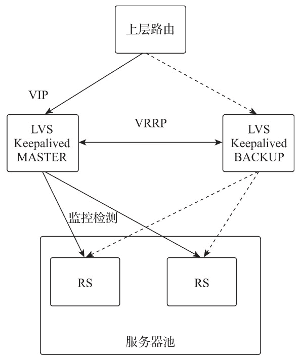

# Keepalived 配置简述

> 原文：[`www.weixueyuan.net/a/827.html`](http://www.weixueyuan.net/a/827.html)

Keepalived 是一款用 C 语言编写的开源路由软件，目前仍处于活跃开发的状态，其主要目标是基于 Linux 系统提供一款配置简单且功能强大的负载均衡和高可用的软件应用。负载均衡是基于 LVS（IPVS）实现的，Keepalived 在 LVS 的基础上增加了多种主动健康检测机制，可以根据后端真实服务器的运行状态，自动对虚拟服务器负载的真实服务器进行维护和管理。

高可用性是通过虚拟冗余路由协议（Virtual Reduntant Routing Protocol，VRRP）实现的。VRRP 是工作在网络层的一种路由容错协议，通过组播的通告机制进行网络路由快速转移，以实现网络设备的高可用。

## 1、Keepalived 相关术语

Keepalived 相关术语如下：

*   虚拟 IP（VIP）：对外提供用户访问的 IP 地址，与 LVS 的 VIP 概念相同；
*   真实服务器（Real Server）：被负载的后端服务器；
*   服务器池（Server Pool）：同一虚拟 IP 及端口的一组真实服务器；
*   虚拟服务器（Virtual Server）：服务器池的外部访问点，每个虚拟 IP 和端口组成一个虚拟服务器；
*   虚拟服务（Virtual Service）：与 VIP 关联的 TCP/UDP 服务；
*   VRRP：Keepalived 实现高可用的虚拟路由器冗余协议；
*   VRRP 路由器（VRRP Router）：运行 VRRP 协议的路由器设备；
*   虚拟路由器（Virtual Router）：一个抽象对象，一组具有相同 VRID（虚拟路由器标识符）的多个 VRRP 路由器集合；
*   MASTER 状态：主路由状态，是 VIP 地址的拥有者，负责转发到达虚拟路由的三层数据包，负责对虚拟 IP 地址的 ARP 请求进行响应；
*   BACKUP 状态：备份路由状态，当主路由状态设备故障时，负责接管数据包转发及 ARP 请求响应。

## 2、Keepalived 的工作模式

Keepalived 为 LVS 提供了文件形式的配置方式，并为真实服务器提供了多种主动健康检测机制，通过 VRRP 协议为 LVS 提供了高可用的负载集群解决方案。Keepalived 的工作模式如下图所示。

*   处于 MASTER 状态的 Keepalived 主机是 VIP 的拥有者，负责上层路由 VIP 的 ARP 查询响应和数据包转发；
*   处于 MASTER 状态的 Keepalived 主机通过 VRRP 协议在局域网内组播 VRRP 通告信息；
*   处于 MASTER 状态的 Keepalived 主机通过配置的健康检测机制主动检查服务器池中真实服务器的状态；
*   处于 BACKUP 状态的 Keepalived 主机接收 VRRP 通告信息，并根据通告信息判断本机状态是否变更；
*   当处于 MASTER 状态的路由发生故障时，处于 BACKUP 状态的路由确认主路由状态的 VRRP 通告超时时，则改变自身状态为 MASTER 状态，负责上层路由 IP 地址的 ARP 请求响应，并对外组播 VRRP 通告。


图：Keepalived 的工作模式示意图

## 3、健康检测

Keepalived 设计了多种主动健康检测机制，每个健康检测机制都注册在全局调度框架中，通过检测真实服务器的运行状态，自动对服务池中的真实服务器进行维护和管理。常用的健康检测机制有以下 4 种。

*   TCP 检测。通过非阻塞式 TCP 连接超时检查机制检查真实服务器的状态，当真实服务器不响应请求或响应超时时，则确认为检测失败，并将该真实服务器从服务池中移除。
*   HTTP 检测。通过 HTTP GET 方法访问指定的 URL 并对返回结果进行 MD5 算法求值，如果与配置文件中的预设值不匹配，则确认为检测失败，并将该真实服务器从服务池中移除。该机制支持同一服务器的多 URL 获取检测。
*   SSL 检测。对 HTTP 检测增加了 SSL 支持。
*   自定义脚本。允许用户自定义检测脚本进行检测判断，支持脚本外部传递参数，执行的结果必须是 0 或 1。0 表示检测成功，1 表示检测失败。

## 4、配置关键字

Keepalived 配置文件可以分为 3 个部分，分别为全局配置、VRRP 配置和虚拟服务配置。各部分的常用配置关键字及其功能如下。

#### 1) 全局配置

Keepalived 全局配置关键字实现邮件告警的 SMTP 配置及自身 VRRP 路由相关的全局配置，配置关键字如下表所示。

| 配置关键字 | 功能描述 |
| global_defs | 全局配置区域标识 |
| notification_email | 设置接收告警邮件的地址列表 |
| notification_email_from | 设置发送邮件的地址列表 |
| smtp_server | 设置用于发送邮件的 SMTP 服务器地址 |
| smtp_connection_timeout | 设置 SMTP 服务器连接超时时间 |
| router_id | 设置当前设备的路由 ID，每个设备均不相同 |
| vrrp_version | VRRP 协议版本 |
| nopreempt | 是否启用非抢占模式，即不参与 MASTER 的选举，默认为抢占模式 |

配置样例如下：

```

global_defs{
    notification_email {
        monitor@nginxbar.org        # 接收邮件的邮箱为 monitor@nginxbar.org
    }
    smtp_server smtp.nginxbar.org   # SMTP 服务器地址为 smtp.nginxbar.org
    smtp_connect_timeout 30         # SMTP 服务器连接超时时间为 30 秒
    router_id LVS_Nginx1            # 当前设备路由 ID 为 LVS_Nginx1
}
```

#### 2) VRRP 配置

Keepalived 的 VRRP 配置关键字用于创建 VRRP 路由器，并为其配置运行参数。配置文件中可以创建多个不同名称的 VRRP 路由器实例，每个 VRRP 路由器实例都需要通过设定虚拟路由 ID 加入虚拟路由器中。VRRP 路由器接收组播的 VRRP 通告，并根据 VRRP 通告切换自身状态。当切换状态时会触发配置中对应状态的 shell 脚本，并根据配置参数判断是否发送告警邮件。VRRP 配置关键字如下表所示。

| 配置关键字 | 功能描述 |
| vrrp_instance | VRRP 实例配置区域标识 |
| state | 设置当前 VRRP 路由的初始状态 |
| interface | 设置 VRRP 绑定的设备网络接口 |
| virtual_router_id | 设置当前设备所属的虚拟路由 ID |
| priority | 设置当前 VRRP 路由的初始优先级，优先级最高的会被选举为 MASTER，优先级取值范围为 1~254 |
| advert_int | 发送组播包的间隔时间，默认为 1 秒 |
| nopreempt | 是否启用非抢占模式，即不参与 MASTER 的选举，默认为抢占模式 |
| preempt_delay | 设置抢占延时，取值范围为 0~1000，默认为 0，单位为秒。即等待多少秒才参与 MASTER 选举 |
| authentication | VRRP 通信认证配置区域标识 |
| auth_type | 指定 VRRP 通信的认证类型，有 PASS 简单密码认证和 AH:IPSEC 认证两种类型 |
| auth_pass | 指定 VRRP 通信密码字符串，最大为 8 位 |
| virtual_ipaddress | VIP 地址配置区域标识 |
| notify_master | 指定一个转换为 MASTER 状态后执行的 shell 脚本 |
| notify_backup | 指定一个转换为 BACKUP 状态后执行的 shell 脚本 |
| notify_fault | 指定一个转换为 FAULT 状态后执行的 shell 脚本 |
| smtp_alert | 使用 SMTP 的配置发送邮件告警通知 |

配置样例如下：

```

vrrp_instance VI_1 {
    state MASTER            # 初始路由状态为 MASTER
    interface eth0          # VRRP 绑定接口为 eth0
    virtual_router_id 51    # 虚拟路由器的 VRID 为 51
    priority 100            # 当前设备的优先级是 100
    nopreempt               # 不参与 MASTER 的选举
    advert_int 5            # VRRP 组播的间隔时间是 5 秒
    authentication {
        auth_type PASS      # 认证类型为 PASS
        auth_pass 2222      # 认证密码为 2222
    }
    virtual_ipaddress {
        192.168.2.155       # 虚拟服务器的 VIP 是 192.168.2.155
    }
}
```

VRRP 本身是通过 VRRP 通告机制实现路由器状态切换判断的，但在实际的应用场景中会存在因网络抖动等原因影响 VRRP 的通告传递的情况，为提高状态切换的准确性，Keepalived 还提供了一种脚本检测机制，可以让用户通过自定义脚本更精准地进行路由状态切换。相关配置关键字如下表所示。

| 配置关键字 | 功能描述 |
| vrrp_script | VRRP 脚本配置区域标识 |
| scrip | 指定要执行的脚本路径 |
| weight | 用于调整 VRRP 路由器优先级的权重值，如果脚本执行成功且 weight 为正时，则优先级增力相应值；如果脚本执行失败且 weight 为负，则优先级减少相应值。优先级的取值范围为 1~254 |
| interval | 设置检测脚本的执行间隔。单位是 s。默认为 1s |
| timeout | 脚本执行返回结果超时时间，超过指定时间则认为检测失败 |
| rise | 连续检测成功次数为设定值时才确认为成功状态 |
| fall | 连续检测失败次数为设定值时才确认为失败状态 |
| init_fail | 设置脚本初始检测状态为失败状态 |

Keepalived 通过 VRRP 通告判断虚拟路由器中其他 VRRP 路由状态并确保路由的转移，对于业务层的高可用，则需要用户单独对应用进程进行同步检测。例如，Nginx 与 Keepalived 部署在同一台设备上，可以通过脚本检测 Nginx 进程的状态，如果 Nginx 检测失败并无法自动恢复，则降低 VRRP 的优先级。要尽量避免在切换为 MASTER 状态时，因自身业务层故障导致业务高可用切换失败。也可用多个脚本组合实现 VRRP 路由优先级的动态调整。配置样例如下：

```

vrrp_script checknginx {
    script "/opt/data/scripts/checknginx.sh"
    interval 3      # 检测脚本执行时间间隔
    weight -20      # 当检测失败时，VRRP 路由优先级降低 20
    rise 3          # 连续监测 3 次成功才确认为成功
    fall 3          # 连续监测 3 次失败才确认为失败
}
```

检测脚本内容如下：

```

#!/bin/bash
# 检测脚本查询 Nginx 进程是否存在，若存在则返回 0，若检测失败则返回 1
check = `ps aux | grep -v grep | grep nginx | wc -l`
if [ $check > 0 ]; then
    exit 0
else
    systemctl start nginx
    exit 1
fi
```

#### 3) 虚拟服务器配置

Keepalived 的虚拟服务器是负载均衡的外部访问点，通过配置关键字实现对 LVS 运行参数的配置，配置文件中可以为 VIP 绑定不同的端口创建多个虚拟服务器。虚拟服务器配置关键字如下表所示。

| 配置关键字 | 功能描述 |
| virtual_server | 虚拟服务器配置区域标识 |
| delay_loop | 设置健康检测的间隔时间 |
| lb_algo | LVS 调度算法 |
| lb_kind | LVS 转模式（NAT、DR、TUN） |
| persistence_timeout | 设置保持连接的超时时间，在设定时间内会把同一个客户端的连接全部转发给同一真实服务器 |
| persistence_granularity | 对启用保持连接的客户端 IP 进行掩码调整，当 IP 为 255.255.255.255 时，则仅限这个 IP 的客户端；当 IP 为 255.255.255.0 时，则为这个客户端所在子网网段内 IP 的所有客户端 |
| virtualhost | 为 HTTP_GET 或 SSL_GET 设置执行要检测的虚拟主机 |
| protocol | 转发协议类型（TCP、UDP、SCTP） |
| sorry_server | 设置一个服务池中所有真实服务器都无法访问时的备用服务器 |

真实服务器相关关键字如下表所示。

| 配置关键字 | 功能描述 |
| real_server | 配置真实服务器 IP 及端口 |
| weight | 设置真实服务器的权重，默认为 1 |
| inhibit_on_failure | 当健康检测失败时，将当前服务器权重设置为 0，而不将其从服务器池中移除 |
| notify_up | 当前服务器健康检查成功时执行的脚本 |
| notify_down | 当前服务器健康检查失败时执行的脚本 |
| uthreshold | 当前服务器的最大连接数 |
| lthreshold | 当前服务器的最小连接数 |
| TCP_CHECK | TCP 检测设置区域标识 |
| MISC_CHECK | 自定义检测脚本设置区域标识 |
| HTTP_GET | HTTP 检测设置区域标识 |
| SSL_GET | SSL HTTP 检测设置区域标识 |

通过 Keepalived 为真实服务器配置关键字不仅可以实现 LVS 真实服务器的运行参数配置，还可以对自身增加的真实服务器的主动健康检测进行配置。真实服务器健康检测配置关键字如下表所示。

| 配置关键字 | 功能描述 |
| url | HTTP_GET 和 SSL_GET 的 URL 检测标识 |
| path | HTTP_GET 和 SSL_GET 的 URL 检测路径 |
| digest | HTTP_GET 和 SSL_GET 的返回结果的 MD5 计算值 |
| status_code | HTTP_GET 和 SSL_GET 的健康检测返回状态码 |
| connect_ip | 检测的 IP 地址，默认为真实服务器的 IP 地址 |
| connect_port | 检测的端口，默认为真实服务器的端口 |
| bindto | 发起检测连接的接口地址，默认为本地 IP 地址 |
| bind_port | 发起检测连接的源端口，默认为随机端口 |
| connect_timeout | 检测连接的超时时间，默认为 5s |
| fwmark | 使用 fwmark 对所有发出去的检查数据包进行标记 |
| warmup | 指定一个随机延迟时间用于防止网络阻塞，如果为 0，则表示关闭该功能 |
| nb_get_retry | GET 尝试次数，仅 HTTP_GET 和 SSL_GET 有效 |
| retry | 重试次数，默认是 1 次，仅 TCP_CHECK 有效 |
| delay_before_retry | 设置在重试之前延迟的秒数 |

配置样例如下：

```

virtual_server 192.168.2.155 80 {           # 虚拟服务器 IP 及端口
    delay_loop 6                            # 健康检测间隔时间为 6s
    lb_algo wrr                             # 负载均衡调度算法为加权轮询
    lb_kind DR                              # 转发模式为 DR
    persistence_timeout 60                  # 保持连接的超时时间为 60s
    protocol TCP                            # 负载均衡转发协议为 TCP
    real_server 192.168.2.109 80 {                  # 真实服务器 IP 及端口
        weight 100                                  # 真实服务器权重为 100
        notify_down /etc/keepalived/scripts/stop.sh # 当真实服务器健康检测失败时执
                                                                # 行 stop.sh 脚本
        HTTP_GET {
            url {
                path "/healthcheck"                         # 指定要检查的 URL 的路径
                digest bfaa324fdd71444e43eca3b7a1679a1a     # 检测 URL 返回值的 MD5 计算值
                status_code 200                             # 健康检测返回状态码
            }
            connect_timeout 10                      # 连接超时时间为 10s
            nb_get_retry 3                          # 重试 3 次确认失败
            delay_before_retry 3                    # 失败重试的时间间隔为 3s
        }
    }
}

# digest 值的计算方法
genhash -s 192.168.2.109 -p 80 -u /healthcheck
```

Keepalived 的其他配置关键字此处并未列出，更多配置关键字可以通过 man 命令获取。

man keepalived.conf