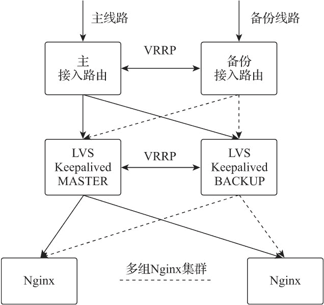

# Nginx 集群负载（基于 LVS 和 Keepalived）搭建

> 原文：[`www.weixueyuan.net/a/828.html`](http://www.weixueyuan.net/a/828.html)

基于 LVS 和 Keepalived 的 Nginx 集群负载是使用 LVS 做传输层的负载均衡设备，将客户端请求从传输层负载到后端的多组 Nginx 集群，并由 Nginx 集群实现应用层负载均衡处理的多层负载均衡网络架构。Keepalived 通过文件配置的方式实现 LVS 的运行管理，并通过 VRRP 机制实现传输层负载的高可用，为 Nginx 集群提供高性能、高可用的负载应用。

Nginx 集群负载部署图如下图所示。

*   LVS 作为传输层负载均衡与接入路由对接，负责把数据包转发给后端的 Nginx 服务器。
*   LVS 选用 DR 转发模式，网络数据包在传输层被分发到 Nginx 服务器，并由 Nginx 经过本地路由返回给客户端。
*   LVS 对后端 Nginx 服务器集群选用加权轮询（wrr）的负载均衡调度策略。
*   Keepalived 通过 VRRP 协议组播通告状态信息，确保两台 LVS 服务器的高可用。
*   当处于 MASTER 状态的 Keepalived 发生故障时，处于 BACKUP 状态的 Keepalived 切换为 MASTER 状态，负责与接入路由对接，把数据包转发给后端的 Nginx 服务器。
*   Keepalived 通过健康检测机制检测 Nginx 集群内每台 Nginx 服务器的健康状态。
*   Nginx 负责应用层负载均衡，完成客户端请求的负载、路由分流、过滤等操作。


图：Nginx 集群负载部署图

#### 1) Keepalived 安装

Keepalived 在 CentOS 7 系统下使用 yum 安装即可。在 CentOS 7 系统下，LVS 已被集成到内核中，无须单独安装。

yum  -y install keepalived

systemctl enable keepalived

#### 2) Keepalived 配置

Keepalived 需要分别在两台 LVS 服务器上进行配置，主服务器上的 Keepalived 配置如下：

```

! Configuration File for keepalived

global_defs {
    notification_email {
      monitor@nginxbar.org                          # 发生故障时发送邮件告警通知的邮箱
    }
    notification_email_from admin@nginxbar.org      # 使用哪个邮箱发送
    smtp_server mail.nginxbar.org                   # 发件服务器
    smtp_connect_timeout 30
    router_id LVS_01                                # 当前设备路由 ID 为 LVS_01
}

vrrp_instance VI_1 {
    state MASTER                                    # 初始路由状态为 MASTER
    interface eth0                                  # VRRP 绑定的本地网卡接口为 eth0
    virtual_router_id 51                            # 虚拟路由器的 VRID 为 51
    priority 100                                    # 当前设备的优先级是 100
    advert_int 5                                    # VRRP 组播的间隔时间是 5s
    authentication {
        auth_type PASS                                      # 认证类型为 PASS
        auth_pass 2222                                      # 认证密码为 2222
    }
    virtual_ipaddress {
        192.168.21.155                                      # 虚拟服务器的 VIP 是 192.168.21.155
    }
}

virtual_server 192.168.21.155 80 {                      # 虚拟服务器 IP 及端口
    delay_loop 6                                            # 健康检测间隔时间为 6s
    lb_algo wrr                                             # 负载均衡调度算法为加权轮询
    lb_kind DR                                              # 转发模式为 DR
    persistence_timeout 60                                  # 保持连接的超时时间为 60s
    protocol TCP                                            # 负载均衡转发协议为 TCP
    real_server 192.168.2.108 80 {                          # 真实服务器 IP 及端口
        weight 100                                          # 真实服务器权重为 100
        notify_down /etc/keepalived/scripts/stop.sh         # 当真实服务器健康检测失败时执
                                                                # 行 stop.sh 脚本
        HTTP_GET {
            url {
                path "/healthcheck"                         # 指定要检查的 URL 的路径
                digest bfaa324fdd71444e43eca3b7a1679a1a     # 检测 URL 返回值的 MD5 计算值
                status_code 200                             # 健康检测返回状态码
            }
            connect_timeout 10                      # 连接超时时间为 10s
            nb_get_retry 3                          # 重试 3 次确认失败
            delay_before_retry 3                    # 失败重试的时间间隔为 3s
        }
    }
    real_server 192.168.2.109 80 {                  # 真实服务器 IP 及端口
        weight 100                                  # 真实服务器权重为 100
        notify_down /etc/keepalived/scripts/stop.sh # 当真实服务器健康检测失败时执
                                                                # 行 stop.sh 脚本
        HTTP_GET {
            url {
                path "/healthcheck"                         # 指定要检查的 URL 的路径
                digest bfaa324fdd71444e43eca3b7a1679a1a     # 检测 URL 返回值的 MD5 计算值
                status_code 200                             # 健康检测返回状态码
            }
            connect_timeout 10                              # 连接超时时间为 10s
            nb_get_retry 3                          # 重试 3 次确认失败
            delay_before_retry 3                    # 失败重试的时间间隔为 3s
        }
    }
}
```

备份服务器上的 Keepalived 配置样例如下：

```

! Configuration File for keepalived

global_defs {
    notification_email {
      monitor@nginxbar.org                          # 发生故障时发送邮件告警通知
                                                                # 的邮箱
    }
    notification_email_from admin@nginxbar.org              # 使用哪个邮箱发送
    smtp_server mail.nginxbar.org                   # 发件服务器
    smtp_connect_timeout 30
    router_id LVS_02                                # 当前设备路由 ID 为 LVS_02，此
                                                                # 处与主服务器配置不同
}

vrrp_instance VI_1 {
    state BACKUP                                    # 初始路由状态为 BACKUP，此处
                                                                # 与主服务器配置不同
    interface eth0                                  # VRRP 绑定的本地网卡接口为 eth0
    virtual_router_id 51                            # 虚拟路由器的 VRID 为 51
    priority 99                                     # 当前设备的优先级是 99，此处
                                                                # 与主服务器配置不同
    advert_int 5                                    # VRRP 组播的间隔时间是 5s
    authentication {
        auth_type PASS                                      # 认证类型为 PASS
        auth_pass 2222                                      # 认证密码为 2222
    }
    virtual_ipaddress {
        192.168.21.155                              # 虚拟服务器的 VIP 是 192.168.21.155
    }
}

virtual_server 192.168.21.155 80 {                      # 虚拟服务器 IP 及端口
    delay_loop 6                                            # 健康检测间隔时间为 6s
    lb_algo wrr                                             # 负载均衡调度算法为加权轮询
    lb_kind DR                                              # 转发模式为 DR
    persistence_timeout 60                                  # 保持连接的超时时间为 60s
    protocol TCP                                            # 负载均衡转发协议为 TCP
    real_server 192.168.2.108 80 {                          # 真实服务器 IP 及端口
        weight 100                                  # 真实服务器权重为 100
        notify_down /etc/keepalived/scripts/stop.sh # 当真实服务器健康检测失败时执
                                                                # 行 stop.sh 脚本
        HTTP_GET {
            url {
                path "/healthcheck"                         # 指定要检查的 URL 的路径
                digest bfaa324fdd71444e43eca3b7a1679a1a     # 检测 URL 返回值的 MD5 计算值
                status_code 200                             # 健康检测返回状态码
            }
            connect_timeout 10                              # 连接超时时间为 10s
            nb_get_retry 3                                  # 重试 3 次确认失败
            delay_before_retry 3                            # 失败重试的时间间隔为 3s
        }
    }
    real_server 192.168.2.109 80 {                          # 真实服务器 IP 及端口
        weight 100                                          # 真实服务器权重为 100
        notify_down /etc/keepalived/scripts/stop.sh # 当真实服务器健康检测失败时执
                                                                # 行 stop.sh 脚本
        HTTP_GET {
            url {
                path "/healthcheck"                         # 指定要检查的 URL 的路径
                digest bfaa324fdd71444e43eca3b7a1679a1a     # 检测 URL 返回值的 MD5 计算值
                status_code 200                             # 健康检测返回状态码
            }
            connect_timeout 10                              # 连接超时时间为 10s
            nb_get_retry 3                                  # 重试 3 次确认失败
            delay_before_retry 3                            # 失败重试的时间间隔为 3s
        }
    }
}
```

至此，高可用的 LVS 负载均衡就配置完成了。当主 LVS 服务器出现故障时，备份 LVS 服务器可以快速接管传输层网络数据的负载均衡工作，将数据包分发给后端的 Nginx 服务器集群。