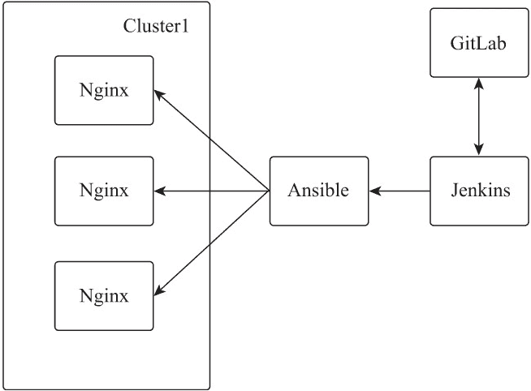

# Nginx 集群配置管理规划

> 原文：[`www.weixueyuan.net/a/830.html`](http://www.weixueyuan.net/a/830.html)

Nginx 的配置是以文件形式存在的，配置指令会在启动时一次性加载并生效，采用这种方式除 upstream 的配置可动态变更（商业版本支持 API 变更，开源版本依赖第三方模块动态修改）外，其他配置的修改均需要重启或热加载 Nginx 进程才可生效。为实现便捷的 Nginx 配置变更管理，需要从以下几个方面进行规划。

## 1、配置目录结构

Nginx 默认所有配置文件均存放在其安装目录的 conf 目录下，为防止配置文件不方便阅读和管理，可以按照虚拟主机（具有独立主机名或网络端口）进行拆分，每个虚拟主机一个配置文件，并存放在统一的目录下。对功能固定、全局的配置指令以固定文件的形式存放在配置文件目录的根目录下。所有的配置文件都以 nginx.conf 为统一入口，并使用配置指令 include 按需引入。

Nginx 的目录结构规划样例如下。

conf/
  ├── conf.d
  │   ├── mysql_apps.ream
  │   ├── www.nginxbar.com.conf
  │   └── www.nginxbar.org.conf
  ├── fastcgi.conf
  ├── fastcgi_params
  ├── fscgi.conf
  ├── gzip.conf
  ├── mime.types
  ├── nginx.conf
  ├── proxy.conf
  ├── scgi_params
  ├── ssl
  │   ├── www_nginxbar_org.csr
  │   ├── www_nginxbar_org.key
  │   └── www_nginxbar_org.pem
  └── uwsgi_params

目录说明如下：

*   conf.d 为自建目录，是存放虚拟主机配置文件的目录。
*   mysql_apps.ream 是自定义应用 apps 的 MySQL 集群代理配置文件。
*   www.nginxbar.com.conf 是域名 www.nginxbar.com (http://www.nginxbar.com) 对应的虚拟主机配置文件。
*   www.nginxbar.org.conf 是域名 www.nginxbar.org (http://www.nginxbar.org) 对应的虚拟主机配置文件。
*   fscgi.conf 是自定义 FastCGI 代理配置文件。
*   gzip.conf 是自定义响应数据 gzip 压缩配置指令文件。
*   proxy.conf 是自定义 HTTP 代理配置指令文件。
*   ssl 是自建目录，用于存放虚拟主机的 SSL 证书文件。

nginx.conf 配置样例如下：

```

# 选择加载动态模块
load_module "modules/ngx_http_geoip_module.so";
load_module "modules/ngx_http_image_filter_module.so";
load_module "modules/ngx_http_xslt_filter_module.so";

# 工作进程及事件配置
worker_processes auto;                  # 启动与 CPU 核数一致的工作进程
worker_priority -5;                     # 工作进程在 linux 系统中的优先级为-5

events {
    worker_connections  65535;              # 每个工作进程的最大连接数
    multi_accept on;                        # 每个工作进程每次都可以接收多个连接
}

# TCP/UDP 代理配置
stream {
    # 配置 TCP/UDP 代理的日志格式模板，模板名为 tcp
    log_format  tcp  '$remote_addr - $connection - [$time_local] $server_addr:$server_port - $protocol'
                      '- $status - $upstream_addr - $bytes_received - $bytes_sent - $session_time '
                      '- $proxy_protocol_addr:$proxy_protocol_port ';

    # 配置 TCP/UDP 代理的错误日志输出位置，错误级别为 error
    error_log logs/tcp_error.log error;

    # 引入 conf.d 目录下所有后缀名为 ream 的配置文件
    include conf.d/*.ream;
}

# HTTP 配置
http {
    include       mime.types;               # 引入 MIME 类型映射表文件

    # 配置 HTTP 的错误日志输出位置，错误级别为 error
    error_log logs/error.log error;

    # 配置 HTTP 的日志格式，模板名为 main
    log_format  main  '$remote_addr - $connection - $remote_user [$time_local] "$request" - $upstream_addr '
                      '$status  - $body_bytes_sent - $request_time - "$http_referer" '
                      '"$http_user_agent" - "$http_x_forwarded_for" - ';

    # 配置全局访问日志输出位置，并以模板 main 的日志格式输出
    access_log  logs/access.log  main;

    charset  utf-8;                         # 字符编码为 utf-8
    variables_hash_max_size 2048;           # 变量哈希表最大值为 2048B
    variables_hash_bucket_size 128;         # 变量哈希桶最大值为 128B
    server_names_hash_bucket_size 256;      # 服务主机名哈希桶大小为 256B
    client_header_buffer_size 32k;          # 请求头缓冲区大小为 32KB
    large_client_header_buffers 4 128k;     # 最大缓存为 4 个 128KB
    client_max_body_size 20m;               # 允许客户端请求的最大单个文件字节数为 20MB
    sendfile on;                            # 开启零复制机制
    tcp_nopush on;                          # 启用在零复制时数据包最小传输的限制机制
    tcp_nodelay on;                         # 当处于保持连接状态时以最快的方式发送数据包
    keepalive_timeout  60;                  # 保持连接超时时间为 60s
    client_header_timeout 10;               # 读取客户请求头的超时时间是 10s
    client_body_timeout 10;                 # 请求体接收超时时间为 10s
    server_tokens on;                       # 不显示 Nginx 版本信息
    include gzip.conf;                      # HTTP gzip 的配置文件
    include proxy.conf;                     # HTTP 代理配置
    include conf.d/*.conf;                  # 引入 HTTP 虚拟主机配置
}
```

nginx.conf 中编辑在全局区域的配置指令均可按照 Nginx 配置指令规范在 server、location 指令域中被同名的配置指令覆盖。

## 2、配置归档

Nginx 作为负载均衡应用时，是业务应用的入口，Nginx 服务器的可用性决定了其所负责的所有被代理业务的可用性。所以 Nginx 进行配置变更时要及时做好归档和版本控制，因为 Nginx 配置是以文件方式存在的，所以可以将每次修改的文件以 Git 标签的方式在 Git 仓库中进行存档和版本控制。

## 3、配置变更

可以使用对应的配置模板进行 Nginx 配置内容的修改、配置部分的标准化及通用性约定，以便进行自动化操作。开源软件 Ansible 提供了自定义模板的功能，使用户可以按照预期设计更加严谨、规范地配置变更。Ansible 支持批量操作，可以快速完成多台 Nginx 服务器配置文件的同步和加载。

## 4、配置发布

Ansible 虽然提供了命令行的操作能力，但是用户权限、操作日志及快速回滚等操作仍不够便捷。Jenkins 是一款 Web 化的持续集成发布工具，被广泛应用于业务应用的发布，拥有超过 1000 个插件，用户无须额外开发就可快速完成代码从代码仓库到运行部署的整个流程，同时还支持用户权限、操作日志及快速回滚等操作。

根据上述 4 个方面的规划，通过 Jenkins 与 GitLab 及 Ansible 的配合使用，无须复杂编程就可以快速搭建一套 Web 化的 Nginx 配置管理系统。应用架构如下图所示。


图：应用架构图
关于上图，有以下几点需要说明：

*   Jenkins 通过 GitLab 获取 Git 仓库中的 Nginx 文件。
*   Ansible 根据 Jenkins Web 界面输入的参数与对应配置模板生成配置文件，更新本地的 Nginx 配置文件。
*   Ansible 将更新后的配置文件同步到 Nginx 集群的所有 Nginx 服务器，并对 Nginx 进程执行 reload 操作，以加载更新后的配置。
*   Jenkins 将更新后的 Nginx 配置文件以 Git 标签的方式进行归档。
*   用户可以通过 Jenkins 获取对应 Git 仓库的所有 Git 标签，并根据需求选择对应的 Git 标签代码执行回滚操作。