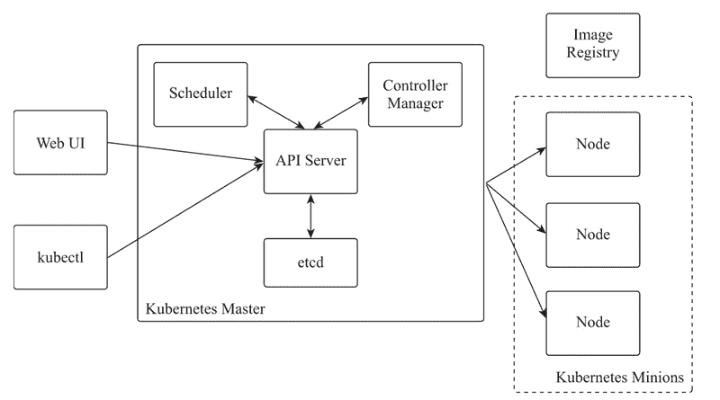
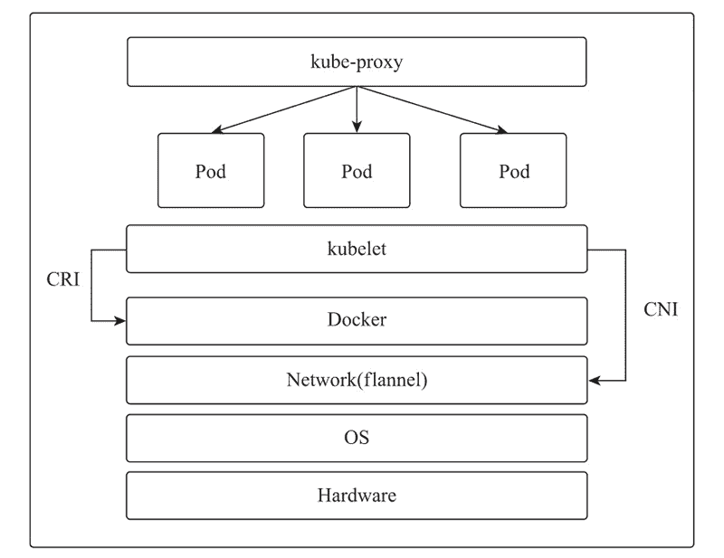
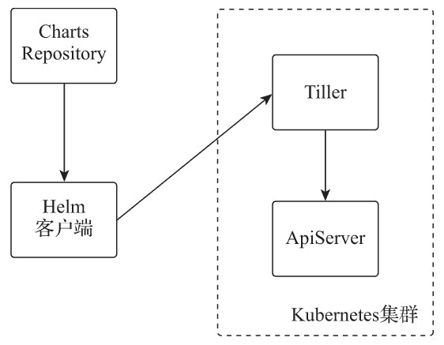

# Kubernetes（k8s）分布式容器管理系统简述

> 原文：[`www.weixueyuan.net/a/847.html`](http://www.weixueyuan.net/a/847.html)

Kubernetes 是分布式容器管理系统，它提供了对容器快速部署、网络规划、负载调度及宿主机节点自动化更新和维护的管理机制，使容器自动化按照用户期望的方式运行。

## 1、Kubernetes 架构简述

与大多数分布式系统一样，Kubernetes 集群由主节点（Master）和多个从节点（Node）组成，集群中运行多个应用组件，是计算、存储、网络资源的集合，为运行的各种应用提供资源管理、调度和维护等功能。Kubernetes 架构如下图所示。

图：Kubernetes 架构
具体说明如下。

*   Kubernetes 集群中被操作控制的资源称为资源对象，如 Pod、Node、Service 都被看作资源对象；
*   kubectl 是 Kubernetes 的命令行管理工具，该工具与 Web UI 一样，可以通过 Kuber-netes 主节点的接口服务（API Server）查看及进行创建、删除或更新资源对象等操作；
*   Kubernetes 主节点的核心组件包括接口服务（API Server）、调度服务（Scheduler）、控制管理服务（Controller Manager）和存储服务（etcd）；
*   接口服务提供了资源对象操作的统一入口，提供认证、授权、访问控制等功能，以 REST API 方式对外提供服务，允许各类组件创建、删除、更新或监视资源；
*   调度服务按照编排的调度策略将运行容器（Pod）根据集群资源和状态选择合适的 Node 进行创建；
*   控制管理服务负责维护整个集群的状态，包括滚动更新、自动扩缩容、故障检测等；
*   存储服务用于存储整个集群各种配置及资源实例的状态，实现配置共享和服务发现等功能。

一个 Kubernetes 集群可包括多个 Node 节点，每个 Node 节点上运行了网络、代理及管理组件。Kubernetes 节点架构如下图所示。


图：Kubernetes 节点架构
具体说明如下。

*   kube-proxy 负责为 Pod 提供网络代理和负载均衡等功能；
*   Kubernetes 并未提供专门的网络组件实现网络功能，目前常用的是 flannel，它通过 CNI（Container Network Interface，容器网络接口）方式与 Kubernetes 集成，提供网络功能；
*   kubelet 是运行在每个节点上的节点代理服务，可以实现每个节点上的 Pod 管理及监控，并接收主节点组件下发的各种管理任务；
*   Pod 是 Kubernetes 中最基本的管理单位，是在 Docker 容器上的一层封装，一个 Pod 可包含多个容器，可以实现内部运行容器的资源共享；
*   CRI（Container Runtime Interface，容器运行时接口）是 Kubernetes 中用来与底层容器（如 Docker）进行通信的接口，可对容器执行启停等操作。

## 2、Kubernetes 相关术语

Kubernetes 提供了容器运行时各种资源自动化调度与管理的强大功能，为应对各种复杂环境的自动化管理操作，Kubernetes 系统中定义了很多术语，可分为资源对象、资源控制器、资源配置和管理工具 4 类。

### 1) 资源对象

资源对象指 Kubernetes 中所有被管理的资源，如 Pod、节点、服务都属于资源对象。可以通过接口服务对 Kubernetes 集群中的所有资源对象进行增、删、改、查操作，资源对象相关数据被持久化保存在存储服务中。

Kubernetes 中被管理的资源对象会因版本不同而变化，如下所示。

#### ① Pod

Pod 是 Kubernetes 中的核心资源，每个 Pod 可包含多个容器，每个运行的 Pod 由一个名为 pause 的沙盒容器（Sandbox Container，也称基础容器）与一个或多个应用容器组成。基础容器为 Pod 中的应用容器提供如下功能。

*   共享 PID 命名空间，Pod 中的应用程序可以查看彼此的进程 ID；
*   共享网络命名空间，Pod 中的不同容器共同使用一个 IP 和端口范围；
*   共享 IPC 命名空间，Pod 中的不同容器的应用可以使用 SystemV IPC 或 POSIX 消息队列进行通信；
*   共享 UTS 命名空间，Pod 中的所有容器共享同一个主机名及共享 Pod 级别定义的存储卷（Volume）。

#### ② Node

Node 是指 Kubernetes 集群中运行 Pod 的宿主机，每个 Node 都会运行节点代理服务（kubelet），负责各 Node 运行 Pod 容器的管理、监控，并向主节点汇报运行容器的状态，同时接收并执行主节点下发的任务。通过管理工具可对 Node 资源进行添加、删除及隔离等操作。

#### ③ 标签

标签（Label）是与资源对象关联的键值对，用以标识资源实例的特征，方便用户对资源实例通过自定义标识进行归类。标签键（key）的长度最多 63 个字符，必须以字母或数字为开始和结束的字符，中间可以有“_”“-”“.”做连接符。

标签键值（value）的长度最多 63 个字符，必须以字母或数字为首字符，也可以为空。每个资源实例与标签是多对多的关系，可以在资源实例初始时定义标签，也可以动态添加或删除。

#### ④ 注解

注解（Annotation）也是与资源对象关联的键值对，用以对资源实例的内置属性进行描述。注解键值对不能用于资源实例的标识及选择，但资源实例被描述的属性数据可以被管理工具或系统扩展使用。注解键值对可以使用标签不允许的字符，可用于资源实例运行时的外部设置，使资源实例在注解值不同时实现不同的运行状态。

#### ⑤ 服务

服务（Service）定义了由多个具有相同服务名称标签的 Pod 组成的虚拟网络集群，其负责虚拟集群内 Pod 的负载均衡和自动发现，每个服务会被分配一个全局唯一固定的虚拟 IP（Cluster IP），Kubernetes 集群内的所有应用都可以通过 Cluster IP 与这个服务实现 TCP 通信。

#### ⑥ 端点

资源对象端点（Endpoint）表示一个由 Pod IP 和端口组成的可被访问的网络访问点，是构成 Service 的基础单位，每个 Service 负责实现端点列表中端点的负载均衡和网络请求转发。

#### ⑦ 配置映射

配置映射（ConfigMap）提供了一种类似于配置中心的配置使用方法。应用容器的内容是在制作镜像时打包好的，如果要修改容器的内容，通常都需要重新制作镜像。日常使用中，会遇到很多只简单修改应用配置文件的需求，通过配置映射将配置变量或文件存储在存储服务 etcd 中，应用容器可以在运行的系统中以环境变量或挂载文件的方式使用这些配置变量。

#### ⑧ 命名空间

命名空间（Namespace）是 Kubernetes 集群用于对资源进行管理的逻辑集合，不同命名空间的资源实例逻辑间是彼此隔离的。不同命名空间可通过设定资源配额、网络策略、RBAC 策略进行资源实例的管控。网络策略需要网络插件的支持，如 Flannel 并没有提供网络策略的支持，所以无法实现网络隔离。

### 2) 资源控制器

资源控制器用以实现每个资源对象的具体操作，每个资源对象都由对应的控制器进行管理和控制。Kubernetes 通过各种控制器跟踪和对比存储服务中已保存资源实例的期望状态与当前集群中运行的资源实例的实际状态的差异来实现自动控制和纠错。

Kubernetes 通过管理控制服务来管理资源对象，管理控制服务由一系列资源控制器（Controller）组成，有如下几种。

#### ① 副本控制器

副本控制器（Replication Controller，RC）与进程管理器类似，用以监控集群中所有节点上的 Pod，并确保每个 Pod 都有设定数量的副本在运行。如果运行的 Pod 数量大于设定的数量，则关闭多余的 Pod；反之，则启用足够数量的新 Pod。

#### ② 副本集

副本集（Replica Set，RS）在 RC 原有功能的基础上提供了更多的增强工具，它主要被部署控制器（Deployment Controller）作为协调 Pod 创建、删除和更新使用。RS 也被称为下一代副本控制器，官方已经推荐使用部署控制器管理 RS（而不是 RC）。

#### ③ 部署控制器

部署控制器用来管理无状态应用，它通过资源对象 Deployment 的配置与 RS 组合来管理 Pod 的多个副本，确保 Pod 按照资源配置描述的状态运行。部署控制器完成资源对象 Deployment 实例的创建过程，由 RS 协助实现 Pod 副本的创建，并随时监控 Deployment 资源实例的部署状态，当部署状态不稳定时，可将 Pod 回滚到之前的 Deployment 资源实例版本。

#### ④ DaemonSet 控制器

DaemonSet 控制器可确保以该模式部署的 Pod 应用，在集群中的每个 Node 上都有一个 Pod 副本在运行，如果集群中增加了新的 Node，也会自动在该 Node 创建该应用的 Pod 副本，常用来部署全局使用的日志采集、监控、系统管理等容器应用。

#### ⑤ StatefulSet 控制器

StatefulSet 控制器是用来管理有状态应用的，能够保证其管理的 Pod 的每个副本在整个生命周期中名称不变。通常每个 Pod 在被删除重建或重启后名称（PodName 和 HostName）都会变化，而 StatefulSet 控制器可以使 Pod 副本相关信息不变，也可以按照固定的顺序启动、更新或删除。StatefulSet 控制器通常用来解决有状态服务的管理和维护。

#### ⑥ 端点控制器

端点控制器（Endpoint Controller）负责与服务对应端点列表的生成和维护，监听服务及其对应 Pod 的变化。服务被创建或修改时，端点控制器根据服务信息获得其所有 Pod 的 IP 和端口信息，并创建或更新同名的端点对象列表。当服务被删除时，同名的端点列表也会被删除。kube-proxy 服务通过获取每个服务对应的端点列表，实现服务的负载均衡和数据转发配置。

#### ⑦ 服务控制器

服务控制器（Service Controller）是属于 Pod 应用对外发布服务的一个接口控制器，可通过 ClusterIP、NodePort、LoadBalancer、ExternalName 和 externalIPs 方式实现 Pod 应用的对外服务访问。服务控制器监听资源对象服务的变化，当服务是 LoadBalancer 类型时，确保外部的云平台上对该服务对应的 LoadBalancer 实例被相应地创建、删除及路由转发表的更新。

### 3) 资源配置

资源配置是由用户编写来描述资源实例期望状态的 Yaml 格式数据或文本，每个资源对象被通过对应的资源接口创建或修改资源实例，并通过资源控制器使资源实例按照资源配置文件中描述的期望状态运行。

本章涉及资源配置的资源接口版本（apiVersion）、资源类型（kind）、元数据（metadata）、规范（spec）四个部分。

#### ① 资源接口版本

因 Kubernetes 本身也在快速迭代，所以 Kubernetes 每次更新一个版本时，就会为被改变内容的资源接口创建一个新的版本，所以在编写资源配置时，需要先声明被操作资源接口的版本，以确保所描述的操作内容可被正常解析和执行。可使用如下命令查看当前 Kubernetes 集群接口服务支持的接口版本。

kubectl api-versions

#### ② 资源类型

资源类型用以声明需要操作的资源类型名称，资源类型包括一个或多个可被操作的资源对象，常见的资源类型有 Service、Deployment、Pod、Ingress。可使用如下命令查看当前 Kubernetes 集群接口服务可操作的资源对象名称和所属资源类型。

kubectl api-resources

#### ③ 元数据

元数据用以对当前操作的资源实例进行标识，元数据可以包括实例名称（name）、实例所在命名空间（namespace）、实例标签（label）、实例注解（Annotation）等信息。

#### ④ 规范

规范用以描述被操作的资源实例在 Kubernetes 集群中的执行规范和被期望达成的状态。

资源配置样例如下。

创建名为 nginx-svc 的服务资源实例，将资源实例 nginx-svc 以 NodePort 类型对外开放端口 30080，对应的 Service 端口为 8080，Pod 端口为 80。

```

apiVersion: v1          # 调用资源接口版本为 v1
kind: Service           # 资源类型为 Service
metadata:
    name: nginx-svc     # 资源实例名称为 nginx-svc
    namespace: webapps      # 资源实例所属命名空间为 webapps
    labels:
        app: nginx-svc      # 资源实例的标签为 nginx-svc
spec:
    type: NodePort          # 服务类型为 NodePort
    ports:
    - port: 8080            # 服务的端口为 8080
      nodePort: 30080       # NodePort 对外开放的端口为 30080
      targetPort: 80        # Pod 应用的端口为 80
    selector:
        app: nginx-web      # 服务用于筛选对应 Pod 的标签名为 nginx-web
```

### 4) 管理工具

管理工具是用于与 Kubernetes 交互来实现资源对象操作的执行程序，资源配置文件就是通过管理工具提交给 Kubernetes 接口服务完成相关资源对象操作的。

#### ① 集群部署工具 kubeadm

kubeadm 是 Kubernetes 官方推荐的部署工具之一，可以实现 Kubernetes 集群容器化的快速部署。Master 节点只需执行 kubeadm init 即可完成 Master 组件的自动化部署，Node 节点只需执行 kubeadm join 即可完成加入指定 Kubernetes 集群的操作。

执行 kubeadm init 命令时自动执行如下动作。

*   系统环境检查；
*   生成 Master token；
*   生成自签名的 CA 和 Client 证书；
*   生成 kubeconfig 用于 kubelet 服务连接 API server；
*   初始化并启动 kubelet 服务；
*   为 Master 各组件生成静态 Pod 配置（Static Pod manifests）并创建 Pod 应用，Master 组件运行命名空间为 kube-system；
*   配置 RBAC；
*   添加 kube-proxy 和 CoreDNS 附加服务。

该命令的其他参数如下。

```

# 初始化主节点
kubeadm init

# 查看 token
kubeadm token list

# 重新生成 token
kubeadm token generate

# 清空 kubeadm 设置
kubeadm reset
```

#### ② 资源管理工具 kubectl

kubectl 是 Kubernetes 的资源管理客户端程序，可以通过 Kubernetes Master 的接口服务（API Server）查看及进行创建、删除或更新资源对象等操作。通常建议在非 Master 节点主机运行或在 Master 节点上以非 root 权限用户运行。

当 Master 节点被 kubeadm 初始化成功后，会提示将 /etc/kubernetes/admin.conf 复制到 kubectl 控制机或非 root 用户的 Home 目录中。该命令的其他参数如下。

```

# 查看节点状态
kubectl get nodes

# 查看集群状态
kubectl get cs

# 查看所有事件
kubectl get events --all-namespaces

# 查看所有 Pod
kubectl get pods --all-namespaces -o wide

# 查看所有服务
kubectl get services --all-namespaces -o wide

# 扩缩容，将以 deployment 部署方式部署的 Pod 资源实例 nginx 的副本数设定为 3
kubectl scale --replicas=3 deployment/nginx

# 编辑配置，编辑资源对象 Service 实例名为 nginx 的资源配置
kubectl edit service/nginx
```

为了更方便地扩展资源管理工具的功能，kubectl 通过插件机制允许开发者以独立文件的形式发布自定义的 kubectl 子命令。kubectl 插件可以使用任意语言开发，可以是一个 Bash 或 Python 的脚本，也可以是其他语言开发编译的二进制可执行文件，只要最终将脚本或二进制可执行文件以 kubectl- 为前缀命名，并存放到 /root/.krew/bin/ 目录中即可。

使用 `kubectl plugin list` 命令可以查看有哪些插件。krew 是 kubectl 插件的管理器，使用 krew 可以轻松查找、安装和管理 kubectl 插件。krew 本身也是一个 kubectl 插件。krew 相关的命令如下。

```

# 安装 kubectl 插件 krew
curl -fsSLO "https://storage.googleapis.com/krew/v0.2.1/krew.{tar.gz,yaml}"

tar zxvf krew.tar.gz
./krew-linux_amd64 install --manifest=krew.yaml --archive=krew.tar.gz
echo "export PATH=\"\${KREW_ROOT:-\$HOME/.krew}/bin:\$PATH\"" >>/etc/profile
source /etc/profile

# 更新插件列表
kubectl krew update

# 查看插件列表
kubectl krew list
```

#### ③ 应用部署工具 Helm

Helm 并非官方提供的工具，而是 Deis 公司（已被微软收购）开发的用于 Kubernetes 下应用部署、更新、卸载的管理工具。Helm 类似于 Linux 操作系统中的包管理工具，如 CentOS 下使用的 yum。Helm 让 Kubernetes 的用户可以像安装软件包一样，轻松查找、部署、升级或卸载各种应用。Helm 的工作逻辑如下图所示。


图：Helm 工作逻辑
关于 Helm 的几点说明如下。

*   Helm 管理的安装包被称为 Chart；
*   Chart 存储在远端的 Charts 仓库（Repository）；
*   Tiller 是 Helm 的服务端，以 Pod 方式部署在 Kubernetes 中，负责接收 Helm 客户端的控制命令，解析 Chart 并调用接口服务完成应用的部署和配置。

常用的 Helm 命令如下。

```

# 初始化 Helm
helm init

# 查看当前安装的应用
helm list

# 安装应用
helm install --namespace kubeapps --name kubeapps bitnami/kubeapps

# 删除应用
helm delete --purge kubeapps
```