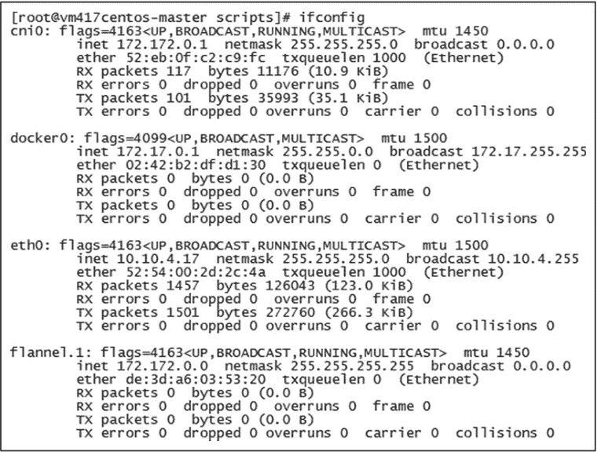

# Kubernetes（k8s）集群部署详解

> 原文：[`www.weixueyuan.net/a/853.html`](http://www.weixueyuan.net/a/853.html)

Kubernetes 集群支持多种方式部署，kubeadm 是 Kubernetes 官方提供的用于快速部署 Kubernetes 集群的工具，本节将使用 kubeadm 实现 Kubernetes 集群样例的快速部署。部署规划如下表所示。

| 名称 | IP | 主机名 |
| Master 节点 | 10.10.4.17 | vm417centos-master.kube |
| 从节点 | 10.10.4.26 | vm426centos-node01.kube |
| Pod 网络 | 172.172.0.0/16 | -- |

## 1、系统初始化

分别在 Master 和 Node 主机进行系统初始化，此处使用的操作系统版本为 CentOS 7.2。

```

# 关闭 setenforce
setenforce 0
sed -i "s/SELINUX=enforcing/SELINUX=disabled/g" /etc/selinux/config

# 关闭默认防火墙
systemctl stop firewalld
systemctl disable firewalld

# 配置 hosts，实现本地主机名解析
echo "10.10.4.17 vm417centos-master.kube
10.10.4.26 vm426centos-node01.kube" >> /etc/hosts

# 配置系统内核参数，因网桥工作于数据链路层，数据默认会直接经过网桥转发，为避免 iptables 的 FORWARD
# 设置失效，需要启用 bridge-nf 机制
cat <<EOF >  /etc/sysctl.d/k8s.conf
net.bridge.bridge-nf-call-ip6tables = 1
net.bridge.bridge-nf-call-iptables = 1
net.ipv4.ip_forward = 1
vm.swappiness=0
EOF

# 使内核参数配置生效
sysctl --system

# 关闭交换内存，如果不关闭，kubelet 服务将无法启动
swapoff -a

# 安装 docker-ce，Kubernetes 与 Docker 存在版本兼容问题，Kubernetes 最新版本 v1.15，最高支持
# Docker 18.09 版本，所以需要安装指定的 Docker 版本
yum install -y yum-utils
yum-config-manager --add-repo https://download.docker.com/linux/centos/docker-ce.repo
yum install -y docker-ce-18.09.0-3.el7 docker-ce-cli-18.09.0-3.el7 containerd.io-1.2.0-3.el7 ebtables ethtool
systemctl enable docker
systemctl start docker

# 优化 Docker cgroup 驱动，Kubernetes 文档指出，使用 systemd 作为 init system 的 Linux 系统中，
# cgroup driver 为 systemd 模式可以确保服务器节点在资源紧张时的稳定性
yum install -y systemd
cat >/etc/docker/daemon.json<<EOF
{
    "exec-opts": ["native.cgroupdriver=systemd"]
}
EOF
systemctl restart docker

# 查看确认
docker info | grep Cgroup

# 配置 kubernetes yum 源，用以安装 Kubernetes 基础服务及工具，此处使用阿里云镜像仓库源
cat > /etc/yum.repos.d/kubernetes.repo <<EOF
[kubernetes]
name=Kubernetes
baseurl=https://mirrors.aliyun.com/kubernetes/yum/repos/kubernetes-el7-x86_64/
enabled=1
gpgcheck=0
EOF

# 安装 Kubernetes 基础服务及工具
yum install -y kubeadm kubelet kubectl kompose kubernetes-cni
systemctl enable kubelet.service
```

## 2、部署 Master 节点

Master 节点理论上只需要接口服务、调度服务、控制管理服务、状态存储服务，但 kubeadm 以 Pod 形式部署 Master 组件，所以在 Master 节点主机上仍需要部署 kubelet 服务，kubeadm 在初始化时会自动对 kubelet 服务进行配置和管理。

```

# 设置主机名，kubeadm 识别主机名时有严格的规范，主机名中需要有“-”或“.”
hostnamectl --static set-hostname vm417centos-master.kube

# 使用 kubeadm 初始化 Master 节点，建议使用阿里云镜像仓库
kubeadm init  --pod-network-cidr=172.172.0.0/16 \       # 设置 Pod 网段 IP 为 172.172.0.0/16
              --image-repository registry.cn-hangzhou.aliyuncs.com/google_containers \                                      　　 # 设置从阿里云镜像仓库下载
              --kubernetes-version v1.15.1  # 下载 Kubernetes 的 v1.15.1 版本
```

Master 节点初始化成功后，会提示成功并输出 token 和 discovery-token-ca-cert-hash，用于将 Node 加入所指定 Master 的 Kubernetes 集群。Kubernetes 本身并没有集成网络功能，需要单独安装网络插件实现 Kubernetes 集群中 Pod 的网络功能，此处安装网络组件 Flannel。

```

# 初始化 kubectl 配置，建议在非 root 或单独的管理机上配置 kubectl 管理环境
echo "export KUBECONFIG=/etc/kubernetes/admin.conf" >> ~/.bash_profile
source ~/.bash_profile

# 获取网络组件 Flannel 的资源配置文件
wget https://raw.githubusercontent.com/coreos/flannel/master/Documentation/kube-flannel.yml

# 修改 Pod 网段 IP 为自定义的 172.172.0.0/16
sed -i "s#10.244.0.0/16#172.172.0.0/16#g" kube-flannel.yml

# 创建应用
kubectl apply -f kube-flannel.yml
```

网络组件安装后，可以在网络接口上看到 cni0 和 flannel.1，如下图所示。


图：Flannel 接口信息
用如下命令可以查看主节点运行 Pod 的状态。

kubectl get pods --all-namespaces -o wide

## 3、部署 Node

```

# 设置主机名，kubeadm 识别主机名时有严格的规范，主机名中需要有“-”或“.”
hostnamectl --static set-hostname vm426centos-node01.kube

# 加入 Kubernetes 集群
kubeadm join 10.10.4.17:6443 --token rk1zux.esj6fnjz3xlms3rv \
    --discovery-token-ca-cert-hash sha256:f8371d489b9f67f630199a03754ceffa83d850f06db039a60fc9b170c20e5826

# 在 Master 节点通过命令查看节点状态
kubectl get nodes
```

## 4、部署 kubernetes-dashboard

kubernetes-dashboard 是 Kubernetes 社区中一个很受欢迎的项目，它为 Kubernetes 用户提供了一个可视化的 Web 前端，通过 Web 前端可以查看当前集群的各种信息，为用户管理维护 Kubernetes 集群提供帮助。

```

# 获取资源配置文件
wget https://raw.githubusercontent.com/kubernetes/dashboard/v1.10.1/src/deploy/recommended/kubernetes-dashboard.yaml

# 修改镜像仓库为阿里云仓库
sed -i "s/k8s.gcr.io/registry.cn-hangzhou.aliyuncs.com\/google_containers/g" kubernetes-dashboard.yaml

# 设置端口映射方式为 NodePort，映射端口为 31443
sed -i '/spec:/{N;s/  ports:/  type: NodePort\n&/g}' kubernetes-dashboard.yaml
sed -i "/targetPort: 8443/a\      nodePort: 31443" kubernetes-dashboard.yaml

# 部署 Pod 应用
kubectl apply -f kubernetes-dashboard.yaml
```

kubernetes-dashboard 有 Kubeconfig 和 Token 两种认证登录方式，此处选择 Token 方式认证登录。此处 Kubernetes 的资源类型——服务账户（Service Account）创建 admin-user 账户并授权为 Cluster-Role 的管理角色。

```

# 创建 admin-user 账户及授权的资源配置文件
cat>dashboard-adminuser.yml<<EOF
apiVersion: v1
kind: ServiceAccount
metadata:
    name: admin-user
    namespace: kube-system
---
apiVersion: rbac.authorization.k8s.io/v1
kind: ClusterRoleBinding
metadata:
    name: admin-user
roleRef:
    apiGroup: rbac.authorization.k8s.io
    kind: ClusterRole
    name: cluster-admin
subjects:
- kind: ServiceAccount
  name: admin-user
  namespace: kube-system
EOF

# 创建资源实例
kubectl create -f dashboard-adminuser.yml

# 获取账户 admin-user 的 Token 用于登录
kubectl -n kube-system describe secret $(kubectl -n kube-system get secret | grep admin-user | awk '{print $1}')
```

kubernetes-dashboard 的 Pod 运行成功后，可以在浏览器上通过集群中的任意 Node IP 和 31443 端口访问 kubernetes-dashboard，通过 Token 登录后就可以通过 Web 界面进行 Kubernetes 集群的管理和维护。

## 5、部署管理工具 Helm

Helm 客户端程序需要使用 Kubernetes 管理工具 kubectl，所以要先确认安装 Helm 主机的 kubectl 可用，如果不可用则需要先安装。

#### 1) 安装 kubectl

配置样例如下：

```

# 配置 Kubernetes 安装源
cat > /etc/yum.repos.d/kubernetes.repo <<EOF
[kubernetes]
name=Kubernetes
baseurl=https://mirrors.aliyun.com/kubernetes/yum/repos/kubernetes-el7-x86_64/
enabled=1
gpgcheck=0
EOF

# 安装 kubectl
yum install -y kubectl

# 初始化配置目录
mkdir -p $HOME/.kube

# 将 Master 节点主机的文件/etc/kubernetes/admin.conf 复制到 kubectl 控制机
scp Master:/etc/kubernetes/admin.conf $HOME/.kube/config
```

#### 2) 安装 Helm

配置样例如下：

```

# 下载 Helm 客户端
wget https://get.helm.sh/helm-v2.14.2-linux-amd64.tar.gz
tar -zxvf helm-v2.14.2-linux-amd64.tar.gz
mv linux-amd64/helm /usr/sbin/
mv linux-amd64/tiller /usr/sbin/
helm help

# 添加阿里云仓库
helm repo add aliyun-stable https://acs-k8s-ingress.oss-cn-hangzhou.aliyuncs.com/charts
helm repo update

# 将 Tiller 应用安装到 Kubernetes 集群并使用阿里云的 charts 仓库
helm init --upgrade -i registry.cn-hangzhou.aliyuncs.com/google_containers/tiller:v2.14.2 --stable-repo-url https://kubernetes.oss-cn-hangzhou.aliyuncs.com/charts

# 添加 Tiller 授权
kubectl create serviceaccount --namespace kube-system tiller
kubectl create clusterrolebinding tiller-cluster-rule --clusterrole=cluster-admin --serviceaccount=kube-system:tiller
kubectl patch deploy --namespace kube-system tiller-deploy -p '{"spec":{"template": {"spec":{"serviceAccount":"tiller"}}}}'
```

#### 3) 安装 Helm 的 Web 管理工具 Kubeapps

Kubeapps 是 Helm 的 Web 化管理工具，提供了比命令行更丰富的应用安装说明和更便捷的安装方式。

```

# 添加 bitnami 的 charts 仓库
helm repo add bitnami https://charts.bitnami.com/bitnami

# 安装 Kubeapps，命名为 kubeapps，所属命名空间为 kubeapps
helm install --namespace kubeapps --name kubeapps bitnami/kubeapps

# 创建 Kubeapps 账号
kubectl create serviceaccount kubeapps-operator
kubectl create clusterrolebinding kubeapps-operator --clusterrole=cluster-admin --serviceaccount=default:kubeapps-operator

# 创建服务，提供 NodePort 类型的访问端口 30080
cat>kubeapps-service.yml<<EOF
apiVersion: v1
kind: Service
metadata:
    name: kubeapps-svc
    namespace: kubeapps
    labels:
        app: kubeapps
spec:
    type: NodePort
    ports:
    - port: 8080
      nodePort: 30080
    selector:
        app: kubeapps
EOF

# 在集群中创建资源实例
kubectl create -f kubeapps-service.yml

# 获取登录 token
kubectl get secret $(kubectl get serviceaccount kubeapps-operator -o jsonpath= '{.secrets[].name}') -o jsonpath='{.data.token}' | base64 --decode
```

在浏览器上通过端口 30080 就可以访问应用 Kubeapps。