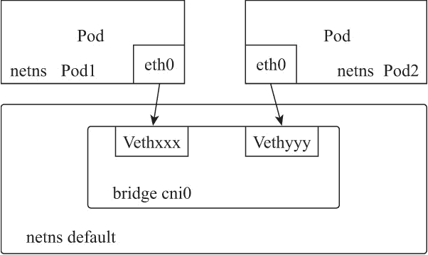
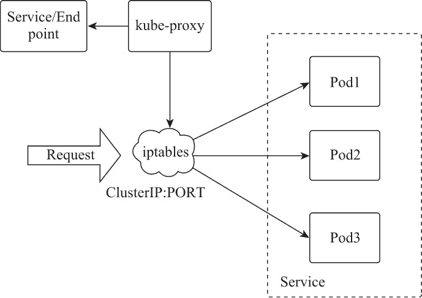
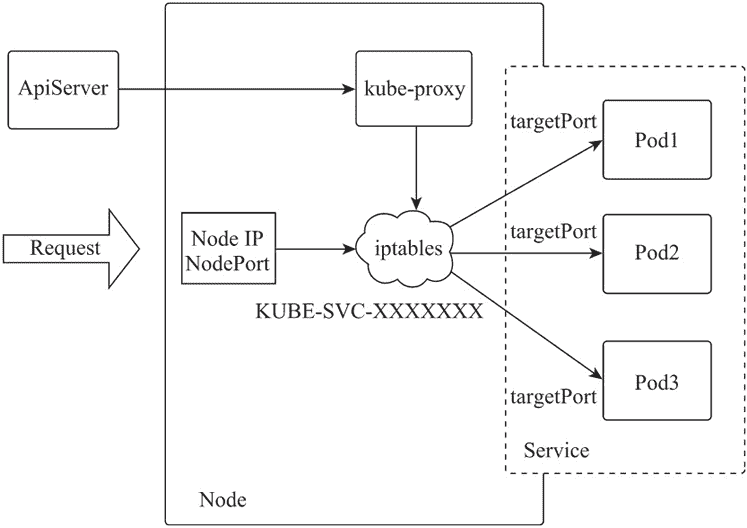

# Kubernetes（k8s）网络通信详解

> 原文：[`www.weixueyuan.net/a/857.html`](http://www.weixueyuan.net/a/857.html)

计算机间的信息和数据在网络中必须按照数据传输的顺序、数据的格式内容等方面的约定或规则进行传输，这种约定或规则称作协议。各种网络协议分布于不同的网络分层中，网络分层分为 OSI 七层模型和 TCP/IP 五层模型两种。TCP/IP 五层模型分别是应用层、传输层、网络层、链路层和物理层，其中应用层对应于 OSI 七层模型中的会话层、表示层、应用层，这也是二者的区别。

计算机网络数据是按照协议规范，采用分层的结构由发送端自上而下流动到物理层，再从物理层在网络分层中自下而上流动到接收端的应用层完成数据通信。网络分层中，高层级的应用模块仅利用低层级应用模块提供的接口和功能，低层级应用模块也仅使用高层级应用模块传来的参数响应相关操作，层次间每个应用模块都可能被提供相同功能的应用模块替代。

Kubernetes 网络通信也遵守 TCP/IP 五层模型的定义，通过不同的资源对象在相应的层级提供相应的模块功能。Kubernetes 资源对象在相应的网络层级与传统网络设备模块的对照表如下表所示。

| 网络分层 | 设备模块 | Kubernetes 资源对象 |
| 应用层 | F5、HAProxy、Nginx | Ingress |
| 传输层 | F5、LVS | Service |
| 网络层 | 路由器、三层交换机 | Flannel、Calico、Pod（容器间通信） |
| 链路层 | 网桥、二层交换机、网卡 | vnet、bridge |
| 物理层 | 中继器、集线器、网线 | -- |

## 1、Docker 网络模式

Kubernetes 是基于容器的管理系统，其使用的 Docker 容器版本的 Pod 由多个 Docker 容器组成，因此为便于理解 Pod 的网络通信方式，应首先了解 Docker 自有的网络模式。Docker 容器有如下 4 种常见的网络模式。

#### 1) 主机模式（host）

该模式下，因为容器与宿主机共享网络命名空间（network name-space，netns），所以该容器中可以共享使用宿主机的所有网卡设备。使用者可以通过访问宿主机 IP，访问容器中运行应用的所有网络端口。主机模式下网络传输效率最高，但宿主机上已经存在的网络端口无法被容器使用。

#### 2) 无网卡模式（none）

该模式下，容器中只有环回（Lookback，lo）接口，运行在容器内的应用仅能使用环回接口实现网络层的数据传输。

#### 3) 桥接模式（bridge）

该模式下，容器内会被创建 Veth（Virtual ETHernet）设备并接入宿主机的桥接网络，通过宿主机的桥接网络，容器内部应用可与宿主机及宿主机中接入同一桥接设备的其他容器应用进行通信。

#### 4) Macvlan 网络模式（macvlan）

当宿主机的网络存在多个不同的 VLAN 时，可以通过该模式为容器配置 VLAN ID，使该容器与宿主机网络中同一 VLAN ID 的设备实现网络通信。

Docker 容器间可以通过 IP 网络、容器名解析、joined 容器 3 种方式实现通信。IP 网络是在网络联通的基础上通过 IP 地址实现互访通信。容器名解析是在网络联通的基础上，由 Docker 内嵌的 DNS 进行容器名解析实现的互访通信方式，同一主机桥接模式的容器间需要启动时，可使用 --link 参数启用这一功能。

joined 容器方式可以使多个容器共享一个网络命名空间，多个容器间通过环回接口直接通信，这种方式容器间传输效率最高。

## 2、Pod 内容器间的数据通信

Pod 是由多个 Docker 容器以 joined 容器方式构成的，多个容器共享由名为 pause 的容器创建的网络命名空间，容器内的进程彼此间通过环回接口实现数据通信。环回接口不依赖链路层和物理层协议，一旦传输层检测到目的端地址是环回接口地址，数据报文离开网络层时会被返回给本机的端口应用。这种模式传输效率较高，非常适用于容器间进程的频繁通信。

## 3、同节点的 Pod 间数据通信

每个 Pod 拥有唯一的 IP 和彼此隔离的网络命名空间，在 Linux 系统中，Pod 间跨网络命名空间的数据通信是通过 Veth 设备实现的。Veth 设备工作在链路层，总是成对出现，也被称为 Veth-pair 设备。在网络插件是 Flannel 的虚拟网络结构中，Flannel 在被 Kubernetes 触发、接收到相关 Pod 参数时，会为 Pod 创建 Veth 设备并分配 IP，Veth 设备一端是 Pod 的 eth0 接口，一端是 Node 节点中网络空间名为 default 的 Veth 虚拟接口。

Flannel 在初始安装时，创建了网桥设备 cni0，网络空间 default 中创建的 Veth 虚拟接口都被加入网桥设备 cni0 中，相当于所有的 Pod 都被接入这个虚拟交换机中，在同一虚拟交换机中的 Pod 实现了链路层的互联并进行网络通信。工作原理如下图所示。


图：同节点的 Pod 间数据通信
可用如下命令查看当前节点服务器的网络命名空间和网桥信息。

```

# 查看系统中的网络命名空间
ls /var/run/docker/netns

# 查看每个命名空间的网络接口信息
nsenter --net=/var/run/docker/netns/default ifconfig -a

# 查看网桥信息
brctl show
```

## 4、跨主机的 Pod 间数据通信

由 CoreOS 使用 Go 语言开发的 Flannel 实现了一种基于 Vxlan（Virtual eXtensible Local Area Network）封装的覆盖网络（Overlay Network），将 TCP 数据封装在另一种网络包中进行路由转发和通信。

Vxlan 协议是一种隧道协议，基于 UDP 协议传输数据。Flannel 的 Vxlan 虚拟网络比较简单，在每个 Kubernetes 的 Node 上只有 1 个 VTEP（Vxlan Tunnel Endpoint）设备（默认为 flannel.1）。Kubernetes 集群中整个 Flannel 网络默认配置网段为 10.244.0.0/16，每个节点都分配了唯一的 24 位子网，Flannel 在 Kubernetes 集群中类似于传统网络中的一个三层交换设备，每个 Node 节点的桥接设备通过 VTEP 设备接口互联，使运行在不同 Node 节点中不同子网 IP 的容器实现跨 Node 互通。

可用如下命令查看当前节点服务器的 arp 信息。

```

# 本地桥 arp 表
bridge fdb

bridge fdb show dev flannel.1
```

## 5、Pod 应用在 Kubernetes 集群内发布服务

Kubernetes 通过副本集控制器能够动态地在集群中任意创建和销毁 Node，因为每个 Node 被分配的子网范围不同，所以 Pod IP 也会随之变化。Flannel 构建的虚拟网络使得集群中的每个 Pod 在网络上已经实现互联互通，由于 Pod IP 变化的不确定性，运行在 Pod 中的应用服务无法被其他应用固定访问。

为使动态变化 IP 的 Pod 应用可以被其他应用访问，Kubernetes 通过标签筛选的形式将具有相同指定标签的一组 Pod 定义为 Service，每个 Service 的 Pod 成员信息通过端点控制器在 etcd 中保存及更新。Service 为 Pod 应用提供了固定的虚拟 IP 和端口实现固定访问，使得集群内其他 Pod 应用可以访问这个服务。

Service 是四层（TCP/UDP over IP）概念，其构建了一个有固定 ClusterIP（集群虚拟 IP，Virtual IP）和 Port 的虚拟集群，每个节点上运行的 kube-proxy 进程通过主节点的接口服务监听资源对象 Service 和 Endpoint 内 Pod 列表的变化。

kube-proxy 默认使用 iptables 代理模式，其通过对每个 Service 配置对应的 iptables 规则，在集群中的 Node 主机上捕获到达该 Service 的 ClusterIP 和 Port 的请求，当捕获到请求时，会将访问请求按比例随机分配给 Service 中的一个 Pod，如果被选择的 Pod 没有响应（取决于 readiness probes 的配置），则自动重试另一个 Pod。Service 访问逻辑如下图所示。


图：Service 访问逻辑
具体说明如下。

*   kube-proxy 根据集群中 Service 和 Endpoint 资源对象的状态初始化所在节点的 iptables 规则；
*   kube-proxy 通过接口服务监听集群中 Service 和 Endpoint 资源对象的变化并更新本地的 iptables 规则；
*   iptables 规则监听所有请求，将对应 ClusterIP 和 Port 的请求使用随机负载均衡算法负载到后端 Pod。

kube-proxy 在集群中的每个节点都会配置集群中所有 Service 的 iptables 规则，iptables 规则设置如下。

*   kube-proxy 首先是建立 filter 表的 INPUT 规则链和 nat 表的 PREROUTING 规则链，将访问节点的流量全部跳转到 KUBE-SERVICES 规则链进行处理；
*   kube-proxy 遍历集群中的 Service 资源实例，为每个 Service 资源实例创建两条 KUBE-SERVICES 规则；
*   KUBE-SERVICES 中一条规则是将访问 Service 的非集群 Pod IP 交由 KUBE-MARK-MASQ 规则标记为 0x4000/0x4000，在执行到 POSTROUTING 规则链时由 KUBE-POSTROUTING 规则链对数据流量实现 SNAT；
*   KUBE-SERVICES 中另一条规则将访问目标是 Service 的请求跳转到对应的 KUBE-SVC 规则链；
*   KUBE-SVC 规则链由目标 Service 端点列表中每个 Pod 的处理规则组成，这些规则包括随机负载均衡策略及会话保持（Session Affinity）的实现；
*   KUBE-SVC 每条规则链命名是将服务名 + 协议名按照 SHA256 算法生成哈希值后通过 base32 对该哈希值再编码，取编码的前 16 位与 KUBE-SVC 作为前缀组成的字符串；
*   KUBE-SEP 每个 Pod 有两条 KUBE-SEP 规则，一条是将请求数据 DNAT 到 Pod IP，另一条用来将 Pod 返回数据交由 KUBE-POSTROUTING 规则链实现 SNAT；
*   KUBE-SEP 每条规则链命名是将服务名 + 协议名 + 端口按照 SHA256 算法生成哈希值后通过 base32 对该哈希值再编码，取编码的前 16 位与 KUBE-SEP 为前缀组成的字符串。

Service 的负载均衡是由 iptables 的 statistic 模块实现的。statistic 模块的 random 模式可以将被设定目标的请求数在参数 probability 设定的概率范围内分配，参数设定值在 0.0～1.0 之间，当参数设定值为 0.5 时，表示该目标有 50% 的概率分配到请求。

kube-proxy 遍历 Service 中的 Pod 列表时，按照公式 1.0/float64(n-i) 为每个 Pod 计算概率值，n 是 Pod 的总数量，i 是当前计数。当有 3 个 Pod 时，计算值分别为 33%、50%、100%，3 个 Pod 的总流量负载分配分别为 33%、35%、32%。

Service 也支持会话保持功能，是应用 iptables 的 recent 模块实现的。recent 允许动态创建源地址列表，并对源地址列表中匹配的来源 IP 执行相应的 iptables 动作。recent 模块参数如下表所示。

| 参数 | 参数说明 |
| set  | 把匹配动作的源 IP 添加到地址列表 |
| name | 源地址列表名称 |
| mask | 源地址列表中 IP 的掩码 |
| rsource | 设置源地址列表中保存数据包的源 IP 地址 |
| rcheck | 检查当前数据包源 IP 是否在源地址列表中 |
| seconds | 与 rcheck 配合使用，设置对指定时间内更新的 IP 地址与数据包源 IP 进行匹配检查，单位为秒 |
| rеaр | 与 seconds 配合使用，将清除源地址列表中指定时间内未被更新的 IP 地址 |

配置 Service 会话保持，只需在 Service 中进行如下配置即可。

```

spec:
    sessionAffinity: ClientIP
    sessionAffinityConfig:
        clientIP:
            timeoutSeconds: 10800
```

kube-proxy 实现 Service 的方法有 4 种，分别是 userspace、iptables、IPVS 和 winuser-space。iptables 只是默认配置，因 kube-proxy 的其他实现方式非本教程重点，此处不深入探讨。

## 6、Pod 应用在 Kubernetes 集群外发布服务

Service 实现了 Pod 访问的固定 IP 和端口，但 ClusterIP 并不是绑定在网络设备上的，它只是 kube-proxy 进程设定的 iptables 本地监听转发规则，只能在 Kubernetes 集群内的节点上进行访问。Kubernetes 系统默认提供两种方式实现 Pod 应用向集群外发布服务，一种是基于资源对象 Pod 的 hostPort 和 hostNetwork 方式，另一种是基于资源对象 Service 的 NodePort、Load-Balancer 和 ExternalIPs 方式。

#### 1) hostPort 方式

hostPort 方式相当于创建 Docker 容器时使用 -p 参数提供容器的端口映射，只能通过运行容器的 Node 主机 IP 进行访问，属于资源对象 Pod 的运行方式，不支持多个 Pod 的 Service 负载均衡等功能。资源配置如下：

```

apiVersion: v1
kind: Pod
metadata:
    name: apps
    labels:
        app: web
spec:
    containers:
    - name: apps
      image: apache
      ports:
        - containerPort: 80
          hostPort: 8080
```

#### 2) hostNetwork 方式

hostNetwork 方式相当于创建 Docker 容器时以主机模式为网络模式的 Pod 运行方式，该方式运行的容器与所在 Node 主机共享网络命名空间，属于资源对象 Pod 的运行方式，不支持多个 Pod 的 Service 负载均衡等功能。资源配置如下：

```

apiVersion: v1
kind: Pod
metadata:
    name: nginx-web
    namespace: default
    labels:
        run: nginx-web
spec:
    hostNetwork: true
    containers:
    - name: nginx-web
      image: nginx
        ports:
        - containerPort: 80
```

#### 3) NodePort 方式

NodePort 方式是在集群中每个节点监听固定端口（NodePort）的访问，外部用户对任意 Node 主机 IP 和 NodePort 的访问，都会被 Service 负载到后端的 Pod，全局 NodePort 的默认可用范围为 30000～32767。NodePort 方式访问逻辑如下图所示。


图：NodePort 方式访问逻辑
具体说明如下。

*   kube-proxy 初始化时，会对 NodePort 方式的 Service 在 iptables nat 表中创建规则链 KUBE-NODEPORTS，用于监听本机 NodePort 的请求；
*   外部请求访问节点 IP 和端口（NodePort）后，被 iptables 规则 KUBE-NODEPORTS 匹配后跳转给对应的 KUBE-SVC 规则链执行负载均衡等操作；
*   选定 Pod 后，请求被转发到选定的 Pod IP 和目标端口（targetPod）。

NodePort 方式的资源配置如下：

```

apiVersion: v1
kind: Service
metadata:
    name: nginx-web
    namespace: default
    labels:
        run: nginx-web
spec:
    type: NodePort
    ports:
    - nodePort: 31804
      port: 8080
        protocol: TCP
        targetPort: 8080
```

#### 4) LoadBalancer 方式

LoadBalancer 方式是一种 Kubernetes 自动对外发布的解决方案，该方案是将外部负载均衡器作为上层负载，在创建 Service 时自动与外部负载均衡器互动，完成对 Kubernetes Service 负载均衡创建的操作，将 Service 按照外部负载均衡器的负载策略对外提供服务。该方案依赖外部负载均衡器的支持，阿里云、腾讯云等的容器云都提供了对这个方案的支持。资源配置如下：

```

apiVersion: v1
kind: Service
metadata:
    name: nginx-web
    namespace: default
    labels:
        run: nginx-web
spec:
    type: LoadBalancer
    ports:
    - port: 8080
      protocol: TCP
      targetPort: 8080
```

具体说明如下。

*   不同的外部负载均衡器需要有对应的负载均衡控制器（Loadbalancer Controller）；
*   负载均衡控制器通过接口服务实时监听资源对象 Service 的变化；
*   LoadBalancer 类型的 Service 被创建时，Kubernetes 会为该 Service 自动分配 Node-Port；
*   当监听到 LoadBalancer 类型的 Service 创建时，负载均衡控制器将触发外部负载均衡器（LoadBalancer）创建外部 VIP、分配外部 IP 或将现有节点 IP 绑定 NodePort 端口添加到外部负载均衡器的负载均衡池，完成负载均衡的配置；
*   当外部用户访问负载均衡器的外部 VIP 时，外部负载均衡器会将流量负载到 Kubernetes 节点或 Kubernetes 集群中的 Pod（视外部负载均衡器的功能而定）；
*   不能与 NodePort 方式同时使用。

#### 5) ExternalIPs 方式

ExternalIPs 方式提供了一种指定外部 IP 绑定 Service 端口的方法，该方法可以指定节点内某几个节点 IP 地址或绑定外部路由到节点网络的非节点 IP 对外提供访问。Kubernetes 通过 ExternalIPs 参数将被指定的 IP 与 Service 端口通过 iptables 监听，其使用与 Service 一致的端口，相较于 NodePort 方式配置更加简单灵活。

由于是直接将 Service 端口绑定被路由的 IP 对外暴露服务，用户需要将整个集群对外服务的端口做好相应的规划，避免端口冲突。资源配置如下：

```

spec:
    externalIPs:
    - 192.168.1.101
    - 192.168.1.102
    ports:
    - name: http
      port: 80
      targetPort: 80
      protocol: TCP
    - name: https
      port: 443
      targetPort: 443
      protocol: TCP
```

具体说明如下。

*   ExternalIPs 设置的 IP 可以是集群中现有的节点 IP，也可以是上层网络设备路由过来的 IP。kube-proxy 初始化时，会对 ExternalIPs 方式的 Service 在 iptables nat 表中创建规则链 KUBE-SERVICES，用于访问 ExternalIPs 列表中 IP 及 Service port 请求的监听；
*   外部或本地访问 ExternalIPs 列表中 IP 及 port 的请求被匹配后，跳转给对应的 KUBE-SVC 规则链执行负载均衡等操作。

## 7、Service 中 Pod 的调度策略

Kubernetes 系统中，Pod 默认是按照资源策略随机部署的，虽然用户可对调度策略进行一定的调整，但 Pod 的调度策略同样对 Pod 通信存在一定的影响，相关调度策略有如下两种。

#### 1) 部署调度策略（Affinity）

Kubernetes 集群中的 Pod 被随机调度并创建在集群中的 Node 上。在实际使用中，有时需要考虑 Node 资源的有效利用及不同应用间的访问效率等因素，也需要对这种调度设置相关期望的策略。主要体现在 Node 与 Pod 间的关系、同 Service 下 Pod 间的关系、不同 Service 下 Pod 间的关系这 3 个方面。

Node 与 Pod 间的关系可以使用 nodeAffinity 在资源配置文件中设置，在设置 Pod 资源对象时，可以将 Pod 部署到具有指定标签的集群 Node 上。Pod 间的关系可通过 podAntiAffinity 的配置尽量把同一 Service 下的 Pod 分配到不同的 Node 上，提高自身的高可用性，也可以把互相影响的不同 Service 的 Pod 分散到不同的集群 Node 上。

对于 Pod 间访问比较频繁的应用，可以使用 podAffinity 配置，尽量把被配置的 Pod 部署到同一 Node 服务器上。

#### 2) 流量调度策略（externalTrafficPolicy）

Service 的流量调度策略有两种，分别是 Cluster 和 Local。Cluster 是默认调度策略，依据 iptables 的随机负载算法，将用户请求负载均衡分配给 Pod，但该方式会隐藏客户端的源 IP。

Local 策略则会将请求只分配给请求 IP 主机中该 Service 的 Pod，而不会转发给 Service 中部署在其他 Node 中的 Pod，这样就保留了最初的源 IP 地址。但该方式不会对 Service 的 Pod 进行负载均衡，同时被访问 IP 的 Node 主机上如果没有该 Service 的 Pod，则会报错。Local 策略仅适用于 NodePort 和 LoadBalancer 类型的 Service。

Kubernetes 中通过 Service 实现 Pod 应用访问，在流量调度策略的 Cluster 调度策略下，对一个 Service 的访问请求会被随机分配到 Service 中的任意 Pod，即便该 Service 与发出请求的 Pod 在同一 Node 有可提供服务的 Pod，也不一定会被选中。

在 Kubernetes 计划的 1.16 版本中增加了服务拓扑感知的流量管理功能，设计了新的 Pod 定位器（PodLocator），实现了服务的拓扑感知服务路由机制，使得 Pod 总能优先使用本地访问的策略找到最近的服务后端，这种拓扑感知服务使本地访问具有更广泛的意义，包括节点主机、机架、网络、机房等，这样可以有效地减少网络延迟，提高访问效率及安全性，更加节约成本。