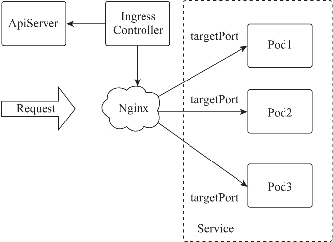

# Nginx Ingress 简介

> 原文：[`www.weixueyuan.net/a/862.html`](http://www.weixueyuan.net/a/862.html)

Kubernetes 通过 kube-proxy 服务实现了 Service 的对外发布及负载均衡，它的各种方式都是基于传输层实现的。在实际的互联网应用场景中，不仅要实现单纯的转发，还有更加细致的策略需求，如果使用真正的负载均衡器更会增加操作的灵活性和转发性能。

基于以上需求，Kubernetes 引入了资源对象 Ingress，Ingress 为 Service 提供了可直接被集群外部访问的虚拟主机、负载均衡、SSL 代理、HTTP 路由等应用层转发功能。

Kubernetes 官方发布了基于 GCE 和 Nginx 的 Ingress 控制器，Nginx Ingress 控制器能根据 Service 中 Pod 的变化动态地调整配置，结合 Nginx 的高稳定性、高性能、高并发处理能力等特点，使 Kubernetes 对集群中运行于容器的应用程序具有了更加灵活的应用层管理能力。

Nginx Ingress 因使用 Nginx 的不同版本，分为 Nginx 官方版本和 Kubernetes 社区版。Nginx 官方版本提供其基于 Go 语言开发的 Ingress 控制器，并与 Nginx 集成分为 Nginx 开源版和 Nginx Plus 版；开源版仅基于 Nginx 的原始功能，提供了 Nginx 原生配置指令的支持，相较于 Nginx Plus 版功能简单且不支持 Pod 变化的动态变更。

Nginx Plus 版则提供了诸多完善的商业功能，其支持 Nginx 原生配置指令、JWT 验证、Pod 变化的动态配置及主动健康检查等功能。Kubernetes 社区版是基于 Nginx 的扩展版 OpenResty 及诸多第三方模块构建的，其基于 OpenResty 的 Lua 嵌入式编程能力，扩展了 Nginx 的功能，并基于 balancer_by_lua 模块实现了 Pod 变化的动态变更功能。本节介绍的是基于 Kubernetes 社区版的 Nginx Ingress。

## 1、Nginx Ingress 原理

Nginx Ingress 由资源对象 Ingress、Ingress 控制器、Nginx 三部分组成，Ingress 控制器用以将 Ingress 资源实例组装成 Nginx 配置文件（nginx.conf），并重新加载 Nginx 使变更的配置生效。当它监听到 Service 中 Pod 变化时通过动态变更的方式实现 Nginx 上游服务器组配置的变更，无须重新加载 Nginx 进程。工作原理如下图所示。

*   Ingress，一组基于域名或 URL 把请求转发到指定 Service 实例的访问规则，是 Kubernetes 的一种资源对象，Ingress 实例被存储在对象存储服务 etcd 中，通过接口服务被实现增、删、改、查的操作。
*   Ingress 控制器（Ingress controller），用以实时监控资源对象 Ingress、Service、End-point、Secret（主要是 TLS 证书和 Key）、Node、ConfigMap 的变化，自动对 Nginx 进行相应的操作。
*   Nginx，实现具体的应用层负载均衡及访问控制。

图：Nginx Ingress 工作原理
Ingress 控制器通过同步循环机制实时监控接口服务 Ingress 等资源对象的变化，当相关 Service 对应的端点列表有变化时，会通过 HTTP POST 请求将变化信息发送到 Nginx 内部运行的 Lua 程序进行处理，实现对 Nginx Upstream 中后端 Pod IP 变化的动态修改。

每个后端 Pod 的 IP 及 targetPort 信息都存储在 Nginx 的共享内存区域，Nginx 对每个获取的请求将使用配置的负载均衡算法进行转发，Nginx 的配置中应用 Lua 模块的 balancer_by_lua 功能实现 upstream 指令域的动态操作，Pod IP 变化及资源对象 Ingress 对 upstream 指令域相关注解（annotation）的变化无须执行 Nginx 的 reload 操作。

当 Ingress 控制器监控的其他资源对象变化时，会对当前变化的内容创建 Nginx 配置模型，如果新的配置模型与当前运行的 Nginx 配置模型不一致，则将新的配置模型按照模板生成新的 Nginx 配置，并对 Nginx 执行 reload 操作。

Nginx 配置模型避免了 Nginx 的无效 reload 操作。为避免因 Nginx 配置语法错误导致意外中断，Ingress 控制器为 Nginx 的配置内容提供了冲突检测及合并机制，Ingress 控制器使用了准入控制插件（Validating Admission Webhook）做验证 Ingress 配置语法的准入控制，验证通过的 Ingress 资源对象才会被保存在存储服务 etcd 中，并被 Ingress 控制器生成确保没有语法错误的 Nginx 配置文件。

## 2、集成的第三方模块

Kubernetes 的 Nginx Ingress 当前版本是 0.25.1，其集成了 Nginx 的扩展版本 Open-Resty 的 1.15.8.1 版本，OpenResty 的最大特点是集成了 Lua 脚本的嵌入式编程功能，基于 Nginx 的优化，使 Nginx 具有更强的扩展能力。

Nginx Ingress 通过 Lua 脚本编程，利用 OpenResty 的 balancer_by_lua 模块，可通过 nginx-ingress 控制器动态地修改 Nginx 上游服务器组的配置，无须 Nginx 进程的热加载，有效地解决了因 Pod 调度带来的 Pod IP 变化的问题。

Kubernetes 的 Nginx Ingress 在 OpenResty 基础上还集成了诸多的第三方模块，模块功能介绍如下。

#### 1) Ajp 协议模块（nginx_ajp_module）

Ajp 协议模块是一个使 Nginx 实现 Ajp 协议代理的模块，该模块可以使 Nginx 通过 Ajp 协议连接到被代理的 Tomcat 服务。

模块网址：https://github.com/nginx-modules/nginx_ajp_module

#### 2) InfluxDB 输出模块（nginx-influxdb-module）

InfluxDB 输出模块可以使 Nginx 的每次请求记录以 InfluxDB 作为后端进行存储，其以非阻塞的方式对每个请求进行过滤，并使用 UDP 协议将处理后的数据发送到 InfluxDB 服务器。可以通过该模块实时监控 Nginx 的所有请求，获得每个请求的连接类型、请求状态，并通过 InfluxDB 实现相关故障状态的报警。

模块网址：https://github.com/influxdata/nginx-influxdb-module

#### 3) GeoIP2 数据库模块（ngx_http_geoip2）

MaxMind 的 GeoIP 数据库已经升级到第二代，GeoIP2 数据库提供了准确的 IP 信息，包括 IP 地址的位置（国家、城市、经纬度）等数据。该模块增加了 GeoIP2 数据的支持。

模块网址：https://github.com/nginx-modules/ngx_http_geoip2_module

#### 4) 摘要认证模块（nginx-http-auth-digest）

摘要认证模块使 Nginx 的基本认证功能增加了摘要认证（Digest Authentication）的支持，这是一种简单的身份验证机制，是对基本认证的一种安全改进，仅通过服务端及客户端根据用户名和密码计算的摘要信息进行验证，避免了密码的明文传递，增加了认证过程的安全性。

模块网址：https://github.com/nginx-modules/nginx-http-auth-digest

#### 5) 内容过滤模块（ngx_http_substitutions_filter_module）

内容过滤模块是一个内容过滤功能的模块，其相对于 Nginx 自带的内容过滤模块（ngx_http_sub_module）增加了正则匹配的替换方式。

模块网址：https://github.com/nginx-modules/ngx_http_substitutions_filter_module

#### 6) 分布式跟踪模块（nginx-opentracing）

OpenTracing 由 API 规范、实现该规范的框架和库以及项目文档组成，是一个轻量级的标准化规范，其位于应用程序和跟踪分析程序之间，解决了不同分布式追踪系统 API 不兼容的问题。OpenTracing 允许开发人员使用 API 向应用程序代码中添加工具，实现业务应用中的分布式请求跟踪。

分布式请求跟踪，也称分布式跟踪，是一种用于分析和监视应用程序的方法，特别是那些使用微服务体系结构构建的应用程序。分布式跟踪有助于查明故障发生的位置以及导致性能低下的原因。该模块是将 Nginx 的请求提供给 OpenTracing 项目的分布式跟踪系统用于应用的请求分析和监控。

Nginx Ingress 中集成了 jaeger 和 zipkin 两种分布式跟踪系统的 OpenTracing 项目插件，用户可根据实际情况进行选择使用。

模块网址：https://github.com/opentracing-contrib/nginx-opentracing

#### 7) Brotli 压缩模块（ngx_brotli）

Brotli 是 Google 推出的侧重于 HTTP 压缩的一种开源压缩算法，它使用 lz77 算法的现代变体、Huffman 编码和基于上下文的二阶建模的组合来压缩数据。在与 Deflate 相似的压缩与解压缩速度下，增加了 20% 的压缩密度。在与 gzip 的测试下，因压缩密度高其消耗的压缩时间要比 gzip 多，但在客户端解压的时间则相当。

模块网址：https://github.com/google/ngx_brotli

#### 8) ModSecurity 连接器模块（ModSecurity-nginx）

ModSecurity 是一个开源的 Web 应用防火墙，其主要作用是增强 Web 应用的安全性并保护 Web 应用免受攻击。模块 ModSecurity-nginx 是一个 Nginx 的 ModSecurity 连接器，其提供了 Nginx 和 libmodsecurity（ModSecurity v3）之间的通信通道。Nignx Ingress 中已经集成了 ModSecurity 和 OWASP 规则集，在 Nginx 配置文件目录可以查看相关配置。

模块网址：https://github.com/nginx-modules/ModSecurity-nginx

#### 9) lua-resty-waf 模块

lua-resty-waf 是一个基于 OpenResty 的高性能 Web 应用防火墙，它使用 Nginx Lua API 及灵活的规则架构分析和处理 HTTP 请求信息，并不断开发和测试一些自定义的规则补丁来应对不断出现的新的安全威胁。lua-resty-waf 提供了 ModSecurity 兼容的规则语法，支持 ModSecurity 现有规则的自动转换，用户无须学习新的语法规则就可以扩展 lua-resty-waf 的规则。

模块网址：https://github.com/p0pr0ck5/lua-resty-waf。