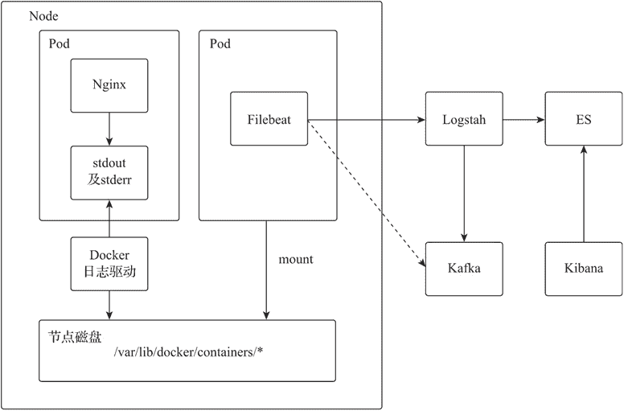

# Nginx Ingress 安装部署

> 原文：[`www.weixueyuan.net/a/867.html`](http://www.weixueyuan.net/a/867.html)

Helm 是一个非常方便的 Kubernetes 应用部署工具，支持 Nginx Ingress 的快速部署和卸载。通过 Helm 可快速将 Nginx Ingress 部署在 Kubernetes 集群中，Helm 中 Nginx Ingress 的 1.19.1 版本 Chart 部分参数如下表所示。

| 参数 | 参数值选项 | 默认值 | 功能说明 |
| controller.service.type | ClusterIP 或 NodePort 或 LoadBalancer | LoadBalancer | 设置资源对象 Service 的服务类型 |
| controller.hostNetwork | true 或 false | false | 设置资源对象 Pod 是否以 hostNet-work 方式运行 |
| controller.service.externalIPs | -- | -- | 设置资源对象 Service externalIPs 的 IP 地址 |
| controller.kind | Deployment 或 Daemon-Set | Deployment | 设置部署方式 |
| controller.service.external-TrafficPolicy | Local 或 Cluster | Cluster | 设置 Pod 流量调度方式 |
| rbac.create | true 或 false | false | 是否为 nginx-ingress 创建 RBAC 资源 |
| controller.autoscaling.enabled | true 或 false | false | 是否启用多副本支持，启用后最小副本数为 1，最大值为 11 |
| controller.autoscaling.min-Replicas | -- | 1 | 设置创建的最小副本数 |
| controller.metrics.enabled | true 或 false | false | 是否启用 Prometheus Exporter |
| controller.containerPort.http | -- | 80 | Nginx Ingress 的默认 HTTP 端口 |
| controller.containerPort.https | -- | 443 | Nginx Ingress 的默认 HTTP 端口 |

Nginx Ingress 的默认部署方式是 Deployment，只会部署一个副本，Service 对外发布类型是 LoadBalancer，安装参数如下：

helm install --name nginx-ingress stable/nginx-ingress --set rbac.create=true

具体说明如下：

*   Helm 安装的应用名称为 nginx-ingress；
*   rbac.create 参数用以为 nginx-ingress 创建 RBAC 资源，获取与接口服务的访问授权。

## 1、Nginx Ingress 部署

Nginx Ingress 以 Pod 形式运行在 Kubernetes 集群中，用户可根据 Kubernetes 的网络通信特点以及实际场景选择灵活的部署方式进行 Nginx Ingress 的部署，此处分别以基于资源对象 Service 的 NodePort 方式和 Pod 的 hostNetwork 方式举例介绍。

#### 1) Service 的 NodePort 方式

以 NodePort 类型部署 Nginx Ingress，需要使用参数进行指定 controller.service.type 为 NodePort。为便于管理，可以为 Nginx Ingress 创建单独使用的命名空间 nginx-ingress，部署拓扑如下图所示。


图：NodePort 方式
部署命令如下：

```

# 安装 nginx-ingress
helm install --name nginx-ingress \
             --namespace nginx-ingress \
             stable/nginx-ingress \
             --set "rbac.create=true,controller.autoscaling.enabled=true,controller. autoscaling.minReplicas=2,controller.service.type=NodePort,con-troller.service.externalTrafficPolicy=Local"

# 也可以在创建后调整副本数
kubectl scale --replicas=3 deployment/nginx-ingress
```

具体说明如下：

*   Helm 安装的应用名称为 nginx-ingress，命名空间为 nginx-ingress；
*   以默认的 Deployment 方式部署，设置 Pod 副本数为 2，并以 Service 的 NodePort 方式对外发布服务，设置流量调度策略为 Local；
*   Kubernetes 将为 nginx-ingress Service 随机创建范围在 30000～32767 之间的 Node-Port 端口；
*   用户将 Kubernetes 中节点 IP 和 NodePort 手动添加到传输层负载均衡中的虚拟服务器集群中；
*   外部请求发送到传输层负载均衡虚拟服务器，传输层负载将请求数据转发到 Kubernetes 集群节点的 NodePort；
*   NodePort 类型的 Service 将请求负载到对应的 Nginx Pod；
*   Nginx 将用户请求进行应用层负载转发到配置的应用 Pod；
*   在该部署方式下，Nginx Pod 需要使用 Local 的流量调度策略，获取客户端的真实 IP。

#### 2) Pod 的 hostNetwork 方式

主机网络（hostNetwork）方式可以使 Pod 与宿主机共享网络命名空间，外网传输效率最高。因 Pod 直接暴露外网，虽然存在一定的安全问题，但不存在客户端源 IP 隐藏的问题，部署拓扑如下图所示。


图：hostNetwork 方式
部署命令如下：

```

# 以 Deployment 方式部署
helm install --name nginx-ingress \
             --namespace nginx-ingress \
             stable/nginx-ingress \
             --set "rbac.create=true,controller.service.type=ClusterIP,controller. hostNetwork=true"
```

具体说明如下：

*   Deployment 方式部署时，Nginx Ingress 的 Service 设置类型为 ClusterIP，仅提供内部服务端口；
*   用户将 Kubernetes 中节点 IP 及 80、443 端口手动添加到传输层负载均衡中的虚拟服务器集群中；
*   用户请求经传输层负载均衡设备转发到 Nginx，Nginx 将用户请求负载到 Kubernetes 集群内的 Pod 应用。

也可以使用 DaemonSet 部署方式，在集群中的每个节点自动创建并运行一个 Nginx Ingress Pod，实现 Nginx Ingress 的自动扩展。

```

# 以 DaemonSet 方式部署 nginx-ingress 并成为集群唯一入口
helm install --name nginx-ingress \
             --namespace nginx-ingress \
             stable/nginx-ingress \
             --set "rbac.create=true,controller.kind=DaemonSet,controller.service.type=ClusterIP,controller.hostNetwork=true"
```

#### 3) SSL 终止（SSL Termination）和 SSL 透传（SSL Passthrough）

SSL 终止模式下，客户端的 TLS 数据会在代理服务器 Nginx 中解密，解密的数据由代理服务器直接或再次 TLS 加密后传递给被代理服务器，这种模式下，相对增加代理服务器的计算负担，但方便了 SSL 证书的统一管理。

SSL 透传模式下，Nginx 不会对客户端的 HTTPS 请求进行解密，加密的请求会被直接转发到后端的被代理服务器，这种方式常被应用到后端的 HTTPS 服务器需要对客户端进行客户端证书验证的场景，相对也会降低 Nginx 对 TLS 证书加解密的负担。由于请求数据是保持加密传输的，HTTP 消息头将无法修改，所以消息头字段 X-forwarded-* 的客户端 IP 无法被添加。Nginx Ingress 默认部署方式没有开启 SSL 透传的支持，需要在部署时使用参数 --enable-ssl-passthrough 进行开启。

```

# 修改部署资源对象 nginx-ingress-controller
kubectl edit Deployment/nginx-ingress-controller -n nginx-ingress

# 在规范部分添加容器启动参数--enable-ssl-passthrough
    spec:
        containers:
        - args:
          - /nginx-ingress-controller
          - --default-backend-service=nginx-ingress/nginx-ingress-default-backend
          - --election-id=ingress-controller-leader
          - --ingress-class=nginx
          - --configmap=nginx-ingress/nginx-ingress-controller
          - --enable-ssl-passthrough
```

#### 4) 卸载 Nginx Ingress

Nginx 的配置是以资源对象 ConfigMap 和 Ingress 方式存储在 etcd 服务中的，所以即便删除或重新部署 Nginx Ingress 也不会影响之前的配置。

helm delete --purge nginx-ingress

## 2、管理工具

Nginx Ingress 提供了基于 kubectl 工具的管理插件 ingress-nginx，用于 Nginx Ingress 的日常维护。插件 ingress-nginx 安装方法如下：

```

# 安装插件 ingress-nginx
kubectl krew install ingress-nginx

常见命令参数如下：

# 显示所有的 Ingress 实例摘要
kubectl ingress-nginx ingresses

# 查看所有的后端 Service 配置
kubectl ingress-nginx backends -n nginx-ingress

# 查看 Nginx 的所有配置
kubectl ingress-nginx conf -n nginx-ingress

# 查看指定主机名的 Nginx 配置
kubectl ingress-nginx conf -n nginx-ingress --host auth.nginxbar.org

# 查看 Nginx 服务器的配置目录
kubectl ingress-nginx exec -i -n nginx-ingress -- ls /etc/nginx

# 查看 Nginx 服务器的日志
kubectl ingress-nginx logs -n nginx-ingress
```

## 3、日志管理

Nginx Ingress 是以 Pod 方式运行的，在默认配置下，Nginx 的日志输出到 stdout 及 stderr。Kubernetes 下有很多日志收集解决方案，此处推荐使用 Filebeat 进行容器日志收集，并将容器日志实时发送到 ELK 集群，ELK 环境部署可参见《Nginx 日志分析工具（ELK）配置》一节，日志收集方案逻辑如下图所示。


图：日志收集方案逻辑
具体说明如下：

*   Docker 的默认日志驱动是 json-driver，每个容器的日志输出到 stdout 及 stderr 中时，Docker 的日志驱动会将容器日志以 *-json.log 的命名方式保存在 /var/lib/docker/containers/ 目录下；
*   在 Kubernetes 集群中以 DaemonSet 方式部署 Filebeat 应用，会在每个 Node 节点运行一个 Filebeat 应用 Pod，进行每个 Node 节点的容器日志采集；
*   Filebeat 采集的日志可以直接发送给 Logstash 服务器，也可以发送给 Kafka 后由 Logstash 服务器进行异步获取；
*   所有日志被 Logstash 转到 Elasticsearch 集群进行存储；
*   使用者通过 Kibana 进行日志查看和分析。

#### 1) 部署 Filebeat

```

# 获取官方的 Filebeat 资源配置文件
curl -L -O https://raw.githubusercontent.com/elastic/beats/7.3/deploy/kubernetes/filebeat-kubernetes.yaml

# 修改 filebeat 输出目标为 Logstash
sed -i "s/   cloud.id/          #cloud.id/g" filebeat-kubernetes.yaml
sed -i "s/   cloud.auth/        #cloud.auth/g" filebeat-kubernetes.yaml

sed -i "s/    output.elasticsearch:/    output.logstash:/g" filebeat-kubernetes.yaml
sed -i 's/    hosts:.*/     hosts: ["10\.10\.4\.37:5045"]/g' filebeat-kubernetes.yaml
sed -i "s/    username/ #username/g" filebeat-kubernetes.yaml
sed -i "s/    password/ #password/g" filebeat-kubernetes.yaml

kubectl create -f filebeat-kubernetes.yaml
```

#### 2) 配置 Logstash

按照 kubernetes.labels.app 创建容器日志在 Elasticsearch 中的索引，配置文件内容如下：

```

cat>logstash/pipeline/k8s.conf<<EOF
input {
    beats {
        port => 5045
        codec =>"json"
    }
}
filter {
    mutate {
        # 添加字段 kubernetes_apps 默认值为 kubernetes_noapps
        add_field => { "kubernetes_apps" => "kubernetes_noapps" }
    }
    if [kubernetes][labels][app] {
        mutate {
            # 当存在 kubernetes.labels.app 时，将该字段复制为字段 kubernetes_apps
            copy => {
            "[kubernetes][labels][app]" => "kubernetes_apps"
            }
        }
    }
}
output {
    elasticsearch {
        # 将 log 输出到 ES 服务器
        hosts => ["http://10.10.4.37:9200"]
        # 根据字段 kubernetes_apps 的值创建 ES 索引
        index => "k8slog-%{kubernetes_apps}-%{[@metadata][version]}-%{+YYYY.MM.dd}"
    }
}
EOF
```

Helm 默认会为安装的应用添加 app 标签，通过 Helm 安装 Nginx Ingress 的 app 标签值为 nginx-ingress，因此 Elasticsearch 中自动创建的索引名前缀为 k8slog-nginx-ingress-*。

## 4、监控管理

Nginx Ingress 中已经集成了 Nginx 的 Prometheus Exporter，可以直接使用 Prometheus 或 Zabbix 获取监控数据。Nginx 监控支持可以在部署的时候使用部署参数 controller.metrics.enabled=true 启用。

```

# 启用监控
helm install --name nginx-ingress \
             --namespace nginx-ingress \
             stable/nginx-ingress \
             --set "rbac.create=true,controller.kind=DaemonSet,controller.service.type=ClusterIP,controller.hostNetwork=true,controller.metrics.enabled=true"

curl http://节点 IP:9913/metrics
```