# Python 编译器（解释器）汇总

> 原文：[`www.weixueyuan.net/a/358.html`](http://www.weixueyuan.net/a/358.html)

语言是一种规范，或者说仅仅是一张纸，编译器、解释器是语言的具体实现，不同的解释器会添加自己的一些风格。所以即使是同一份代码，使用不同的解释器其表现也会有所不同。

Python 语言是开放的，任何人、任何公司或者组织都可以做出自己的实现，做出自己的解释器。目前最正统的 Python 发行版本是 python.org 提供的用 C 语言实现的 Python 解释器，该发行版本可以在 Python 官网（[`www.python.org/`](https://www.python.org/)）上免费下载。

除了 python.org 外，还有不少组织或公司也提供其他的 Python 实现版本，本节将介绍一些常见的实现版本。

## 1\. CPython

CPython 是前面提到的由 python.org 提供的 Python 编译器，其支持在 Windows、macOS、Linux 以及其他系统上运行。本教程推荐大家安装 CPython。

之所以被称为 CPython，是因为它使用 C 语言实现。

在 [`www.python.org/downloads/`](https://www.python.org/downloads/) 上可以看到其发布的所有 Python 版本，包括 Python 2 和 Python 3。我们可以从这里选择自己的版本，单击链接后即可进入相关版本的下载页面，如图 1 所示。
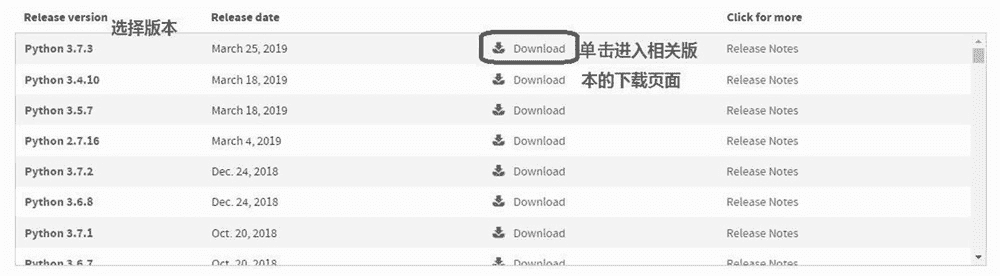
图 1：选择 CPython 的版本
在打开的链接中可以选择下载不同平台的安装包，也可以下载源代码。对于 Windows 用户，推荐下载 Windows x86-64 executable installer 安装包，如图 2 所示。下载后直接双击即可完成安装。
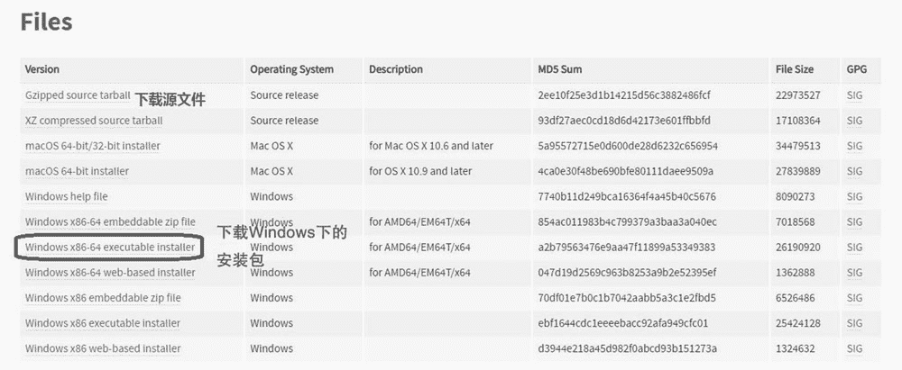
图 2：选择 CPython 的安装包

## 2\. Irony Python

IronPython 是一种在 .NET 和 Mono 上对 Python 语言的实现，由 Jim Hugunin（同时也是 Jython 的创造者）所创造，第一个发行版本在 2006 年 9 月 5 日发布。

IronPython 的最大特点就是和 Windows 无缝对接，甚至可以直接编译成 Windows 下的可执行程序。

可以在 [`ironpython.net/`](https://ironpython.net/) 上看到 IronPython 项目的情况，目前其最新的发行版本是 2.7.9，还没有看到 Python 3 相关的版本，该版本可以从 [`github.com/IronLanguages/ironpython2/releases/tag/ipy-2.7.9`](https://github.com/IronLanguages/ironpython2/releases/tag/ipy-2.7.9) 上下载，推荐下载 msi 安装文件，如图 3 所示。

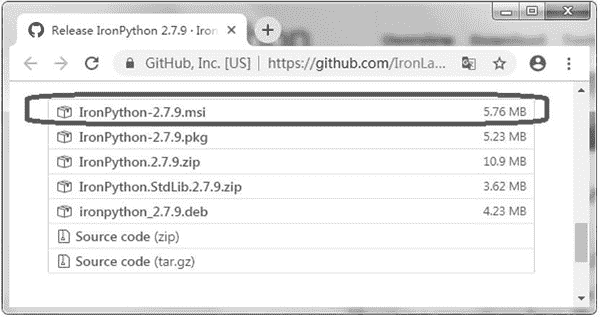
图 3：下载 IronPython 安装包

IronPython 安装包约 5MB，相比 CPython 的安装包小了很多。

下载完成后双击该 msi 文件即可进行安装，如图 4 所示。

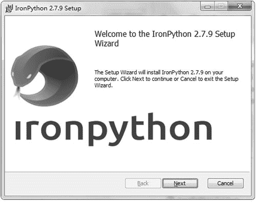
图 4：安装 IronPython
安装完后即可在安装目录下看到一些可执行文件，如图 5 所示。

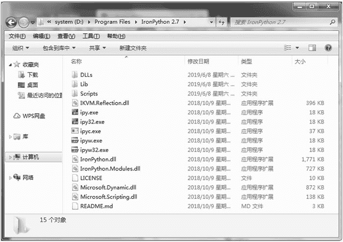
图 5：IronPython 安装目录下的文件
其中，ipy32.exe 是 32 位的解释器。运行该程序，可以看到如图 6 所示的窗口。

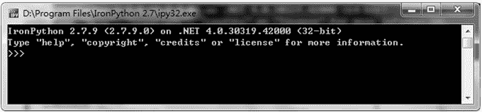
图 6：ipy32.exe 运行情况
ipy.exe 是 64 位的解释器。运行该程序，可以看到如图 7 所示的窗口。

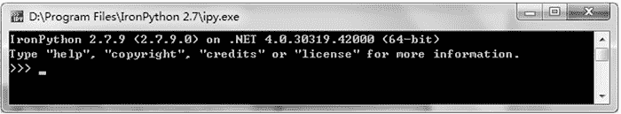
图 7：ipy.exe 运行情况
ipyc.exe 是编译器，可以将 Python 脚本编译成可执行文件，这是 IronPython 比较有特色的一个功能。

CPython 也有将 Python 脚本编译成可执行文件的工具，但是通常编译后的结果文件非常巨大。而 ipyc.exe 编译出来的是 dotnet 上的字节码，所以结果文件要小得多。

图 8 演示了使用 ipyc.exe 进行编译的过程。

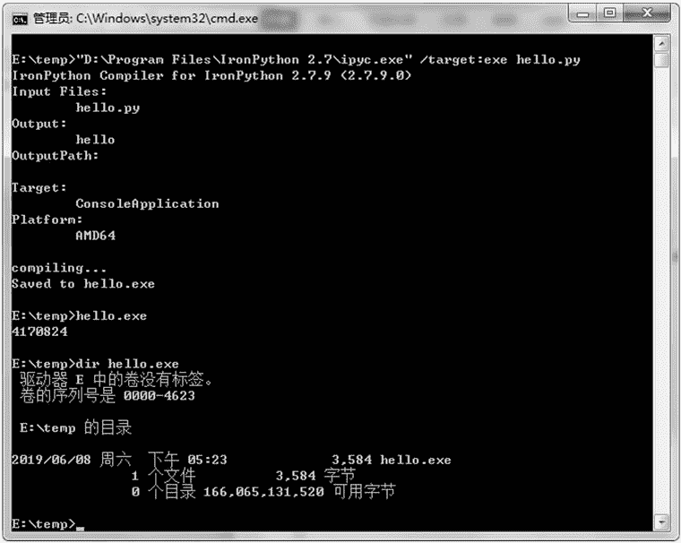
图 8：ipyc 编译器的使用
我们可以看到编译结果文件 hello.exe 约 4KB。如果使用其他工具，输出文件至少是 2MB 以上，二者相差了几百倍。

在安装目录的 scripts 目录下有几个安装 Python 软件包的工具，如 pip 和 easy_install 程序，如图 9 所示。这两个程序都是常见的安装 Python 软件包的工具。pip 现在是比较流行的 Python 包安装方法，本教程也推荐使用 pip 来安装 Python 包。

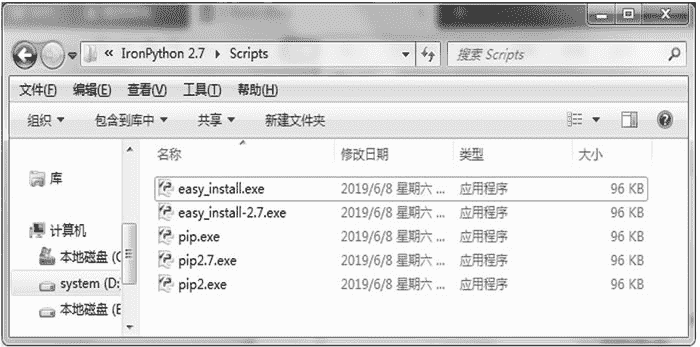
图 9：scripts 目录下的内容
和 CPython 不同，pip 不是 Python 脚本而是应用程序，是一个可执行文件，用文本编辑器打开看到的将是二进制乱码。

由于 IronPython 不是本教程的重点，所以在这里仅演示一个简单的例子，这个例子创建一个窗口，并显示该窗口。代码如下：

```

import clr                             # 用来引入 dotnet 库
clr.AddReference('System.Drawing')     # 引入 System.Drawing 这个 dll
# 引入 System.Windows.Forms 这个 dll
clr.AddReference('System.Windows.Forms')
from System.Drawing import Icon        # 引入图标
from System.Windows.Forms import Form  # 引入窗口
icon = Icon('./test.ico')              # 创建一个图标
form = Form()                          # 创建一个窗口
form.Icon = icon                       # 指定窗口使用的图标
form.ShowDialog()                      # 显示窗口
```

可以发现它使用的方法和 C# 类似，首先引入一些 dll，然后创建这些用户界面元素，最后显示出来即可。运行该代码，可以看到如图 10 所示的窗口。

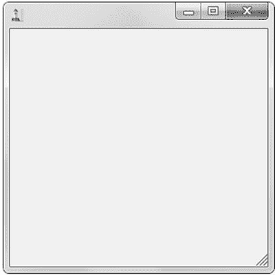
图 10：IronPython 下执行代码的效果

## 3\. Jython

Jython 是用 Java 实现的 Python 解释器，其特点也很鲜明，可以无缝使用第三方的 jar 包，这样 Java 社区的所有资源都可以在 Python 中直接使用。

Jython 和 CPython 的用法基本一样，不过 sys 的信息有所不同，如其 os.name 就是 java，而 CPython 的值为 nt。图 11 演示了 Jython 解释器的运行情况。

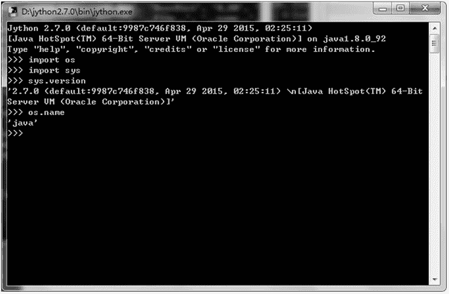
图 11：Jython 解释器的运行情况