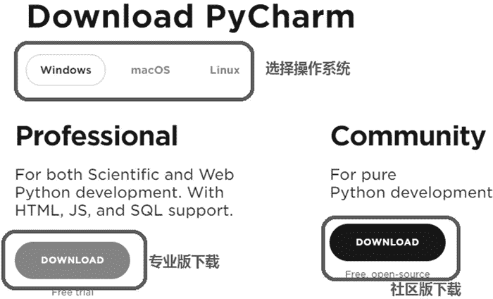

# Pycharm 简介

> 原文：[`www.weixueyuan.net/a/359.html`](http://www.weixueyuan.net/a/359.html)

我们在《Python 编译器》一节中下载安装的软件包主要包括 Python 解释器和其依赖的库文件，有些也带有编辑器等辅助工具。但总的来说，这些都是比较基础的工具。

如果希望大幅提升开发效率，可以选择安装一些集成开发环境，这样编辑代码、运行程序、调试程序便都可以在一个窗口中完成。PyCharm 就是 Python 程序员常用的一款集成开发工具。

PyCharm 是 JetBrains 公司开发的 Python 集成开发环境。JetBrains 公司开发了很多种语言的集成开发环境，比较有名的包括 C++ 开发环境 CLion、Java 开发环境 IntelliJ IDEA、iOS/macOS 开发环境 APPCode 等。

Pycharm 分为两个版本，专业版和社区版。专业版是需要付费的，社区版是免费的。

Pycharm 有以下几个特点：

*   PyCharm 提供智能代码补全、代码检查、实时错误高亮显示和快速修复，以及自动化代码重构和丰富的导航功能。
*   PyCharm 为现代 Web 开发框架（如 Django、Flask、Google App Engine、Pyramid 和 web2py）提供丰富的框架针对性支持。
*   PyCharm 与 IPython Notebook 集成，提供交互式 Python 控制台，并且支持 Anaconda 和多种科学化的包（例如 matplotlib 和 NumPy）。

Pycharm 的下载地址是 [`www.jetbrains.com/pycharm/download/`](https://www.jetbrains.com/pycharm/download/)。打开后可以选择自己的操作系统，如 Windows、macOS 或 Linux，之后可以单击不同的按钮来选择下载社区版或专业版，如图 1 所示。

图 1：选择目标操作系统和 Pycharm 的版本