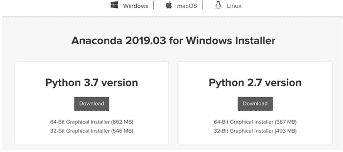
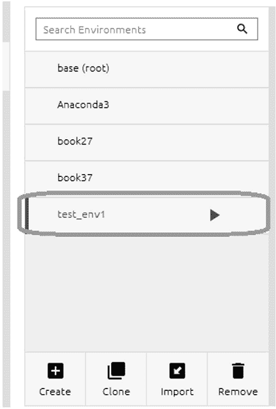

# Anaconda 使用教程（图解）

> 原文：[`www.weixueyuan.net/a/360.html`](http://www.weixueyuan.net/a/360.html)

Anaconda 是一个非常类似于 PyCharm 的集成开发环境，也是本教程推荐的集成开发环境，其下载地址为 [`www.anaconda.com`](https://www.anaconda.com)。它可以在 Windows、Linux 和 macOS 系统上运行。

在下载页面 [`www.anaconda.com/distribution/`](https://www.anaconda.com/distribution/) 可以选择操作系统和 Python 的版本，如可以选择 Python 3.7 或者 Python 2.7；对于不同的语言版本还可以选择不同的硬件平台，如 32 位版或 64 位版，如图 1 所示。


图 1：选择目标操作系统和 Anaconda 的版本
下载完成后，在 Windows 或 macOS 系统下双击即可完成安装。安装完毕后启动 Anaconda，可以看到如图 2 所示的界面（以 Windows 版本为例，其他版本类似）。


图 2：Anaconda 界面
如图 3 所示，在左边栏选择 Environmens（环境）选项，可以在中间栏看到目前系统中的所有环境，并在右边栏看到默认环境下已经安装的 Python 包。


图 3：Anaconda 开发环境
可以看到，中间栏显示的是目前的运行环境，其中第一个 base(root) 是系统自带的，其他的是我们创建的。我们可以为每个项目创建一个独立的开发环境。每个环境中安装的软件包是不同的，每个虚拟的环境就相当于一个独立的机器。

可以通过单击中间栏下部的 Create 按钮来创建新的环境，如图 4 所示。


图 4：新建开发环境
在弹出的对话框中输入环境的名称“test_env1”，并且选中 Python 复选框，选择 Python 的版本为 2.7，然后单击 Create 按钮即可创建新的环境，如图 5 所示。


图 5：设定新建开发环境的参数
该创建过程需要有可用的网络连接，因为在该过程中，安装程序会从网络上下载所指定环境需要的软件包。如果安装过程中没有出现问题，就可以在中间栏看到该新创建的开发环境，如图 6 所示。


图 6：创建完成的新的开发环境
单击选中该环境，可以看到该环境项的右侧出现了一个三角型箭头。在右边栏可以看到当前环境安装了哪些 P ython 软件包，如图 7 所示。


图 7：新建开发环境的安装包列表
目前该新建的环境一共安装了 9 个 Python 包，而且还显示了这些包的名称和版本信息，如 pip 的版本就是 19.1.1。

在右边栏还可以选择安装需要的软件包。我们可以先将 Python 包的范围设置为 All，即不论该包是否已经安装都显示出来，然后在搜索框中输入要安装的包的名称，如 flask，可以看到相关的 6 个包，这里选中 flask 包，然后单击右下角的 Apply 按钮即可安装该软件包，如图 8 所示。当然，在安装包时需要保证网络畅通。


图 8：安装新的 Python 包
在安装过程中，通过分析包的依赖关系，会弹出一个对话框，显示需要安装的所有 Python 包以及它们的版本，单击 Apply 按钮确认安装即可，如图 9 所示。


图 9：确认需要安装的 Python 包
安装完成后，在显示该环境已安装的 Python 包时即可发现软件包的数量由之前的 9 个变成了 15 个，并且可以看到新安装的 flask 包也显示在列表中，如图 10 所示。


图 10：安装 Python 包后的效果
下面启动该环境下的终端，查看安装的软件包的情况。在中间栏选中新建的环境 test_env1，在该环境右侧出现了绿色的三角形箭头，单击该箭头弹出菜单，然后选择 OpenTerminal 选项，如图 11 所示。


图 11：启动指定环境的命令行工具
在弹出的终端输入“pip freeze”以显示安装包的情况，如图 12 所示。


图 12：使用 PIP 命令查看安装的 Python 包
可以看到，Flask 1.0.2 已经安装在该环境下。

也可以运行 Python 来查看 Flask 的信息。方法是选中环境 test_env1，然后单击右侧的绿色三角形箭头，在弹出的菜单中选择 Open with Python 选项，如图 13 所示。


图 13：启动指定环境的 Python 解释器
该操作会启动 Python 解释器，在解释器中输入下面的内容：

```

import flask
flask
```

输入时不要输入前面的行号，即每行开始的数字 1、2 等。这也是本教程的一个约定，所有输入的内容前面都带有行号 ，这些行号都是不用输入的，仅仅为了便于定位。

可以看到目前使用的 Flask 是哪个文件，就是该模块对应的原文件，如图 14 所示。


图 14：查看 Flask 模块的信息
在使用完成后也可以删除该环境。方法是选中该环境 test_env1 选项，然后单击下部的 Remove 按钮，如图 15 所示。


图 15：删除指定的开发环境
在弹出的确认框中单击 Remove 按钮以确认删除指定的开发环境，如图 16 所示。


图 16：确认删除指定的开发环境