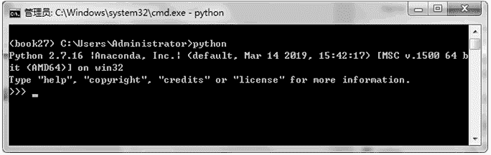
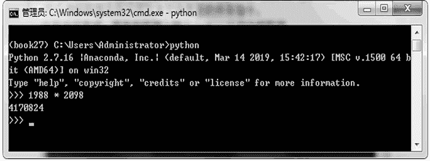
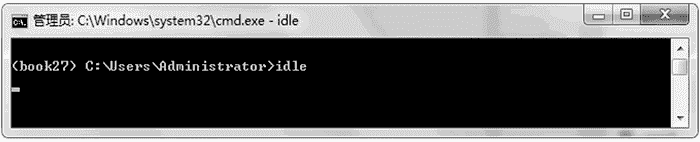
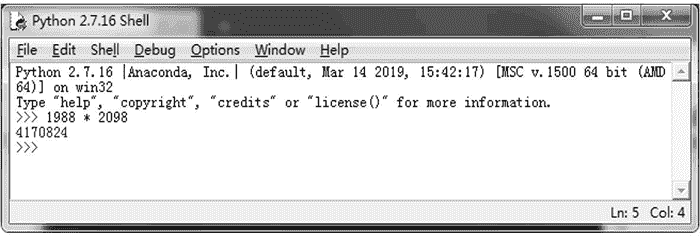
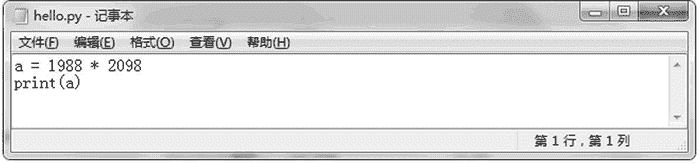
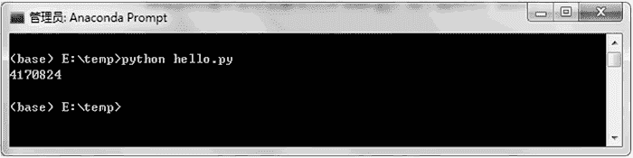

# Python 代码的两种运行方式

> 原文：[`www.weixueyuan.net/a/361.html`](http://www.weixueyuan.net/a/361.html)

Python 代码有两种运行方式，即交互运行方式和脚本运行方式：

*   交互运行方式和 Windows 系统上的 cmd 类似，启动 Python 解释器后，解释器等待用户输入指令，在接收到用户指令后就去执行该指令，指令执行完毕后接着等待用户的下一条指令。
*   而脚本运行方式则是将用户执行存入到一个文本文件中，然后让解释器去执行该文本文件中的所有指令。

但无论哪种方式，都可以发现其不同于 C 和 Java 语言的一个地方，即代码没有经过编译便直接运行了。这是所有脚本语言的特点，如 Perl、Shell、TCL 等，它们的脚本也是不用编译便直接运行的。

## 1\. 交互运行方式

首先在终端上输入 python 以启动解释器，如图 1 所示。

图 1：启动 Python 解释器
这时出现了`>>>`提示符，表示用户可以在这里输入命令。如要让 Python 计算 1988×2098，则可以在这里输入 1988 * 2098。Python 解释器便会去执行该乘法运算，并将结果 4 170 824 显示出来。

指令运行完毕后再次显示`>>>`符号，以提示用户输入下条指令，如图 2 所示。

图 2：输入指令查看结果
这种方式非常直观，每一步执行了什么指令，指令执行的结果是什么都一目了然。这也是本书首选的演示代码的方式。

在 CPython 中还自带了一个解释器 IDLE，该解释器是一个 GUI 程序，用法和前面的类似。其启动方式比较简单，直接在终端上输入 idle 即可，如图 3 所示。

图 3：启动 IDLE
启动 IDLE 后便可以在窗口内输入要执行的指令，解释器会立即执行并等待下一条指令，如图 4 所示。

图 4：IDLE 运行情况

## 2\. 脚本运行方式

脚本运行方式是先创建一个文本文件，然后在该文本文件中输入需要执行的指令，最后通过指令“python 脚本文件名”来执行该文本文件中的所有指令。

例如，假定我们使用 Windows 自带的文本编辑器“记事本”新建了一个文件 hello.py，内容如图 5 所示。

:
图 5：hello.py 的内容
可以看到该文件包含两条指令，第一条指令是计算 1988 和 2098 的乘积并将计算结果保存到变量 a 中，第二条指令是显示 a 的值。

下面在终端中运行该脚本文件 hello.py，可以看到准确地输出了 1988 × 2098 的结果，如图 6 所示。

:
图 6：运行脚本文件 hello.py