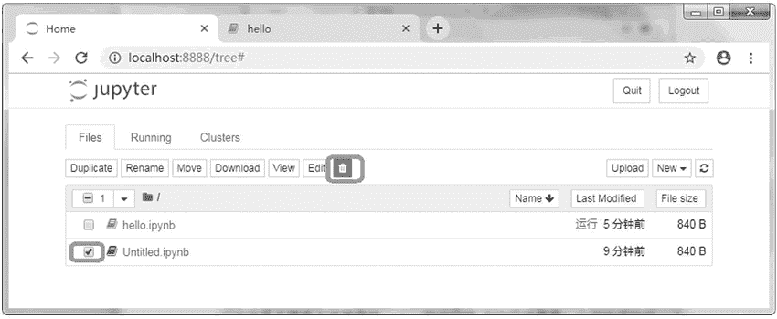

# 在网页上运行 Python 代码

> 原文：[`www.weixueyuan.net/a/362.html`](http://www.weixueyuan.net/a/362.html)

最近比较流行的 Python 代码运行方式是 Notebook，它使用网页作为用户界面来编辑和执行 Python 代码。

首先需要安装 notebook 这个包，下面演示在 Anacconda 中安装 Notebook 包的方法。

启动 Annaconda，在左边栏中选择 Home 选项，在右边栏中选择开发环境 book27，如图 1 所示。

图 1：选择开发环境
由于笔者已经安装好了 Jupyter，所以显示的是 Launch 按钮。如果在该环境下未安装 Jupyter，则显示 Install 按钮，在保证网络畅通情况下单击 Install 按钮即可安装该组件。

在 Notebook 安装完成后启动终端，进入到目录下，运行命令 jupyter notebook 来启动 Notebook，如图 2 所示。

图 2：启动 Notebook
在浏览器中输入图 2 中框中的地址该地址会在每次启动时各不相同，所以最好是将其复制下来，即可在浏览器中可以看到当前目录下的文件，不过目前该目录下没有任何文件，如图 3 所示。

图 3：启动浏览器查看 Notebook 服务器上的内容
我们可以创建一个新的文件，注意文件的扩展名是 ipynb。方法是单击右边的 New 按钮，在弹出的菜单中选择 Notebook 下面的 Python 3 选项，这样就新建了一个脚本文件，如图 4 所示。

图 4：新建一个脚本文件
在新打开的页面中输入 Python 代码，然后单击“运行”按钮即可运行该脚本，如图 5 所示。

图 5：运行脚本文件
下面可以保存该脚本文件。选择 File→Save as... 命令，如图 6 所示。

图 6：保存脚本文件
然后在弹出的对话框内输入文件名 hello.ipynb，单击 Save 按钮即可，如图 7 所示。

图 7：输入新的脚本文件名
现在回到前一个页面，即可看到两个文件，其中一个是我们新保存的，另外一个是单击 New 按钮时生成的默认文件，如图 8 所示。

图 8：查看脚本文件列表
上面是通过 Save as...（另存为）命令来另外保存了一份文件。下面可以删掉原始的 Untitled.ipynb 文件。方法是选中该文件前面的复选框，然后单击删除按钮，如图 9 所示。

图 9：删除脚本文件
类似地，我们可以进行重命名、文件下载等操作，如图 10 所示。

图 10：重命名和下载脚本文件