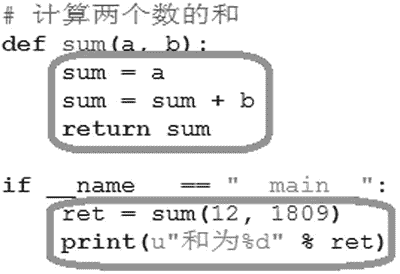
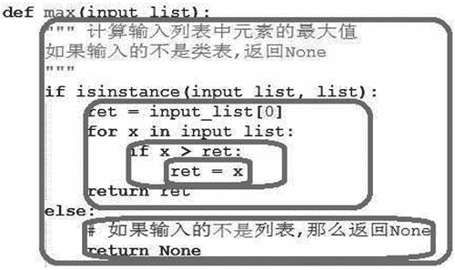
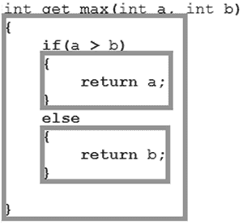
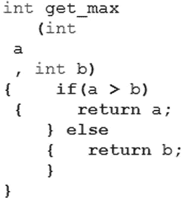
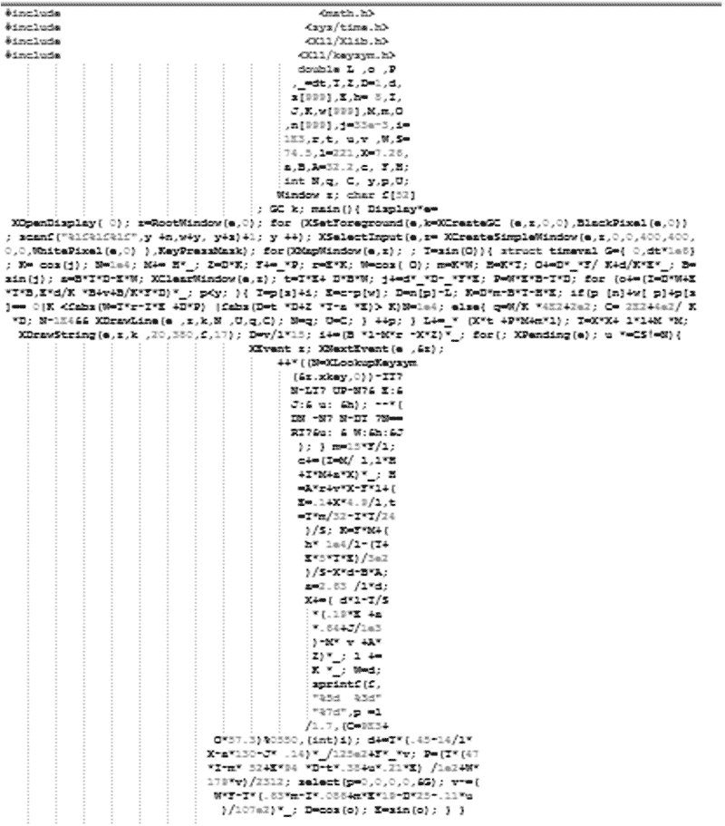

# Python 缩进和代码块

> 原文：[`www.weixueyuan.net/a/364.html`](http://www.weixueyuan.net/a/364.html)

和其他语言不同，Python 使用缩进来表示代码块，即连续代码行中，缩进相同的行被认为是一个块。如图 1 所示的代码就包含两个块，它们的缩进是相同的。

图 1：代码块
和其他语言一样，块是可以嵌套的，如图 2 所示的代码便是大块中包含小块。一个块最少包含一条语句。

图 2：嵌套块
Python 在这点上和 C 语言、Shell 都不同：

*   在 C 语言中使用一对大括号`{ }`来表示标识块，所有放到这对大括号中的内容都被认为属于这个块。
*   而 Shell 则使用不同的起始和结束标识，如 if 块，就是用 if 和 fi 分别标识块的开始和结束，在这中间的都是 if 块的内容。

如图 3 所示的 C 语言代码，就包含 3 个块，分别放在不同的大括号中。

图 3：C 语言中的代码块
缩进的语法带来的好处是代码看起来特别工整规范。当然图 3 所示的 C 代码看起来也非常工整。但与 C 代码不同的是 Python 代码必须工整，而 C 代码却没有这个强制要求。

C 代码可以写得让人完全看不懂，但是依然可以很好地运行。如图 3 所示求最大值的 C 代码也可以写成图 4 所示的样子，二者含义完全一样。

图 4：C 语言中的块不要求对齐
有些程序员本着娱乐至上的精神，写了不少标新立异的代码。如图 5 所示的 C 代码，看起来就像一个飞机，其实该代码的确就是一个飞行模拟器。

图 5：难看但是可以运行的 C 代码但是在 Python 中，这样的代码是不能工作的。