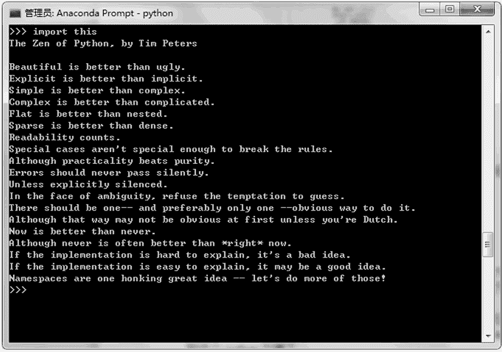

# Python 之禅（编码规范）

> 原文：[`www.weixueyuan.net/a/365.html`](http://www.weixueyuan.net/a/365.html)

使用 Python 语言进行软件开发应该遵循什么样的风格和原则呢？Tim Peters 对该问题进行了解答，他的答案被称作 Zen of Python，也就是本节将要介绍的 Python 之禅。

这些编码的原则被 Python 社区广泛接受，因此最后被放入到各个 Python 解释器中了。用户只需要在 Python 解释器中输入 import this 即可看到这个 Python 之禅，如图 1 所示。当然它是用英文编写的，这里简单做一下翻译和解释的工作。

图 1：Python 之禅
Python 之禅的内容翻译成中文如下：

#### 1) 优美漂亮的代码优于丑陋的代码

就是说我们不仅要求代码能够正常工作，而且还希望代码看起来优美。

#### 2) 明确优于隐含

简单来说就是我们的代码要明确说明其用法，不要让用户根据他们自己的理解来猜。

#### 3) 简单优于复杂

能用简单方法就一定不要故意给自己找麻烦，最简单的方法就是最好的方法。

#### 4) 复杂胜于凌乱

如果功能很复杂，则希望能够将其分割成功能单一的多个模块；希望保持模块间接口函数简洁，保证各个模块功能单一。

#### 5) 扁平优于嵌套

就是尽量不要使用嵌套，毕竟嵌套代码在调试时，定位问题比较麻烦，不知道是在哪一层嵌套时出的问题。

#### 6) 宽松优于紧凑

各个代码模块之间的联系要简单，不能过于依赖某些模块，不要不同模块之间的联系过于复杂而形成蜘蛛网状。

#### 7) 代码可读性很重要

变量名、函数名、类名最好有明确的含义。注释也是很重要的，注释可以帮助我们和他人来理解代码。

#### 8) 即便是特例，也不可违背上述规则

所谓的特例就是这样一些情况，如果我们不遵守这些规则，看起来在目前更加划算。但是如果我们的代码会长期服务于我们，那么遵守这些规则最终会让我们受益。

#### 9) 虽然现实往往不那么完美，但是不应该放过任何异常

对异常的处理非常重要，90% 的问题就发生在那些边角用例中。

#### 10) 对异常处理不可马虎

虽然多数异常出现概率很低，但是我们不能掉以轻心，希望能够找到异常发生的原因并将其解决，不能使用 except 捕捉到异常然后就不管了。

#### 11) 如果存在多种可能，不要猜测

肯定有一种，通常也是唯一一种最佳的解决方案。

#### 12) 对待代码，要有精益求精的精神

开发者要逐步改进代码，让其趋于完美。

#### 13) 虽然这并不容易，因为你不是 Python 之父

完全按照上面执行，最开始可能有点困难，但是坚持下来，事情会变得容易起来。

#### 14) 动手比不动手要好

编程既是脑力劳动，也是体力劳动。多多练习，将想法付之实践能够帮助我们更好地理解代码的优缺点。

#### 15) 不假思索就动手还不如不做

动手之前，需要思考，确定目标，了解现状。比如，我们要完成的功能是否有类似的库可以使用，它们能否满足我们的需要，即使不能完全满足我们的需要，但可以看看有哪些设计思想值得我们借鉴。

#### 16) 如果你的方案很难懂，那肯定是一个糟糕的方案

一个难懂的方案，一般很难实现，毕竟代码还是要人来写的。如果编写代码的人对这个方案的理解都不好，结果会和期望值相去甚远，毕竟差之毫厘谬以千里。

#### 17) 如果你的方案很好懂，那肯定是一个好方案

如果一个方案很好懂，在方案论证时大家都能很好地理解，也能帮忙出主意。在开发时，开发人员也容易保证开发的进度和质量，测试方案和实施也要容易得多。最后出来一个爆款是大概率事件，大家都能从中受益。

#### 18) 命名空间非常有用，我们应当多加利用

尽量不要将太多的东西放在一个包中，这样会导致功能不清，就像杂货铺一样。应该尽量将代码按照某种方式有效地组织起来。