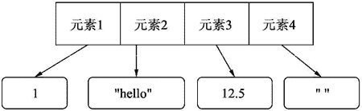

# Python list 列表精讲

> 原文：[`www.weixueyuan.net/a/392.html`](http://www.weixueyuan.net/a/392.html)

Python 列表（list）是多个元素组成的有序集合。

我们可以使用列表将紧密关联的元素捆绑在一起，如某个班级有 28 名同学，那么可以建立一个班级列表，里面包含 28 个元素，每个元素对应一个学生。由于列表是有序的，我们可以按照学号来排序，这样就得到了一个学生列表用来表示某个班级的所有学生。

## 1\. 列表的定义

在 Python 中，使用`[ ]`来定义列表：

```

>>> list1 = [1, 2, 3]  # 定义列表 list1
>>> type(list1)        # 查看 list1 的类型
<class 'list'>
```

另外一种构造列表的方式是 list（对象），其从另外一个对象复制数据来构建一个新的列表。这个输入的对象一般也是一个集合数据，就是说其是包含很多个元素的数据，如字符串。字符串可以看作是字符的集合。

```

>>> list('123')
['1', '2', '3']
```

列表可以为空，即不包含任何元素的列表。用`[ ]`来表示空的列表。

```

>>> a = []  # 空列表
>>> len(a)  # 列表元素为 0
0
```

## 2\. 列表的特性

列表和前面介绍的数据类型有很大的不同，它是一系列元素的集合。在其他编程语言中，也有类似的数据类型，但 Python 中的列表有其自己的特性。

#### 1) 异构性

Python 的列表不要求其元素的类型相同，这点和 C 语言、Java 语言中的数组有很大的不同。

```

>>> a = [1, 2.3, "hello", [1, 2]]  # 构造一个列表，4 个元素
>>> type(a[0])                     # 第一个元素的类型为整型
<class 'int'>
>>> type(a[1])                     # 第二个元素的类型为浮点数
<class 'float'>
>>> type(a[2])                     # 第三个元素的类型为字符串
<class 'str'>
>>> type(a[3])                     # 第四个元素的类型为列表
<class 'list'>
```

#### 2) 元素个数可变

对于 C 语言和 Java 语言的数组来说，元素个数在定义时就已经确定了，以后是不可以修改的。而 Python 的列表对元素个数是没有限制的，而且可以在运行时动态发生变化，如可以在尾部添加一个元素，或者在头部插入一个元素。

经过这样的操作后，列表的元素个数也会发生变化。

```

>>> a = [1, 2, 3]   # 构造列表 a
>>> len(a)          # a 有 3 个元素
3
>>> a.append(4)     # 在尾部添加元素 4
>>> a               # 查看 a 的内容
[1, 2, 3, 4]
>>> len(a)          # 现在 a 的元素个数为 4
4
>>> a.insert(0, 0)  # 在头部插入 0
>>> a               # 查看 a 的内容
[0, 1, 2, 3, 4]
>>> len(a)          # a 的元素个数现在为 5
5
```

#### 3) 直接访问元素

这个和 C 语言、Java 语言中的数组类似，可以指定某个位置来访问列表中的元素，如第一个元素、最后一个元素等。

另外一种常见的数据结构是链表，但链表不可以直接访问任意元素，如要得到第三个元素的值，首先要访问第一个元素，通过第一个元素来找到第二个元素，再通过第二个元素来找到第三个元素。

```

>>> a = list(range(1, 100))  # 生成 99 个元素的列表
>>> len(a)                   # 得到元素的个数
99
>>> a[10]                    # 访问第 11 个元素，得到其值
11
```

#### 4) 对象表示法

我们从前面知道访问列表中任意元素的时间是相同的，这点就像 C、C++ 和 Java 中的数组一样。但是其不要求所有元素类型相同，也不要求它们占用相同的内存空间，这是如何做到的呢？

下面以列表 [1,"hello"12.5,""] 为例画出其在内存中对象模型，如图 1 所示。


图 1：列表的对象模型

## 4\. 列表的常见操作

下面介绍列表数据的常用操作。

#### 1) 得到元素个数——len()

可以使用 len() 函数来得到某个列表包含的元素个数。

```

>>> len([])         # 空的列表元素个数为 0
0
>>> len([1, 2, 3])  # 包含 3 个元素的列表
3
```

#### 2) 得到某种元素——列表[位置]

我们可以用“列表[位置]”来表示某个元素，然后可以读取该元素的值，也可以修改该元素的值。

```

>>> list1 = [1, 2, 3]  # 定义一个列表
>>> list1[1]           # 查看第二个元素的值
2
>>> list1[1] = 100     # 修改第二个元素的值
>>> list1              # 查看列表的内容
[1, 100, 3]
```

#### 3) 在尾部添加元素——append()

结果就是元素个数加一，列表自己的 id 没有发生变化。

```

>>> list_obj1 = [1, 2, 3]
>>> id(list_obj1)
4346456544
>>> list_obj1.append(12)
>>> list_obj1
[1, 2, 3, 12]
>>> id(list_obj1)
4346456544
```

#### 4) 得到某个值在列表中出现的次数——count()

如果没有出现过，那么返回 0。

```

>>> list_obj1 = [1, 1, 2, 3, 4]  # 创建一个列表
>>> list_obj1.count(1)           # 列表中值为 1 的元素个数为 2
2
>>> list_obj1.count(2)           # 列表中值为 2 的元素个数为 1
1
>>> list_obj1.count(20)          # 列表中值为 20 的元素个数为 0
0
```

#### 5) 将另外一个列表的元素附加到尾部——extend(新列表)

将新列表的元素放在原来列表尾部，原来的列表数据发生了变化。

```

>>> list_obj1 = [1, 2, 3]        # 新建一个列表
>>> list_obj2 = [10, 20, 30]     # 新建另外一个列表
>>> id(list_obj1)                # 得到第一个列表的 id
4346331936
>>> id(list_obj2)                # 得到第二个列表的 id
4346393520
>>> list_obj1.extend(list_obj2)  # 将第二个列表内容依次加入第一个列表
>>> id(list_obj1)                # 第一个列表的 id 没有发生变化
4346331936
>>> id(list_obj2)                # 第二个列表的 id 也没有发生变化
4346393520
>>> list_obj1                    # 但是第一个列表的内容发生了变化
[1, 2, 3, 10, 20, 30]
>>> list_obj2                    # 第二个列表的内容没有发生变化
[10, 20, 30]
```

#### 6) 查找第一个指定值出现的位置——index()

第一个元素的位置为 0。如果没有找到，抛出异常。

```

>>> list_obj1 = [1, 2, 4, 1, 21, 20]  # 新建一个列表
>>> list_obj1.index(1)  # 第一个值为 1 的元素位置是 0,也就是第一个位置
0
>>> list_obj1.index(30)  # 第一个值为 30 的元素位置是不存在的,抛出异常
Traceback (most recent call last):
  File "<stdin>", line 1, in <module>
ValueError: 30 is not in list
>>> list_obj1.index(21)  # 第一个值为 21 的元素位置是 4,也就是第 5 个元素
4
```

也可以指定开始位置。

```

>>> list_obj1 = [1, 2, 4, 1, 21, 20]
>>> list_obj1.index(1, 2)  # 开始位置为 2
3
>>> list_obj1.index(1, 0)  # 开始位置为 0
0
```

当然也可以同时指定开始和结束的位置。

```

>>> list_obj1 = [1, 2, 4, 1, 21, 20]
>>> list_obj1.index(1, 4, 6)  # 开始于位置 4，结束于位置 5
Traceback (most recent call last):
  File "<stdin>", line 1, in <module>
ValueError: 1 is not in list
```

#### 7) 在指定位置插入元素——insert()

需要指定位置和值，在该位置后面的元素都会向后移动一个位置。

```

>>> list_obj1 = [1, 2, 4, 1, 21, 20]
>>> list_obj1.insert(0, 100)
>>> list_obj1
[100, 1, 2, 4, 1, 21, 20]
```

#### 8) 删除指定位置的元素——pop()

将该指定位置上的元素从列表中删除，在该位置后面的元素都往前挪动一个位置。返回值是删除掉的元素的值。

```

>>> list_obj1 = [1, 2, 4, 1, 21, 20]
>>> list_obj1.pop(2)  # 删除位置为 2 的元素，也就是第三个元素
4
>>> list_obj1         # 查看删除后的结果
[1, 2, 1, 21, 20]
```

如果没有指定位置，那么就是删除最后一个元素。

```

>>> list_obj1 = [1, 2, 4, 1, 21, 20]
>>> list_obj1.pop()  # 删除最后一个元素
20
>>> list_obj1
[1, 2, 4, 1, 21]
```

#### 9) 删除第一个等于指定值的元素——remove（值）

从头部开始，删除第一个指定值的元素。

```

>>> list_obj1 = [1, 2, 4, 1, 21, 20]
>>> list_obj1.remove(1)  # 删除第一个值为 1 的元素
>>> list_obj1            # 查看删除后的列表内容
[2, 4, 1, 21, 20]
```

如果没有元素的值等于指定值，那么抛出异常。

```

>>> list_obj1 = [1, 2, 4, 1, 21, 20]
>>> list_obj1.remove(100)
Traceback (most recent call last):
  File "<stdin>", line 1, in <module>
ValueError: list.remove(x): x not in list
```

#### 10) 颠倒顺序——reverse()

用于反转列表中的元素。

```

>>> list_obj1 = [1, 2, 4, 1, 21, 20]
>>> list_obj1.reverse()
>>> list_obj1
[20, 21, 1, 4, 2, 1]
```

#### 11) 排序——sort()

这对于由整数组成的列表来说非常有用。如果不是数值型的元素，那么其使用某种排队规则进行排序。我们也可以指定自己的排队规则来实现不同的排列方式。

```

>>> list_obj1 = [1, 2, 4, 1, 21, 20]
>>> list_obj1.sort()
>>> list_obj1
[1, 1, 2, 4, 20, 21]
```

#### 12) in 操作符

用来判断某个列表中是否包含指定值的元素。如果包含，返回 True；否则返回 False。

```

>>> list_obj1 = [1, 2, 4, 1, 21, 20]
>>> 1 in list_obj1
True
>>> 10 in list_obj1
False
```

#### 13) not in 操作符

判断某个值是否不在列表中。如果不在，返回 True；否则返回 False。该操作符和 in 刚好相反。

```

>>> list_obj1 = [1, 2, 4, 1, 21, 20]
>>> 1 not in list_obj1
False
>>> 10 not in list_obj1
True
```

#### 14) 遍历所有元素——forin

该操作符依次访问列表中的所有元素，而且是按照列表中元素的顺序依次来访问。第一次访问该列表的第一个元素，第二次访问第二个元素，循环执行直到访问完最后一个元素。

如果列表为空，该操作符也是合法的，但是不会执行循环内的代码，一次也不会执行。

```

>>> list_obj1 = [1, 2, 4, 1, 21, 20]
>>> for ele in list_obj1:  # 遍历所有元素
        print(ele)         # 打印输出这些元素的值

1  # 按照顺序输出各个元素
2
4
1
21
20
```