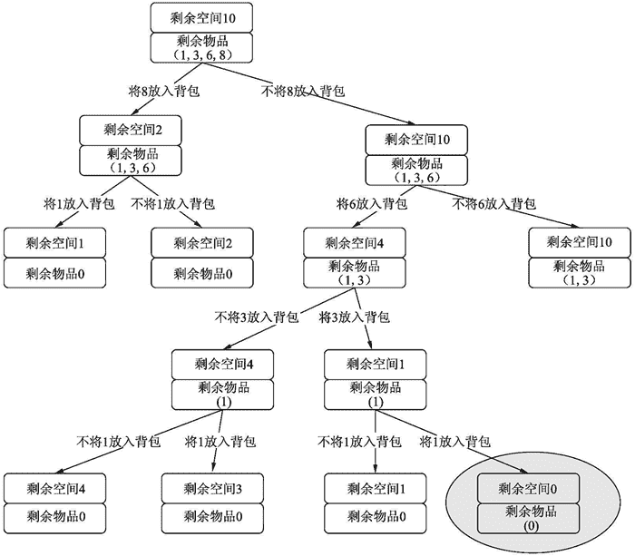

# Python 解决 0-1 背包问题

> 原文：[`www.weixueyuan.net/a/398.html`](http://www.weixueyuan.net/a/398.html)

背包问题是一个经典的问题，其有多个变种，本节要解决的是 0-1 背包问题。

题目如下，给定一个背包，其容量为 v，现在有 n 个物品，它们的体积分别为 e1、e2、…、en。现在挑选任意多个物品放入背包内，要求它们的体积和不能超过背包容量 v，并且希望尽量接近 v，如背包容量为 100，那么物品体积和为 99 的方案就比物品体积和为 98 的方案要好，当然最好是体积和等于背包容量 v。我们就是要找到这个最优的物品组合。

为了说明该类问题的解决方案，我们设定了一个特殊的场景，在该场景中，背包容量为 10，物品有 4 个，它们的容量分别为 1、3、6、8。现在我们需要计算出这个最优的物品组合。

最简单的方法就是列出所有的排列组合，看看它们是否满足条件。由于有 4 个物体，每个物体有两个可能选项，放入背包或者不放入背包。下面为实现代码：

```

goods_list = [1, 3, 6, 8]
def resolve_bag(bag_volume, goods_list):
    biggest_valid_vol = 0
    biggest_valid_selection = []
    goods_num = len(goods_list)
    candidate_num = 1 << goods_num
    for candidate in range(candidate_num):
        selection_decision = []
        for x in range(goods_num):
            if (candidate & 1) == 1:
                selection_decision.append(True)
            else:
                selection_decision.append(False)
            candidate = candidate >> 1
        current_vol = 0
        for x in range(goods_num):
            if selection_decision[x] == True:
                current_vol = current_vol + goods_list[x]
        if current_vol <= bag_volume and current_vol > biggest_valid_vol:
            biggest_valid_vol = current_vol
            biggest_valid_selection = selection_decision
    result = [goods_list[x] for x in range(goods_num) if biggest_valid_selection[x] == True]
    print(result)
resolve_bag(10, goods_list)
```

运行结果：
[1, 3, 6]

但是该程序的运行效率比较低下，其枚举了所有的组合。对于这个过程，可以用决策树来表示。

我们可以用两个信息来描述每个状态，一个是背包的剩余空间，一个是没有放入背包的物品。如初始状态就是有 10 个剩余空间，没有放入背包的物品体积依次为 1、3、6、8。然后我们对于所有的物品，从右往左，依次决定是否放入背包。如将体积为 8 的物品放入背包，那么就得到这样一个状态，其背包剩余空间是 2，没有放入到背包的物品容量是 1、3、6。如果决定不将体积为 8 的放入背包，那么就得到这样一个状态，剩余空间为 10，没有放入背包的物品体积为 1、3、6。

除掉一些明显不太可能出现的状态，可以得到如图 1 所示的一个状态图。


图 1：背包问题的状态图
最后找到右下角的这个状态，剩余空间为 0，即将背包完全装满了。这就是我们的终极状态了。