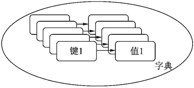

# Python dict 字典精讲

> 原文：[`www.weixueyuan.net/a/525.html`](http://www.weixueyuan.net/a/525.html)

Python 字典也是一个集合，但是其每个元素包含两部分——键和值，如图 1 所示：


图 1：字典模型
和列表一样的是，字典对元素个数没有限制，可以动态添加和删除元素；和列表不同的是，字典对元素自动按照某种规则排序，所以在插入元素时不能指定位置。

## Python 创建字典

可以用多种方法来创建一个没有元素的字典，即空的字典，下面演示了 3 种创建空字典的方法。

```

>>> a = {}        # 第一种方法
>>> type(a)
<type 'dict'>
>>> b = dict()    # 第二种方法
>>> type(b)
<type 'dict'>
>>> c = dict([])  # 第三种方法：使用空的列表作为输入
>>> type(c)
<type 'dict'>
```

下面创建一个指定了元素初始值的字典。

```

>>> a = {1: 100, 2: 200}  # 包含 z 个元素，一个是 1:100，另外一个是 2:200
>>> type(a)
<type 'dict'>
```

## Python 字典的基本操作

本节介绍字典的基本操作，如计算字典中元素个数、修改字典内容等。

#### 1) 计算元素个数——len()

如果字典为空，返回 0；否则返回一个正整数表示键-值对的个数。

```

>>> a = {1: 100, 2: 200}  # 字典 a 包含两个元素
>>> len(a)                # 字典 a 的元素个数为 2
2
>>> b = dict()            # 创建一个空的字典 b
>>> len(b)                # 字典 b 的元素个数为 0
0
```

#### 2) 添加元素

如果该键不存在，则新建该键。

```

>>> a = {1: 100, 2: 200}
>>> a[3] = 300  # 添加元素 3:300，键为 3，值为 300
>>> a
{1: 100, 2: 200, 3: 300}
```

#### 3) 修改元素值

如果该键已经存在，则修改该键的值。

```

>>> a = {1: 100, 2: 200}
>>> a
{1: 100, 2: 200}
>>> a[1] = 1000
>>> a
{1: 1000, 2: 200}
```

#### 4) 得到元素值——get()

如果该键存在，返回该键对应的值；否则返回 None。

```

>>> a = {1: 100, 2: 200}
>>> a.get(1)  # 键 1 存在，返回其对应的值 100
100
>>> a.get(8)  # 键 8 不存在，返回 None
>>> r = a.get(8)
>>> r is None
True
```

#### 5) 更新值——a.update（字典 b）

对于字典 b 中的元素，如果其存在于字典 a 中，则用 b 的值覆盖 a 的值；如果不存在于 a 中，则添加一个新的元素到 a 中。该过程 a 发生了变化而 b 没有变化。该函数没有返回值。

```

>>> a = {1: 100, 2: 200}    # 定义字典 a
>>> b = {1: 1000, 3: 3000}  # 定义字典 b
>>> a.update(b)             # 用字典 b 的内容来更新 a 的内容
>>> a                       # 字典 a 发生了变化
{1: 1000, 2: 200, 3: 3000}
>>> b                       # 字典 b 没有发生了变化
{1: 1000, 3: 3000}
```

#### 6) 是否存在某个键——has_key（键）

如果存在该键，返回 True；否则返回 False。

```

>>> a = {1: 100, 2: 200}  # 定义字典 a，有两个键 1 和 2
>>> a.has_key(1)          # 是否存在键 1？存在
True
>>> a.has_key(3)          # 是否存在键 3？不存在
False
```

#### 7) 得到键组成的列表——key()

该函数返回一个列表，每个元素都是原来字典的键。

```

>>> a = {1: 100, 2: 200}
>>> r = a.keys()
>>> type(r)
<type 'list'>
>>> r
[1, 2]
```

#### 8) 得到值组成的列表——values()

该函数返回一个列表，每个元素都是原来字典的值。

```

>>> a = {1: 100, 2: 200}
>>> r = a.values()
>>> type(r)
<type 'list'>
>>> r
[100, 200]
```

如果有重复的值，则在返回列表中也会出现重复的元素。

```

>>> a = {1: 100, 2: 200, 3: 200}
>>> r = a.values()
>>> type(r)
<type 'list'>
>>> r
[100, 200, 200]  # 其中有重复的元素 200
```

#### 9) 删除所有元素——clear()

该操作会丢掉所有的元素，但是字典自身还存在。

```

>>> a = {1: 100, 2: 200, 3: 200}  # 创建字典 a
>>> len(a)                        # 字典 a 包含 3 个元素
3
>>> id(a)                         # 查看字典 a 的 id
48498080
>>> a.clear()                     # 删除字典 a 的所有元素
>>> len(a)                        # 字典 a 没有元素了
0
>>> id(a)                         # 字典 a 的 id 没有发生变化
10      48498080
```

#### 10) 删除指定键的元素——pop（键）

如果指定的键不存在，抛出 KeyError 异常。

```

>>> a =  {1: 100, 2: 200, 3: 200}  # 创建字典 a，3 个元素
>>> a
{1: 100, 2: 200, 3: 200}
>>> len(a)                         # 字典 a 的元素个数为 3
3
>>> a.pop(1)                       # 删除键为 1 的元素，返回值是该键对象的值
100
>>> a                              # 删除后字典 a 剩余两个元素
{2: 200, 3: 200}
>>> a.pop(10)                      # 删除键 10，但是不存在该键
Traceback (most recent call last):
  File "<stdin>", line 1, in <module>
KeyError: 10
```

也可以指定默认值，即如果指定的键不存在，返回该默认值。这时就不会抛出异常了。

```

>>> a = {1: 100, 2: 200, 3: 200}  # 创建一个字典
>>> a.pop(100, 888)               # 888 是默认值
888                               # 指定的键 100 不存在，所以返回 888
>>> a                             # 原来的字典没有发生任何变化
{1: 100, 2: 200, 3: 200}
```

#### 11) in 操作符

该操作符用于判断某个值是否为字典的某个键，即是否存在这样一个键，其值等于指定的值。

```

>>> a = {1: 100, 2: 200, 3: 200}
>>> 1 in a    # 是否存在值为 1 的键
True
>>> 100 in a  # 是否存在值为 100 的键
False
```

#### 12) not in 操作符

该操作符用于判断是否不存在这样的一个键，该键的值为指定的值。如果不存在，返回 True；否则返回 False。

```

>>> a = {1: 100, 2: 200, 3: 200}
>>> 1 not in a    # 是否不值为 1 的键
False
>>> 100 not in a  # 是否不值为 100 的键
True
```