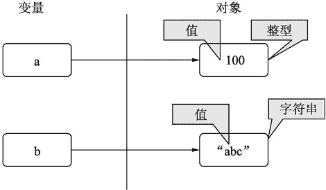
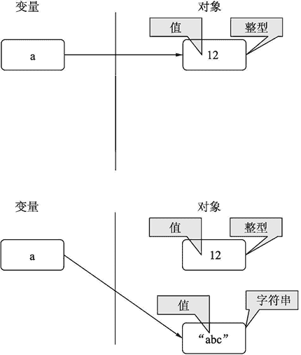
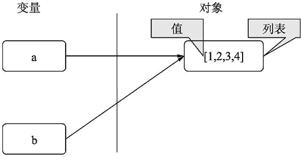
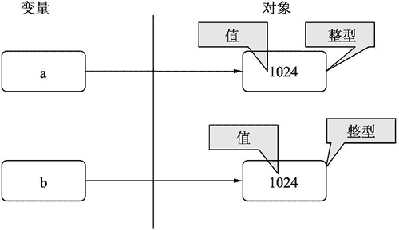

# Python 变量、对象和值的关系

> 原文：[`www.weixueyuan.net/a/532.html`](http://www.weixueyuan.net/a/532.html)

前面的例子中我们已经用到了变量，如：

>>> a = 12

就创建了变量，而且变量的值为 12，但对象接触的不是很多。

变量就是一个符号，或者说是名字。类比现实生活，相当于是身份证。

对象是一段存储空间，简单来说就是一块内存。类比现实生活就是某个具体的人。对象有很多属性，其中一个属性就是类型。相同类型的对象有很多一样的属性。类型就类似于国籍，相同国籍的人虽然不同，但是有很多一样的属性，如所有中国人都有一个户口的属性，其他国家的人就没有这个属性。

值就是对象的详细属性。如某个整型对象，其值为 100，而另外一个整型对象，其值就为 800。

图 1 所示描述了它们的关系。

图 1：变量、对象和值的关系
它们的关系是每个变量一定对应某个对象，变量的值就是该变量对应对象的值。每个对象有三个基础属性，id、类型和值。每个对象的 id 是不同的，但是两个不同对象的类型和值可以相同。

可以使用“id（变量名）”来获得对象的 id。

```

>>> a = 12
>>> id(a)      # 得到变量 a 对应对象的 id
140377101203968
>>> b = "abc"  # 新建一个字符串对象，并让变量 b 指向该对象
>>> id(b)      # 得到变量 b 对应对象的 id
4370848984
```

可以使用“type（变量名）”来查看对象的类型。

```

>>> a = 12
>>> type(a)
<type 'int'>
>>> b = "abc"
>>> type(b)
<type 'str'>
```

可以通过变量名来得到对象的值。

```

>>> a = 12  # 创建一个对象，其值为 12，并且用 a 来记录它
>>> a       # 得到 a 所对应的对象的值
12
>>> a = 13  # 修改 a 所对应的对象的值
>>> a       # 得到 a 所对应的对象的值
13
```

前面提到某个变量一定有一个对应的对象，那么随着时间的推移，某个变量是否可以对应到另外一个对象上呢？这个是可以的。

```

>>> a = 12
>>> id(a)
140377101203968
>>> a = "abc"
>>> id(a)  # id 发生了变化，变量 a 所对应的对象也发生了变化
4370848984
```

可以用图 2 来表示该过程。开始变量 a 指向值为 12 的对象，后来 a 指向了一个新的对象，该对象值为“abc”。


图 2：变量重新赋值
那么可不可以两个变量对应同一个对象呢？答案是可以的。如下面的情况：

```

>>> a = [1, 2, 3, 4]
>>> id(a)
4370717152
>>> b = a
>>> id(b)   # 变量 b 对应的对象和变量 a 对应的对象的 id 相同
4370717152  # 这说明 a 和 b 指向同一个对象
```

可以用图 3 来表示这种情况。

图 3：变量共用对象
这时对 a 的修改和对 b 的修改是一样的。

```

>>> a = [1, 2, 3, 4]
>>> id(a)
4370717152
>>> b = a
>>> id(b)
4370717152
>>> a.append(100)  # 修改变量 a 指向的对象
>>> a
[1, 2, 3, 4, 100]
>>> b              # b 指向的对象也发生了改变
[1, 2, 3, 4, 100]
```

那么如何知道两个变量对应的对象是同一个对象呢？可以通过判断 id 是否相等来确定。

```

>>> a = [1, 2, 3, 4]
>>> b = a
>>> id(a) == id(b)  # 判断 a 和 b 的 id 是否相等
True
```

也可以通过 is 操作符来判断，如下：

```

>>> a = [1, 2, 3, 4]
>>> b = a
>>> a is b
True
```

另外一种情况是两个不同的对象有相同的值。

```

>>> a = 1024
>>> b = 1000 + 24
>>> a
1024
>>> b
1024
>>> id(a)   # 变量 a 指向的对象和变量 b 指向的对象是两个对象
140377101238440
>>> id(b)
140377101238464
>>> a is b  # 此时通过 is 操作返回 False
False
```

这种情况可以用图 4 来表示。


图 4：不同对象的值相同