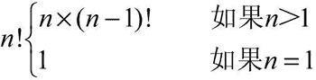
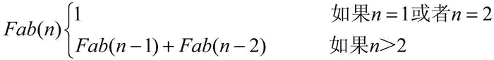

# Python 递归函数实例详解

> 原文：[`www.weixueyuan.net/a/615.html`](http://www.weixueyuan.net/a/615.html)

递归调用是高级编程语言的基本特性，它最早出现在 LISP 语言中。Python 语言也支持递归调用。通过递归调用可以简化代码，而且可以让代码和问题的数学描述非常一致。使用递归调用一般不会提升代码运行速度。

## 什么是递归调用

递归调用是一种特殊的嵌套调用，是指某个函数调用自己或者调用其他函数后再次调用自己。由于不能无限嵌套调用，所以某个递归函数一定存在至少两个分支，一个是退出嵌套，不再直接或者间接调用自己；另外一个则是继续嵌套。

一般通过函数的输入参数来决定走哪个分支，所以递归函数一般都是带有参数的。

## 递归调用的实例

#### 1、求阶乘

最常见的递归用法是求一个整数的阶乘，如 2 的阶乘等于 1×2，3 的阶乘等于 1×2×3。如果不用递归的方法，可以使用下面的方法来实现。

```

>>> def get_factorial(n):                      # 定义阶乘函数
...     ret = i = 1
..     while i <= n:                           # 从 1 到 n，依次相乘
...             ret = ret * I
...             i = i + 1
...     return ret                             # 返回值
...                                            # 阶乘函数定义结束
>>> get_factorial(3)                           # 求 3 的阶乘
6
>>> get_factorial(10)                          # 求 10 的阶乘
3628800
```

如果使用递归方法，可以定义下面的求值方案：


如果 n>1，就可以递归调用阶乘函数自己了，代码如下：

```

>>> def get_factorial(n):                              # 定义阶乘函数
...     if n == 1:                                     # 退出递归的分支
...         return 1
...     return n * get_factorial(n-1)   # 递归调用
...                                                    # 阶乘函数定义结束
>>> get_factorial(3)                                   # 求 3 的阶乘
6
>>> get_factorial(10)                                  # 求 10 的阶乘
3628800
```

递归需要注意递归的深度。由于递归会产生多次函数调用，而函数调用会消耗代码的栈空间，如果递归的深度太大，会导致栈溢出。以上面的阶乘为例，如果计算 100000 的阶乘，在一般机器上都会出现栈溢出的问题，如下所示：

```

>>> get_factorial(100000)             # 求 100000 的阶乘
Traceback (most recent call last):    # 错误信息
File "<stdin>", line 1, in <module>
  File "<stdin>", line 4, in get_factorial
  File "<stdin>", line 4, in get_factorial
  File "<stdin>", line 4, in get_factorial
  [Previous line repeated 994 more times]
  File "<stdin>", line 2, in get_factorial
RecursionError: maximum recursion depth exceeded in comparison
```

默认情况下，函数调用深度的最大值为 1000，如果达到或者超过 1000 就会出现上面的错误信息。可以通过下面的代码来查看该系统的设置。

```

>>> import sys
>>> sys.getrecursionlimit()   # 得到最大调用深度
1000                    # 目前值为 1000
```

如果希望修改该系统值，也可以通过 sys 模块的接口函数来实现。如希望最大函数调用深度为 10000，那么可以使用下面的代码进行修改：

```

>>> import sys
>>> sys.setrecursionlimit(10000)               # 设定最大调用深度
```

#### 2、斐波拉契级数

有这样一个数列：1，1，2，3，5，8，13，21，34…。其第一元素和第二个元素等于 1，其他元素等于其前面两个元素的和。用数学公式表示如下：


可以用下面的代码来实现。

```

>>> def fab(n):          # 定义斐波拉契级数
...     if n in [1, 2]:  # 如果 n=1 或者 2
...         return 1
...     return fab(n-1)+fab(n-2)    # n>2
...
>>> fab(1)                          # 斐波拉契级数的第一个元素
1
>>> fab(2)                          # 斐波拉契级数的第二个元素
1
>>> fab(8)                          # 斐波拉契级数的第 8 个元素
21
>>> fab(8)                          # 斐波拉契级数的第 9 个元素
34
```

#### 3、全排列

对于一个输入的列表，可以通过改变元素的位置来得到不同的值。全排列就是得到所有的这些排列的列表。一般对于 n 个元素的列表有 n! 种排列方式。如对于 [1,2,3] 有下面几种排列方法：

1, 2, 3
1, 3, 2
2, 1, 3
2, 3, 1
3, 1, 2
3, 2, 1

下面是用递归的方法实现的全排列。

```

>>> def sub_combination(left, right):  # left 表示左边待处理的列表
...     if len(left) > 0:              # 如果没有处理完
...         for item in left:          # 从没有处理完的元素中取出一个
...             new_right = right + [item]      # 将该元素放入到处理好的列表中
...             new_left = [x for x in left if x != item]
...             sub_combination(new_left, new_right)    # 递归继续处理
...     else:                          # 所有元素都已经处理完毕
...         print(right)               # 显示这个排列的内容
...                                    # 结束 sub_combination()的定义
>>> def combination(l):                # 已经处理的列表为空
...     return sub_combination(l, [])  # 开始处理
...                                    # 结束 combination()的定义
>>> combination(["alex", "bob", "carol"])    # 对 3 个元素的列表进行排列
['alex', 'bob', 'carol']               # 排列结果，一行一个结果
['alex', 'carol', 'bob']
['bob', 'alex', 'carol']
['bob', 'carol', 'alex']
['carol', 'alex', 'bob']
['carol', 'bob', 'alex']
```