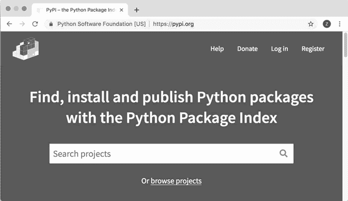
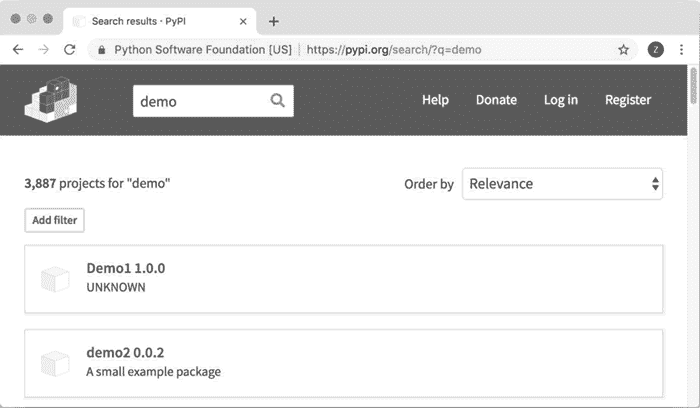

# Python 软件包的安装（3 种方法）

> 原文：[`www.weixueyuan.net/a/620.html`](http://www.weixueyuan.net/a/620.html)

有些 Python 软件包是系统自带的，如 sys，这些包在安装 Python 时已自动安装。但有些包是需要自行下载安装的，如 PIL。这些第三方的软件有的以源代码的形式提供，有的以安装包的形式提供。

安装第三方 Python 包的方法有很多种。本节将介绍一些常见的方法。 

## 1、复制源代码到系统目录

最简单的方法就是将 Python 源文件复制到 sys.path 包含的某个目录下。这样使用“imp ort 文件名”即可导入该包。

下面的代码查看 sys.path 变量包含的路径：

```

>>> import sys
>>> sys.path
['', '/anaconda3/lib/python37.zip',
'/anaconda3/lib/python3.7',         # 这里要使用的目录
'/anaconda3/lib/python3.7/lib-dynload',
'/anaconda3/lib/python3.7/site-packages',
'/anaconda3/lib/python3.7/site-packages/aeosa']
```

假定将文件 demo1.py 复制到目录 /anaconda3/lib/python3.7，就是上面的代码第 4 行指定的目录。该文件的内容如下：

```

""" just a demo package
"""
var_str = "love python"
var_int = 88
def show_usage():
    print("just to demo the package installation")
```

下面就可以使用 demo1 模块了，方法如下：

```

>>> import demo1
>>> demo1.var_int
88
>>> demo1.__doc__
' just a demo package\n'
>>> demo1.var_str
'love python'
>>> demo1.show_usage()
just to demo the package installation
```

## 2、使用 PIP 进行安装

最近比较流行的安装工具是 PIP，该工具一般在安装 Python 时已成功安装，不需要单独安装。 PIP 是客户端安装工具，安装包来自 PyPI，PIP 从 PyPI 上下载安装包，并且安装在本机。

Python 软件包的制作方需要有 PyPI 账户，这样才可以将自己编写的 Python 包推送到 PyPI 上以供其他用户使用。而对于普通用户来说，并不需要注册 PyPI 账户，只需要本地有 PIP 客户端程序即可。

PIP 提供了安装、卸载、列出安装软件包列表等功能。下面将对这些常见功能一一讲解。

#### 1) 安装

安装的常用命令有两个，一个不指定版本信息，一个指定版本信息。下面分别是它们的格式：

pip install 包名
pip install 包名==版本号

如果已经有了一个安装包，但是希望修改其版本，则需要使用下面的命令：

pip install --upgrade 包名==版本

下面是安装一个 Python 包 lin-demo 的例子。

```

$ pip install lin-demo
Collecting lin-demo             # 获得 lin-demo 包的相关信息
Downloading https://files.pythonhosted.org/packages/87          #下载安装包
/35/985a9e7d7fd66bfe82c3c83092bb14d23105e15b5738e02b6c761737c8a8/
lin_demo-0.0.1-py3-none-any.whl
Installing collected packages: lin-demo # 安装
Successfully installed lin-demo-0.0.1  # 安装成功，显示安装的版本
```

由于 PyPI 是一个开源项目，有些公司也在内部搭建了自己的 PyPI 服务器。有些专有的包可能只能从公司自己搭建的服务器上才能找到，这时就需要指定 PyPI 服务器信息，而不是使用默认的服务器。下面的命令可以指定安装包的来源：

pip install --index-url 包的来源 包名

如果一次要安装很多的软件包，尤其是在搭建开发或者运行环境时，这么一个一个地去执行安装命令进行安装显得不是很友好。

这时可以将要安装的包写在一个文本文件中，如 requirements.txt，然后使用该文本文件作为输入，将文本文件中列出的 Pyhton 包一次安装完成。这相当于是一个批处理命令，其格式如下：

pip install -r 包列表文件

这个包含包列表的文本文件的格式也很简单，一般一行写一个包的名和版本，格式还是“包名==版本”。下面便是一个例子：

CherryPy==13.0.0
Jinja2==2.10
MySQL-python==1.2.5
Routes==2.4.1
SQLAlchemy==1.1.15
Werkzeug==0.13
hpc==0.2.725
requests==2.18.4

#### 2) 卸载

卸载相对来说比较简单。由于一台机器对于某个软件包只能安装某一个版本，而且肯定是安装在本机上的，所以卸载命令没有指定版本、指定源这些参数。下面即为卸载某个包的命令格式：

pip uninstall 包名

#### 3) 查看已经安装的包

有时在 import 语句时会抛出异常，原因可能是某个软件包没有安装，或者安装的版本不对。这时可以通过下面的命令来查看所有本地已经安装的 Python 包：

pip freeze

下面是一个例子：

$ pip freeze
alabaster==0.7.12                # 0.7.12 是版本信息
allure-pytest==2.7.0
allure-python-commons==2.7.0
anaconda-client==1.7.2
…                                           # 其他的已经安装的 Python 包
anaconda-navigator==1.9.7
anaconda-project==0.8.2
appnope==0.1.0

#### 4) 查看某个包的详细情况

如果对某个包的具体作用不是很清楚，或者对其所依赖的包的情况不是很清楚，这时可以查看该包的详细描述，命令如下：

pip show 包名

下面是一个例子：

$ pip show SQLAlchemy
Name: SQLAlchemy
Version: 1.2.11                    # 版本信息
Summary: Database Abstraction Library
Home-page: http://www.sqlalchemy.org
Author: Mike Bayer
Author-email: mike_mp@zzzcomputing.com
License: MIT License
Location: /Library/Python/2.7/site-packages     # 安装位置
Requires:                              # 其所依赖的包
Required-by:                        # 依赖该包的包

#### 5) 查看服务器上的包信息

可以使用命令行来查找包，命令行格式如下：

pip search 包名

然后便可以看到与指定包名类似的包的信息，包括版本和描述信息。下面是查找带有 demo 字样的包的信息：

$ pip search demo                             # 搜索与 demo 相关的 Python 包
demo (0.1.0)                            - egg test demo.
rattail-demo (0.1.0)            - Rattail Software Demo
typosquating-demo (1.1.7)       - Typosquating demo attack.
hacmec-demo (0.0.3)             - hACMEc demo application
python-demo (0.0.3)             - python scripts demos
python-demo (0.0.3)             - python scripts demos
my-demo (2019.3.31)             - A demo for python packaging.
pysp2tf-demo (0.11)             - PySpark and TF demo
flask-demo (1.0.0)                      - demo template based on flask
agora-demo (0.1.0)              - A demo testing configuration and dataset
                                                                  management.
version-demo (0.0.3)                    - Just demo for checking how is version work
smooth-demo (0.1)                       - Tool to automate giving a demo on command line
pypi-task-demo (0.0.1)                  - PyPI demo
...                                                             # 省略一些包
jdhp-setuptools-demo (0.2)              - A snippet to test setuptools and PyPI
flask_neglog (0.0.2)                    - demo
mylittlepypiproject (0.0.4)             - A demo
flask_aide (0.0.1)                              - demo
mypypiproject (0.0.4)                   - A demo
my_little_pypi_project (0.0.4)          - A demo
ccq18-hello (0.2)                               - demos
hykpyp (0.1)                                    - this is demo
Flask-Kits (0.0.24)                     - demo
longj_demo (1.2.1)                      - this is a demo
demo-project-test-time (1.1111115)      -
openerp-web-tests-demo (7.0.406)        - Demonstration of web/javascript tests

当然，也可以在 PyPI 网站上进行查找。打开地址 https://pypi.org/，可以看到如图 1 所示的页面。


图 1 PyPI 的主页面
在搜索框内输入 demo，按 Enter 键，即可看到搜索到的与 demo 相关的 Python 包，如图 2 所示。


图 2 搜索 demo 相关的 Python 包

## 3、使用 easy_install 和 setup 进行安装

有些老的 Python 包可能没有放在 PyPI 服务器上，这时就需要使用 easy_install 来进行安装了。

使用 easy_install 安装其他软件包之前需要首先安装 easy_install 这个工具，步骤如下：

1.  从 http://peak.telecommunity.com/dist/ 下载 ez_steup.py 到本地。
2.  运行刚下载的 ez_setup.py。

这时在 Python 的系统目录下便可以看到文件 easy_install，这就是用来进行包安装的工具。现在直接运行命令“easy_install 包名”即可安装需要的包。

有些模块的源代码中包含 setup.py 文件，这时一般使用下面的命令便可以完成安装任务：

python setup.py install

例如有一个 Python 包叫作 send2trash，其源代码地址是 https://github.com/hsoft/send2trash，下载源代码，然后可以使用源代码中的 setup.py 来进行安装。

> 本节介绍的安装方法并不常用，只有在安装某些特殊的包时才会用到。多数 Python 包都可以通过 PIP 进行安装，如本教程介绍的第三方 Python 包都是可以使用 PIP 进行安装的。