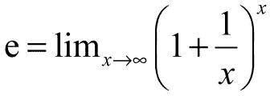

# Python math 数学库的用法

> 原文：[`www.weixueyuan.net/a/628.html`](http://www.weixueyuan.net/a/628.html)

对于基本的加、减、乘、除等运算，不用引入任何库就可以完成。但是如果要进行求正弦值、求平方根等运算，便需要使用数学库 math。

math 库通过下面语句引入：

import math

该库包含常用的常量和处理函数。

## 1) π：圆周率

π 是一个常量，可以直接使用，类型是浮点数。

```

>>> import math           # 引入库
>>> math.pi               # 查看π的值
3.141592653589793
>>> type(math.pi)         # 查看类型
<class 'float'>
```

## 2) e：自然常数

e 的类型是浮点数。和 π 一样，也是一个无理数。该数的定义方法非常多，下面是最常见的一种。



```

>>> import math               # 引入库
>>> math.e                    # 查看 e 的值
2.718281828459045
>>> type(math.e)              # 查看类型
<class 'float'>
```

## 3) sin：正弦（弧度）

sin 的输入参数是弧度而不是度，如 sin(1)=0.8414709848078965。

```

>>> math.sin(0.0)
0.0
>>> math.sin(math.pi/4.0)
0.706825181105366
>>> math.sin(math.pi/2.0)
0.9999996829318346
>>> math.sin(math.pi)
0.0015926529164868282
```

## 4) cos：余弦（弧度）

和 sin() 一样，cos 的输入参数是弧度而不是度。

```

>>> math.cos(0.0)
1.0
>>> math.cos(math.pi/4.0)
0.7073882691671998
>>> math.cos(math.pi/2.0)
0.0007963267107332633
>>> math.cos(math.pi)
-0.9999987317275395
```

## 5) tan：正切（弧度）

tan 输入的参数是弧度而不是度。

```

>>> math.tan(0.0)
0.0
>>> math.tan(math.pi/4.0)
0.9992039901050427
>>> math.tan(math.pi/2.0)
1255.7655915007897
>>> math.tan(-math.pi/2.0)
-1255.7655915007897
>>> math.tan(-math.pi/4.0)
-0.9992039901050427
```

## 6) atan：余切（弧度）

atan 的输入参数是弧度而不是度。

```

>>> math.atan(0.0)
0.0
>>> math.tan(math.pi/4.0)
0.9992039901050427
>>> math.tan(math.pi/2.0)
1255.7655915007897
>>> math.tan(math.pi)
-0.0015926549364072232
>>> math.tan(-math.pi/4.0)
-0.9992039901050427
>>> math.tan(-math.pi/2.0)
-1255.7655915007897
```