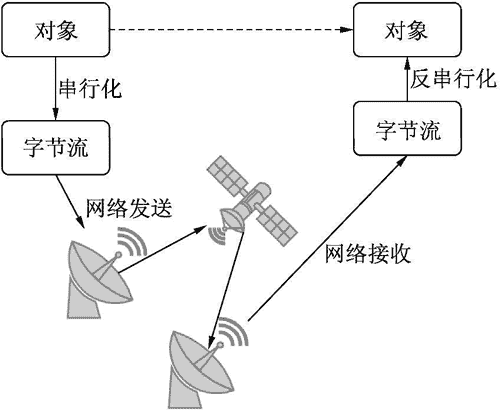
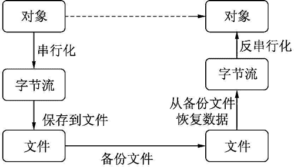

# Python pickle 模块的用法

> 原文：[`www.weixueyuan.net/a/633.html`](http://www.weixueyuan.net/a/633.html)

串行化主要用于网络传输或者持久化。我们知道，网络上的数据都是字节流，如果希望将某个对象传送给远端的机器，首先就必须将其转换成字节流，然后才可以在网络上传输。文件也是字节流，如果希望将某个对象保存到文件中，首先也是需要将其转换成字节流，然后才可以保存。

与串行化对应的是反串行化，即从字节流中恢复出原来的对象。这样传输才有意义。

## 基本流程

将串行化和反串行化与网络传输合并起来，便可以得到如图 1 所示的描述过程。


图 1 串行化和反串行化
如果是通过文件永久保存或备份数据，则可以使用图 6-2 来表示该过程。


图 2 对象保存的过程
可以看出，串行化在这两个领域是非常有用的。串行化的基本要求即是恢复的对象要等价于原来的对象，不能有信息丢失现象。

## pickle 用法

串行化相关的模块很多，如 pickle、cpickle、json 和 marshal 等，它们都在转换效率和压缩效率上下了不少功夫，但其基本功能大同小异。所以本教程并不会将这些模块都进行详细介绍，主要介绍 pickle 库的用法。

pickle 不用安装，其是 Python 自带的包，使用时仅需要引入该包即可。方法如下：

import pickle

pickle 包主要提供了两个功能，一个是将对象转换成字节流，即串行化；另一个是将字节流转换成对象，即反串行化。每个功能又分出了两个分支，一个是仅转换成字节流，另一个是转换成字节流并保存到文件中去。所以 pickle 包主要有 4 个接口，如表 3 所示。

表 3 pickle 包的主要接口串行化

| 操 作 | 串行化 | 反串行化 |
| 转换+文件操作 | dump() | load() |
| 转换 | dumps() | loads() |

#### 1) dump（对象，文件对象）：串行化并保存到文件

dump 的文件对象要求是可写的。

```

>>> a = range(10)
>>> a
[0, 1, 2, 3, 4, 5, 6, 7, 8, 9]
>>> fd = open("tmp,bin", "wb")
>>> fd
<open file 'tmp,bin', mode 'wb' at 0x000000000277E8A0>
>>> pickle.dump(a, fd)
>>> fd.close()
>>> fd2 = open("tmp,bin", "rb")
>>> a2 = pickle.load(fd2)
>>> a2
[0, 1, 2, 3, 4, 5, 6, 7, 8, 9]
```

#### 2) load（文件对象）：从文件读数据并恢复出对象

load 函数从文件对象中读出一个对象，返回值就是该对象。上面的例子中演示了如何使用该接口函数。

#### 3) dumps（对象）：仅串行化

dumps 函数返回一个字节流。

```

>>> a = range(10)
>>> a
[0, 1, 2, 3, 4, 5, 6, 7, 8, 9]
>>> s =  pickle.dumps(a)
>>> s
'(lp0\nI0\naI1\naI2\naI3\naI4\naI5\naI6\naI7\naI8\naI9\na.'
>>> type(s)
<type 'str'>
>>> b = pickle.loads(s)
>>> b
[0, 1, 2, 3, 4, 5, 6, 7, 8, 9]
```

#### 4) loads（字节流）：从字节流中恢复出对象

输入应该是 dumps() 的返回值。注意，不要随意构造字节流，因为并不是所有的字节流都能被解析出来。该接口函数的用法在上面的例子中已经演示过了。

另外，可不可以将多个对象保存到一个文件中呢？答案是可以。如果需要写入多个对象，则可以多次调用 dump() 函数。同样，在恢复时也要多次调用 load() 函数。它们之间的对应关系是，第一次 load() 得到的对象是第一次 dump() 对应的对象，第二次 load() 得到的对象是第二次 dump() 对应的对象，简单来说就是先进先出。

下面的代码演示了这个用法。

```

>>> a1 = range(3)
>>> a1
[0, 1, 2]
>>> a2 = range(5)
>>> a2
[0, 1, 2, 3, 4]
>>> fd = open("tmp,bin", "wb")
>>> pickle.dump(a1, fd)              # 先写入短的列表
>>> pickle.dump(a2, fd)              # 再写入长的列表
>>> fd.close()
>>> fd2 = open("tmp,bin", "rb")
>>> b1 = pickle.load(fd2)
>>> b1               # 先读出来的是短的列表
[0, 1, 2]
>>> b2 = pickle.load(fd2)
>>> b2               # 再读出来的是长的列表
[0, 1, 2, 3, 4]
>>> fd2.close()
```