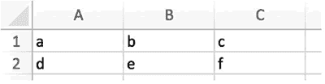

# Python csv 模块：处理 csv 文件

> 原文：[`www.weixueyuan.net/a/701.html`](http://www.weixueyuan.net/a/701.html)

csv 文件本质上是文本文件，用来保存表格数据，它使用逗号来分隔行内的单元，使用换行符来分隔不同的行。下面是一个普通的 csv 文件，包含两行和两列，内容如下：

第一行第一列，第一行第二列
第二行第一列，第二行第二列

在 Excel 中的显示效果如图 1 所示。


图 1 普通的 csv 文件
如果某个单元格中包含“，”分隔符，那么它将使用双引号将单元格的内容包裹起来。如下面的 csv 文件内容就是包裹有“，”分隔符的情形。

"包括,的单元",第一行第二列
第二行第一列,第二行第二列

注意，第一行第一列是用双引号包裹的，显示效果如图 2 所示。


图 2 带有“，”分隔符的单元
如果某个单元格包含多行，也是将该单元格的内容包裹在双引号内。例如，下面的 csv 文件的第一行第一列就包含多行。

"包含换行符的单元
第 2 行
第三行",第一行第二列
第二行第一列,第二行第二列

在 Excel 中的显示效果如图 3 所示。


图 3 包含多行内容的单元格
如果单元格的内容包含双引号呢？其还是用双引号来包裹，内容中的双引号用两个连续的双引号来表示。例如下面的 csv 文件的第一行第一列就包含“””字符：


图 4 带有双引号的单元格
可以看出 csv 文件的格式还是比较简单的，通过“，”和“””就能完整表示一个仅包含文本内容的表格数据。在 Python 中，可以不通过操作文本文件的方式来对 csv 文件进行处理，因为其可以通过很多库来直接操作单元格内容，而不用关心 csv 文件格式的细节。本节将介绍一个比较常见的处理 csv 文件的模块——csv。

csv 模块是 Python 的一个内置模块，不需要安装只需要在使用之前将其引入即可，方式如下：

import csv

对 csv 文件的操作主要有两个，一个是读入，一个是写出。首先来介绍读入，在 csv 模块中有一个类 reader，该类实例对象是可迭代的，就是可以用 for...in... 语句来变量所有的 csv 的行。同时其还有一个属性 line_num，表示当前读入的行号。

下面以图 1 所示的 csv 文件为例来演示相关操作：

```

>>> import csv                                  # 引入 csv 模块
>>> reader_obj = csv.reader(open('demo1.csv', 'r', encoding="utf-8"))
>>> for line in reader_obj:                             # 对每行进行操作
...   print("line number: %d" % reader_obj.line_num)    # 显示当前行号
...   print("content: %s" % str(line))          # 显示当前行的内容
...   print("")                                 # 输出换行
...                                             # 结束 for 循环
line number: 1                                  # 行号为 1
content: ['第一行第一列', '第一行第二列']         # 内容为列表
                                                # 第 6 行的输出
line number: 2                                  # 行号为 2
content: ['第二行第一列', '第二行第二列']         # 第二行的内容
```

下面是一个查找诈骗电话的例子。诈骗电话有这样一个特点，就是这些电话仅往外拨，从来不接听别人的电话。现在我们拿到一个完整的通话记录，内容显示如图 5 所示。


图 5 通话记录
其中第一列是呼叫方的号码，第二列是被叫方的电话号码，第三列是呼叫开始的时间，第四列是通话时长。我们希望通过这些数据来找到其中的诈骗电话号码。我们依次读出所有的行，然后在呼叫方号码列表中查找没有出现在被叫方号码列表的号码，它们就可能是诈骗电话号码。

实现代码如下：

```

import sys, csv
# 打开通话记录文件
if sys.version_info.major == 3: # python3
    f = open("telephone.csv", "r",encoding="utf-8", newline="\n")
else:                                          # Python 2
    f = open("telephone.csv", "r")
reader = csv.reader(f)
caller_list = []                               # 呼叫方号码列表
callee_list = []                               # 被叫方号码列表，最开始都为空
for record in reader:                          # 对每个记录进行处理
    # 第一行是表头，不进行处理
    if reader.line_num == 1:
        continue
    caller_list.append(record[0])       # 记录下所有的呼叫号码
    # 记录下所有的被呼叫号码
    callee_list.append(record[1])
caller_list = set(caller_list)          # 去掉重复的呼叫号码
f.close()                               # 关闭文件
# 对于每个呼叫号码
for caller in caller_list:              # 如果它没有被呼叫过，那么标定为骗子号码
    if caller not in callee_list:
        print(caller, "is Cheat Telephone Number")
```

运行后的输出如下：

$ python cheatTel1.py
13243767000 is Cheat Telephone Number

下面我们来介绍将数据输出到 csv 文件中的方法。在 csv 模块中有一个 writer 类，其提供 writerow() 和 writerows() 两个接口函数。使用这两个接口函数便可以将列表数据输出到 csv 文件中。

下面是一个简单的例子，其使用 writerow() 来产生一个 csv 文件：

```

import csv
csv_writer_obj = csv.writer(open("writeDemo1.csv", "w"))
csv_writer_obj.writerow(("a", "b", 12, 24.6))
```

输出文件 writeDemo1.csv 的内容在 Excel 中的显示如图 6 所示。


图 6 writeDemo1.csv 文件的内容
在输出时并不要求每行的列数相同，例如下面的代码，其输出了三行，这三行的列数分别为 4、2、3。

```

import csv
csv_writer_obj = csv.writer(open("writeDemo2.csv", "w"))
csv_writer_obj.writerow(("a", "b", 12, 24.6))
csv_writer_obj.writerow(("c", "d"))
csv_writer_obj.writerow(("e", "", "1"))
```

输出 csv 文件，内容如图 7 所示。


图 7 writeDemo2.csv 文件的内容
另外一个接口函数是 writerows()，顾名思义，该接口函数可以一次写入多行。下面的例子便是将一个列表写入到 csv 文件中。

```

import csv
data = [                          # 列表，每个元素代表一行
    ["a", "b", "c"],
    ["d", "e", "f"],
]
csv_writer_obj = csv.writer(open("writeDemo3.csv", "w"))
csv_writer_obj.writerows(data)
```

输出 csv 文件，内容如图 8 所示。


图 8 writeDemo3.csv 的内容