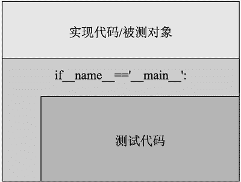
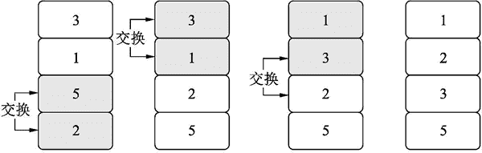

# Python assert 实现软件测试

> 原文：[`www.weixueyuan.net/a/708.html`](http://www.weixueyuan.net/a/708.html)

Python 对于测试非常看重，例如测试中最常见的操作——断言 assert，其在 Python 中就是一个关键字而不是一个函数。而在 C 语言中，assert 只是一个普通的函数。从这点也可以看出，Python 将测试当作最基础的部分。

可以通过使用下面的代码来查看 Python 语言定义的关键字：

```

>>> import keyword                                     # 引入模块 keyword
>>> keyword.kwlist                                     # 得到所有的关键字
# 关键字列表
['False', 'None', 'True', 'and', 'as', 'assert', 'async', 'await',
'break', 'class', 'continue', 'def', 'del', 'elif', 'else',
'except', 'finally', 'for', 'from', 'global', 'if', 'import',
'in', 'is', 'lambda', 'nonlocal', 'not', 'or', 'pass',
'raise', 'return', 'try', 'while', 'with', 'yield']
```

可以直接是使用 assert 在源代码中对其进行测试，常用的做法如图 1 所示。


图 1 将测试代码和实现功能放入同一个文件
下面看一个简单的例子，假定自定义了一个模块 sampleAssert，其代码如下：

```

def int_list_sort(input_list):          # 被测对象，完成对输入的整数列表排序
    input_list.sort()                   # 完成排序
if __name__ == "__main__":                      # 判断条件，里面的内容是用来测试的
    def test_normal_positive_input():                   # 定义一个测试用例
        input_list = [3, 5, 9, 1, 8]
        int_list_sort(input_list)
        assert input_list == [1, 3, 5, 8, 9]
        print("test_normal_positive_input: PASS")
    test_normal_positive_input()                         # 执行测试用例
```

如果我们是 import（引入）该模块，case 是不会执行的，即第 3 行开始的块是不会执行的，所以包含在该块内的测试用例定义不会被看到，测试用例也不会被执行。

```

$ python                                       # 启动解释器，Python 3
Python 3.7.3 (default, Mar 27 2019, 16:54:48)
[Clang 4.0.1 (tags/RELEASE_401/final)] :: Anaconda, Inc. on darwin
Type "help", "copyright", "credits" or "license" for more information.
>>> import sampleAssert                        # 引入我们刚才定义的模块
>>> sampleAssert.test_normal_positive_input()  # 测试函数是不可见的
Traceback (most recent call last):
  File "<stdin>", line 1, in <module>
AttributeError: module 'sampleAssert' has no attribute 'test_normal_
        positive_input'
>>> list_obj = [3, 1, 6, 100, 98, 9]
>>> sampleAssert.int_list_sort(list_obj)         # 被测对象是可见的
>>> list_obj
[1, 3, 6, 9, 98, 100]                            # 排序后的结果
```

如果是直接运行该脚本，则测试用例就会被触发。

```

$ python sampleAssert.py
test_normal_positive_input: PASS
```

下面我们来实现一个冒泡排序法，其仅对整数列表有效。冒泡排序法是最简单的排序法，其通过交换相邻的元素来实现排序。下面以对包含 4 个元素 3、1、5、2 的列表进行排序为例来解释这个过程，如图 2 所示。


图 2 冒泡排序
首先从尾部，也就是下部依次查找不符合排列要求的相邻两个数，第一次找到的是 5 和 2，交换它们，然后继续查找得到 3 和 1 这两个不符合要求的相邻数，交换它们。通过这一轮的交换，最小的数交换到了第一个元素。然后继续其他记录的排序，第二轮可以保证第二小的数排到第二个位置上。以此类推，最多经过 n-1 轮就可以完成所有数据的排序。

> 在这个例子中，经过了两轮就完成了所有数据的排序。

下面是完整的实现代码和相关测试代码：

```

def bubble_sort(input_list):                    # 被测函数，冒泡排序
    if type(input_list) is not type([]):        # 如果输入参数不符合要求
        print("Invalid Input Type")
        return None
    for x in input_list:                                # 有元素不是整数，返回 None
        if type(x) != int:
            return None
    input_len = len(input_list)
    print()
    print("Origin:", input_list)
    if input_len <= 1:                               # 没有元素或者仅包含一个元素
        return input_list
    for x in range(input_len-1):                # 如果顺序不对，和旁边的元素交换
        swap_happens = False
        for y in range(input_len-1, x, -1):
            if input_list[y-1] > input_list[y]:
                input_list[y-1], input_list[y] = input_list[y], input_
                        list[y-1]
                swap_happens = True
        if swap_happens == False:               # 上一轮没有交换数据，已经排序完毕
            break
        print("Temp %d:" % x, input_list)
    return input_list                                   # 返回排序完毕的列表
if __name__ == "__main__":                              # 如果是运行该脚本而不是引入该脚本
    import random                                               # 测试代码开始
    def test_empty_input():                             # 如果输入的列表为空
        input = []
        output = bubble_sort(input)
        assert type(output) == type([])
        assert len(output) == 0
    def test_invalid_input():                   # 如果输入的不是列表
        output = bubble_sort(1)
        assert output is None
    def test_one_element():                     # 如果列表仅包含一个元素
        input = [1, ]
        output = bubble_sort(input)
      assert type(output) == type([])
      assert len(output) == 1
      assert output[0] == 1
    def test_neg_one_element():         # 如果列表仅包含一个元素，而且不是整数
      input = ["name", ]
       output = bubble_sort(input)
       assert output is None
    def test_two_element():                     # 如果列表仅包含两个元素
       input = [18, 8]
        output = bubble_sort(input)
        assert type(output) == type([])
        assert len(output) == 2
        assert output[0] == 8
        assert output[1] == 18
    def test_neg_two_element():         # 如果列表包含两个元素，但并不都是整数
        input = [1, "name"]
        output = bubble_sort(input)
        assert output is None
    def test_normal_pos():                              # 正常输入
        input = [88, 1, 20, 8, 9, 21, 98, 76]
        output = bubble_sort(input)
        expected_output = [1, 8, 9, 20, 21, 76, 88, 98]
        assert output == expected_output
    def test_dup_elements():                    # 如果有重复的元素
        input = [88, 1, 20, 8, 9, 21, 98, 8, 76]        # 两个 8
        print("input:", input)
        output = bubble_sort(input)
        print("outpout:", output)
        expected_output = [1, 8, 8, 9, 20, 21, 76, 88, 98]
        assert output == expected_output
    def test_all_same():                                # 如果所有元素都相等
        input = [8, 8, 8, 8, 8, 8]              # 所有的输入元素相同
        output = bubble_sort(input)
        expected_output = [8, 8, 8, 8, 8, 8]
        assert output == expected_output
    def random_test():                                  # 随机生成测试数据
        # 生成随机的输入数据
        expected_list_len = random.randint(10, 100)
        input_list = []
        for x in range(expected_list_len):
            input_list.append(random.randint(-100, 100))
        input_len = len(input_list)
        org_input = input_list.copy()           # 备份一下元素数据
        output = bubble_sort(input_list)
        print("org_input", org_input)
        #input_len = len(org_input)
        assert len(output) == expected_list_len
        for pos in range(input_len-1):
            val = output[pos]
            # 该数据在原始列表中存在
            # 这样可以确保所有结果列表中的数据都是来自输入列表
            assert val in org_input
            # 而且其出现的次数和元素列表中出现的次数一致
            # 这可保证输入列表中的数据不会丢失
            assert output.count(val) == org_input.count(val)
            # 保证有序，从小到大
            assert val <= output[pos+1]
    def test_random_data():                             # 随机输入测试
        # 进行 100 轮随机输入的测试
        for x in range(100):
            random_test()
    # 执行所有的测试
    test_empty_input()
    test_invalid_input()
    test_one_element()
    test_neg_one_element()
    test_two_element()
    test_neg_two_element()
    test_normal_pos()
    test_dup_elements()
    test_all_same()
    test_random_data()
```

可以发现测试代码的长度比被测代码的长度还要长，这是软件测试中，尤其是功能测试部分常见的现象。另外一个现象是对于针对特殊使用场景的测试用例数量比较大。多数情况下，问题不会隐藏在常用的使用场景，而多隐藏在这些不常见的使用场景中，所以针对这些特殊使用场景的测试用例的设计需要多下功夫。