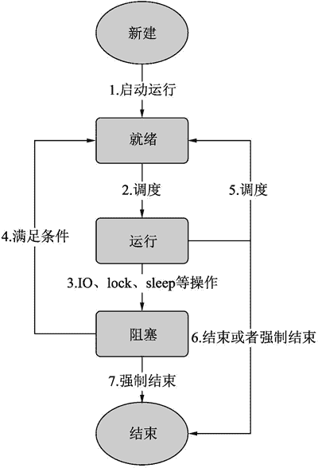

# 什么是多线程，Python 多线程编程

> 原文：[`www.weixueyuan.net/a/665.html`](http://www.weixueyuan.net/a/665.html)

早在 20 世纪 60 年代，进程的概念就出现了。但进程是资源的拥有者，进程的创建、销毁、调度代价都比较高，所以出现了对轻量级进程的需求。

到了 20 世纪 80 年代，出现了线程，类似于进程，线程可以独立运行，但使用的代价比进程小很多。

线程一般包括程序、数据和线程控制块，其中线程控制块包括以下信息：

1.  线程状态。
2.  在线程处于非运行态时，其上次运行结束时的处理器状态，主要是寄存器的状态。
3.  堆栈信息。

线程是独立调度和分派的基本单位，线程切换消耗的资源比较少。在多核系统中，多线程可以完全并发执行，这样可以完全发挥硬件的计算能力。同一个进程内的线程共享很多资源，如文件、定时器等，所以线程通信是很方便的。

## 线程状态

线程可以处于不同的状态，随着时间推移，线程在不同状态之间迁移。线程有 5 种状态，分别是新建、就绪、运行、阻塞和结束。

图 1 描述的便是线程在这些状态之间的转换。

图 1 线程状态迁移图
最开始是创建一个线程，这个新创建的线程就处于“新建”状态，这是所有线程的起点。线程在该状态是可以进行各种配置的，如入口函数、栈的大小等。

操作 1 表示应用程序启动了该线程，这时线程将进入到“就绪”状态。处于就绪状态的线程还没有真正运行，但是已经满足了运行的全部条件。

操作 2 表示操作系统给其分配了处理器资源，现在线程就开始执行了，线程切换到新的“运行”状态。

操作 3 表示线程运行时碰到了问题，暂时不能继续执行下去了，如要读取文件数据，但该数据目前还没有捣入到系统，这时操作系统会将该线程调度出来并进入到“阻塞”队列中。这时该线程分配的处理器资源便可以释放出来并分配给其他“就绪”状态的线程使用。

操作 4 表示线程需要的资源已经就绪，现在该线程可以运行了。

操作 5 表示某个正在运行的线程被操作系统调度到就绪队列。由于处理器资源有限，处于“就绪”状态的线程可能数目远远大于处理器的个数，因此任意时刻只能一部分可运行的线程在运行。但也不能一直让某些线程运行而让其他线程处于等待状态，这是不合理的。所以操作系统会定时将一些运行中的线程调度处理，这样空闲出来的处理器就可以给其他等待中的线程使用。

操作 6 表示线程自行退出或者被强制退出。自行退出就是线程代码执行完成，这种方式比较优雅；强制退出就是外部代码强制要求线程停止运行，如主线程退出了，那么所有该进程内的线程都会被强制退出。强制退出可能导致某些运行结果没有来得及保存而丢失。自行退出就类似于关机，强制退出则类似于断电。

操作 7 就是强制退出。

## 主线程

在一个进程中，第一个启动的线程就是主线程，其具有如下特点：

*   其他线程都是由主线程直接或者间接创建出来的，我们可以画一棵线程树，主线程就是树的根，其他线程就是树上的节点。
*   主线程退出会导致进程退出，该进程内的所有其他线程会被强制退出。

我们常说的一个进程至少包含一个线程，这个至少包含的线程就是主线程。

另外，在后面的章节中还会经常提到几个线程相关的概念，这里先简要介绍一下这些概念。

*   线程 id：每个线程都有一个自己的 id，就像 Python 中任何对象都有一个自己的 id 一样。不同的线程其 id 是不同的。
*   父线程：除了主线程外，其他所有的线程都有一个父线程。这个父线程就是创建该线程的线程。在程序启动时，就只有一个主线程，这个线程可能会启动其他线程，这些新启动的线程的父线程就是主线程。

## Python 中的线程

Python 语言自然支持线程，不必另行安装特殊的软件包。

Python 系统自带了两个线程相关的包，一个是 thread，其要求用户提供一个函数作为线程的入口函数；另外一个包是 threading，其要求的输入是一个派生自 threading.Thread 类的实例对象。这两个包只是提供的接口函数不同，其内部的线程概念是一样的，后面分别对它们进行介绍。