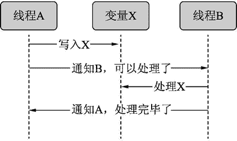

# Python 线程同步实现方式详解

> 原文：[`www.weixueyuan.net/a/671.html`](http://www.weixueyuan.net/a/671.html)

一个线程启动后，其会自行运行。但如果希望它们能同步运行，应该怎么做呢？

举个简单的例子，有两个线程 A 和 B，A 负责从网络上读取数据，保持到变量 X 中，B 负责处理变量 X 中的数据，这时线程 B 就需要和 A 同步。也就是说 B 需要等 A 给其一个信号，其才可以开始去做自己的事情。同样，B 完成了任务后也需要通知 A，告诉 A 变量 X 中的数据已经处理完了，可以将新的数据放入 X 了。

图 1 表示了这个过程：


图 1 线程同步
实现线程同步的方式有很多种，下面分别进行介绍。

## 1、thread.Lock 线程锁

借助锁，可以得到一些排他的资源。例如，为某个资源 A 加上锁 L，如果要使用该资源，则必须得到锁 L，这个锁可以保证在任意时候，只有一个线程可以得到它。其他线程如果想得到已经被别的线程得到的锁，只能等待锁的拥有者主动释放锁。

这个锁类提供了 acquire() 和 release() 两个接口函数。release() 表示某线程已经完成了任务，其他线程可以开始自己的工作了；acquire() 表示某线程计划做某个工作，请在可以开始时通知它。

所以做某件工作可以用下面三步构成：

*   acquire()：等条件成熟了告诉某线程。
*   do_the work()：条件成熟了，开始工作。
*   release()：工作完成，告诉其他线程可以开始工作了。

现在回到前面的例子上，我们需要两个锁。一个用来写变量 X，用 write_lock 来表示；一个用来读变量 X，用 read_lock 来表示。写变量 X 的过程如下：

write_lock.acquire()
X=var
read_lock.release()

读变量 X 的过程如下：

read_lock.acquire()
var=X
write_lock.release()

下面是完整的代码。

```

import sys, time                        # 引入时间库
if sys.version_info.major == 2:         # Python 2
import thread
else:                                   # Python 3
import _thread as thread               # 创建两个锁，一个用来读，一个用来写
read_lock = thread.allocate_lock()
write_lock = thread.allocate_lock()
X = 0                                   # 变量 X，用来保存两个线程之间交换的数据
def write_thread_entry():               # 写线程的入口函数
    global X, read_lock,  write_lock
    for i in range(2, 10, 1):
        write_lock.acquire()
        X = i
        read_lock.release()
def read_thread_entry():                # 读线程的入口函数
    global X, read_lock, write_lock
    while True:
        read_lock.acquire()
        print("Processing X = %d" % X)
        write_lock.release()
def start_threads():                    # 启动线程
    read_lock.acquire()                 # read_lock 处于被占用状态
    t1 = thread.start_new_thread(write_thread_entry, tuple())
    t2 = thread.start_new_thread(read_thread_entry, tuple())
    time.sleep(5)
if __name__=='__main__':                # 如果是运行该脚本而不是 import 该文件
    start_threads()
```

运行结果如下：

$ python lockDemo1.py         # 运行脚本
Processing X = 2            # 程序第 20 行的输出
Processing X = 3            # 当前 X 的值
Processing X = 4
Processing X = 5
Processing X = 6
Processing X = 7
Processing X = 8
Processing X = 9

## 2、threading.Lock 线程锁

threading 包也包含一个类 Lock，其提供的函数也是 acquire() 和 release()，这两个函数和 thread.Lock 类的函数一样。但是其并没有提供 allocate_lock() 接口函数来创建 Lock，需要我们用构造函数自己创建。

下面的代码使用几乎一样的方法实现了前面的例子：

```

import sys, time
import threading                       # 引入线程库
read_lock = threading.Lock()
write_lock = threading.Lock()
X = 0                                  # 变量 X，读写线程交互信息的载体
def write_thread_entry():
    global X, read_lock,  write_lock
    for i in range(2, 10, 1):
        write_lock.acquire()
        X = i
        read_lock.release()
def read_thread_entry():
    global X, read_lock, write_lock
    while True:
        read_lock.acquire()
        print("Processing X = %d" % X)
        write_lock.release()
def start_threads():
    read_lock.acquire()         # read_lock 处于被占用状态
    t1 = threading.Thread(target=write_thread_entry)
    t1.setDaemon(True)
    t1.start()
    t2 = threading.Thread(target=read_thread_entry)
    t2.setDaemon(True)
    t2.start()
    time.sleep(5)
if __name__=='__main__':
    start_threads()
```

运行结果如下：

$ python lockDemo1.py
Processing X = 2          # 程序第 16 行的输出
Processing X = 3          # 显示当前 X 的值
Processing X = 4
Processing X = 5
Processing X = 6
Processing X = 7
Processing X = 8
Processing X = 9

## 3、threading.RLock 可重入锁

前面介绍的 threading.Lock 有一个问题，就是对某个 threading.Lock 对象在同一个线程内重复调用两次 acquire() 会发生锁死现象。

下面的代码演示了这个情况：

```

import sys, time
import threading
lock_obj1 = threading.Lock()            # 创建锁对象
def thread_entry():                     # 子线程入口函数
    global lock_obj1                    # 使用全局变量 lock_obj1
    print("Child Thread: thread_entry() Is Running")
    lock_obj1.acquire()                         # 第一次调用 acquire()，成功
    print("Child Thread: acquire(1) Finished")
    lock_obj1.acquire()                         # 第二次调用 acquire()，阻塞
            # 我们看不到下面的两句输出
    print("Child Thread: acquire(2) Finished")
    print("Child Thread: Quit")
def start_threads():                            # 主线程
    global lock_obj1
    t1 = threading.Thread(target=thread_entry)
    t1.setDaemon(True)
    t1.start()
    time.sleep(5)
print("Main Thread: Quit")
if __name__=='__main__':            # 作为脚本执行
    start_threads()
```

运行结果如下：

$ python lockDemo3.py
Child Thread: thread_entry() Is Running
Child Thread: acquire(1) Finished
Main Thread: Quit

可以看到子线程在第二次调用 acquire() 时卡住了。threading.RLock() 类就是为了解决这个问题的，其用法和 Threading.Lock() 基本相同，区别是如果某个线程调用了自己已经调用过的 RLock，不会被阻塞。

下面将前面代码的第三行：

lock_obj1 = threading.Lock()

修改为

lock_obj1 = threading.RLock()

其他都保持不变，再次运行后结果如下：

$ python lockDemo4.py
Child Thread: thread_entry() Is Running
Child Thread: acquire(1) Finished
Child Thread: acquire(2) Finished
Child Thread: Quit
Main Thread: Quit

这里还有一个特别的地方，就是 release() 被调用的次数要求和 acquire() 被调用的次数相同，否则其他的非所有者线程还是会被卡在 acquire() 上。

某个线程成功执行 acquire() 后，该线程就是该 threading.RLock 对象的所有者。threading.RLock 对象内部有一个成员变量 _RLock__count，其类型为整数。如 _RLock__count=0，表示其没有被任意线程所有，因而任意线程都可以成功执行 acquire() 来获得该 threading.RLock 对象；如果 _RLock__count>0，则只有上次成功执行 acquire()的所有者线程才可以成功执行 acquire()，其他线程都会被阻塞。成功执行 acquire() 后，_RLock__count 的值会加一；而成功执行 release() 后，_RLo ck__count 的值会减一。

```

>>> import threading                   # 引入库
>>> lock_obj1 = threading.RLock()      # 创建 RLock 对象
>>> lock_obj1._RLock__count            # 查看当前的值
                                # =0 表示还没有所有者
>>> lock_obj1.acquire()                # 获得该 RLock 对象
True
>>> lock_obj1._RLock__count            # 查看值
                                       # 已经被 acquire()一次了
>>> lock_obj1.acquire()                # 继续获得 RLock，同一个线程
1
>>> lock_obj1._RLock__count
2
>>> lock_obj1.release()                # 释放一次，值应该减一
>>> lock_obj1._RLock__count
1
>>> lock_obj1.release()
>>> lock_obj1._RLock__count            # =0 表示没有所有者了
0
```

## 4、threading.Condition 条件变量

条件变量提供两个接口，一个是 wait()，表示等待有线程调用 notify()；另一个是 nodify()，表示激活处于等待的线程。

下面是一个简单的例子，其每隔 3 秒就将工作线程唤醒一次。注意在调用 wait() 和 notify() 之前要调用 acquire()，在调用 wait() 和 notify 之后要调用 release()。

```

import sys, time
import threading                                # 引入线程库
def thread_entry(id, condition_obj):            # 线程入口函数
    print("Worker Thread %d: thread_entry() Is Running" % id)
    for round in range(3):                      # 循环 3 次
        condition_obj.acquire()                 # 等待
        condition_obj.wait()
        print("Worker Thread %d: is Doing Work" % id)
        condition_obj.release()
        time.sleep(0.1*id)
    print("Worker Thread %d : Quit" % id)       # 线程结束
def start_threads():                            # 创建线程
    condition_obj = threading.Condition()       # 创建 condition
    t1 = threading.Thread(target=thread_entry, args=(1, condition_obj))
    t1.start()                                  # 启动线程
    time.sleep(0.1)                             # 休眠 0.1 秒
    t2 = threading.Thread(target=thread_entry, args=(2, condition_obj))
    t2.start()
    for round in range(3):
        time.sleep(2)
        condition_obj.acquire()
        condition_obj.notify_all()               # 通知子线程开始工作
        condition_obj.release()
if __name__=='__main__':
    start_threads()
```

运行结果如下：

$ python conditionDemo1.py
Worker Thread 1: thread_entry() Is Running
Worker Thread 2: thread_entry() Is Running
Worker Thread 1: is Doing Work
Worker Thread 2: is Doing Work
Worker Thread 1: is Doing Work
Worker Thread 2: is Doing Work
Worker Thread 1: is Doing Work
Worker Thread 2: is Doing Work
Worker Thread 1 : Quit
Worker Thread 2 : Quit

如果觉得使用 acquire() 和 release() 比较麻烦，也可以用 with 语句，如

with condition_obj:
condition_obj.notify_all()

等效于：

condition_obj.acquire()
condition_obj.notify_all()
condition_obj.release()

现在代码可以写成：

```

import sys, time
import threading                                        # 引入线程库
def thread_entry(id, condition_obj):
    print("Worker Thread %d: thread_entry() Is Running" % id)
    for round in range(3):                              # 循环 3 次
        with condition_obj:
        condition_obj.wait()
        print("Worker Thread %d: is Doing Work" % id)
time.sleep(0.1*id)
    print("Worker Thread %d : Quit" % id)
def start_threads():
condition_obj = threading.Condition()
    t1 = threading.Thread(target=thread_entry, args=(1, condition_obj))
    t1.start()
time.sleep(0.1)
    t2 = threading.Thread(target=thread_entry, args=(2, condition_obj))
    t2.start()
    for round in range(3):                              # 循环 3 次
time.sleep(2)
        with condition_obj:                             # 进入竞争区
        condition_obj.notify_all()                      # 通知子线程
if __name__=='__main__':
start_threads()
```

## 5、threading.Semaphore 信号量

Semaphore 和 Lock 的作用相似，其不同之处是 Lock 只能被一个线程获得，其他的线程都只能等待，而 Semaphore 可以被 N 个线程同时获得，N 也可以等于 1。

下面是其用法演示：

```

import sys, time
import threading                        # 引入线程库
def thread_entry(id, Semaphore_obj):    # 线程入口函数
    print("Worker Thread %d: thread_entry() Is Running" % id)
    time.sleep(1.8)
    for round in range(3):              # 循环 3 次
        Semaphore_obj.acquire()
        print("Worker Thread %d: is Doing Work" % id)
        time.sleep(0.1*id)
    print("Worker Thread %d : Quit" % id)
def start_threads():
    Semaphore_obj = threading.Semaphore(3)      # 创建 3 个元素的 sem
    t1 = threading.Thread(target=thread_entry, args=(1, Semaphore_obj))
    t1.start()
    t2 = threading.Thread(target=thread_entry, args=(2, Semaphore_obj))
    t2.start()
    t3 = threading.Thread(target=thread_entry, args=(3, Semaphore_obj))
    t3.start()
    t4 = threading.Thread(target=thread_entry, args=(4, Semaphore_obj))
    t4.start()
    for round in range(9):
        time.sleep(2)
        print("Release() is Called")      # 释放 sem
        Semaphore_obj.release()
    print("Main Thread Quit")
if __name__=='__main__':
    start_threads()
```

运行结果如下：

$ python semaphoreDemo1.py                  # 运行脚本
Worker Thread 1: thread_entry() Is Running  # 子线程启动
Worker Thread 2: thread_entry() Is Running
Worker Thread 3: thread_entry() Is Running
Worker Thread 4: thread_entry() Is Running
Worker Thread 2: is Doing Work              # 仅有 3 个线程可以并行工作
Worker Thread 1: is Doing Work
Worker Thread 3: is Doing Work
Release() is Called                     # 释放 sem，这时有一个子线程可以工作了
Worker Thread 4: is Doing Work          # 被第 9 行释放的 sem 唤醒
Release() is Called                     # 再次释放一个 sem
Worker Thread 1: is Doing Work
Release() is Called
Worker Thread 2: is Doing Work
Release() is Called
Worker Thread 3: is Doing Work
Release() is Called
Worker Thread 4: is Doing Work
Release() is Called
Worker Thread 1: is Doing Work
Worker Thread 1 : Quit
Release() is Called
Worker Thread 2: is Doing Work
Worker Thread 2 : Quit
Release() is Called
Worker Thread 3: is Doing Work
Worker Thread 3 : Quit
Release() is Called
vMain Thread Quit
Worker Thread 4: is Doing Work
Worker Thread 4 : Quit

可以看到最开始有 3 个线程并行工作，到后来每调用一次 release() 就会有一个进程开始工作。Semephore 内部保存一个属性 _Semaphore__value 该值在初始化时设置，在上面的代码中设置为 3。每次调用 acquire() 时判断该值是否大于 0，如果大于 0，则将该值减一并立即返回；如果等于 0，则一直等待直到该值大于 0。而在 release() 时，其将 _Semaphore__value 值加一，这样原来阻塞在 acquire() 上的线程可能就会开始执行了。

下面介绍信号量的一些属性和方法。

#### 1) _Semaphore__value 属性

该属性值表示还有多少个线程可以得到该 Semaphore。其在 Semaphore 初始化时被初始化。该属性对 Python 2 有效，在 Python 3 中则被 _value 替代。下面是 Python 2 中的情况：

```

>>> import threading
>>> sem_obj = threading.Semaphore(3)
>>> sem_obj._Semaphore__value
3
>>> sem_obj.acquire()
True
>>> sem_obj._Semaphore__value
2
>>> sem_obj.release()
>>> sem_obj._Semaphore__value
3
>>> sem_obj.release()
>>> sem_obj._Semaphore__value
4
>>> sem_obj.release()
>>> sem_obj._Semaphore__value
5
```

下面是 Python 3 中的情况：

```

>>> import threading
>>> sem_obj = threading.Semaphore(3)
>>> sem_obj._value
3
>>> sem_obj.acquire()
True
>>> sem_obj._value
2
>>> sem_obj.release()
>>> sem_obj._value
3
>>> sem_obj.release()
>>> sem_obj._value
4
>>> sem_obj.release()
>>> sem_obj._value
5
```

需要注意的是，该属性值可以大于初始值。如最开始设定的初始值为 3，但其通过调用 release() 可以达到 4 或 5。这在很多系统中是不会出现的现象。

#### 2) acquire()得到信号量

该函数在 Python 2 中只有一个参数 blocking，如果为 1 表示一直等待；为 0 表示立刻返回。如果得到了信号量，返回值是 True，否则是 False。

```

>>> import threading
>>> sem_obj = threading.Semaphore(1)
>>> sem_obj._Semaphore__value
1
>>> sem_obj.acquire()
True
>>> sem_obj._Semaphore__value
0
>>> sem_obj.acquire(0)     # 不等待，直接返回
False
```

在 Python 3 中，多了一个超时参数，表示最多等待的时间，单位为秒。

```

>>> import threading
>>> sem_obj = threading.Semaphore(1)
>>> sem_obj._value
1
>>> sem_obj.acquire()
True
>>> sem_obj._value
0
>>> sem_obj.acquire(1, 3)     # 等待最多 3 秒
False
```

#### 3) release()释放信号量

该函数没有任何参数，而且返回值也是 None。

```

>>> import threading                   # 引入 threading 库
>>> sem_obj = threading.Semaphore(1)   # 创建 Semaphore 对象
>>> sem_obj.acquire()
True
>>> ret = sem_obj.release()             # 返回值是 None
>>> ret is None
True
```

## 6、threading.Event 事件

Event 可以看作是某个开关状态，可以通过 set() 来闭合开关，也可以通过 clear() 来断开开关，还可以使用 wait() 来等待开关的闭合。

```

import sys, time
import threading                                        # 引入线程库
def thread_entry(id, evt):                              # 线程入口函数
    print("Child Thread %d Wait for event" % id)
    evt.wait()                                          # 等待可以执行
    print("Child Thread %d Quit" % id)  # 子线程退出
def start_threads():
    event_obj1 = threading.Event()      # 创建事件
    thread1 = threading.Thread(target=thread_entry, args=(1, event_obj1))
    thread1.start()                     # 启动子线程 1
    thread2 = threading.Thread(target=thread_entry, args=(2, event_obj1))
    thread2.start()                     # 启动子线程 2       
    time.sleep(0.8)
    print("Active Thread Number = %d" % threading.active_count())
    time.sleep(1.8)
    event_obj1.set()                    # 允许子线程运行
    print("Main Thread Quit")
if __name__=='__main__':
    start_threads()
```

运行结果如下：

$ python eventDemo1.py
Child Thread 1 Wait for event
Child Thread 2 Wait for event
Active Thread Number = 3
Main Thread Quit
Child Thread 1 Quit
Child Thread 2 Quit

下面介绍 Event 对象的接口函数。

#### 1) is_set()：得到 Event 实例对象的状态

新创建的 Event 对象处于非 set 状态。注意：set 状态表示闭合开关。

```

>>> event_obj = threading.Event()
>>> event_obj.is_set()
False
```

#### 2) wait(timeout)：等待 Event 实例对象变成 set 状态

该接口函数有超时参数，表示最多等待多少秒。不提供该参数表示一直等待直到 Event 实例对象变成 set 状态。如果超时，其返回值为 False，否则返回值为 True。

```

>>> event_obj = threading.Event()     # 创建 Event 实例对象 event_obj
>>> event_obj.set()                   # 设置为 set 状态（闭合开关）
>>> ret = event_obj.wait()            # 等待，没有超时参数
>>> ret                               # 返回值为 True
True
>>> event_obj.clear()                 # 清除 set 状态（断开开关）
>>> ret = event_obj.wait(0.1)         # 超时时间为 0.1 秒
>>> ret                               # 返回值为 False，表示超时返回
False
```

#### 3) set()：设置状态

这样所有 wait() 都会满足条件返回，相当于开关闭合。

```

>>> event_obj = threading.Event()
>>> event_obj.is_set()
False
>>> event_obj.set()
>>> event_obj.is_set()
True
>>> event_obj.set()             # 多次设置也没有问题
>>> event_obj.is_set()
True
```

#### 4) clear()：清除状态

这样所有 wait() 都会被阻塞，相当于开关断开。

```

>>> event_obj = threading.Event()
>>> event_obj.is_set()
False
>>> event_obj.set()
>>> event_obj.is_set()
True
>>> event_obj.clear()
>>> event_obj.is_set()
False
>>> event_obj.clear()
>>> event_obj.is_set()
False
```