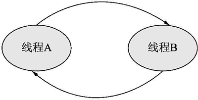

# Python 线程死锁的原因及解决方法

> 原文：[`www.weixueyuan.net/a/677.html`](http://www.weixueyuan.net/a/677.html)

死锁是多线程编程中经常讨论的问题，所谓死锁，就是线程一直无限期地等待某个资源。

最简单的死锁现象就是一个线程等待一个自己已经拿到的锁。由于该锁已经被自己拿到了，所以第二次申请该锁时会被放到等待队列中，但这个等待的时间是永远。下面的代码演示了这种情况。

```

import sys, time
if sys.version_info.major == 2:
    import thread
else:
    import _thread as thread
lock = thread.allocate_lock()           # 创建一个锁
def thread_entry():                     # 线程入口函数
    global lock
    print("Before lock Acquire - 1")
    lock.acquire()
    print("After lock Acquire - 1")
    print("Before lock Acquire - 2")
    lock.acquire()                      # 死锁在这里，后面的代码不会继续执行
    print("After lock Acquire - 1")
    lock.release()
    lock.release()
def start_threads():                    # 启动子线程
    t1 = thread.start_new_thread(thread_entry, tuple())
    time.sleep(5)
    print("Main Thread Quit")           # 主线程退出
if __name__=='__main__':
    start_threads()
```

运行结果如下：

$ python deadlockDemo1.py
Before lock Acquire – 1       # 第 9 行的输出
After lock Acquire – 1          # 第 11 行的输出
Before lock Acquire – 2       # 第 12 行的输出
Main Thread Quit                # 第 20 行的输出，子进程卡在第 13 行

前面介绍的是自己将自己给锁死了，这种情况相对来说较少，更多的情况是这样的：线程 A 得到某个资源 R1，同时去申请资源 R2，线程 B 得到了资源 R2，同时去申请资源 R1。这时就出现了死锁，线程 A 因为得不到资源 R2 而一直处于等待状态，线程 B 也因为得不到资源 R1 而一直处于等待状态。下面的代码演示了这种情况。

```

import sys, time                                # 引入 time 库
if sys.version_info.major == 2: # Python 2
    import thread
else:                                           # Python 3
            import _thread as thread
        lock1 = thread.allocate_lock()  # 资源 R1
        lock2 = thread.allocate_lock()  # 资源 R2
def thread_entry_A():                   # 线程 A 的入口函数
    global lock1, lock2
    print("Thread A: Before lock1 Acquire")
    lock1.acquire()                              # 得到资源 R1
    print("Thread A: After lock1 Acquire")
    time.sleep(3)
    print("Thread A: Before lock2 Acquire")
    lock2.acquire()                               # 申请资源 R2，死锁在这里
    print("Thread A: After lock2 Acquire")
    lock1.release()                               # 释放资源 R1
    lock2.release()                               # 释放资源 R2
def thread_entry_B():                           # 线程 B 的入口函数
    global lock1, lock2
    print("Thread B: Before lock2 Acquire")
    lock2.acquire()                             # 得到资源 R2
    print("Thread B: After lock2 Acquire")
    time.sleep(3)
    print("Thread B: Before lock1 Acquire")
    lock1.acquire()                             # 申请资源 R1，死锁在这里
    print("Thread B: After lock1 Acquire")
    lock1.release()                             # 释放资源 R1
    lock2.release()                             # 释放资源 R2
def start_threads():
    t1 = thread.start_new_thread(thread_entry_A, tuple())
    t1 = thread.start_new_thread(thread_entry_B, tuple())
    time.sleep(5)
    print("Main Thread Quit")           # 主线程退出，进程也退出
if __name__=='__main__':                # 如果是运行脚本而不是引入该模块
    start_threads()
```

运行结果如下：

$ python deadlockDemo2.py               # 运行脚本
Thread A: Before lock1 Acquire          # 第 10 行的输出
Thread A: After lock1 Acquire           # 第 12 行的输出
Thread B: Before lock2 Acquire          # 第 21 行的输出
Thread B: After lock2 Acquire           # 第 23 行的输出
Thread A: Before lock2 Acquire          # 第 14 行的输出，进入死锁状态
Thread B: Before lock1 Acquire          # 第 25 行的输出，进入死锁状态
Main Thread Quit                        # 主线程结束

死锁是发生在线程之间的，一般是因为某个线程 A 希望得到另外一个线程 B 的某个资源，所以可以用图 1 来表示这个关系。

图 1 线程 A 等待线程 B 所拥有的资源
但是这不会导致死锁，因为线程 B 会释放其所拥有的资源，那时线程 A 就可以继续运行了，死锁的一个条件就是所有参与死锁的线程都无法继续运行下去。在前面的例子中，线程 A 是无法继续运行下去的，但是线程 B 是可以继续运行下去的，所以这时是没有死锁发生的。如果线程 B 也在等 A 手中的某个资源呢？那么 B 也不能继续运行下去了，这就是前面例子代码演示的情况，可以用图 2 来表示。


图 2 线程 A 和线程 B 死锁
可以发现这时图上形成了一个环，即 A 依赖于 B，B 又依赖于 A。一旦形成了环，那么就出现了死锁现象。而对于本节的第一个例子，即自己锁死自己的那个例子，可以用图 3 来表示。


图 3 线程 A 锁死自己
线程死锁一般都不是我们期望的结果，所以应该尽量避免出现。而且现实中的死锁并不像例子中演示的那样，每次都会确定发生，而是表现为一种随机现象，即有时工作的很好，有时就进入了死锁状态，所以最根本的方法是谨慎设计以防止这种现象出现。

在编码时也有一些小技巧可以使用，如不要无限期等待某个资源，而是设定一个等待时限。例如设置某个线程最多等待 10 秒钟，那么该锁在 10 秒钟后便可以自动解开。