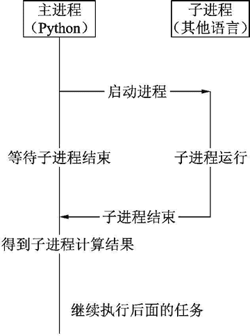
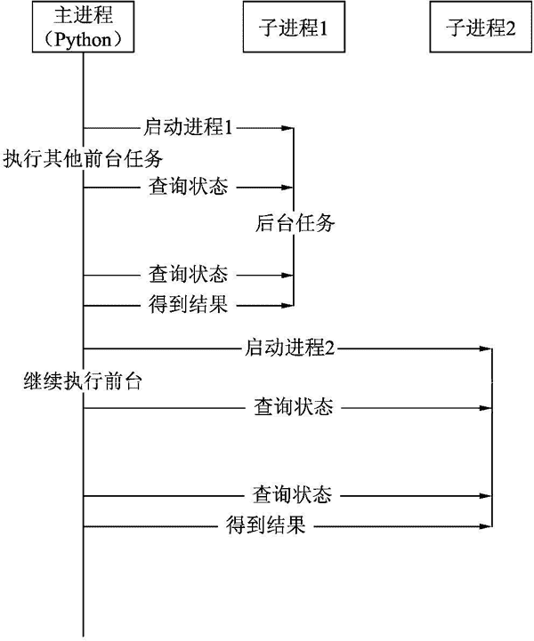

# 什么是进程

> 原文：[`www.weixueyuan.net/a/680.html`](http://www.weixueyuan.net/a/680.html)

在计算机发展的早期阶段，任务调度方式比较简单，计算机从用户处得到任务，然后一直执行下去，直到指定任务完成，然后计算机等待用户的下一个计算任务。在这种运行方式下，任意时刻计算机都只能完成一个任务。如果该任务处于等待状态，计算机也不能执行其他的任务。

为了解决这个问题，工程师们创造了进程的概念，在一个计算机系统上同时运行多个进程，当某个进程处于等待输入状态时，其他进程可以继续运行，计算机资源的利用效率获得了大幅提升。

对于运行多个进程的计算机系统来说，我们看到的是多个任务并发执行。对于某个进程来说，我们看到的是该进程占用了其所需要的所有资源，这些资源不会被其他进程使用。

一个进程就好像是一个独立的虚拟运行环境，进程和进程之间基本是相互隔离的。不同的操作系统上，进程的实现有所不同。本教程不深度介入这些操作系统的细节，只介绍一些对各种操作系统都适用的用法，用来解决实际的问题。

在 Python 中，对进程的使用主要有以下 2 种情形：

1) 有些情况下我们需要使用某些专用的应用程序来完成特定任务。这些专用的应用程序不是用 Python 编写的，也许它是一个 Shell 脚本，也许它是一个可执行文件，或者是一个 jar 包。这时便不能在 Python 解释器这个进程中执行该任务了，必须启动另外一个进程来执行该任务。

在这种情况下，多数采用的是启动-等待模式，即启动另外一个进程，然后等待该进程的执行完毕。图 1 描述了这个过程。

图 1 启动-等待模式
2) 如果需要执行一个很大的任务，该任务需要花费很长的时间，则该任务不适合在主进程中完成，因为主进程还需要执行其他任务，如用户交互的任务。这时可以将这个大的任务放到一个独立的进程中独立运行。

这种情况下，主进程是不会等待子进程完成的，因为它有自己的事情要去做，主进程只是在空闲时刻才去查询一下子进程的状态，这就是我们常说的前后台任务。前台进程处理一些实时性要求比较高的小任务，后台进程处理比较费时的重度任务，这两种任务并发执行。

图 2 描述了这种应用场景。

图 2 并发模式