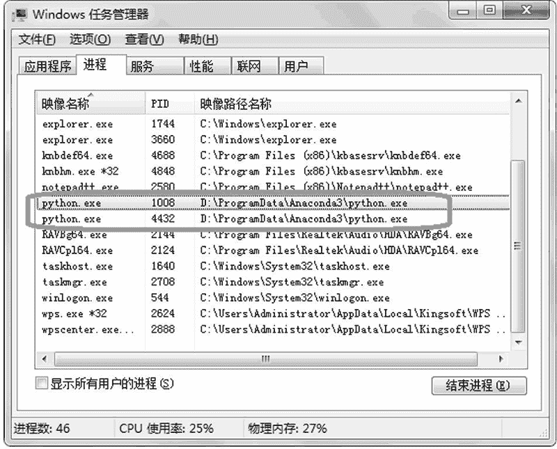

# Python multiprocessing 模块精讲

> 原文：[`www.weixueyuan.net/a/683.html`](http://www.weixueyuan.net/a/683.html)

multiprocessing 模块无须安装，从 Python 2.6 开始系统便自带该模块了。该模块的接口函数和 threading 类似，但是它启动的是进程而不是线程。

使用该模块时需要先将其引入 multiprocessing，方法如下：

import multiprocessing

该模块包含很多类，如 Lock，其和多线程中的锁类似，本节对这些类都会有所涉及。

## 创建进程

创建进程最简单的方法是创建一个 multiprocessing.Process 的实例，在创建该实例时需要提供入口函数。

下面就是一个最简单的创建进程的例子：

```

import time, os
import multiprocessing       # 引入 multiprocessing 模块
# 子进程要执行的代码，可以看作是进程的入口函数
def process_entry():
    print(u"子进程在运行")
    print(u'子进程的 ID = %d' % os.getpid())
if __name__=='__main__':
    print(u'父进程的 ID = %d' % os.getpid())
    p = multiprocessing.Process(target=process_entry)
    time.sleep(1)
    print(u'启动子进程')
    p.start()                # 此时才真正开始运行子进程
    time.sleep(2)
    print(u'父进程结束')
```

运行结果如下：

$ python multiprocessingDemo1.py                # 运行脚本
父进程的 ID = 63998
启动子进程
子进程在运行
子进程的 ID = 63999
父进程结束

当然创建进程时也可以带上参数。上例子中没有带任何参数，下面的例子中带了一个参数。

```

import time, os
import multiprocessing               # 引入 multiprocessing 模块
# 子进程要执行的代码，入口函数带有一个参数 arg1
def process_entry(arg1):             # 子进程的入口函数
    print(u"子进程(%d)在运行" % arg1)
    print(u'子进程(%d)的 ID = %d' % (arg1, os.getpid()))
if __name__=='__main__':
    print(u'父进程的 ID = %d' % os.getpid())    # 指定了参数为 1
    p1 = multiprocessing.Process(target=process_entry, args=(1,))  # 指定了参数为 2
    p2 = multiprocessing.Process(target=process_entry, args=(2,))
    time.sleep(1)
    print(u'启动子进程')              # 此时子进程才开始执行
    p1.start()
    p2.start()
    time.sleep(2)
    print(u'父进程结束')
```

运行结果如下：

$ python multiprocessingDemo2.py
父进程的 ID = 64055
启动子进程
子进程(1)在运行
子进程(1)的 ID = 64056
子进程(2)在运行
子进程(2)的 ID = 64057
父进程结束

另外一种创建进程的方法是从 Process 派生一个自己的类，我们只需要定义该类的 run() 函数即可。启动进程时就会运行该 run() 函数。

```

import time, os
import multiprocessing
# 用户自建的进程类
class NewProcess(multiprocessing.Process):
    def __init__(self, arg):                    # 初始化函数
        super(NewProcess, self).__init__()
        self.arg = arg
    def run(self):                              # 入口函数
        print(u"子进程(%d)在运行" % self.arg)
        print(u'子进程(%d)的 ID = %d' % (self.arg, os.getpid()))
if __name__=='__main__':
    print(u'父进程的 ID = %d' % os.getpid())
    p1 = NewProcess(1)
    p2 = NewProcess(2)
    time.sleep(1)
    print(u'启动子进程')
    p1.start()                       # 启动子进程
    p2.start()
    time.sleep(2)                    # 休眠 2 秒钟
    print(u'父进程结束')
```

运行结果如下：

$ python3 multiprocessingDemo5.py
父进程的 ID = 62560
启动子进程
子进程(1)在运行
子进程(1)的 ID = 62561
子进程(2)在运行
子进程(2)的 ID = 62562
父进程结束

## 进程的属性

在创建完进程后，可以对其进行很多操作，如启动、退出、查看其运行状态等。本节将介绍与进程相关的一些属性。

#### 1) 进程 ID

这个和操作系统返回的 PID 是一样的。可以通过下面的例子来演示其用法：

```

import time, os
import multiprocessing
def child_process_entry():
    pid = os.getpid()
    ppid = os.getppid()
    print(u"子进程: PID = %d, PPID = %d" % (pid, ppid))
    while True:
        time.sleep(10)
main_pid = os.getpid()
child_process = multiprocessing.Process(target=child_process_entry)
child_process.start()
print(u"主进程: PID=%d" % main_pid)
print(u"主进程: 子进程的 PID=%d" % child_process.pid)
child_process.join()
```

如果是在 Linux 或者 macOS 系统上运行，其可能的输出如下：

```

$ python3 demo2.py                        # 启动脚本
主进程: PID=52983                         # 在主进程中得到自己的 PID
主进程: 子进程的 PID=52984                 # 在主进程中得到子进程的 PID
        # 在子进程中得到子进程的 PID 和主进程的 PID
子进程: PID = 52984, PPID = 52983
```

> 该程序是不会自动退出的，因为子进程是一个死循环，而主进程则是一直在等待子进程结束。所以需要强制让其退出，可以通过按 Ctrl+C 组合键或者关闭窗口等方法来强制退出。

我们可以在 shell 中看到这两个进程，如下：

```

$ ps ax | grep python                           # 查看所有的 Python 进程
52983 s001  S+     0:00.05 python3 demo2.py     # 主进程，第一列是 PID
52984 s001  S+     0:00.00 python3 demo2.py     # 子进程
53585 s003  S+     0:00.00 grep python          # 这是我们的查询进程，不用管
```

在这个例子中，使用 os.getpid() 得到当前进程的 PID，使用 os.getppid() 得到当前进程的父进程的 PID。

如果是在 Windows 系统下运行，需要加上下面运行代码：

multiprocessing.freeze_support()

完整代码如下：

```

import time, os
import multiprocessing 
def child_process_entry():                                      # 子进程入口
    pid = os.getpid()
    ppid = os.getppid()
    print(u"子进程: PID = %d, PPID = %d" % (pid, ppid))
    while True:
        time.sleep(10)
if __name__ == '__main__':                                      # 主程序
    # windows 下必须要有的
    multiprocessing.freeze_support()            # 新加的代码
    main_pid = os.getpid()
    child_process = multiprocessing.Process(target=child_process_entry)
    child_process.start()
    print(u"主进程: PID=%d" % main_pid)
    print(u"主进程: 子进程的 PID=%d" % child_process.pid)
    child_process.join()
```

运行结果如下：

> python demo2.py
主进程: PID=1008
主进程: 子进程的 PID=4432
子进程: PID = 4432, PPID = 1008

此时在 Windows 任务管理器中可以看到两个 Python 进程，如图 1 所示。


图 1 进程 ID
可以看到代码返回的 PID 和操作系统中的 PID 是一致的。

另外，属性 ident 也是表示进程 ID 的，它们其实是同一个对象。下面的代码使用 id() 检查并确认它们为同一个对象。

```

import time, os
import multiprocessing
def process_entry(arg1):                # 子进程要执行的代码
    return arg1 * 2
if __name__=='__main__':
    p1 = multiprocessing.Process(target=process_entry, args=(1,),
            daemon=True)
    p1.start()
    if id(p1.pid) == id(p1.ident):
        print(u"pid 和 ident 是同一个对象")
    time.sleep(1)
```

运行结果如下：

$ python multiprocessing_pid_ident.py
pid 和 ident 是同一个对象

> 需要注意的是，在调用 start()之前，该属性的值为 None；在进程退出后，该属性的值依然有效。

#### 2) Daemon 属性

Daemon 进程在父进程退出时自动退出，而且不能再创建新的进程。该属性默认值是 False，表示普通的进程。

我们可以在创建进程时通过参数 daemon=True 来创建一个 Daemon 进程。下面先来看看非 Daemon 进程在父进程退出后状态。在下面的例子中，父进程在启动子进程 10 秒钟后就退出了，但是子进程需要运行 15 秒钟才退出。

```

import time, os
import multiprocessing
# 子进程要执行的代码
def process_entry(arg1):
    print(u"子进程(%d)在运行" % arg1)
    print(u'子进程(%d)的 ID = %d' % (arg1, os.getpid()))
    round = 5
    while round > 0:
        print(u"子进程在运行中")
        time.sleep(3)
        round = round - 1
    print(u"子进程退出")
if __name__=='__main__':
    print(u'父进程的 ID = %d' % os.getpid())
    p1 = multiprocessing.Process(target=process_entry, args=(1,),daemon=False)
    time.sleep(1)
    print(u'启动子进程')
    p1.start()
    time.sleep(10)
    print(u'父进程结束')
```

运行结果如下：

$ python multiprocessingDemo3.py
父进程的 ID = 65687
启动子进程
子进程(1)在运行
子进程(1)的 ID = 65688
子进程在运行中
子进程在运行中
子进程在运行中
子进程在运行中
父进程结束
子进程在运行

可以看到在父进程退出后，子进程继续执行。

如果在创建时指定子进程是 Daemon 进程，那么在父进程执行完毕后子进程会被强制退出。修改上例中的第 15 行代码，原来是：

```

p1 = multiprocessing.Process(target=process_entry, args=(1,), daemon=False)
```

现在修改为：

```

p1 = multiprocessing.Process(target=process_entry, args=(1,), daemon=True)
```

运行修改后的代码，可以看到下面的输出：

$ python multiprocessingDemo4.py
父进程的 ID = 9734
启动子进程
子进程(1)在运行
子进程(1)的 ID = 9735
子进程在运行中
子进程在运行中
子进程在运行中
子进程在运行中
父进程结束

可以看到在父进程退出后子进程自动被强制退出。

我们也可以在调用进程的 start() 之前设置该属性，方法如下：

进程对象. Daemon = True

#### 3) exitcode 进程返回码

就是进程函数返回的值。下面的代码演示了如何得到进程的返回码。

```

import time, os, sys
import multiprocessing
def process_entry(arg1):     # 子进程要执行的代码
    sys.exit(arg1*2)
if __name__=='__main__':
    p1 = multiprocessing.Process(target=process_entry, args=(1,),
            daemon=True)
    p1.start()
    time.sleep(1)
    print(u"返回值是%d" % p1.exitcode)
```

运行结果如下：

$ python multiprocessing_exit_code.py
返回值是 2

> 需要注意的是，需要使用 sys.exit() 来指定返回码，不能使用 return，而且仅在进程结束运行时才可以得到返回码，否则该属性的值为 None。

## 进程的接口函数

除了可以获得进程的属性，进程实例对象还提供了一些接口函数，通过这些接口函数可以对进程进行操作，如启动进程、判断进程是否仍然在运行、得到进程退出码、等待进程退出、强制要求进程退出等。

#### 1) start()：启动

就像前面演示的那样，只有在调用该函数之后，进程才真正运行起来，进程对象也才有了进程的 ID。在调用该函数之前，进程对象的 pid 属性为 None。下面的代码演示这个情况：

```

import time, os
import multiprocessing
# 子进程要执行的代码
def process_entry(arg1):
    print(u"子进程在运行")
    return arg1 * 2
if __name__=='__main__':
    p1 = multiprocessing.Process(target=process_entry, args=(1,),
            daemon=True)
    if p1.pid is None:
        print(u"1)在调用 start()之前，子进程的 ID=None")
    else:
        print(u"1)在调用 start()之前，子进程的 ID=%d" % p1.pid)
    p1.start()
    time.sleep(1)
    print(u"2)在调用 start()之后，子进程的 ID=%d" % p1.pid)
    time.sleep(1)
```

运行结果如下：

$ python multiprocessing_noIDbeforeStart.py
1)在调用 start()之前，子进程的 ID=None
子进程在运行
2)在调用 start()之后，子进程的 ID=12430

而且对于某一个进程对象，只能调用一次该函数，如果多次调用，除第一次之外，其他的都会抛出异常。例如下面的代码：

```

import time, os
import multiprocessing
# 子进程要执行的代码
def process_entry(arg1):
    print(u"子进程在运行")
    return arg1 * 2
if __name__=='__main__':
    p1 = multiprocessing.Process(target=process_entry, args=(1,),
            daemon=True)
    p1.start()
    time.sleep(1)
    print(u'再次启动该进程对象,导致错误')
    p1.start()                           # 再次启动，抛出异常
```

运行结果如下：

$ python multiprocessing_restart.py
子进程在运行
再次启动该进程对象,导致错误
Traceback (most recent call last):
  File "multiprocessing_restart.py", line 14, in <module>
    p1.start()
  File "/anaconda3/lib/python3.7/multiprocessing/process.py", line
          106, in start
    assert self._popen is None, 'cannot start a process twice'
AssertionError: cannot start a process twice

#### 2) is_alive()：进程是否还在运行

在调用 start() 之前，该函数返回 False；在该进程退出后，该函数返回 False；在其他时候，该函数返回 True。

下面的例子演示了该函数在不同时刻返回的值。

```

import time, os
import multiprocessing
def process_entry(arg1):                        # 子进程要执行的代码
    max_round = 2
    while max_round > 0:
        time.sleep(3)
        max_round = max_round - 1
    print(u'子进程结束')
if __name__=='__main__':
    p1 = multiprocessing.Process(target=process_entry, args=(1,),
             daemon=True)
    print(u"1)子进程是否存活: %s" % p1.is_alive())
    p1.start()
    print(u"2)子进程是否存活: %s" % p1.is_alive())
    max_query = 10
    while max_query > 0:
        time.sleep(1)
        print(u"3)子进程是否存活: %s" % p1.is_alive())
        max_query = max_query - 1
    print(u'父进程结束')
```

运行结果如下：

$ python multiprocessing_isalive1.py
1)子进程是否存活: False
2)子进程是否存活: True
3)子进程是否存活: True
3)子进程是否存活: True
3)子进程是否存活: True
3)子进程是否存活: True
3)子进程是否存活: True
子进程结束
3)子进程是否存活: False
3)子进程是否存活: False
3)子进程是否存活: False
3)子进程是否存活: False
3)子进程是否存活: False
父进程结束

#### 3) join（超时时间）等待进程结束

该函数在前面的例子中使用过。如果没有指定超时时间则一直等待，直到指定进程退出为止。

```

import time, os
import multiprocessing
def process_entry(arg1):                        # 子进程要执行的代码
     print(u"子进程(%d)在运行" % arg1)
     print(u'子进程(%d)的 ID = %d' % (arg1, os.getpid()))
     max_round = 3
     while max_round > 0:
         print(u"%d) 子进程在运行中" % max_round)
         time.sleep(3)
         max_round = max_round - 1
if __name__=='__main__':
     print(u'父进程的 ID = %d' % os.getpid())
     p1 = multiprocessing.Process(target=process_entry, args=(1,),
             daemon=True)
     time.sleep(1)
     print(u'启动子进程')
     p1.start()
     p1.join()                                   # 这个函数没有返回值
     print(u'父进程结束')
```

运行结果如下：

$ python multiprocessing_joinDemo1.py
父进程的 ID = 9940
启动子进程
子进程(1)在运行
子进程(1)的 ID = 9941
3) 子进程在运行中
2) 子进程在运行中
1) 子进程在运行中
父进程结束

如果指定了超时时间，则可能在指定进程退出之前该函数就返回了。这时不能使用返回值来判断是因为进程退出了还是超时了，而需要使用 is_alive() 来判断是否是因为超时而返回的。下面的代码演示了这种用法。

```

import time, os
import multiprocessing
def process_entry(arg1):                                # 子进程要执行的代码
     print(u"子进程(%d)在运行" % arg1)
     print(u'子进程(%d)的 ID = %d' % (arg1, os.getpid()))
     max_round = 3
     while max_round > 0:
         print(u"%d) 子进程在运行中" % max_round)
         time.sleep(3)
         max_round = max_round - 1
     print(u'子进程结束')
if __name__=='__main__':
     print(u'父进程的 ID = %d' % os.getpid())
     p1 = multiprocessing.Process(target=process_entry, args=(1,),
             daemon=True)
     time.sleep(1)
     print(u'启动子进程')
     p1.start()
     while p1.is_alive():
         p1.join(1)            # 仅仅等待 1 秒钟
     print(u'父进程结束')
```

运行结果如下：

$ python multiprocessing_joinDemo2.py
父进程的 ID = 9985
启动子进程
子进程(1)在运行
子进程(1)的 ID = 9986
3) 子进程在运行中
2) 子进程在运行中
1) 子进程在运行中
子进程结束
父进程结束

#### 4) kill()：强制退出

该函数给指定的进程发送 SIGKILL 信号。如果是 Windows 系统，那么就是调用了 TerminateProcess() 接口函数。

另外一个强制退出的接口函数是 terminate()，其内部实现和接口函数 kill() 会有所不同，但我们可以将它们当作同一个接口函数来使用。下面的代码演示了该接口函数的用法。

```

import time, os, sys
import multiprocessing
def process_entry(arg1):                        # 子进程要执行的代码
     while True:                                         # 子进程不会自主，是一个死循环
         time.sleep(1)
if __name__=='__main__':
     p1 = multiprocessing.Process(target=process_entry, args=(1,),
            daemon=True)
     p1.start()
     if p1.is_alive():
         print(u"子进程在运行中")
     else:
         print(u"子进程没有在运行中")
     print(u"杀死子进程")
     p1.kill()
     time.sleep(2)
     if p1.is_alive():
         print(u"子进程在运行中")
     else:
         print(u"子进程没有在运行中")
```

运行该程序，输出如下：

$ python multiprocessing_kill.py
子进程在运行中
杀死子进程
子进程没有在运行中

需要注意的是，并不是所有的子进程都可以被杀死掉的，也不是立即就可以被杀死掉的。就像杀死 Windows 下的某些进程，由于这些进程忽略对外部消息的响应，导致它们很难被杀死。我们也不认为从外部杀死一个进程是一个好的想法。相对来说，让进程自主优雅地退出是一个更好的设计。

## 进程池

如果频繁去创建一个进程，然后销毁它，会导致性能下降。对于这种情况推荐的做法是事先创建一个进程池，在有任务达到时从进程池中取出一个进程来执行相关任务，在任务完成后便归还回去。这样做可以复用部分已有进程资源，达到提升效率的作用。

在 mulitprocessing 模块中有一个 Pool 类可以帮助我们完成该任务。下面是一个使用进程池的例子。

```

import multiprocessing             # 引入 multiprocessing 模块
import time                        # 引入 time 模块
def child_process_entry():         # 定义进程入口函数
    print(u"子进程在运行")
    time.sleep(10)
    print(u"子进程结束")
pool_obj = multiprocessing.Pool(processes = 5)  # 建立 5 个元素池子
for i in range(10):                             # 添加 10 个进程
    pool_obj.apply_async(child_process_entry)
pool_obj.close()                                # 停止添加进程了
pool_obj.join()                                 # 等待进程都结束
```

运行该脚本后，输出如下：

$ python3 process_pool1.py            # 运行脚本
子进程在运行                           # 同时启动 5 个进程来完成任务
子进程在运行
子进程在运行
子进程在运行
子进程在运行
子进程结束                              # 有进程结束工作了
子进程结束
子进程结束
子进程结束
子进程结束
子进程在运行                            # 启动新的任务
子进程在运行
子进程在运行
子进程在运行
子进程在运行
子进程结束
子进程结束
子进程结束
子进程结束
子进程结束

可以发现，其一次启动 5 个进程，并在 5 个完成后才启动另外 5 个。也就是说其最多同时运行 5 个进程，并且仅当有进程结束后才将新的进程投入运行。

启动进程时可以指定参数 args，args 是一个元组，其各个元素对应到入口函数的各个参数。下面将前面的例子稍作修改，传入一个参数，用来标识该进程。具体代码如下：

```

import multiprocessing                          # 引入 multiprocessing 模块
import time, random                                     # 引入 time,random 模块
def child_process_entry():                      # 定义进程入口函数
    print(u"子进程在运行")
time.sleep(random.randint(1, 100)/10.0)                 # 休息随时间
    print(u"子进程结束")
pool_obj = multiprocessing.Pool(processes = 5)          # 建立 5 个元素池子
for i in range(10):                                     # 添加 10 个进程
pool_obj.apply_async(child_process_entry)
pool_obj.close()                                        # 停止添加进程了
pool_obj.join()                                         # 等待进程都结束
```

运行该脚本，输出如下：

$ python3 process_pool1.py         # 运行脚本
子进程在运行                        # 同时启动 5 个进程来完成任务
子进程在运行
子进程在运行
子进程在运行
子进程在运行
子进程结束                          # 有进程结束工作了
子进程在运行                        # 投入一个新的进程
子进程结束                          # 有进程结束工作了
子进程在运行                        # 投入一个新的进程
子进程结束                          # 有进程结束工作了
子进程在运行                        # 投入一个新的进程
子进程结束                          # 有进程结束工作了
子进程在运行                        # 投入一个新的进程
子进程结束                          # 有进程结束工作了
子进程在运行                        # 投入一个新的进程
子进程结束
子进程结束
子进程结束
子进程结束
子进程结束

由于是多进程同时运行，所以一般子进程和主进程是同时运行的，也就是说它们是异步的，这也是 apply_async 中 async 的来源。

如果要是同步执行，那么主进程会等待子进程结束，所以子进程只能是一个一个地运行。这种同步运行的方式比较少见，因为这没有利用到并发操作的特性。但这里还是要演示一下同步运行的情况，将上面的代码稍作修改，将第 9 行从

```

pool_obj.apply_async(child_process_entry, args=(i, ))
```

修改为

```

pool_obj.apply(child_process_entry, args=(i, ))
```

其他部分不做任何修改，运行后的输出如下：

$ python3 process_pool3.py
子进程 0 在运行                                 # 第一个进程开始执行
子进程 0 结束                                          # 第一个进程执行完毕
子进程 1 在运行
子进程 1 结束
子进程 2 在运行
子进程 2 结束
子进程 3 在运行
子进程 3 结束
子进程 4 在运行
子进程 4 结束
子进程 5 在运行
子进程 5 结束
子进程 6 在运行
子进程 6 结束
子进程 7 在运行
子进程 7 结束
子进程 8 在运行
子进程 8 结束
子进程 9 在运行
子进程 9 结束

可以看到子进程是依次执行的，前一个执行完毕之后才执行下一个。

## 进程通信

在前面章节我们也用到了进程之间的一些简单信息交换，如查询进程的运行状态、等待进程退出、得到进程的退出码等。但是在一些复杂的应用场景，则希望进程之间有更多的信息交换。下面介绍 multiprocessing 模块提供的进程之间通信的方式，包括管道、队列和锁。

#### 1) 管道

管道有两头，一般一头给进程 A，一头给进程 B。如果进程 A 对管道进行写入操作，那么进程 B 就可以通过读操作看到写入的数据。而且管道是双向的，可以进程 A 写进程 B 读，也可以进程 B 写进程 A 读。

下面的例子演示了管道的用法。

```

import multiprocessing                        # 引入 multiprocessing 模块
def process_A(pipe):                          # 进程 A 的入口函数
    print(u"进程 A 发送数据 hello 到 B")            # 发送数据 hello 到进程 B
    pipe.send('hello')
    print(u"进程 A 等待进程 B 的输入")
    data = pipe.recv()                        # 结束进程 B 的数据
    print(u'进程 A 收到 B 的数据%s' % data)
    print(u'进程 A 结束')
def process_B(pipe):                          # 进程 B 的入口函数
    print(u'进程 B 等待进程 A 的数据')
    data = pipe.recv()                        # 接收数据
    print(u'进程 B 收到 B 的数据%s' % data)
    print(u'进程 B 发送 hi 到进程 A')
    pipe.send('hi')                           # 发送数据
    print(u'进程 B 结束')
pipe = multiprocessing.Pipe()                 # 建立管道
        # 创建进程 A
p1 = multiprocessing.Process(target=process_A, args=(pipe[0],))
        # 创建进程 B
p2 = multiprocessing.Process(target=process_B, args=(pipe[1],))
p1.start()                                    # 启动进程
p2.start()
p1.join()                                     # 等待进程结束
p2.join()
```

运行后的输出如下：

$ python3 pipe1.py
进程 A 发送数据 hello 到 B
进程 A 等待进程 B 的输入
进程 B 等待进程 A 的数据
进程 B 收到 B 的数据 hello
进程 B 发送 hi 到进程 A
进程 B 结束
进程 A 收到 B 的数据 hi
进程 A 结束

#### 2) 队列

对于队列有两个操作，一个是写入数据，一个是读出数据。最简单的使用方式是让一个进程往队列中写入数据，让另外一个进程从队列中读出数据。

```

import multiprocessing
import time
def process_read(queue):                      # 读队列子进程
    print(u"queue 读出进程开始运行")
    data = queue.get()
    while(data != "quit"):                    # 一直读，直到读出了 quit
        print("queue 读出进程读出数据%s" % data)
        data = queue.get()
    print(u'queue 读出进程退出')
def process_write(queue):                     # 写队列子进程
    print(u"queue 写入进程开始运行")
    data = ['good', 'morning', 'everyone']    # 写入的数据
    for w in data:
        print("queue 写入进程写入数据%s" % w)
        data = queue.put(w)
        time.sleep(1)
    data = queue.put('quit')                  # 发送 quit，让读子进程退出
    print(u'queue 写入进程退出')
queue_obj = multiprocessing.Queue(3)
# 创建两个子进程，一个读队列，一个写队列
p1   = multiprocessing.Process(target=process_read, args=(queue_obj,))
# Pass the other end of the pipe to process 2
p2   = multiprocessing.Process(target=process_write, args=(queue_obj,))
p1.start()                                    # 启动进程
p2.start()     
p1.join()                                     # 等待子进程退出
p2.join()
queue_obj.close()                             # 销毁队列
```

运行后的输出如下：

$ python3 queue1.py
queue 读出进程开始运行                           # 两个子进程启动了起来
queue 写入进程开始运行
queue 写入进程写入数据 good                       # 写入 good
queue 读出进程读出数据 good                       # 读出 good
queue 写入进程写入数据 morning
queue 读出进程读出数据 morning
queue 写入进程写入数据 everyone                   # 写入 everyone
queue 读出进程读出数据 everyone                   # 读出 everyone
queue 写入进程退出                               # 子进程退出
queue 读出进程退出

#### 3) Lock 锁

该对象主要提供了两个接口函数，一个是得到锁 acquire()，另外一个是释放锁 release()。下面的例子演示了 3 个进程，它们都往同一个文件写入数据。由于其每轮操作需要执行 3 次数据写入，而且要求在这 3 次操作之间其他的进程不能往文件写入数据。

可以使用锁来实现该功能，代码如下：

```

import multiprocessing
import time
def process_entry (lock, fd, id):               # 进程入口函数
    for x in range(30):                                 # 30 轮输出，每轮进行 3 次写操作
        lock.acquire()                                  # 得到锁
        line = "%d: line 1, round: %d\n" % (id, x)
        time.sleep(0.1)
        fd.write(line)                                  # 第 1 次写
        fd.flush()
        line = "%d: line 2, round: %d\n" % (id, x)
        fd.write(line)                                  # 第 2 次写
        fd.flush()
        time.sleep(0.1)
        line = "%d: line 3, round: %d\n" % (id, x)
        fd.write(line)                                          # 第 3 次写
        fd.flush()     
        lock.release()                                          # 释放锁
        time.sleep(0.1)
if __name__ == "__main__":
    file_name = "shared_input2.txt"
    fd = open(file_name, "a+")
    lock = multiprocessing.Lock()                       # 创建锁
    p1 = multiprocessing.Process(target=process_entry, args=(lock, fd, 1))
    p2 = multiprocessing.Process(target=process_entry, args=(lock, fd, 2))
    p3 = multiprocessing.Process(target=process_entry, args=(lock, fd, 3))
    p1.start()                                                          # 启动进程
    p2.start()
    p3.start()
    p1.join()                                                           # 等待子进程结束
    p2.join()
    p3.join()
    fd.close()                                                          # 关闭文件
    print(u"开始检查结果")                                    # 开始检查结果
    fd2 = open(file_name, "r")
    lines = fd2.readlines()
    fd2.close()
    line_num = len(lines)                                       # 显示行数
    print(u"总的行数: %d" % line_num)
            # 要求每连续的 3 行是同一个进程打印出来的
    for x in range(int(line_num/3)):
                # 第 1 行和第 2 行不是同一个进程打印出来的
        if lines[x*3][:2] != lines[x*3+1][:2]:
            print("line %d: Error" % x*3+1)     # 发现错误，退出
            sys.exit(1)
                # 第 1 行和第 3 行不是同一个进程打印出来的
        if lines[x*3][:2] != lines[x*3+2][:2]:
            print("line %d: Error" % x*3+2)     # 发现错误，退出
            sys.exit(1)
    print(u"成功通过检查")                                    # 所有行的检查通过
```

运行后的输出如下：

$ python lock2.py
开始检查结果
总的行数: 270
成功通过检查

也可以使用 with lock 语句，这样就不用再显式调用 acquire() 和 release() 了，只需将 acquire() 和 release() 之间的代码放到 with lock 块中即可。

下面的代码实现和前面一样的功能，但是使用 with lock 语句代替了 acquire() 和 release()。代码如下：

```

import multiprocessing
import time
def process_entry(lock, fd, id):
    for x in range(30):                     # 30 轮操作，每轮 3 次写操作
        with lock:                          # 每次写入 3 行，不能被打断
            line = "%d: line 1, round: %d\n" % (id, x)
            time.sleep(0.1)
            fd.write(line)
            fd.flush()
            line = "%d: line 2, round: %d\n" % (id, x)
            fd.write(line)
            fd.flush()
           time.sleep(0.1)
           line = "%d: line 3, round: %d\n" % (id, x)
           fd.write(line)
           fd.flush()
           time.sleep(0.1)
if __name__ == "__main__":
    file_name = "shared_input.txt"           # 打开输出文件
    fd = open(file_name, "a+")
    lock = multiprocessing.Lock()            # 创建锁
    p1 = multiprocessing.Process(target=process_entry, args=(lock, fd, 1))
    p2 = multiprocessing.Process(target=process_entry, args=(lock, fd, 2))
    p3 = multiprocessing.Process(target=process_entry, args=(lock, fd, 3))
    p1.start()                               # 启动 3 个子进程
    p2.start()
    p3.start()
    p1.join()                                # 等待子进程结束
    p2.join()
    p3.join()
    fd.close()                               # 关闭文件
    print(u"开始检查结果")                    # 检查结果
    fd2 = open(file_name, "r")
    lines = fd2.readlines()
    fd2.close()
    line_num = len(lines)
    print(u"总的行数: %d" % line_num)      
    for x in range(int(line_num/3)):
                # 如果第 1 行和第 2 行不是同一个进程打印
        if lines[x*3][:2] != lines[x*3+1][:2]:
            print("line %d: Error" % x*3+1)     # 发现错误，退出
            sys.exit(1)
                 # 如果第 1 行和第 3 行不是同一个进程打印
        if lines[x*3][:2] != lines[x*3+2][:2]:
            print("line %d: Error" % x*3+2)     # 发现错误，退出
            sys.exit(1)
    print(u"成功通过检查")                       # 所有行检查通过
```

运行后的输出如下：

$ python lock1.py
开始检查结果
总的行数: 270
成功通过检查

> 通过运行结果可以发现使用 with lock 语句的效果和使用 acquire() 和 release() 的效果一样。