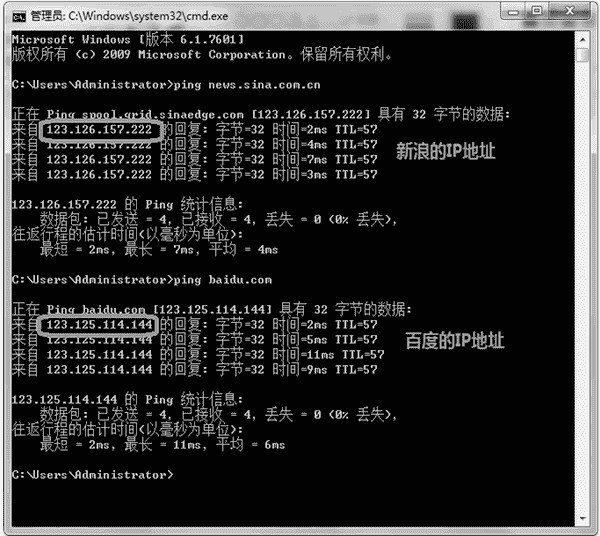

# TCP/IP 协议详解

> 原文：[`www.weixueyuan.net/a/709.html`](http://www.weixueyuan.net/a/709.html)

计算机之间要交换信息，就需要定义交换信息的方式。1965 年，Donald Davies 创造了报文这个词语，用来描述在两台计算机之间传输的数据。

在 1969 年，最早的广域网 ARPNET 出现了，这个网络也是第一个使用报文交换的网络（相对报文交换，早期的电话使用的是电路交换，就是在通话双方之间建立电路连接，直到通话结束）。ARPNET 网络也是目前人们使用的互联网的前身。

在 1983 年，ARPNET 开始全面使用 TCP/IP 协议。本节要使用的便是 TCP/IP 协议，准确来说是 TCP/IP 协议族，因为这里面包含很多协议，不仅仅是 TCP 协议和 IP 协议这两个。

ISO 对网络协议进行了分层，从最底层的物理层到最上面的应用层，一共是 7 层，但在 TCP/IP 中，仅分为 4 层。如图 1 所示为它们之间的对应关系。


图 1 不同协议族中的协议分层
左侧是 ISO 定义的参考模型，右侧是 TCP/IP 定义的模型。本章主要关心的是网络层和传输层，应用层则是需要自己开发内容。

## 1、网络层

网络层我们主要关心的是 IPv4 协议。网络上每台机器都至少有一个 IP 地址，不同的机器会有不同的 IP 地址。这个 IP 地址就是在网络层定义的，用来区分不同的机器。


图 2　不同的网站有不同的 IP 地址
如图 2 所示，分别 ping 一下新浪网和百度的网址，可以看到它们有不同的 IP 地址，新浪网的 I 地址是 123.126.157.222，百度的 IP 地址是 123.125.114.144。

在 IPv4 中，IP 地址是用 32 位整数来表示的，但是多数情况下我们看到的是用点（.）分割的 4 个数字段，每段表示一个 0 到 255 之间的整数，这种表示法叫作点分十进制表示法（用小数点分割的，分割的每段表示的是十进制数）。

点分十进制表达方式比较直观，也容易记忆。我们只需要知道这两种表达方式是等价的即可，它们是可以相互转换的。下面演示它们之间的相互转换。

```

>>> import socket                        # 这是我们将使用的库
>>> str_ip_addr = "123.125.114.144"    # 输入的是字符串表示的 IP 地址
>>> int_ip_addr = socket.inet_aton(str_ip_addr)    # 将其转换成字节流
>>> type(int_ip_addr)
<class 'bytes'>
>>> int_ip_addr[0]                        # 查看各个字节的内容
123
>>> int_ip_addr[1]
125
>>> int_ip_addr[2]
114
>>> int_ip_addr[3]
144
# 将字节流转换成整数
>>> int_val_1 = int.from_bytes(int_ip_addr, byteorder='big')
>>> type(int_val_1)                        # 查看类型
<class 'int'>
>>> int_val_1                            # 查看整数值
2071818896
>>> socket.inet_ntoa(int_ip_addr)        # 将字节流转换回字符串
'123.125.114.144'
```

IP 地址一共 32 位，分为两组，前面一组表示网络地址，后面一组表示主机地址。例如有两台机器，它们的 IP 地址分别是 192.168.1.1 和 192.168.1.2，由于这两台机器是在同一个网络中，所以它们的 IP 地址前面部分即网络地址是相同的（都为 192.168.1），只是后面的主机地址是不同的（分别为 1 和 2）。

在 TCP/IP 设计时，定义了一些特殊的 IP 地址，如 127.0.0.1 表示自己，也叫回环地址，就是说对该地址发送数据，其实就是发给自己。这个地址非常有用，我们知道一般网络通信需要两台机器，一个负责发送数据，一个负责接收数据。有了这个地址，便可以使用一台机器来模仿真实的网络环境。

如在一台机器上运行两个进程，一个负责发送数据，一个负责接收数据，发送方将目标地址设定为 127.0.0.1 即可，所有发送的数据都会回环给本机，这样接收的进程就可以看到这个数据了。

还有一个特殊的地址是 0.0.0.0，其表示任意 IP 地址。多数机器有多个 IP 地址，一般来说至少有两个 IP 地址，一个是前面介绍的回环地址（127.0.0.1），另外一个是对外的普通 IP 地址。不同的 IP 地址对应不同的协议栈。

可以这样理解，不同的 IP 地址表示不同的快递系统，如果你和多个快递公司签订了协议，那么在你们家门口就会有多个邮箱，那么在接收快件时，就需要指定需要查看的邮箱。如果希望查看所有的邮箱，那么就需要使用 0.0.0.0 这个特殊的地址。如果绑定到 127.0.0.1，那么表示仅接收来自该地址的数据，发送到本机另外一个 IP 地址的数据是接收不到的，就像查看运通的邮箱不会看到韵达的快递包裹一样。


图 3 IP 协议栈
在图 3 中，可以看到两个不同的协议栈实例，左边使用的是回环地址 127.0.0.1，右边使用的是普通地址 192.168.1.1。可以看到它们是独立的、平等的。如果我们希望接收来自 127.0.0.1 的数据，那么使用的是左边这套系统；如果希望接收来自 192.168.1.1 的数据，那么就使用右边的这套系统。

它们使用的的物理层可以相同，也可以不同。其实回环地址 127.0.0.1 是不需要物理层的，就是说不需要网卡和相应的驱动，这也意味着发送到 127.0.0.1 的数据在网络上是不可见的。

## 2、传输层

传输层的主要功能就是让应用程序相互通信。通过 IP 层，可以将数据传送到某个主机。但是在该主机上会有很多应用程序，此时就需要指定一个应用程序来处理发送的信息。

传输层引入了端口的概念，不同的应用程序会使用不同的端口。在发送信息时只需要指定目标端口就可以保证发送到指定的应用程序。

端口使用 16 位的整数来表示。有些端口是预先定义好的，如 HTTP 应用程序使用的端口默认是 80，而 Telnet 使用的端口是 23。

> 需要注意的是，端口对于客户端和服务端都是确定的，但一般仅指定服务端的端口，而客户端不用指定。原因是所有的会话都是客户端发起的，服务端是被动等待的一方。但客户端也是有自己的端口，只是该端口一般是不固定的。

传输层的协议也有多个，本节主要介绍 TCP 和 UDP 这两个协议。

TCP 是有连接的，而且保证数据传输的可靠性。使用 TCP，不用担心发送的数据在传输过程中会丢失，其内部实现了自动重传的机制，如果发生丢包现象，TCP 会自动恢复发送丢失的数据。

UDP 和 TCP 不同，其不需要建立连接，也不保证数据的可靠传输。如果发生丢包现象，需要上层应用程序进行相应的处理。例如给包打上标签号，需要在接收端检查标签号是否连续，以确定在传输过程中是否发生了丢包现象。UDP 相对 TCP 来说简单一些，不需要建立连接，速度也会快不少。

由于 TCP 和 UDP 都有端口的概念，所以需要说明，使用 TCP 的 80 端口作为 http 的服务端口，或者使用 UDP 的 5060 端口作为 sip 的服务端口。

表 4 给出了常用端口以及它们对应的服务。

表 4 常用端口和对应的服务

| 端口号 | 名 称 | 说 明 |
| TCP/21 | ftp | 文件传输协议 |
| TCP/22 | ssh | 安全服务 |
| TCP/23 | telnet | 远程登录 |
| TCP/25 | smtp | 邮件协议 |
| UDP/69 | tftp | 简单文件传输协议 |
| TCP/80 | http | WWW 服务 |
| TCP/109 | pop2 | 邮件协议 |
| TCP/110 | pop3 | 邮件协议 |